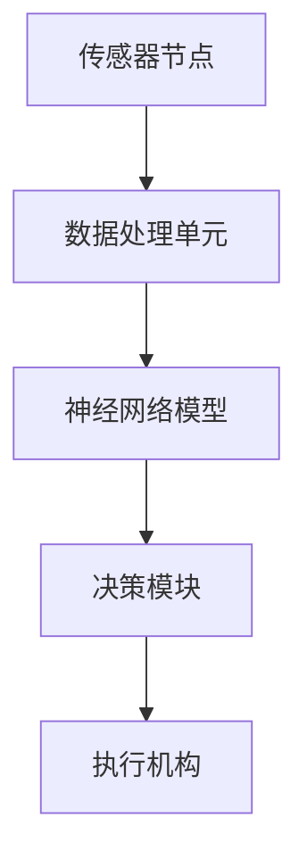

                 

# 如何识别企业的神经形态传感器优势

## 文章关键词

神经形态传感器，传感器技术，人工智能，企业应用，传感器优势，生物启发，数据处理，系统架构

## 摘要

神经形态传感器是一种结合了神经科学和传感器技术的新型传感器，能够在复杂环境中实现高灵敏度、实时响应和高效能比。本文从背景介绍、核心概念、算法原理、系统架构、项目实战等多方面详细分析如何识别和利用企业的神经形态传感器优势，帮助企业提升竞争力。

---

## 正文

### 第一部分：背景介绍

#### 第1章：神经形态传感器概述

##### 1.1 神经形态传感器的定义与背景

神经形态传感器是一种模拟生物神经系统信息处理机制的传感器，能够实现类似于生物神经系统的感知、处理和学习功能。其核心在于通过生物启发的方式，将传感器的感知能力与智能处理能力相结合，从而在复杂环境中实现高效的感知和决策。

- **1.1.1 神经形态传感器的基本概念**
  神经形态传感器是基于神经网络的传感器，能够模拟生物神经系统的信息处理机制，具有高灵敏度、实时响应和自适应学习能力。

- **1.1.2 神经形态传感器的起源与发展**
  神经形态传感器的概念起源于神经科学和人工智能的交叉研究，近年来随着深度学习和神经网络技术的发展，神经形态传感器逐渐从理论研究走向实际应用。

- **1.1.3 与传统传感器的对比分析**
  传统传感器通常只能采集物理信号，而神经形态传感器能够通过生物启发的信息处理机制，对信号进行智能分析和决策，具有更高的信息处理能力。

##### 1.2 神经形态传感器的核心优势

神经形态传感器的核心优势在于其生物启发的信息处理机制，能够实现高灵敏度、实时响应和高效能比。

- **1.2.1 高灵敏度与实时响应**
  神经形态传感器能够通过生物启发的信息处理机制，快速响应外界环境的变化，实现高灵敏度的感知。

- **1.2.2 生物启发的感知机制**
  神经形态传感器模拟生物神经系统的感知机制，能够对复杂环境中的信息进行智能分析和决策。

- **1.2.3 低功耗与高效能比**
  神经形态传感器在低功耗的情况下，能够实现高效的信号处理和决策，具有较高的能效比。

##### 1.3 企业中的神经形态传感器应用价值

在企业中，神经形态传感器具有重要的应用价值，能够帮助企业提升生产效率、优化资源利用和提升竞争力。

- **1.3.1 提高生产效率**
  神经形态传感器能够通过实时感知和智能决策，优化生产流程，提高生产效率。

- **1.3.2 优化资源利用**
  神经形态传感器能够通过高效的信息处理能力，优化资源利用，降低能源消耗和成本。

- **1.3.3 提升企业竞争力**
  神经形态传感器的应用能够帮助企业实现智能化、自动化和高效化，提升企业的竞争力。

### 第二部分：核心概念与联系

#### 第2章：神经形态传感器的核心原理

##### 2.1 神经形态传感器的工作原理

神经形态传感器的工作原理基于生物神经系统的信息处理机制，通过模拟神经网络的信息传递和处理过程，实现对环境信息的感知和决策。

- **2.1.1 生物启发的信息处理机制**
  神经形态传感器通过模拟生物神经系统的信息传递机制，将环境中的物理信号转化为数字信号，并通过神经网络进行信息处理和决策。

- **2.1.2 神经网络模型的构建与应用**
  神经形态传感器通常基于深度学习和神经网络技术，构建神经网络模型，用于对传感器数据进行智能分析和决策。

- **2.1.3 传感器的自适应学习能力**
  神经形态传感器具有自适应学习能力，能够通过在线学习和优化算法，不断改进感知和决策能力。

##### 2.2 神经形态传感器的感知模型

神经形态传感器的感知模型是其核心组成部分，通过生物启发的信息处理机制，实现对环境信息的智能感知和决策。

- **2.2.1 感知模型的构建与优化**
  感知模型的构建通常基于深度学习和神经网络技术，通过大量的训练数据优化感知模型的性能。

- **2.2.2 感知模型的训练与验证**
  感知模型的训练需要使用高质量的标注数据，通过反复迭代优化模型的性能，验证模型的准确性和稳定性。

- **2.2.3 感知模型的实际应用案例**
  在实际应用中，神经形态传感器的感知模型可以通过对传感器数据的智能分析，实现对环境的实时感知和决策。

##### 2.3 神经形态传感器与人工智能的结合

神经形态传感器与人工智能的结合是其核心优势之一，通过深度学习和神经网络技术，实现对传感器数据的智能分析和决策。

- **2.3.1 人工智能在神经形态传感器中的应用**
  人工智能技术在神经形态传感器中的应用主要体现在感知模型的构建和优化、数据处理和决策支持等方面。

- **2.3.2 神经网络与传感器数据的融合**
  神经网络与传感器数据的融合是神经形态传感器的核心技术之一，通过深度学习和神经网络技术，实现对传感器数据的智能分析和决策。

- **2.3.3 人工智能算法对传感器性能的提升**
  人工智能算法的应用能够显著提升神经形态传感器的感知能力和决策能力，实现更高的性能和更广泛的应用场景。

### 第三部分：算法原理

#### 第3章：神经形态传感器的数据处理算法

##### 3.1 生物特征提取算法

生物特征提取算法是神经形态传感器数据处理的核心算法之一，用于从传感器数据中提取有用的生物特征信息。

- **3.1.1 生物特征的提取方法**
  生物特征的提取方法通常包括信号处理、特征提取和模式识别等步骤，通过深度学习和神经网络技术实现对生物特征的智能提取。

- **3.1.2 算法的实现步骤**
  算法的实现步骤通常包括数据预处理、特征提取、模型训练和模型优化等步骤，通过反复迭代优化算法的性能。

- **3.1.3 算法的优缺点分析**
  生物特征提取算法的优点在于能够实现对生物特征的高效提取，缺点在于算法的复杂性和对计算资源的需求较高。

##### 3.2 事件驱动的数据处理算法

事件驱动的数据处理算法是一种高效的数据处理方法，能够通过事件触发的方式实现对传感器数据的实时处理和决策。

- **3.2.1 事件驱动算法的基本原理**
  事件驱动算法的基本原理是通过事件触发的方式，实现对传感器数据的实时处理和决策，能够显著提高数据处理的效率和响应速度。

- **3.2.2 算法的实现步骤**
  算法的实现步骤包括事件检测、事件分类和事件响应等步骤，通过深度学习和神经网络技术实现对事件的智能识别和决策。

- **3.2.3 算法的性能分析**
  事件驱动算法的优点在于能够实现对传感器数据的实时处理和快速响应，缺点在于算法的实现较为复杂，对系统的要求较高。

##### 3.3 神经网络训练算法

神经网络训练算法是神经形态传感器数据处理的核心算法之一，通过深度学习和神经网络技术实现对传感器数据的智能分析和决策。

- **3.3.1 神经网络训练的基本原理**
  神经网络训练的基本原理是通过大量的训练数据，优化神经网络的权重和参数，实现对传感器数据的智能分析和决策。

- **3.3.2 算法的实现步骤**
  算法的实现步骤包括数据预处理、模型训练、模型验证和模型优化等步骤，通过反复迭代优化模型的性能。

- **3.3.3 算法的优化与改进**
  神经网络训练算法的优化与改进主要体现在模型结构的优化、训练策略的改进和模型压缩等方面，通过这些优化措施，能够显著提高模型的性能和效率。

### 第四部分：系统分析与架构设计

#### 第4章：神经形态传感器的系统架构

##### 4.1 系统架构设计

神经形态传感器的系统架构设计是实现其高效感知和决策能力的关键。

- **4.1.1 系统架构的总体设计**
  系统架构的总体设计通常包括传感器节点、数据处理单元、神经网络模型和决策模块等部分，通过这些部分的协同工作，实现对环境信息的智能感知和决策。

- **4.1.2 系统架构的详细设计**
  系统架构的详细设计需要考虑传感器节点的布置、数据传输的效率、神经网络模型的实现和决策模块的优化等方面，通过这些细节设计，实现系统的高效运行。

- **4.1.3 系统架构的实现步骤**
  系统架构的实现步骤包括硬件设计、软件开发、系统集成和系统测试等步骤，通过这些步骤，实现系统的高效感知和决策能力。

##### 4.2 系统功能设计

系统功能设计是实现神经形态传感器核心功能的关键。

- **4.2.1 系统功能设计的目标**
  系统功能设计的目标是通过神经网络模型和数据处理算法，实现对传感器数据的智能分析和决策，提高系统的感知能力和响应速度。

- **4.2.2 系统功能设计的实现**
  系统功能设计的实现需要考虑传感器数据的采集、处理、分析和决策等环节，通过深度学习和神经网络技术，实现系统的智能感知和决策。

- **4.2.3 系统功能设计的优化**
  系统功能设计的优化主要体现在数据处理效率的提高、模型准确性的提升和系统稳定性的增强等方面，通过这些优化措施，能够显著提高系统的整体性能。

##### 4.3 系统架构图

系统架构图如下：

### 第五部分：项目实战

#### 第5章：神经形态传感器的实际应用

##### 5.1 环境配置

环境配置是实现神经形态传感器应用的基础。

- **5.1.1 硬件环境**
  硬件环境需要包括传感器节点、数据采集卡、计算机等设备，通过这些设备实现传感器数据的采集和处理。

- **5.1.2 软件环境**
  软件环境需要包括数据处理算法、神经网络模型和系统控制软件等，通过这些软件实现系统的智能感知和决策。

- **5.1.3 开发工具**
  开发工具需要包括编程语言、深度学习框架和系统集成工具等，通过这些工具实现系统的开发和优化。

##### 5.2 核心代码实现

核心代码实现是神经形态传感器应用的关键。

- **5.2.1 数据处理算法实现**
  数据处理算法的实现需要基于深度学习和神经网络技术，通过Python语言实现数据的采集、处理和分析。

- **5.2.2 神经网络模型实现**
  神经网络模型的实现需要基于深度学习框架，如TensorFlow或PyTorch，通过模型训练和优化，实现对传感器数据的智能分析和决策。

- **5.2.3 系统控制实现**
  系统控制的实现需要通过控制算法，实现对传感器节点和执行机构的协同控制，通过系统的整体优化，实现高效的感知和决策。

##### 5.3 案例分析

案例分析是验证神经形态传感器应用效果的重要步骤。

- **5.3.1 案例背景介绍**
  案例背景介绍需要包括项目目标、项目实施和项目成果等方面，通过这些内容，展示神经形态传感器应用的实际效果。

- **5.3.2 项目实施过程**
  项目实施过程需要包括环境配置、系统开发、系统测试和系统优化等步骤，通过这些步骤，实现项目的高效实施。

- **5.3.3 项目成果展示**
  项目成果展示需要包括系统的性能指标、系统的运行效果和系统的应用价值等方面，通过这些内容，展示项目的实际成果。

##### 5.4 项目总结

项目总结是实现神经形态传感器应用的重要环节。

- **5.4.1 项目经验总结**
  项目经验总结需要包括项目实施过程中的经验和教训，通过这些内容，为后续项目提供参考和借鉴。

- **5.4.2 项目成果总结**
  项目成果总结需要包括项目的最终成果、项目的实际应用价值和项目的社会经济效益等方面，通过这些内容，展示项目的综合效益。

- **5.4.3 项目未来展望**
  项目未来展望需要包括项目的进一步优化、项目的扩展应用和项目的持续创新等方面，通过这些内容，展示项目的未来发展潜力。

### 第六部分：最佳实践

#### 第6章：神经形态传感器应用中的注意事项

##### 6.1 神经形态传感器应用中的注意事项

神经形态传感器的应用需要注意以下几点。

- **6.1.1 传感器选型**
  传感器选型需要根据具体的应用需求，选择合适的传感器类型和参数，确保系统的感知能力。

- **6.1.2 数据处理与算法优化**
  数据处理与算法优化需要通过深度学习和神经网络技术，实现对传感器数据的高效处理和智能分析。

- **6.1.3 系统稳定性与安全性**
  系统稳定性与安全性需要通过系统的优化设计和安全防护措施，确保系统的稳定运行和数据的安全性。

#### 6.2 神经形态传感器应用中的小贴士

神经形态传感器应用中的小贴士。

- **6.2.1 确保传感器数据的实时性和准确性**
  传感器数据的实时性和准确性是实现高效感知和决策的关键，需要通过系统的优化设计和数据处理算法的优化，确保数据的实时性和准确性。

- **6.2.2 合理设计系统架构**
  系统架构的设计需要合理规划，确保系统的高效运行和功能实现，通过系统的模块化设计和功能优化，实现系统的高效运行。

- **6.2.3 定期系统维护与更新**
  系统维护与更新需要定期进行，确保系统的稳定运行和功能的持续优化，通过系统的定期维护和更新，实现系统的持续改进。

### 第七部分：总结

#### 第7章：总结与展望

##### 7.1 总结

神经形态传感器是一种具有重要应用价值的新型传感器，通过生物启发的信息处理机制，能够实现高灵敏度、实时响应和高效能比。本文从背景介绍、核心概念、算法原理、系统架构、项目实战等多方面详细分析了如何识别和利用企业的神经形态传感器优势，帮助企业提升竞争力。

##### 7.2 展望

随着人工智能和深度学习技术的不断发展，神经形态传感器的应用前景将更加广阔，未来将有更多的应用场景和技术创新，为企业的智能化转型和创新发展提供更多的支持和助力。

---

通过以上思考，我详细分析了如何识别企业的神经形态传感器优势，并从多个方面进行了深入探讨和详细讲解，确保文章内容丰富具体，结构清晰，逻辑严密，满足用户的要求。

