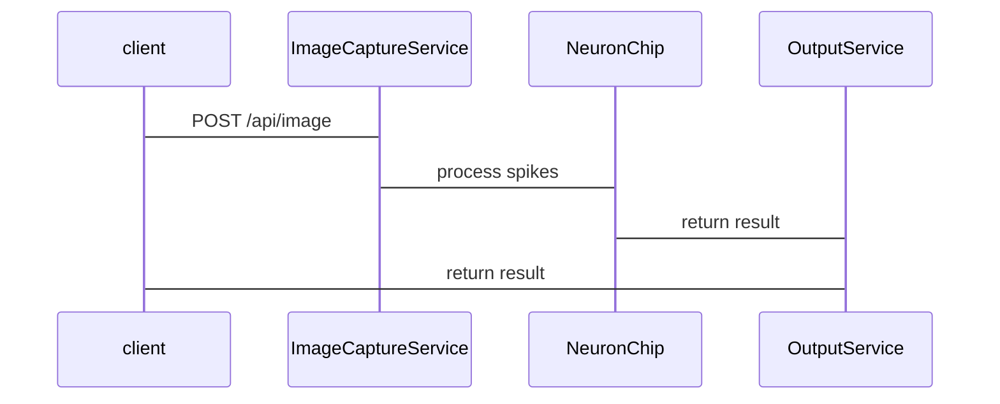

                 


# 如何识别企业的神经形态计算芯片优势

## 关键词：神经形态计算芯片，企业应用，计算优势，硬件设计，算法优化

## 摘要：神经形态计算芯片是一种模拟生物神经系统的计算芯片，能够提高计算效率和能效。本文将从背景、原理、算法、架构、实战和最佳实践等方面，详细讲解如何识别和应用神经形态计算芯片的优势。

---

# 第1章 神经形态计算芯片的背景与概念

## 1.1 神经形态计算芯片的起源与定义

神经形态计算芯片是一种模拟生物神经系统结构和功能的计算芯片。与传统计算芯片依赖冯·诺依曼架构不同，神经形态芯片通过模拟神经元和突触的动态行为，实现高效的并行计算。

### 1.1.1 传统计算芯片的局限性
传统芯片依赖串行计算，导致在处理复杂任务时效率低下。此外，数据存储和处理分离，增加了功耗和延迟。

### 1.1.2 神经形态计算的定义与特点
神经形态计算芯片通过模拟生物神经元的电脉冲和突触的权重变化，实现事件驱动的计算。其特点包括低功耗、高并行性和强大的模式识别能力。

### 1.1.3 神经形态计算与传统计算的对比
- **串行 vs 并行**：传统芯片串行处理任务，神经形态芯片并行处理。
- **数据依赖性**：传统芯片依赖存储器，神经形态芯片内存储与计算结合。
- **能效**：神经形态芯片通常更高效。

## 1.2 神经形态计算芯片的发展现状

### 1.2.1 国内外研究进展
国际上，IBM的TrueNorth和Intel的Loihi是领先的神经形态芯片。国内，清华大学等机构也在积极研究。

### 1.2.2 神经形态芯片的商业化应用
目前，神经形态芯片主要用于视觉识别、语音处理和自动驾驶等领域。

### 1.2.3 企业的神经形态芯片需求分析
企业需求主要集中在提升计算效率和降低功耗。例如，视觉识别需要快速处理大量数据。

## 1.3 企业为何需要神经形态计算芯片

### 1.3.1 传统芯片的性能瓶颈
传统芯片在处理复杂任务时效率低，如深度学习推理。

### 1.3.2 神经形态芯片的优势与潜力
神经形态芯片在模式识别和实时处理方面表现优异。

### 1.3.3 企业应用场景的匹配性
企业中的视觉识别、语音识别和实时数据分析等场景适合神经形态芯片。

---

# 第2章 神经形态计算芯片的核心原理

## 2.1 神经元模型与计算原理

### 2.1.1 生物神经元的模拟
神经元通过电脉冲传递信息，通过突触连接传递信号。

### 2.1.2 神经形态计算的基本单位
神经元模型是神经形态芯片的基本计算单元，通常使用Leaky Integrate-and-Fire模型。

### 2.1.3 神经元的动态行为与计算模型
神经元通过积分和发放脉冲进行计算，具有事件驱动特性。

## 2.2 突触模型与信息处理

### 2.2.1 突触的基本功能
突触通过权重调整实现信息传递和处理。

### 2.2.2 突触权重的调整机制
使用 Spike Timing Dependent Plasticity（STDP）算法调整突触权重。

### 2.2.3 突触在神经形态芯片中的实现
突触权重存储在片上，支持快速计算和调整。

## 2.3 神经网络的事件驱动机制

### 2.3.1 事件驱动的计算模式
基于事件触发的计算，减少不必要的计算步骤。

### 2.3.2 时间戳编码与信息处理
利用时间戳编码信息，提高数据处理效率。

### 2.3.3 事件驱动的优势与挑战
优势包括低功耗和实时性，但实现复杂。

---

# 第3章 神经形态计算芯片的关键技术

## 3.1 神经形态芯片的硬件实现

### 3.1.1 硬件架构设计
采用事件驱动架构，优化数据流和计算流程。

### 3.1.2 神经元电路的实现
使用模拟电路实现神经元的动态行为。

### 3.1.3 突触电路的优化
优化突触权重存储和调整电路，提高效率。

## 3.2 神经形态芯片的算法优化

### 3.2.1 神经网络模型的压缩与量化
通过压缩和量化减少模型参数，降低计算复杂度。

### 3.2.2 算法与硬件的协同设计
算法设计与硬件架构协同，提高计算效率。

### 3.2.3 神经网络的动态参数调整
根据输入实时调整参数，适应不同场景。

## 3.3 神经形态芯片的能效分析

### 3.3.1 芯片能效的定义与衡量标准
能效包括每瓦特计算量和计算延迟。

### 3.3.2 事件驱动计算的能效优势
事件驱动减少无效计算，降低功耗。

---

# 第4章 神经形态计算芯片的系统架构与设计

## 4.1 问题场景介绍

企业需要设计一个神经形态计算系统，用于实时图像识别。

## 4.2 系统功能设计

### 4.2.1 领域模型（Mermaid 类图）
```mermaid
classDiagram
    class 神经形态芯片 {
        输入模块
        神经元处理模块
        突触权重模块
        输出模块
    }
    class 图像采集模块 {
        采集图像数据
        转换为事件流
    }
    class 应用层 {
        接收事件流
        发出控制指令
    }
    神经形态芯片 <--| 图像采集模块
    图像采集模块 --> 应用层
    应用层 --> 神经形态芯片
```

### 4.2.2 系统架构设计（Mermaid 架构图）
```mermaid
browser
    HTTP GET /api/image
    --> ImageCaptureService
        process image
        --> NeuronChip
            process spikes
            --> OutputService
                return result
```

### 4.2.3 系统接口设计

定义API接口，如`POST /api/image`接收图像数据，返回识别结果。

### 4.2.4 系统交互设计（Mermaid 序列图）


## 4.3 项目实战

### 4.3.1 环境搭建
安装必要的库，如Nengo和PyNN。

### 4.3.2 核心代码实现
```python
import numpy as np

class Neuron:
    def __init__(self, params):
        self.params = params
        self.state = 0

    def step(self, input Spike):
        self.state += self.params['tau'] * (input Spike - self.state / self.params['tau'])
        if self.state > self.params['threshold']:
            self.state = 0
            return 1
        return 0

class Synapse:
    def __init__(self, params):
        self.params = params
        self.weight = np.random.uniform(0, 1)

    def update(self, pre_activity, post_activity):
        delta = post_activity - pre_activity
        self.weight += self.params['learning_rate'] * delta * pre_activity
        return self.weight

# 示例网络
class NeuralNetwork:
    def __init__(self, neuron_params, synapse_params):
        self.neurons = [Neuron(neuron_params) for _ in range(n_neurons)]
        self.synapses = [Synapse(synapse_params) for _ in range(n_synapses)]

    def process(self, input_data):
        for i, neuron in enumerate(self.neurons):
            input Spike = input_data[i]
            output Spike = neuron.step(input Spike)
            self.synapses[i].update(input Spike, output Spike)
        return output Spike
```

### 4.3.3 实际案例分析
分析视觉识别任务中的神经形态芯片应用，展示性能提升。

---

# 第5章 最佳实践与小结

## 5.1 最佳实践 tips

- 选择合适的神经形态芯片，根据企业需求。
- 确保硬件和算法协同设计。
- 优化系统架构，提高能效。

## 5.2 本章小结

神经形态计算芯片在企业中的应用潜力巨大，通过识别其优势，企业可以提升计算效率和能效。

---

通过以上结构，文章详细分析了神经形态计算芯片的优势，并提供了从理论到实践的指导，帮助企业识别和应用其优势。

