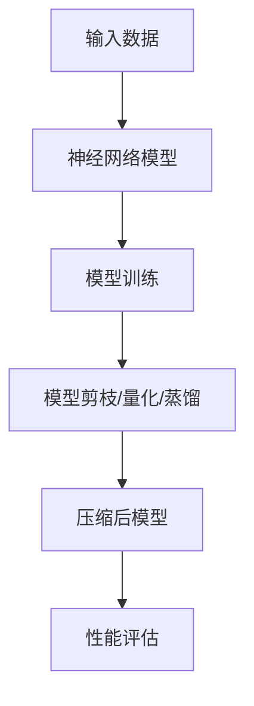
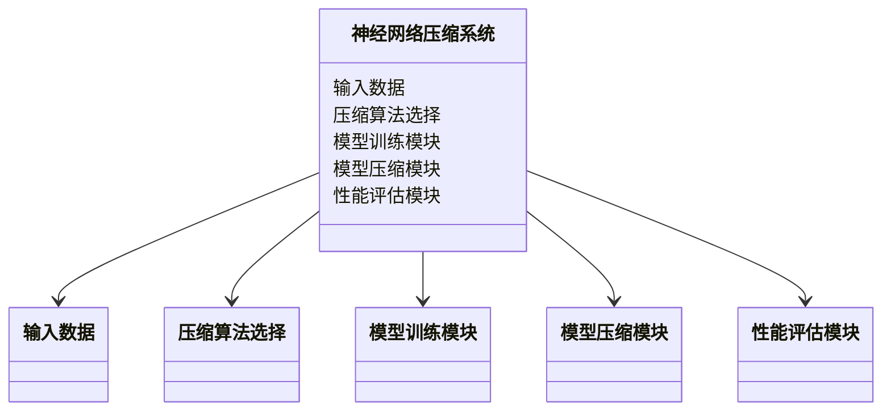
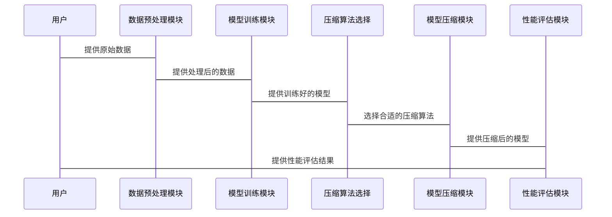

                 


# 如何识别企业的神经网络压缩技术优势

## 关键词：神经网络压缩技术、企业应用、模型优化、算法原理、系统设计、项目实战

## 摘要：神经网络压缩技术在企业中的应用日益广泛，本文将从背景与意义、核心概念、算法原理、系统设计、项目实战等多方面详细解析，帮助读者识别和理解神经网络压缩技术的优势，掌握其实现方法和应用场景。

---

## 目录

### 第一部分：神经网络压缩技术概述

#### 第1章：神经网络压缩技术的背景与意义

##### 1.1 神经网络压缩技术的背景

###### 1.1.1 神经网络的发展与挑战

- 神经网络的快速发展及其在企业中的应用
- 模型体积过大和计算资源受限的问题
- 压缩技术的迫切需求

###### 1.1.2 神经网络压缩技术的提出

- 压缩技术的核心目标
- 压缩技术的分类与特点
- 压缩技术在企业中的应用前景

###### 1.1.3 企业应用中的压缩技术优势

- 提高模型部署效率
- 降低计算成本
- 支持边缘计算和实时应用

##### 1.2 问题背景与目标

###### 1.2.1 神经网络压缩的目标

- 减小模型体积
- 提高运算速度
- 保持或接近原始模型的准确率

###### 1.2.2 压缩技术的核心问题

- 如何在保证准确率的前提下最小化模型体积
- 如何平衡压缩比率与性能损失
- 如何选择适合特定任务的压缩方法

###### 1.2.3 企业场景中的压缩需求

- 针对不同场景的压缩策略
- 企业中模型压缩的实际案例
- 压缩技术对企业竞争力的影响

### 第二部分：神经网络压缩技术的核心概念

#### 第2章：神经网络压缩技术的基本原理

##### 2.1 压缩技术的核心概念

###### 2.1.1 模型剪枝

- 删除冗余的神经网络节点或权重
- 剪枝算法的分类与比较
- 剪枝过程中保持模型准确性的方法

###### 2.1.2 模型量化

- 降低模型参数的精度（如从浮点数降到整数）
- 量化对模型性能的影响
- 量化过程中的误差分析

###### 2.1.3 知识蒸馏

- 使用大型模型的知识来训练小型模型
- 蒸馏技术的核心思想与实现方法
- 蒸馏过程中的挑战与优化策略

##### 2.2 压缩技术的关键属性

###### 2.2.1 模型大小

- 模型体积与压缩比率的关系
- 不同压缩技术对模型大小的影响
- 模型大小与应用场景的匹配

###### 2.2.2 运算速度

- 压缩对模型运算速度的提升
- 不同硬件平台上运算速度的差异
- 优化运算速度的具体方法

###### 2.2.3 准确率损失

- 准确率损失与压缩比率的关系
- 如何在保证准确率的前提下进行压缩
- 企业中对准确率损失的容忍度分析

##### 2.3 核心概念对比表

| 技术         | 原理                         | 优势                           | 动态性       |
|--------------|------------------------------|----------------------------------|--------------|
| 模型剪枝     | 删除冗余参数                 | 减小模型体积                   | 动态调整冗余度 |
| 模型量化     | 降低参数精度                 | 减少存储空间                   | 受限于精度损失 |
| 知识蒸馏     | 小模型学习大模型知识         | 提高轻量级模型性能             | 需要教师模型   |

#### 第3章：神经网络压缩技术的算法原理

##### 3.1 模型剪枝算法

###### 3.1.1 梯度剪枝

- 基于梯度的信息进行剪枝
- 剪枝策略的实现方法
- 剪枝过程中模型准确率的保持

###### 3.1.2 权重剪枝

- 基于权重大小的剪枝方法
- 剪枝阈值的确定
- 剪枝后的模型再训练方法

###### 3.1.3 层级剪枝

- 分层剪枝的思想
- 层级剪枝的具体实现
- 层级剪枝对模型结构的影响

##### 3.2 模型量化算法

###### 3.2.1 二进制量化

- 将权重量化为二进制值
- 量化过程中的信息损失
- 二进制量化在实际应用中的效果

###### 3.2.2 四舍五入量化

- 基于四舍五入的量化方法
- 量化对模型性能的影响
- 如何优化量化过程以减少误差

###### 3.2.3 沃尔夫斯滕量化

- 沃尔夫斯滕量化的基本原理
- 量化过程中的参数调整
- 沃尔夫斯滕量化在不同场景下的应用

##### 3.3 知识蒸馏算法

###### 3.3.1 温度缩放

- 温度参数对蒸馏过程的影响
- 温度缩放的具体实现方法
- 温度缩放对模型准确率的提升

###### 3.3.2 软标签蒸馏

- 软标签的概念与实现
- 软标签蒸馏与硬标签蒸馏的对比
- 软标签蒸馏在实际应用中的优势

###### 3.3.3 知识蒸馏的损失函数

- 蒸馏损失函数的设计
- 蒸馏过程中的损失计算
- 损失函数对模型性能的影响

##### 3.4 算法流程图



### 第三部分：神经网络压缩技术的系统分析与架构设计

#### 第4章：系统分析与架构设计方案

##### 4.1 问题场景介绍

- 神经网络压缩技术的应用场景
- 企业中常见的压缩需求
- 不同场景下的压缩策略选择

##### 4.2 项目介绍

- 项目目标
- 项目范围
- 项目计划与资源分配

##### 4.3 系统功能设计

###### 4.3.1 领域模型



###### 4.3.2 系统架构设计


###### 4.3.3 系统接口设计

- 输入接口：数据输入、模型参数输入
- 输出接口：压缩后的模型、性能评估结果
- 接口设计的具体实现细节

###### 4.3.4 系统交互流程图



### 第四部分：神经网络压缩技术的项目实战

#### 第5章：项目实战

##### 5.1 环境配置

- 安装必要的库和工具
- 环境配置的具体步骤
- 常见问题及解决方案

##### 5.2 系统核心实现源代码

###### 5.2.1 模型剪枝实现

```python
import tensorflow as tf
from tensorflow import keras

def model_pruning(model, pruning_rate=0.5):
    # 创建一个新模型
    new_model = keras.models.clone_model(model)
    # 遍历模型的每一层，剪枝冗余的权重
    for layer in new_model.layers:
        if isinstance(layer, keras.layers.Dense):
            weights = layer.get_weights()[0]
            # 假设我们要剪枝50%的权重
            threshold = np.percentile(abs(weights), (1 - pruning_rate) * 100)
            mask = np.abs(weights) > threshold
            # 更新权重
            layer.set_weights([weights * mask, layer.get_weights()[1]])
    return new_model
```

###### 5.2.2 模型量化实现

```python
def model_quantization(model, quantization_bits=8):
    # 创建一个新模型
    new_model = keras.models.clone_model(model)
    # 遍历模型的每一层，量化权重
    for layer in new_model.layers:
        if isinstance(layer, keras.layers.Dense):
            weights = layer.get_weights()[0]
            # 将权重量化到指定的位数
            quantized_weights = np.round(weights * (2 ** (quantization_bits - 1)) / (2 ** (quantization_bits - 1))).astype(int)
            # 确保权重在量化后的范围内
            quantized_weights = np.clip(quantized_weights, -2 ** (quantization_bits - 1), 2 ** (quantization_bits - 1))
            # 更新权重
            layer.set_weights([quantized_weights, layer.get_weights()[1]])
    return new_model
```

###### 5.2.3 知识蒸馏实现

```python
def knowledge_distillation.teacher_model():
    # 定义教师模型
    model = keras.Sequential([
        keras.layers.Dense(128, activation='relu', input_shape=(784,)),
        keras.layers.Dense(10, activation='softmax')
    ])
    model.compile(optimizer='adam', loss='categorical_crossentropy', metrics=['accuracy'])
    return model

def knowledge_distillation.student_model():
    # 定义学生模型
    model = keras.Sequential([
        keras.layers.Dense(64, activation='relu', input_shape=(784,)),
        keras.layers.Dense(10, activation='softmax')
    ])
    model.compile(optimizer='adam', loss='categorical_crossentropy', metrics=['accuracy'])
    return model

def train_with_distillation(teacher, student, x_train, y_train, x_test, y_test, epochs=10):
    # 训练过程
    for epoch in range(epochs):
        # 预测教师模型的软标签
        teacher_preds = teacher.predict(x_train)
        # 蒸馏损失函数
        distillation_loss = keras.losses.KLDivergence()
        # 计算蒸馏损失
        loss = distillation_loss(y_train, teacher_preds)
        # 反向传播和优化
        student.trainable = True
        student.optimizer.minimize(loss)
        student.trainable = False
        # 验证模型
        student.evaluate(x_test, y_test)
```

##### 5.3 代码应用解读与分析

- 代码功能分析
- 代码实现细节
- 代码的可扩展性和优化空间

##### 5.4 实际案例分析和详细讲解剖析

- 案例背景
- 案例分析
- 案例实现步骤
- 案例结果与分析

##### 5.5 项目小结

- 项目总结
- 经验分享
- 改进建议

### 第五部分：总结与展望

#### 第6章：总结与展望

##### 6.1 最佳实践 tips

- 压缩技术的选择与应用场景
- 压缩过程中的常见问题及解决方案
- 压缩技术的未来发展趋势

##### 6.2 小结

- 本文的核心内容回顾
- 神经网络压缩技术的优势与挑战
- 未来研究方向

##### 6.3 注意事项

- 压缩技术的适用场景
- 压缩过程中需要注意的问题
- 压缩技术对企业的影响

##### 6.4 拓展阅读

- 推荐的相关书籍和论文
- 其他相关资源
- 学习神经网络压缩技术的建议

---

## 附录

- 附录A：常用神经网络压缩技术工具列表
- 附录B：神经网络压缩技术的数学公式汇总
- 附录C：项目源代码

