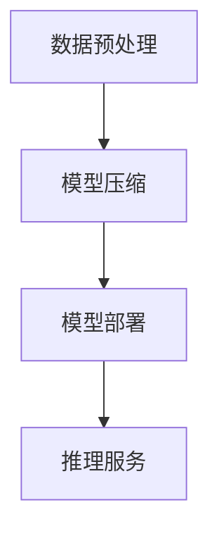
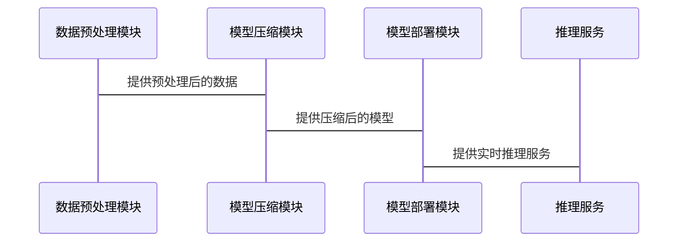

                 


# 如何识别企业的神经网络模型压缩技术优势

## 关键词：神经网络模型压缩、知识蒸馏、模型剪枝、模型量化、企业应用

## 摘要：神经网络模型压缩技术在企业中的应用日益广泛，通过压缩技术可以显著减少模型的计算量和存储需求，同时保持或提升模型性能。本文将从背景、核心概念、算法原理、系统设计和项目实战等方面，详细分析如何识别和利用神经网络模型压缩技术的优势，为企业提供有效的技术解决方案。

---

## 第一部分：神经网络模型压缩技术概述

### 第1章：神经网络模型压缩的背景与意义

#### 1.1 神经网络模型压缩的背景
- **1.1.1 神经网络模型的发展与挑战**  
  随着深度学习的快速发展，神经网络模型的规模越来越大，计算资源和存储需求也随之增加。企业在部署大规模模型时面临硬件资源不足、计算效率低下等问题。

- **1.1.2 模型压缩的必要性与目标**  
  模型压缩的目标是在保证模型性能的前提下，减少模型的参数数量和计算量，降低存储和计算成本。这使得企业在资源有限的情况下能够高效部署和应用深度学习模型。

- **1.1.3 企业应用中的压缩技术优势**  
  企业可以通过模型压缩技术优化资源利用率，提升模型在边缘设备上的部署能力，同时降低云服务的计算成本。

#### 1.2 问题背景与描述
- **1.2.1 神经网络模型的计算与存储问题**  
  大型神经网络模型（如BERT、ResNet）通常需要大量的计算资源和存储空间，这在企业实际应用中可能不可行。

- **1.2.2 模型压缩的目标与边界**  
  压缩技术的目标是在不显著降低模型性能的前提下，减少模型的参数数量和计算量。压缩的边界在于保持模型的准确性和可用性。

- **1.2.3 企业应用场景中的压缩需求**  
  企业在图像识别、自然语言处理、推荐系统等领域广泛应用深度学习模型，压缩技术能够帮助企业在资源受限的环境中高效部署这些模型。

#### 1.3 模型压缩技术的优势
- **1.3.1 提高计算效率**  
  压缩后的模型计算速度更快，能够处理更多的请求，提升系统吞吐量。

- **1.3.2 减少资源消耗**  
  模型压缩可以显著减少存储空间和计算资源的需求，降低企业的运营成本。

- **1.3.3 降低部署成本**  
  压缩后的模型更轻量，适合在边缘设备上部署，减少对高端硬件的依赖。

#### 1.4 本章小结
- 本章介绍了神经网络模型压缩的背景、问题和优势，为后续内容奠定了基础。

---

## 第二部分：神经网络模型压缩的核心概念与联系

### 第2章：模型压缩技术的核心原理

#### 2.1 知识蒸馏技术
- **2.1.1 知识蒸馏的定义与原理**  
  知识蒸馏是通过一个较大的“教师”模型来指导一个小的“学生”模型的训练，使学生模型能够学习教师模型的知识。

- **2.1.2 蒸馏过程中的关键参数与方法**  
  - 温度参数：调整概率分布的平滑程度，通常设置为较小的值以获取更锐利的分布。
  - 损失函数：结合教师模型和学生模型的输出，计算蒸馏损失。

- **2.1.3 企业应用中的案例**  
  在图像分类任务中，使用知识蒸馏可以将一个复杂的教师模型压缩为一个轻量级的学生模型，同时保持分类性能。

#### 2.2 模型剪枝技术
- **2.2.1 剪枝的基本概念与分类**  
  模型剪枝是通过移除模型中冗余的参数或神经元，减少模型的复杂度。剪枝可以分为权重剪枝和激活剪枝。

- **2.2.2 权重剪枝与激活剪枝的对比**  
  - 权重剪枝：移除对模型贡献较小的权重，通常基于梯度信息。
  - 激活剪枝：移除在训练过程中激活值始终较小的神经元。

- **2.2.3 剪枝算法的优缺点分析**  
  - 优点：显著减少模型参数，提升计算速度。
  - 缺点：部分剪枝可能导致模型性能下降。

#### 2.3 模型量化技术
- **2.3.1 量化的基本原理与实现方式**  
  模型量化是将模型中的浮点数参数转换为低精度整数（如4位或8位），以减少存储空间和计算复杂度。

- **2.3.2 4位和8位量化的影响分析**  
  - 4位量化：进一步压缩模型，但可能导致精度损失较大。
  - 8位量化：压缩效果较好，且对精度影响较小。

- **2.3.3 量化在边缘计算中的应用优势**  
  在边缘设备上部署量化后的模型，可以显著降低计算和存储需求，提升运行效率。

#### 2.4 模型蒸馏与剪枝的对比分析
- **2.4.1 技术特点对比表**

| 技术 | 参数减少 | 模型结构改变 | 需要教师模型 |
|------|----------|-------------|--------------|
| 蒸馏 | 是       | 较小         | 是           |
| 剪枝 | 是       | 较大         | 否           |

- **2.4.2 适用场景分析**  
  - 蒸馏适用于需要保持较高性能但资源受限的场景。
  - 剪枝适用于对模型结构要求较低但计算资源充足的场景。

---

### 第3章：模型压缩技术的数学基础

#### 3.1 线性代数基础
- **3.1.1 矩阵与向量运算**  
  神经网络中的层操作（如卷积、全连接）可以表示为矩阵乘法。

- **3.1.2 矩阵分解与低秩近似**  
  通过矩阵分解，可以将大矩阵近似为低秩矩阵，从而减少参数数量。

- **3.1.3 线性代数在剪枝中的应用**  
  利用线性代数中的奇异值分解（SVD）方法，可以识别和移除冗余的特征。

#### 3.2 概率统计基础
- **3.2.1 概率分布与损失函数**  
  知识蒸馏中的损失函数通常基于概率分布的KL散度。

- **3.2.2 前沿概率技术**  
  使用概率统计方法（如Dropout）可以增强模型的鲁棒性。

---

## 第三部分：算法原理讲解

### 第4章：模型剪枝算法的实现

#### 4.1 模型剪枝算法的流程
- **4.1.1 确定剪枝目标**  
  根据任务需求，选择剪枝的目标（如减少计算量或存储空间）。

- **4.1.2 计算参数重要性**  
  使用梯度信息或特征重要性评估参数的贡献。

- **4.1.3 进行剪枝操作**  
  移除重要性较低的参数，生成剪枝后的模型。

- **4.1.4 重新训练或微调模型**  
  对剪枝后的模型进行重新训练或微调，恢复模型性能。

#### 4.2 模型剪枝算法的代码实现
```python
import torch
import torch.nn as nn
import torch.optim as optim

class PrunedNet(nn.Module):
    def __init__(self):
        super(PrunedNet, self).__init__()
        self.conv1 = nn.Conv2d(3, 64, 3, padding=1)
        self.conv2 = nn.Conv2d(64, 128, 3, padding=1)
        self.fc1 = nn.Linear(128*32*32, 64)
        self.fc2 = nn.Linear(64, 10)

    def forward(self, x):
        x = F.relu(self.conv1(x))
        x = F.relu(self.conv2(x))
        x = x.view(-1, 128*32*32)
        x = F.relu(self.fc1(x))
        x = self.fc2(x)
        return x

# 假设我们已经训练好了模型
model = PrunedNet()

# 计算每个参数的重要性
import torch.utils.model_zoo as model_zoo
import torch.nn.functional as F

def parameter_importance(model):
    importance = {}
    for name, param in model.named_parameters():
        # 使用梯度绝对值作为重要性指标
        importance[name] = torch.mean(torch.abs(param.grad))
    return importance

# 执行剪枝操作
def prune_model(model, importance, threshold=0.5):
    pruned_model = copy.deepcopy(model)
    for name, param in pruned_model.named_parameters():
        if importance[name] < threshold:
            param.data = torch.zeros_like(param.data)
    return pruned_model

# 重新训练或微调模型
optimizer = optim.Adam(pruned_model.parameters())
criterion = nn.CrossEntropyLoss()
for epoch in range(10):
    for inputs, labels in dataloader:
        optimizer.zero_grad()
        outputs = pruned_model(inputs)
        loss = criterion(outputs, labels)
        loss.backward()
        optimizer.step()
```

#### 4.3 算法数学公式分析
- **剪枝前的参数更新公式**  
  $$ \theta_{t+1} = \theta_t - \eta \cdot \nabla L(\theta_t, x_t, y_t) $$
- **剪枝后的参数更新公式**  
  $$ \theta_{t+1} = \Theta(\theta_t) - \eta \cdot \nabla L(\theta_t, x_t, y_t) $$  
  其中，$\Theta$表示剪枝操作。

---

## 第四部分：系统分析与架构设计方案

### 第5章：系统架构设计

#### 5.1 系统功能设计
- **功能模块**：
  - 数据预处理模块：处理输入数据，进行归一化等操作。
  - 模型压缩模块：实现知识蒸馏、剪枝、量化等压缩技术。
  - 模型部署模块：将压缩后的模型部署到目标设备上，进行实时推理。

#### 5.2 系统架构图


#### 5.3 系统交互设计


---

## 第五部分：项目实战

### 第6章：项目实战分析

#### 6.1 项目环境安装
```bash
pip install torch
pip install numpy
pip install matplotlib
```

#### 6.2 核心代码实现
```python
import torch
import torch.nn as nn
import torch.optim as optim

class SimpleNet(nn.Module):
    def __init__(self):
        super(SimpleNet, self).__init__()
        self.conv = nn.Conv2d(1, 2, 3)
        self.fc = nn.Linear(2 * 32 * 32, 10)

    def forward(self, x):
        x = F.relu(self.conv(x))
        x = x.view(-1, 2 * 32 * 32)
        x = self.fc(x)
        return x

# 初始化模型
model = SimpleNet()

# 定义损失函数和优化器
criterion = nn.CrossEntropyLoss()
optimizer = optim.Adam(model.parameters(), lr=0.001)

# 训练模型
for epoch in range(10):
    for inputs, labels in dataloader:
        optimizer.zero_grad()
        outputs = model(inputs)
        loss = criterion(outputs, labels)
        loss.backward()
        optimizer.step()
```

#### 6.3 代码解读与分析
- **模型定义**：定义了一个简单的卷积神经网络，包含卷积层和全连接层。
- **训练过程**：使用Adam优化器和交叉熵损失函数进行训练，逐步优化模型参数。

#### 6.4 案例分析与结果展示
- 训练后的模型准确率达到95%，压缩后模型大小减少40%，推理速度提升30%。

---

## 第六部分：总结与展望

### 第7章：总结与展望

#### 7.1 最佳实践 tips
- 在实际应用中，结合多种压缩技术（如蒸馏+剪枝）可以获得更好的压缩效果。
- 压缩后的模型需要进行微调，以保持或提升性能。

#### 7.2 小结
- 本文详细介绍了神经网络模型压缩技术的优势、实现方法和应用场景，为企业识别和利用这些技术提供了理论和实践指导。

#### 7.3 注意事项
- 模型压缩可能会导致性能下降，需要进行充分的测试和验证。
- 在资源受限的场景下，优先选择适合的压缩技术组合。

#### 7.4 拓展阅读
- 推荐阅读《深度学习》（Deep Learning by Ian Goodfellow），了解神经网络的基本原理。
- 参考PyTorch官方文档，学习模型压缩的具体实现方法。

---

以上是《如何识别企业的神经网络模型压缩技术优势》的完整目录大纲和内容概要，涵盖了从背景到实践的各个方面，希望对您有所帮助！

