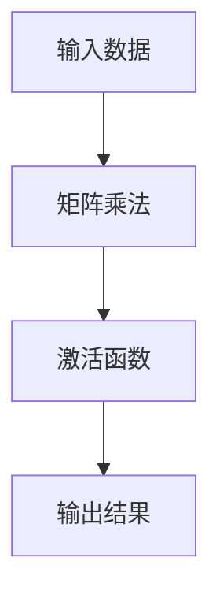
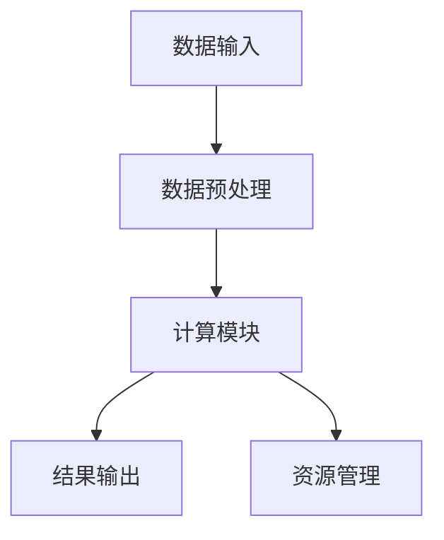
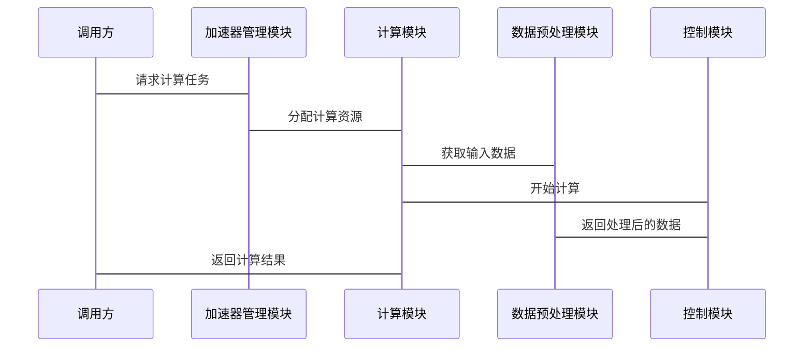

                 


# 如何识别企业的神经网络硬件加速器优势

## 关键词：神经网络硬件加速器、企业优势识别、并行计算、性能优化、硬件架构设计、人工智能优化

## 摘要：本文旨在帮助企业识别神经网络硬件加速器的优势。通过分析神经网络加速器的核心原理、算法优化、系统架构设计以及项目实战，本文将详细阐述如何在企业中有效识别和利用神经网络硬件加速器的优势，从而提升企业的技术竞争力和效率。

---

## 第一部分：神经网络硬件加速器的背景与概念

### 第1章：神经网络硬件加速器的定义与背景

#### 1.1 神经网络硬件加速器的定义
神经网络硬件加速器是一种专门用于加速神经网络计算的硬件设备，通过高效的并行计算和优化的架构设计，显著提升神经网络模型的训练和推理效率。

#### 1.2 神经网络加速器的发展背景
- 随着人工智能技术的快速发展，神经网络模型的复杂性和规模不断增加。
- 传统CPU在处理大规模神经网络时效率低下，无法满足实时性和高性能需求。
- 神经网络加速器通过专用硬件设计，有效解决了这一问题。

#### 1.3 神经网络加速器的优势
- **并行计算能力**：神经网络加速器通过并行计算显著提升计算效率。
- **低能耗**：优化的硬件架构设计降低了计算能耗。
- **高扩展性**：支持大规模模型训练和部署。

#### 1.4 神经网络加速器的应用场景
- **深度学习模型训练**：加速器可以显著缩短训练时间。
- **实时图像处理**：应用于计算机视觉任务，如目标检测、图像分割。
- **自然语言处理**：加速大规模语言模型的训练和推理。

#### 1.5 本章小结
本章介绍了神经网络硬件加速器的基本概念、发展背景及其优势和应用场景。

---

## 第二部分：神经网络硬件加速器的核心原理

### 第2章：神经网络加速器的核心原理

#### 2.1 神经网络加速器的基本原理
- **并行计算**：加速器通过并行计算能力，同时处理大量数据，提升计算效率。
- **流水线处理**：通过流水线技术，优化数据处理流程，减少计算延迟。
- **矩阵运算优化**：神经网络的核心是矩阵运算，加速器通过专门设计优化矩阵运算效率。

#### 2.2 神经网络加速器的关键技术
- **并行计算技术**：支持多线程和多核计算，提升计算速度。
- **流水线技术**：优化数据处理流程，减少指令依赖，提升吞吐量。
- **矩阵运算优化技术**：通过专门的硬件设计，优化矩阵乘法和加法运算。

#### 2.3 神经网络加速器的实现方式
- **GPU加速**：利用GPU的并行计算能力，加速神经网络计算。
- **FPGA加速**：通过FPGA的可编程特性，实现定制化的加速器设计。
- **专用ASIC加速**：设计专用的神经网络加速芯片，进一步优化计算效率。

#### 2.4 神经网络加速器的性能指标
- **计算速度**：每秒处理的计算量（FLOPS）。
- **能耗效率**：单位能耗下的计算效率。
- **并行能力**：支持的最大并行计算核心数量。

#### 2.5 不同加速器的优缺点对比
| 加速器类型 | 优点 | 缺点 |
|------------|------|------|
| GPU        | 并行计算能力强，生态系统完善 | 功耗高，不适合移动设备 |
| FPGA       | 可编程性高，灵活性强 | 开发复杂，资源利用率低 |
| ASIC       | 专为神经网络设计，效率最高 | 成本高，开发周期长 |

#### 2.6 本章小结
本章详细介绍了神经网络加速器的核心原理、关键技术及其实现方式，并对比了不同加速器的优缺点。

---

## 第三部分：神经网络硬件加速器的算法与数学模型

### 第3章：神经网络加速器的算法原理

#### 3.1 神经网络加速器的算法基础
- 神经网络的基本算法包括前向传播、反向传播和优化算法（如梯度下降）。
- 硬件加速器通过优化算法的执行流程，提升计算效率。

#### 3.2 神经网络加速器的数学模型
- 神经网络的核心是矩阵运算，尤其是矩阵乘法和加法运算。
- 神经网络的计算模型包括卷积层、全连接层和激活函数等。

#### 3.3 神经网络加速器的优化算法
- **稀疏化技术**：通过减少权重的非零元素，降低计算量。
- **量化技术**：通过降低数据精度（如从浮点数降到定点数），减少计算资源消耗。
- **并行计算优化**：通过任务划分和数据并行，提升计算效率。

#### 3.4 神经网络加速器的算法流程图


#### 3.5 神经网络加速器的数学模型示例
- 矩阵乘法的数学表达：
$$ C = W \cdot X + b $$
其中，$W$ 是权重矩阵，$X$ 是输入矩阵，$b$ 是偏置向量。

#### 3.6 本章小结
本章详细介绍了神经网络加速器的算法基础、数学模型及其优化算法，并通过流程图和数学公式进行了直观展示。

---

## 第四部分：神经网络硬件加速器的系统架构与设计

### 第4章：神经网络加速器的系统架构

#### 4.1 神经网络加速器的系统架构设计
- 系统功能模块划分：数据输入模块、计算模块、控制模块和输出模块。
- 系统架构的层次化设计：从芯片级到系统级的分层架构。

#### 4.2 神经网络加速器的系统功能设计
- **神经网络模型加载与解析**：加速器需要能够加载和解析不同格式的神经网络模型。
- **神经网络计算任务调度**：通过任务调度算法，优化计算资源的利用。
- **加速器资源管理与分配**：动态分配计算资源，确保任务高效执行。

#### 4.3 神经网络加速器的系统架构图


#### 4.4 神经网络加速器的系统交互序列图


#### 4.5 神经网络加速器的系统接口设计
- **输入接口**：支持多种数据格式的输入，如图像数据、文本数据。
- **输出接口**：提供多种输出格式，如JSON、CSV等。
- **控制接口**：提供配置参数和状态监控接口。

#### 4.6 本章小结
本章详细介绍了神经网络加速器的系统架构设计，包括功能模块划分、系统架构图和系统交互序列图。

---

## 第五部分：神经网络硬件加速器的项目实战

### 第5章：神经网络加速器的项目实战

#### 5.1 环境安装与配置
- **安装GPU驱动**：确保系统支持并安装最新的GPU驱动。
- **安装深度学习框架**：如TensorFlow、PyTorch，支持GPU加速。
- **安装神经网络加速器驱动**：安装相应的硬件驱动和SDK。

#### 5.2 神经网络加速器的核心实现代码
```python
import tensorflow as tf

# 加载预训练模型
model = tf.keras.applications.MobileNetV2(weights='imagenet', include_top=True)

# 定义输入
input_tensor = tf.keras.Input(shape=(224, 224, 3))
# 前向传播
x = model.layers[0](input_tensor)
x = model.layers[1](x)
...
# 获取输出
output = model(x)

# 模型编译和训练
model.compile(optimizer='adam', loss='sparse_categorical_crossentropy', metrics=['accuracy'])
model.fit(train_data, train_labels, epochs=10, batch_size=32)
```

#### 5.3 代码实现与解读
- **输入处理**：定义输入张量并进行前向传播。
- **模型编译**：选择优化器和损失函数，配置训练参数。
- **模型训练**：使用训练数据进行模型训练，优化器自动调整权重。

#### 5.4 实际案例分析
- **案例一**：图像分类任务中，使用加速器加速模型训练。
- **案例二**：自然语言处理任务中，优化模型推理速度。

#### 5.5 项目总结与经验分享
- **加速器的优势**：显著提升训练和推理效率。
- **注意事项**：合理选择加速器类型，优化模型和数据处理流程。

#### 5.6 本章小结
本章通过实际项目案例，详细介绍了神经网络加速器的环境配置、代码实现和案例分析。

---

## 第六部分：神经网络硬件加速器的最佳实践

### 第6章：神经网络加速器的最佳实践

#### 6.1 神经网络加速器的选择建议
- **根据需求选择加速器类型**：明确应用场景和性能需求。
- **评估硬件性能指标**：关注计算速度、能耗效率和并行能力。
- **考虑生态系统和支持**：选择有良好支持和丰富资源的加速器。

#### 6.2 神经网络加速器的优化技巧
- **数据预处理优化**：减少数据加载和预处理时间。
- **模型优化**：通过剪枝和量化技术，减少模型复杂度。
- **任务调度优化**：合理分配计算资源，提高系统利用率。

#### 6.3 神经网络加速器的未来发展趋势
- **更高的计算效率**：通过技术创新进一步提升计算速度。
- **更低的能耗**：优化硬件设计，降低能耗。
- **更灵活的架构**：支持更多样化的模型和任务。

#### 6.4 本章小结
本章给出了神经网络加速器的选择建议、优化技巧和未来发展趋势。

---

## 第七部分：总结与展望

### 第7章：总结与展望

#### 7.1 神经网络硬件加速器的优势总结
- 通过并行计算和优化的硬件设计，显著提升神经网络计算效率。
- 在深度学习模型训练和实时推理中表现出色。

#### 7.2 未来研究方向
- **新型加速技术**：探索新的加速算法和硬件架构。
- **跨平台支持**：提升加速器的兼容性和易用性。
- **智能化优化**：结合自动化技术，实现自适应优化。

#### 7.3 本章小结
本章总结了神经网络硬件加速器的优势，并展望了未来的研究方向。

---

## 参考文献

- TensorFlow官方文档
- PyTorch官方文档
- 《深度学习》 - Ian Goodfellow
- 《神经网络与深度学习》 - 李宏江

---

通过以上内容，本文系统地介绍了神经网络硬件加速器的优势识别方法，从背景、原理、算法、系统架构到项目实战，全面覆盖了相关知识，并通过实际案例和最佳实践，帮助读者更好地理解和应用神经网络硬件加速器的优势。

