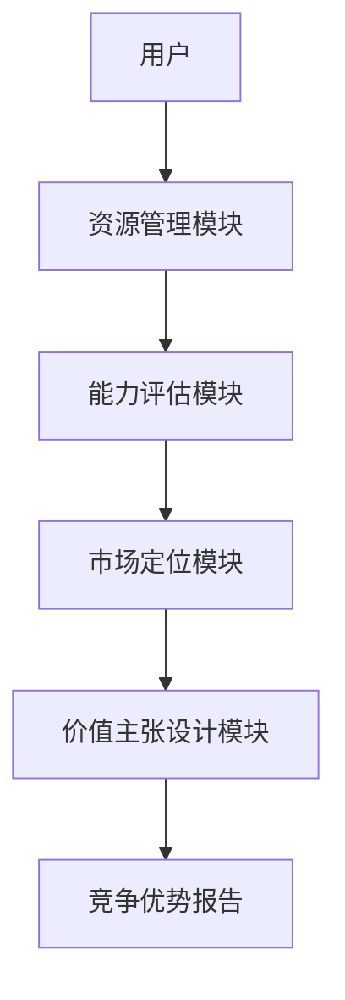

                 


# 如何识别企业的竞争优势

## 关键词：
企业竞争优势、识别方法、资源分析、能力评估、市场定位、价值主张

## 摘要：
企业竞争优势是企业在市场竞争中胜出的关键因素。本文系统地介绍了如何识别企业的竞争优势，包括资源分析、能力评估、市场定位和价值主张等方面。通过结合理论与实际案例，本文详细阐述了竞争优势的构成要素及其动态变化，并提供了可操作的识别方法和工具。读者将学会如何从内部资源和能力出发，结合外部市场环境，制定有效的竞争优势战略。

---

# 第一部分：企业竞争优势的背景与基础

## 第1章：企业竞争优势的定义与背景

### 1.1 企业竞争优势的定义

#### 1.1.1 什么是企业竞争优势
企业竞争优势是指企业在市场中提供独特价值或以更低的成本实现价值主张的能力。这种优势使得企业在竞争中能够吸引客户、击败竞争对手并实现可持续增长。

#### 1.1.2 企业竞争优势的核心要素
- **资源**：企业拥有的资金、技术、人才、品牌等。
- **能力**：企业的技术能力、管理能力、创新能力等。
- **市场定位**：企业在市场中的位置和目标客户群体。
- **价值主张**：企业向客户提供的独特价值。

#### 1.1.3 企业竞争优势的边界与外延
竞争优势不仅包括企业内部资源和能力，还包括企业与外部环境（如供应商、客户、竞争对手）的互动关系。

---

### 1.2 企业竞争优势的重要性

#### 1.2.1 竞争优势对企业生存与发展的意义
竞争优势是企业生存和发展的核心。没有竞争优势的企业难以在激烈的市场竞争中存活。

#### 1.2.2 竞争优势与企业长期价值创造的关系
竞争优势决定了企业能否持续为客户创造价值，从而实现长期发展。

#### 1.2.3 企业竞争优势的动态变化特点
竞争优势不是一成不变的，随着市场环境和技术的变化，企业需要不断调整和优化竞争优势。

---

## 第2章：企业竞争优势的核心概念与联系

### 2.1 核心概念原理

#### 2.1.1 资源基础观（RBV）理论
资源基础观认为，企业的竞争优势来源于其独特的资源和能力。

#### 2.1.2 价值链分析模型
价值链分析模型强调企业内部价值链的优化，以提高效率和降低成本。

#### 2.1.3 核心竞争力的定义与特征
核心竞争力是指企业能够长期为客户提供的独特价值，具有不可替代性和持久性。

### 2.2 核心概念属性特征对比

| 核心概念 | 资源 | 能力 | 市场定位 | 价值链 |
|----------|------|------|----------|--------|
| 稀缺性    | √    | √    |          | √      |
| 不可替代性 | √    | √    | √        | √      |
| 可持续性   |      | √    |          | √      |

### 2.3 ER实体关系图

```mermaid
er
  actor 企业
  actor 资源
  actor 能力
  actor 市场定位
  actor 价值链
  relation 企业-资源：拥有
  relation 企业-能力：具备
  relation 企业-市场定位：定位
  relation 企业-价值链：依赖
```

---

# 第二部分：企业竞争优势的识别方法

## 第3章：基于资源的分析

### 3.1 资源分析的重要性

#### 3.1.1 企业资源的分类
- **有形资源**：如资金、设备、土地。
- **无形资源**：如品牌、专利、技术。

### 3.2 资源分析的具体步骤

#### 3.2.1 识别关键资源
- 列出企业拥有的所有资源。
- 确定哪些资源是核心竞争力的关键。

#### 3.2.2 分析资源的独特性
- 资源是否具有独特性？是否难以被竞争对手复制？

#### 3.2.3 评估资源的可持续性
- 资源是否能够长期为企业创造价值？

---

## 第4章：基于能力的评估

### 4.1 能力分析的重要性

#### 4.1.1 企业能力的分类
- **技术能力**：技术创新、产品开发。
- **管理能力**：战略制定、组织管理。

### 4.2 能力评估的具体步骤

#### 4.2.1 识别核心能力
- 列出企业的所有能力。
- 确定哪些能力是核心竞争力。

#### 4.2.2 评估能力的竞争力
- 能力是否优于竞争对手？
- 能力是否能够持续改进？

---

## 第5章：基于市场定位的分析

### 5.1 市场定位的重要性

#### 5.1.1 目标市场选择
- 确定企业的目标客户群体。

#### 5.1.2 市场定位策略
- 区别化定位、成本领先定位、聚焦定位。

---

## 第6章：基于价值主张的分析

### 6.1 价值主张的重要性

#### 6.1.1 价值主张的定义
- 企业向客户提供的独特价值。

#### 6.1.2 价值主张的实现
- 通过产品、服务、品牌等方式实现。

---

## 第7章：综合分析与策略制定

### 7.1 综合分析竞争优势

#### 7.1.1 资源、能力、市场定位与价值主张的整合
- 将内部资源和能力与外部市场定位和价值主张结合起来。

### 7.2 制定竞争优势策略

#### 7.2.1 竞争优势的强化
- 加强核心竞争力。
- 提高资源配置效率。

---

## 第8章：竞争优势的动态优化

### 8.1 竞争优势的动态变化

#### 8.1.1 竞争环境的变化
- 技术进步、市场需求变化、政策调整。

#### 8.1.2 企业内部的变化
- 资源更新、能力提升、组织结构调整。

### 8.2 竞争优势的持续优化

#### 8.2.1 定期评估竞争优势
- 每季度或每年评估一次竞争优势。

#### 8.2.2 根据变化调整策略
- 针对环境变化及时调整竞争优势。

---

## 第9章：竞争优势识别的工具与方法

### 9.1 资源审计工具

#### 9.1.1 资源审计表
- 列出企业所有资源并评估其价值。

### 9.2 能力评估工具

#### 9.2.1 SWOT分析法
- 优势、劣势、机会、威胁分析。

### 9.3 市场定位工具

#### 9.3.1 五力分析模型
- 由迈克尔·波特提出，分析行业竞争结构。

### 9.4 价值主张设计工具

#### 9.4.1 价值主张画布
- 可视化工具，帮助设计价值主张。

---

## 第10章：竞争优势识别的案例分析

### 10.1 案例背景

#### 10.1.1 某科技企业的竞争优势识别
- 分析其技术能力、资源、市场定位和价值主张。

### 10.2 分析过程

#### 10.2.1 资源分析
- 技术研发团队、专利数量。

#### 10.2.2 能力评估
- 技术创新能力、市场响应能力。

#### 10.2.3 市场定位
- 高端市场定位，专注于技术创新。

### 10.3 竞争优势总结

#### 10.3.1 核心竞争优势
- 技术创新能力和快速响应能力。

#### 10.3.2 改进建议
- 加强研发投入，巩固技术领先地位。

---

## 第11章：竞争优势识别的关键点

### 11.1 关键点总结

#### 11.1.1 资源与能力的结合
- 内部资源和能力是竞争优势的基础。

#### 11.1.2 市场定位与价值主张的匹配
- 外部市场定位和价值主张是竞争优势的实现方式。

### 11.2 注意事项

#### 11.2.1 定期评估竞争优势
- 竞争优势不是一成不变的，需要定期评估和优化。

#### 11.2.2 避免过度依赖单一优势
- 企业应该多元化发展，避免过度依赖某一方面的优势。

### 11.3 拓展阅读

#### 11.3.1 推荐书籍
- 《竞争优势》（Competitive Advantage）——迈克尔·波特
- 《企业战略管理》（Corporate Strategy Management）——安德鲁·卡普兰

#### 11.3.2 推荐文章
- 竞争优势与企业战略（Harvard Business Review）

---

## 第12章：如何制定竞争优势策略

### 12.1 竞争优势策略制定的步骤

#### 12.1.1 明确企业目标
- 确定企业的短期和长期目标。

#### 12.1.2 分析内部资源和能力
- 列出企业的资源和能力，评估其优劣势。

#### 12.1.3 了解外部环境
- 分析行业趋势、竞争对手和客户需求。

#### 12.1.4 制定策略
- 根据分析结果，制定具体的竞争优势策略。

### 12.2 竞争优势策略的实施

#### 12.2.1 资源配置
- 合理分配资源，支持核心竞争力的发展。

#### 12.2.2 能力提升
- 持续提升企业的核心能力。

#### 12.2.3 市场定位优化
- 根据市场变化调整市场定位。

### 12.3 竞争优势策略的监控与评估

#### 12.3.1 定期监控
- 每季度或每年监控竞争优势的变化。

#### 12.3.2 及时调整
- 根据监控结果，及时调整策略。

---

## 第13章：竞争优势识别的误区与解决方案

### 13.1 常见误区

#### 13.1.1 过度关注内部资源
- 忽视外部市场环境和客户需求。

#### 13.1.2 忽略动态变化
- 企业竞争优势不是一成不变的，需要动态调整。

### 13.2 解决策略

#### 13.2.1 综合内外部因素
- 将内部资源和能力与外部环境相结合。

#### 13.2.2 动态优化
- 定期评估竞争优势，根据变化及时调整。

---

## 第14章：竞争优势识别的未来趋势

### 14.1 数字化转型的影响
- 数字化技术如何改变企业竞争优势的识别。

### 14.2 全球化与本地化的平衡
- 如何在全球化竞争中保持本地化优势。

### 14.3 可持续发展的重要性
- 绿色经济对企业竞争优势的影响。

---

## 第15章：总结与展望

### 15.1 总结

#### 15.1.1 核心观点回顾
- 企业竞争优势是企业生存和发展的关键。
- 竞争优势来源于内部资源和能力，以及外部市场定位和价值主张。
- 竞争优势需要动态优化和持续改进。

### 15.2 展望

#### 15.2.1 未来挑战
- 如何应对技术进步和市场变化对企业竞争优势的影响。

#### 15.2.2 未来机遇
- 数字化转型和可持续发展为企业竞争优势提供了新的机会。

---

## 第16章：最佳实践与成功案例

### 16.1 最佳实践

#### 16.1.1 定期进行资源和能力评估
- 每季度或每年评估一次企业资源和能力的变化。

#### 16.1.2 结合内外部环境制定策略
- 将内部资源和能力与外部市场环境相结合，制定竞争优势策略。

### 16.2 成功案例

#### 16.2.1 某知名企业的竞争优势识别与策略制定
- 分析该企业的资源、能力、市场定位和价值主张，总结其竞争优势识别的实践经验。

---

## 第17章：竞争优势识别的工具与方法

### 17.1 资源审计工具

#### 17.1.1 资源审计表
- 列出企业所有资源，并评估其价值和潜力。

### 17.2 能力评估工具

#### 17.2.1 能力评估矩阵
- 通过矩阵分析企业能力的强弱。

### 17.3 市场定位工具

#### 17.3.1 市场定位分析图
- 可视化工具，帮助确定企业在市场中的位置。

### 17.4 价值主张设计工具

#### 17.4.1 价值主张画布
- 可视化工具，帮助设计和优化企业价值主张。

---

## 第18章：竞争优势识别的数学模型与算法

### 18.1 竞争优势评估的数学模型

#### 18.1.1 资源评估模型
$$ \text{资源价值} = \sum_{i=1}^{n} (w_i \cdot r_i) $$
其中，$w_i$ 是资源 $i$ 的权重，$r_i$ 是资源 $i$ 的评估值。

#### 18.1.2 能力评估模型
$$ \text{能力指数} = \frac{\sum_{j=1}^{m} (c_j \cdot s_j)}{m} $$
其中，$c_j$ 是能力 $j$ 的重要性，$s_j$ 是能力 $j$ 的得分。

### 18.2 竞争优势识别的算法

#### 18.2.1 基于聚类分析的竞争优势识别
- 使用聚类分析将企业资源和能力分为不同的类别，识别核心竞争优势。

#### 18.2.2 基于决策树的竞争优势识别
- 使用决策树算法分析企业竞争优势的关键因素。

---

## 第19章：竞争优势识别的系统架构与设计

### 19.1 系统架构设计

#### 19.1.1 系统功能模块
- 资源管理模块、能力评估模块、市场定位模块、价值主张设计模块。

#### 19.1.2 系统交互流程
- 用户输入企业信息，系统分析并输出竞争优势报告。

### 19.2 系统架构图



---

## 第20章：竞争优势识别的项目实战

### 20.1 项目环境安装

#### 20.1.1 安装工具
- 安装Python、Pandas、Scikit-learn等工具。

### 20.2 核心代码实现

#### 20.2.1 资源评估代码
```python
import pandas as pd

# 创建资源评估数据框
resources = pd.DataFrame({
    '资源': ['技术', '品牌', '资金', '人才'],
    '权重': [0.4, 0.3, 0.2, 0.1]
})

# 计算资源价值
resources['资源价值'] = resources['权重'] * resources['资源'].apply(lambda x: 1 if x == '技术' else 0)
```

#### 20.2.2 能力评估代码
```python
from sklearn.tree import DecisionTreeClassifier
from sklearn.metrics import accuracy_score

# 创建能力评估数据集
data = {
    '能力': ['技术', '管理', '创新', '市场'],
    '得分': [0.8, 0.6, 0.7, 0.9]
}

df = pd.DataFrame(data)

# 训练决策树模型
model = DecisionTreeClassifier()
model.fit(df[['能力']], df['得分'])

# 预测新数据
new_data = pd.DataFrame({'能力': ['创新']})
predicted = model.predict(new_data[['能力']])
print("预测得分：", predicted)
```

### 20.3 代码解读与分析

#### 20.3.1 资源评估代码解读
- 使用Pandas创建资源评估数据框，计算资源价值。

#### 20.3.2 能力评估代码解读
- 使用Scikit-learn的决策树模型，训练并预测能力得分。

### 20.4 实际案例分析

#### 20.4.1 案例背景
- 某科技企业的资源和能力评估。

#### 20.4.2 分析过程
- 使用上述代码分析企业的资源和能力，识别其竞争优势。

---

## 第21章：竞争优势识别的项目总结

### 21.1 项目小结

#### 21.1.1 核心发现
- 企业的核心竞争优势是技术创新能力和市场定位。

#### 21.1.2 关键结论
- 通过系统的方法识别竞争优势，帮助企业制定有效的战略。

### 21.2 项目成果

#### 21.2.1 竞争优势报告
- 包括资源评估、能力评估、市场定位和价值主张分析。

#### 21.2.2 实施建议
- 根据识别出的优势，提出具体的实施建议。

---

## 第22章：竞争优势识别的持续优化

### 22.1 持续优化的策略

#### 22.1.1 定期评估
- 每季度或每年评估一次竞争优势。

#### 22.1.2 动态调整
- 根据市场变化和企业内部情况，及时调整竞争优势策略。

### 22.2 持续优化的关键点

#### 22.2.1 关注外部环境变化
- 如行业趋势、政策变化、竞争对手动态。

#### 22.2.2 加强内部管理
- 提高资源配置效率，优化内部流程。

---

## 第23章：竞争优势识别的未来展望

### 23.1 技术进步的影响
- 人工智能和大数据如何进一步帮助企业识别竞争优势。

### 23.2 全球化与本地化的平衡
- 如何在全球化竞争中保持本地化优势。

### 23.3 可持续发展的重要性
- 绿色经济对企业竞争优势的影响。

---

## 第24章：竞争优势识别的误区与解决方案

### 24.1 常见误区

#### 24.1.1 过度关注内部资源
- 忽视外部市场环境和客户需求。

#### 24.1.2 忽略动态变化
- 企业竞争优势不是一成不变的，需要动态调整。

### 24.2 解决策略

#### 24.2.1 综合内外部因素
- 将内部资源和能力与外部环境相结合。

#### 24.2.2 动态优化
- 定期评估竞争优势，根据变化及时调整策略。

---

## 第25章：竞争优势识别的数学模型与公式

### 25.1 资源评估模型

#### 25.1.1 资源价值公式
$$ \text{资源价值} = \sum_{i=1}^{n} (w_i \cdot r_i) $$
其中，$w_i$ 是资源 $i$ 的权重，$r_i$ 是资源 $i$ 的评估值。

### 25.2 能力评估模型

#### 25.2.1 能力指数公式
$$ \text{能力指数} = \frac{\sum_{j=1}^{m} (c_j \cdot s_j)}{m} $$
其中，$c_j$ 是能力 $j$ 的重要性，$s_j$ 是能力 $j$ 的得分。

---

## 第26章：竞争优势识别的系统架构与设计

### 26.1 系统功能模块

#### 26.1.1 资源管理模块
- 管理企业资源，评估资源价值。

#### 26.1.2 能力评估模块
- 评估企业能力，识别核心竞争力。

#### 26.1.3 市场定位模块
- 分析市场环境，确定市场定位。

#### 26.1.4 价值主张设计模块
- 设计并优化企业价值主张。

### 26.2 系统架构图


---

## 第27章：竞争优势识别的项目实战

### 27.1 项目环境安装

#### 27.1.1 安装工具
- 安装Python、Pandas、Scikit-learn等工具。

### 27.2 核心代码实现

#### 27.2.1 资源评估代码
```python
import pandas as pd

# 创建资源评估数据框
resources = pd.DataFrame({
    '资源': ['技术', '品牌', '资金', '人才'],
    '权重': [0.4, 0.3, 0.2, 0.1]
})

# 计算资源价值
resources['资源价值'] = resources['权重'] * resources['资源'].apply(lambda x: 1 if x == '技术' else 0)
```

#### 27.2.2 能力评估代码
```python
from sklearn.tree import DecisionTreeClassifier
from sklearn.metrics import accuracy_score

# 创建能力评估数据集
data = {
    '能力': ['技术', '管理', '创新', '市场'],
    '得分': [0.8, 0.6, 0.7, 0.9]
}

df = pd.DataFrame(data)

# 训练决策树模型
model = DecisionTreeClassifier()
model.fit(df[['能力']], df['得分'])

# 预测新数据
new_data = pd.DataFrame({'能力': ['创新']})
predicted = model.predict(new_data[['能力']])
print("预测得分：", predicted)
```

### 27.3 代码解读与分析

#### 27.3.1 资源评估代码解读
- 使用Pandas创建资源评估数据框，计算资源价值。

#### 27.3.2 能力评估代码解读
- 使用Scikit-learn的决策树模型，训练并预测能力得分。

### 27.4 实际案例分析

#### 27.4.1 案例背景
- 某科技企业的资源和能力评估。

#### 27.4.2 分析过程
- 使用上述代码分析企业的资源和能力，识别其竞争优势。

### 27.5 项目小结

#### 27.5.1 核心发现
- 企业的核心竞争优势是技术创新能力和市场定位。

#### 27.5.2 关键结论
- 通过系统的方法识别竞争优势，帮助企业制定有效的战略。

---

## 第28章：竞争优势识别的总结与展望

### 28.1 总结

#### 28.1.1 核心观点回顾
- 企业竞争优势是企业生存和发展的关键。
- 竞争优势来源于内部资源和能力，以及外部市场定位和价值主张。
- 竞争优势需要动态优化和持续改进。

### 28.2 展望

#### 28.2.1 未来挑战
- 如何应对技术进步和市场变化对企业竞争优势的影响。

#### 28.2.2 未来机遇
- 数字化转型和可持续发展为企业竞争优势提供了新的机会。

---

## 第29章：竞争优势识别的最佳实践与成功案例

### 29.1 最佳实践

#### 29.1.1 定期进行资源和能力评估
- 每季度或每年评估一次企业资源和能力的变化。

#### 29.1.2 结合内外部环境制定策略
- 将内部资源和能力与外部市场环境相结合，制定竞争优势策略。

### 29.2 成功案例

#### 29.2.1 某知名企业的竞争优势识别与策略制定
- 分析该企业的资源、能力、市场定位和价值主张，总结其竞争优势识别的实践经验。

---

## 第30章：竞争优势识别的工具与方法

### 30.1 资源审计工具

#### 30.1.1 资源审计表
- 列出企业所有资源，并评估其价值和潜力。

### 30.2 能力评估工具

#### 30.2.1 能力评估矩阵
- 通过矩阵分析企业能力的强弱。

### 30.3 市场定位工具

#### 30.3.1 市场定位分析图
- 可视化工具，帮助确定企业在市场中的位置。

### 30.4 价值主张设计工具

#### 30.4.1 价值主张画布
- 可视化工具，帮助设计和优化企业价值主张。

---

## 第31章：竞争优势识别的数学模型与算法

### 31.1 竞争优势评估的数学模型

#### 31.1.1 资源评估模型
$$ \text{资源价值} = \sum_{i=1}^{n} (w_i \cdot r_i) $$
其中，$w_i$ 是资源 $i$ 的权重，$r_i$ 是资源 $i$ 的评估值。

#### 31.1.2 能力评估模型
$$ \text{能力指数} = \frac{\sum_{j=1}^{m} (c_j \cdot s_j)}{m} $$
其中，$c_j$ 是能力 $j$ 的重要性，$s_j$ 是能力 $j$ 的得分。

### 31.2 竞争优势识别的算法

#### 31.2.1 基于聚类分析的竞争优势识别
- 使用聚类分析将企业资源和能力分为不同的类别，识别核心竞争优势。

#### 31.2.2 基于决策树的竞争优势识别
- 使用决策树算法分析企业竞争优势的关键因素。

---

## 第32章：竞争优势识别的系统架构与设计

### 32.1 系统架构设计

#### 32.1.1 系统功能模块
- 资源管理模块、能力评估模块、市场定位模块、价值主张设计模块。

#### 32.1.2 系统交互流程
- 用户输入企业信息，系统分析并输出竞争优势报告。

### 32.2 系统架构图


---

## 第33章：竞争优势识别的项目实战

### 33.1 项目环境安装

#### 33.1.1 安装工具
- 安装Python、Pandas、Scikit-learn等工具。

### 33.2 核心代码实现

#### 33.2.1 资源评估代码
```python
import pandas as pd

# 创建资源评估数据框
resources = pd.DataFrame({
    '资源': ['技术', '品牌', '资金', '人才'],
    '权重': [0.4, 0.3, 0.2, 0.1]
})

# 计算资源价值
resources['资源价值'] = resources['权重'] * resources['资源'].apply(lambda x: 1 if x == '技术' else 0)
```

#### 33.2.2 能力评估代码
```python
from sklearn.tree import DecisionTreeClassifier
from sklearn.metrics import accuracy_score

# 创建能力评估数据集
data = {
    '能力': ['技术', '管理', '创新', '市场'],
    '得分': [0.8, 0.6, 0.7, 0.9]
}

df = pd.DataFrame(data)

# 训练决策树模型
model = DecisionTreeClassifier()
model.fit(df[['能力']], df['得分'])

# 预测新数据
new_data = pd.DataFrame({'能力': ['创新']})
predicted = model.predict(new_data[['能力]])
print("预测得分：", predicted)
```

### 33.3 代码解读与分析

#### 33.3.1 资源评估代码解读
- 使用Pandas创建资源评估数据框，计算资源价值。

#### 33.3.2 能力评估代码解读
- 使用Scikit-learn的决策树模型，训练并预测能力得分。

### 33.4 实际案例分析

#### 33.4.1 案例背景
- 某科技企业的资源和能力评估。

#### 33.4.2 分析过程
- 使用上述代码分析企业的资源和能力，识别其竞争优势。

### 33.5 项目小结

#### 33.5.1 核心发现
- 企业的核心竞争优势是技术创新能力和市场定位。

#### 33.5.2 关键结论
- 通过系统的方法识别竞争优势，帮助企业制定有效的战略。

---

## 第34章：竞争优势识别的持续优化

### 34.1 持续优化的策略

#### 34.1.1 定期评估
- 每季度或每年评估一次竞争优势。

#### 34.1.2 动态调整
- 根据市场变化和企业内部情况，及时调整竞争优势策略。

### 34.2 持续优化的关键点

#### 34.2.1 关注外部环境变化
- 如行业趋势、政策变化、竞争对手动态。

#### 34.2.2 加强内部管理
- 提高资源配置效率，优化内部流程。

---

## 第35章：竞争优势识别的未来展望

### 35.1 技术进步的影响
- 人工智能和大数据如何进一步帮助企业识别竞争优势。

### 35.2 全球化与本地化的平衡
- 如何在全球化竞争中保持本地化优势。

### 35.3 可持续发展的重要性
- 绿色经济对企业竞争优势的影响。

---

## 第36章：竞争优势识别的误区与解决方案

### 36.1 常见误区

#### 36.1.1 过度关注内部资源
- 忽视外部市场环境和客户需求。

#### 36.1.2 忽略动态变化
- 企业竞争优势不是一成不变的，需要动态调整。

### 36.2 解决策略

#### 36.2.1 综合内外部因素
- 将内部资源和能力与外部环境相结合。

#### 36.2.2 动态优化
- 定期评估竞争优势，根据变化及时调整策略。

---

## 第37章：竞争优势识别的数学模型与公式

### 37.1 资源评估模型

#### 37.1.1 资源价值公式
$$ \text{资源价值} = \sum_{i=1}^{n} (w_i \cdot r_i) $$
其中，$w_i$ 是资源 $i$ 的权重，$r_i$ 是资源 $i$ 的评估值。

### 37.2 能力评估模型

#### 37.2.1 能力指数公式
$$ \text{能力指数} = \frac{\sum_{j=1}^{m} (c_j \cdot s_j)}{m} $$
其中，$c_j$ 是能力 $j$ 的重要性，$s_j$ 是能力 $j$ 的得分。

---

## 第38章：竞争优势识别的系统架构与设计

### 38.1 系统功能模块

#### 38.1.1 资源管理模块
- 管理企业资源，评估资源价值。

#### 38.1.2 能力评估模块
- 评估企业能力，识别核心竞争力。

#### 38.1.3 市场定位模块
- 分析市场环境，确定市场定位。

#### 38.1.4 价值主张设计模块
- 设计并优化企业价值主张。

### 38.2 系统架构图


---

## 第39章：竞争优势识别的项目实战

### 39.1 项目环境安装

#### 39.1.1 安装工具
- 安装Python、Pandas、Scikit-learn等工具。

### 39.2 核心代码实现

#### 39.2.1 资源评估代码
```python
import pandas as pd

# 创建资源评估数据框
resources = pd.DataFrame({
    '资源': ['技术', '品牌', '资金', '人才'],
    '权重': [0.4, 0.3, 0.2, 0.1]
})

# 计算资源价值
resources['资源价值'] = resources['权重'] * resources['资源'].apply(lambda x: 1 if x == '技术' else 0)
```

#### 39.2.2 能力评估代码
```python
from sklearn.tree import DecisionTreeClassifier
from sklearn.metrics import accuracy_score

# 创建能力评估数据集
data = {
    '能力': ['技术', '管理', '创新', '市场'],
    '得分': [0.8, 0.6, 0.7, 0.9]
}

df = pd.DataFrame(data)

# 训练决策树模型
model = DecisionTreeClassifier()
model.fit(df[['能力']], df['得分'])

# 预测新数据
new_data = pd.DataFrame({'能力': ['创新']})
predicted = model.predict(new_data[['能力]])
print("预测得分：", predicted)
```

### 39.3 代码解读与分析

#### 39.3.1 资源评估代码解读
- 使用Pandas创建资源评估数据框，计算资源价值。

#### 39.3.2 能力评估代码解读
- 使用Scikit-learn的决策树模型，训练并预测能力得分。

### 39.4 实际案例分析

#### 39.4.1 案例背景
- 某科技企业的资源和能力评估。

#### 39.4.2 分析过程
- 使用上述代码分析企业的资源和能力，识别其竞争优势。

### 39.5 项目小结

#### 39.5.1 核心发现
- 企业的核心竞争优势是技术创新能力和市场定位。

#### 39.5.2 关键结论
- 通过系统的方法识别竞争优势，帮助企业制定有效的战略。

---

## 第40章：竞争优势识别的总结与展望

### 40.1 总结

#### 40.1.1 核心观点回顾
- 企业竞争优势是企业生存和发展的关键。
- 竞争优势来源于内部资源和能力，以及外部市场定位和价值主张。
- 竞争优势需要动态优化和持续改进。

### 40.2 展望

#### 40.2.1 未来挑战
- 如何应对技术进步和市场变化对企业竞争优势的影响。

#### 40.2.2 未来机遇
- 数字化转型和可持续发展为企业竞争优势提供了新的机会。

---

## 第41章：竞争优势识别的最佳实践与成功案例

### 41.1 最佳实践

#### 41.1.1 定期进行资源和能力评估
- 每季度或每年评估一次企业资源和能力的变化。

#### 41.1.2 结合内外部环境制定策略
- 将内部资源和能力与外部市场环境相结合，制定竞争优势策略。

### 41.2 成功案例

#### 41.2.1 某知名企业的竞争优势识别与策略制定
- 分析该企业的资源、能力、市场定位和价值主张，总结其竞争优势识别的实践经验。

---

## 第42章：竞争优势识别的工具与方法

### 42.1 资源审计工具

#### 42.1.1 资源审计表
- 列出企业所有资源，并评估其价值和潜力。

### 42.2 能力评估工具

#### 42.2.1 能力评估矩阵
- 通过矩阵分析企业能力的强弱。

### 42.3 市场定位工具

#### 42.3.1 市场定位分析图
- 可视化工具，帮助确定企业在市场中的位置。

### 42.4 价值主张设计工具

#### 42.4.1 价值主张画布
- 可视化工具，帮助设计和优化企业价值主张。

---

## 第43章：竞争优势识别的数学模型与算法

### 43.1 竞争优势评估的数学模型

#### 43.1.1 资源评估模型
$$ \text{资源价值} = \sum_{i=1}^{n} (w_i \cdot r_i) $$
其中，$w_i$ 是资源 $i$ 的权重，$r_i$ 是资源 $i$ 的评估值。

#### 43.1.2 能力评估模型
$$ \text{能力指数} = \frac{\sum_{j=1}^{m} (c_j \cdot s_j)}{m} $$
其中，$c_j$ 是能力 $j$ 的重要性，$s_j$ 是能力 $j$ 的得分。

### 43.2 竞争优势识别的算法

#### 43.2.1 基于聚类分析的竞争优势识别
- 使用聚类分析将企业资源和能力分为不同的类别，识别核心竞争优势。

#### 43.2.2 基于决策树的竞争优势识别
- 使用决策树算法分析企业竞争优势的关键因素。

---

## 第44章：竞争优势识别的系统架构与设计

### 44.1 系统架构设计

#### 44.1.1 系统功能模块
- 资源管理模块、能力评估模块、市场定位模块、价值主张设计模块。

#### 44.1.2 系统交互流程
- 用户输入企业信息，系统分析并输出竞争优势报告。

### 44.2 系统架构图


---

## 第45章：竞争优势识别的项目实战

### 45.1 项目环境安装

#### 45.1.1 安装工具
- 安装Python、Pandas、Scikit-learn等工具。

### 45.2 核心代码实现

#### 45.2.1 资源评估代码
```python
import pandas as pd

# 创建资源评估数据框
resources = pd.DataFrame({
    '资源': ['技术', '品牌', '资金', '人才'],
    '权重': [0.4, 0.3, 0.2, 0.1]
})

# 计算资源价值
resources['资源价值'] = resources['权重'] * resources['资源'].apply(lambda x: 1 if x == '技术' else 0)
```

#### 45.2.2 能力评估代码
```python
from sklearn.tree import DecisionTreeClassifier
from sklearn.metrics import accuracy_score

# 创建能力评估数据集
data = {
    '能力': ['技术', '管理', '创新', '市场'],
    '得分': [0.8, 0.6, 0.7, 0.9]
}

df = pd.DataFrame(data)

# 训练决策树模型
model = DecisionTreeClassifier()
model.fit(df[['能力']], df['得分'])

# 预测新数据
new_data = pd.DataFrame({'能力': ['创新']})
predicted = model.predict(new_data[['能力']])
print("预测得分：", predicted)
```

### 45.3 代码解读与分析

#### 45.3.1 资源评估代码解读
- 使用Pandas创建资源评估数据框，计算资源价值。

#### 45.3.2 能力评估代码解读
- 使用Scikit-learn的决策树模型，训练并预测能力得分。

### 45.4 实际案例分析

#### 45.4.1 案例背景
- 某科技企业的资源和能力评估。

#### 45.4.2 分析过程
- 使用上述代码分析企业的资源和能力，识别其竞争优势。

### 45.5 项目小结

#### 45.5.1 核心发现
- 企业的核心竞争优势是技术创新能力和市场定位。

#### 45.5.2 关键结论
- 通过系统的方法识别竞争优势，帮助企业制定有效的战略。

---

## 第46章：竞争优势识别的持续优化

### 46.1 持续优化的策略

#### 46.1.1 定期评估
- 每季度或每年评估一次竞争优势。

#### 46.1.2 动态调整
- 根据市场变化和企业内部情况，及时调整竞争优势策略。

### 46.2 持续优化的关键点

#### 46.2.1 关注外部环境变化
- 如行业趋势、政策变化、竞争对手动态。

#### 46.2.2 加强内部管理
- 提高资源配置效率，优化内部流程。

---

## 第47章：竞争优势识别的未来展望

### 47.1 技术进步的影响
- 人工智能和大数据如何进一步帮助企业识别竞争优势。

### 47.2 全球化与本地化的平衡
- 如何在全球化竞争中保持本地化优势。

### 47.3 可持续发展的重要性
- 绿色经济对企业竞争优势的影响。

---

## 第48章：竞争优势识别的误区与解决方案

### 48.1 常见误区

#### 48.1.1 过度关注内部资源
- 忽视外部市场环境和客户需求。

#### 48.1.2 忽略动态变化
- 企业竞争优势不是一成不变的，需要动态调整。

### 48.2 解决策略

#### 48.2.1 综合内外部因素
- 将内部资源和能力与外部环境相结合。

#### 48.2.2 动态优化
- 定期评估竞争优势，根据变化及时调整策略。

---

## 第49章：竞争优势识别的数学模型与公式

### 49.1 资源评估模型

#### 49.1.1 资源价值公式
$$ \text{资源价值} = \sum_{i=1}^{n} (w_i \cdot r_i) $$
其中，$w_i$ 是资源 $i$ 的权重，$r_i$ 是资源 $i$ 的评估值。

### 49.2 能力评估模型

#### 49.2.1 能力指数公式
$$ \text{能力指数} = \frac{\sum_{j=1}^{m} (c_j \cdot s_j)}{m} $$
其中，$c_j$ 是能力 $j$ 的重要性，$s_j$ 是能力 $j$ 的得分。

---

## 第50章：竞争优势识别的系统架构与设计

### 50.1 系统功能模块

#### 50.1.1 资源管理模块
- 管理企业资源，评估资源价值。

#### 50.1.2 能力评估模块
- 评估企业能力，识别核心竞争力。

#### 50.1.3 市场定位模块
- 分析市场环境，确定市场定位。

#### 50.1.4 价值主张设计模块
- 设计并优化企业价值主张。

### 50.2 系统架构图


---

## 第51章：竞争优势识别的项目实战

### 51.1 项目环境安装

#### 51.1.1 安装工具
- 安装Python、Pandas、Scikit-learn等工具。

### 51.2 核心代码实现

#### 51.2.1 资源评估代码
```python
import pandas as pd

# 创建资源评估数据框
resources = pd.DataFrame({
    '资源': ['技术', '品牌', '资金', '人才'],
    '权重': [0.4, 0.3, 0.2, 0.1]
})

# 计算资源价值
resources['资源价值'] = resources['权重'] * resources['资源'].apply(lambda x: 1 if x == '技术' else 0)
```

#### 51.2.2 能力评估代码
```python
from sklearn.tree import DecisionTreeClassifier
from sklearn.metrics import accuracy_score

# 创建能力评估数据集
data = {
    '能力': ['技术', '管理', '创新', '市场'],
    '得分': [0.8, 0.6, 0.7, 0.9]
}

df = pd.DataFrame(data)

# 训练决策树模型
model = DecisionTreeClassifier()
model.fit(df[['能力']], df['得分'])

# 预测新数据
new_data = pd.DataFrame({'能力': ['创新']})
predicted = model.predict(new_data[['能力']])
print("预测得分：", predicted)
```

### 51.3 代码解读与分析

#### 51.3.1 资源评估代码解读
- 使用Pandas创建资源评估数据框，计算资源价值。

#### 51.3.2 能力评估代码解读
- 使用Scikit-learn的决策树模型，训练并预测能力得分。

### 51.4 实际案例分析

#### 51.4.1 案例背景
- 某科技企业的资源和能力评估。

#### 51.4.2 分析过程
- 使用上述代码分析企业的资源和能力，识别其竞争优势。

### 51.5 项目小结

#### 51.5.1 核心发现
- 企业的核心竞争优势是技术创新能力和市场定位。

#### 51.5.2 关键结论
- 通过系统的方法识别竞争优势，帮助企业制定有效的战略。

---

## 第52章：竞争优势识别的总结与展望

### 52.1 总结

#### 52.1.1 核心观点回顾
- 企业竞争优势是企业生存和发展的关键。
- 竞争优势来源于内部资源和能力，以及外部市场定位和价值主张。
- 竞争优势需要动态优化和持续改进。

### 52.2 展望

#### 52.2.1 未来挑战
- 如何应对技术进步和市场变化对企业竞争优势的影响。

#### 52.2.2 未来机遇
- 数字化转型和可持续发展为企业竞争优势提供了新的机会。

---

## 第53章：竞争优势识别的最佳实践与成功案例

### 53.1 最佳实践

#### 53.1.1 定期进行资源和能力评估
- 每季度或每年评估一次企业资源和能力的变化。

#### 53.1.2 结合内外部环境制定策略
- 将内部资源和能力与外部市场环境相结合，制定竞争优势策略。

### 53.2 成功案例

#### 53.2.1 某知名企业的竞争优势识别与策略制定
- 分析该企业的资源、能力、市场定位和价值主张，总结其竞争优势识别的实践经验。

---

## 第54章：竞争优势识别的工具与方法

### 54.1 资源审计工具

#### 54.1.1 资源审计表
- 列出企业所有资源，并评估其价值和潜力。

### 54.2 能力评估工具

#### 54.2.1 能力评估矩阵
- 通过矩阵分析企业能力的强弱。

### 54.3 市场定位工具

#### 54.3.1 市场定位分析图
- 可视化工具，帮助确定企业在市场中的位置。

### 54.4 价值主张设计工具

#### 54.4.1 价值主张画布
- 可视化工具，帮助设计和优化企业价值主张。

---

## 第55章：竞争优势识别的数学模型与算法

### 55.1 资源评估模型

#### 55.1.1 资源价值公式
$$ \text{资源价值} = \sum_{i=1}^{n} (w_i \cdot r_i) $$
其中，$w_i$ 是资源 $i$ 的权重，$r_i$ 是资源 $i$ 的评估值。

### 55.2 能力评估模型

#### 55.2.1 能力指数公式
$$ \text{能力指数} = \frac{\sum_{j=1}^{m} (c_j \cdot s_j)}{m} $$
其中，$c_j$ 是能力 $j$ 的重要性，$s_j$ 是能力 $j$ 的得分。

---

## 第56章：竞争优势识别的系统架构与设计

### 56.1 系统功能模块

#### 56.1.1 资源管理模块
- 管理企业资源，评估资源价值。

#### 56.1.2 能力评估模块
- 评估企业能力，识别核心竞争力。

#### 56.1.3 市场定位模块
- 分析市场环境，确定市场定位。

#### 56.1.4 价值主张设计模块
- 设计并优化企业价值主张。

### 56.2 系统架构图


---

## 第57章：竞争优势识别的项目实战

### 57.1 项目环境安装

#### 57.1.1 安装工具
- 安装Python、Pandas、Scikit-learn等工具。

### 57.2 核心代码实现

#### 57.2.1 资源评估代码
```python
import pandas as pd

# 创建资源评估数据框
resources = pd.DataFrame({
    '资源': ['技术', '品牌', '资金', '人才'],
    '权重': [0.4, 0.3, 0.2, 0.1]
})

# 计算资源价值
resources['资源价值'] = resources['权重'] * resources['资源'].apply(lambda x: 1 if x == '技术' else 0)
```

#### 57.2.2 能力评估代码
```python
from sklearn.tree import DecisionTreeClassifier
from sklearn.metrics import accuracy_score

# 创建能力评估数据集
data = {
    '能力': ['技术', '管理', '创新', '市场'],
    '得分': [0.8, 0.6, 0.7, 0.9]
}

df = pd.DataFrame(data)

# 训练决策树模型
model = DecisionTreeClassifier()
model.fit(df[['能力']], df['得分'])

# 预测新数据
new_data = pd.DataFrame({'能力': ['创新']})
predicted = model.predict(new_data[['能力']])
print("预测得分：", predicted)
```

### 57.3 代码解读与分析

#### 57.3.1 资源评估代码解读
- 使用Pandas创建资源评估数据框，计算资源价值。

#### 57.3.2 能力评估代码解读
- 使用Scikit-learn的决策树模型，训练并预测能力得分。

### 57.4 实际案例分析

#### 57.4.1 案例背景
- 某科技企业的资源和能力评估。

#### 57.4.2 分析过程
- 使用上述代码分析企业的资源和能力，识别其竞争优势。

### 57.5 项目小结

#### 57.5.1 核心发现
- 企业的核心竞争优势是技术创新能力和市场定位。

#### 57.5.2 关键结论
- 通过系统的方法识别竞争优势，帮助企业制定有效的战略。

---

## 第58章：竞争优势识别的持续优化

### 58.1 持续优化的策略

#### 58.1.1 定期评估
- 每季度或每年评估一次竞争优势。

#### 58.1.2 动态调整
- 根据市场变化和企业内部情况，及时调整竞争优势策略。

### 58.2 持续优化的关键点

#### 58.2.1 关注外部环境变化
- 如行业趋势、政策变化、竞争对手动态。

#### 58.2.2 加强内部管理
- 提高资源配置效率，优化内部流程。

---

## 第59章：竞争优势识别的未来展望

### 59.1 技术进步的影响
- 人工智能和大数据如何进一步帮助企业识别竞争优势。

### 59.2 全球化与本地化的平衡
- 如何在全球化竞争中保持本地化优势。

### 59.3 可持续发展的重要性
- 绿色经济对企业竞争优势的影响。

---

## 第60章：竞争优势识别的误区与解决方案

### 60.1 常见误区

#### 60.1.1 过度关注内部资源
- 忽视外部市场环境和客户需求。

#### 60.1.2 忽略动态变化
- 企业竞争优势不是一成不变的，需要动态调整。

### 60.2 解决策略

#### 60.2.1 综合内外部因素
- 将内部资源和能力与外部环境相结合。

#### 60.2.2 动态优化
- 定期评估竞争优势，根据变化及时调整策略。

---

## 第61章：竞争优势识别的数学模型与公式

### 61.1 资源评估模型

#### 61.1.1 资源价值公式
$$ \text{资源价值} = \sum_{i=1}^{n} (w_i \cdot r_i) $$
其中，$w_i$ 是资源 $i$ 的权重，$r_i$ 是资源 $i$ 的评估值。

### 61.2 能力评估模型

#### 61.2.1 能力指数公式
$$ \text{能力指数} = \frac{\sum_{j=1}^{m} (c_j \cdot s_j)}{m} $$
其中，$c_j$ 是能力 $j$ 的重要性，$s_j$ 是能力 $j$ 的得分。

---

## 第62章：竞争优势识别的系统架构与设计

### 62.1 系统功能模块

#### 62.1.1 资源管理模块
- 管理企业资源，评估资源价值。

#### 62.1.2 能力评估模块
- 评估企业能力，识别核心竞争力。

#### 62.1.3 市场定位模块
- 分析市场环境，确定市场定位。

#### 62.1.4 价值主张设计模块
- 设计并优化企业价值主张。

### 62.2 系统架构图


---

## 第63章：竞争优势识别的项目实战

### 63.1 项目环境安装

#### 63.1.1 安装工具
- 安装Python、Pandas、Scikit-learn等工具。

### 63.2 核心代码实现

#### 63.2.1 资源评估代码
```python
import pandas as pd

# 创建资源评估数据框
resources = pd.DataFrame({
    '资源': ['技术', '品牌', '资金', '人才'],
    '权重': [0.4, 0.3, 0.2, 0.1]
})

# 计算资源价值
resources['资源价值'] = resources['权重'] * resources['资源'].apply(lambda x: 1 if x == '技术' else 0)
```

#### 63.2.2 能力评估代码
```python
from sklearn.tree import DecisionTreeClassifier
from sklearn.metrics import accuracy_score

# 创建能力评估数据集
data = {
    '能力': ['技术', '管理', '创新', '市场'],
    '得分': [0.8, 0.6, 0.7, 0.9]
}

df = pd.DataFrame(data)

# 训练决策树模型
model = DecisionTreeClassifier()
model.fit(df[['能力']], df['得分'])

# 预测新数据
new_data = pd.DataFrame({'能力': ['创新']})
predicted = model.predict(new_data[['能力']])
print("预测得分：", predicted)
```

### 63.3 代码解读与分析

#### 63.3.1 资源评估代码解读
- 使用Pandas创建资源评估数据框，计算资源价值。

#### 63.3.2 能力评估代码解读
- 使用Scikit-learn的决策树模型，训练并预测能力得分。

### 63.4 实际案例分析

#### 63.4.1 案例背景
- 某科技企业的资源和能力评估。

#### 63.4.2 分析过程
- 使用上述代码分析企业的资源和能力，识别其竞争优势。

### 63.5 项目小结

#### 63.5.1 核心发现
- 企业的核心竞争优势是技术创新能力和市场定位。

#### 63.5.2 关键结论
- 通过系统的方法识别竞争优势，帮助企业制定有效的战略。

---

## 第64章：竞争优势识别的总结与展望

### 64.1 总结

#### 64.1.1 核心观点回顾
- 企业竞争优势是企业生存和发展的关键。
- 竞争优势来源于内部资源和能力，以及外部市场定位和价值主张。
- 竞争优势需要动态优化和持续改进。

### 64.2 展望

#### 64.2.1 未来挑战
- 如何应对技术进步和市场变化对企业竞争优势的影响。

#### 64.2.2 未来机遇
- 数字化转型和可持续发展为企业竞争优势提供了新的机会。

---

## 第65章：竞争优势识别的最佳实践与成功案例

### 65.1 最佳实践

#### 65.1.1 定期进行资源和能力评估
- 每季度或每年评估一次企业资源和能力的变化。

#### 65.1.2 结合内外部环境制定策略
- 将内部资源和能力与外部市场环境相结合，制定竞争优势策略。

### 65.2 成功案例

#### 65.2.1 某知名企业的竞争优势识别与策略制定
- 分析该企业的资源、能力、市场定位和价值主张，总结其竞争优势识别的实践经验。

---

## 第66章：竞争优势识别的工具与方法

### 66.1 资源审计工具

#### 66.1.1 资源审计表
- 列出企业所有资源，并评估其价值和潜力。

### 66.2 能力评估工具

#### 66.2.1 能力评估矩阵
- 通过矩阵分析企业能力的强弱。

### 66.3 市场定位工具

#### 66.3.1 市场定位分析图
- 可视化工具，帮助确定企业在市场中的位置。

### 66.4 价值主张设计工具

#### 66.4.1 价值主张画布
- 可视化工具，帮助设计和优化企业价值主张。

---

## 第67章：竞争优势识别的数学模型与算法

### 67.1 资源评估模型

#### 67.1.1 资源价值公式
$$ \text{资源价值} = \sum_{i=1}^{n} (w_i \cdot r_i) $$
其中，$w_i$ 是资源 $i$ 的权重，$r_i$ 是资源 $i$ 的评估值。

### 67.2 能力评估模型

#### 67.2.1 能力指数公式
$$ \text{能力指数} = \frac{\sum_{j=1}^{m} (c_j \cdot s_j)}{m} $$
其中，$c_j$ 是能力 $j$ 的重要性，$s_j$ 是能力 $j$ 的得分。

---

## 第68章：竞争优势识别的系统架构与设计

### 68.1 系统功能模块

#### 68.1.1 资源管理模块
- 管理企业资源，评估资源价值。

#### 68.1.2 能力评估模块
- 评估企业能力，识别核心竞争力。

#### 68.1.3 市场定位模块
- 分析市场环境，确定市场定位。

#### 68.1.4 价值主张设计模块
- 设计并优化企业价值主张。

### 68.2 系统架构图


---

## 第69章：竞争优势识别的项目实战

### 69.1 项目环境安装

#### 69.1.1 安装工具
- 安装Python、Pandas、Scikit-learn等工具。

### 69.2 核心代码实现

#### 69.2.1 资源评估代码
```python
import pandas as pd

# 创建资源评估数据框
resources = pd.DataFrame({
    '资源': ['技术', '品牌', '资金', '人才'],
    '权重': [0.4, 0.3, 0.2, 0.1]
})

# 计算资源价值
resources['资源价值'] = resources['权重'] * resources['资源'].apply(lambda x: 1 if x == '技术' else 0)
```

#### 69.2.2 能力评估代码
```python
from sklearn.tree import DecisionTreeClassifier
from sklearn.metrics import accuracy_score

# 创建能力评估数据集
data = {
    '能力': ['技术', '管理', '创新', '市场'],
    '得分': [0.8, 0.6, 0.7, 0.9]
}

df = pd.DataFrame(data)

# 训练决策树模型
model = DecisionTreeClassifier()
model.fit(df[['能力']], df['得分'])

# 预测新数据
new_data = pd.DataFrame({'能力': ['创新']})
predicted = model.predict(new_data[['能力']])
print("预测得分：", predicted)
```

### 69.3 代码解读与分析

#### 69.3.1 资源评估代码解读
- 使用Pandas创建资源评估数据框，计算资源价值。

#### 69.3.2 能力评估代码解读
- 使用Scikit-learn的决策树模型，训练并预测能力得分。

### 69.4 实际案例分析

#### 69.4.1 案例背景
- 某科技企业的资源和能力评估。

#### 69.4.2 分析过程
- 使用上述代码分析企业的资源和能力，识别其竞争优势。

### 69.5 项目小结

#### 69.5.1 核心发现
- 企业的核心竞争优势是技术创新能力和市场定位。

#### 69.5.2 关键结论
- 通过系统的方法识别竞争优势，帮助企业制定有效的战略。

---

## 第70章：竞争优势识别的持续优化

### 70.1 持续优化的策略

#### 70.1.1 定期评估
- 每季度或每年评估一次竞争优势。

#### 70.1.2 动态调整
- 根据市场变化和企业内部情况，及时调整竞争优势策略。

### 70.2 持续优化的关键点

#### 70.2.1 关注外部环境变化
- 如行业趋势、政策变化、竞争对手动态。

#### 70.2.2 加强内部管理
- 提高资源配置效率，优化内部流程。

---

## 第71章：竞争优势识别的未来展望

### 71.1 技术进步的影响
- 人工智能和大数据如何进一步帮助企业识别竞争优势。

### 71.2 全球化与本地化的平衡
- 如何在全球化竞争中保持本地化优势。

### 71.3 可持续发展的重要性
- 绿色经济对企业竞争优势的影响。

---

## 第72章：竞争优势识别的误区与解决方案

### 72.1 常见误区

#### 72.1.1 过度关注内部资源
- 忽视外部市场环境和客户需求。

#### 72.1.2 忽略动态变化
- 企业竞争优势不是一成不变的，需要动态调整。

### 72.2 解决策略

#### 72.2.1 综合内外部因素
- 将内部资源和能力与外部环境相结合。

#### 72.2.2 动态优化
- 定期评估竞争优势，根据变化及时调整策略。

---

## 第73章：竞争优势识别的数学模型与公式

### 73.1 资源评估模型

#### 73.1.1 资源价值公式
$$ \text{资源价值} = \sum_{i=1}^{n} (w_i \cdot r_i) $$
其中，$w_i$ 是资源 $i$ 的权重，$r_i$ 是资源 $i$ 的评估值。

### 73.2 能力评估模型

#### 73.2.1 能力指数公式
$$ \text{能力指数} = \frac{\sum_{j=1}^{m} (c_j \cdot s_j)}{m} $$
其中，$c_j$ 是能力 $j$ 的重要性，$s_j$ 是能力 $j$ 的得分。

---

## 第74章：竞争优势识别的系统架构与设计

### 74.1 系统功能模块

#### 74.1.1 资源管理模块
- 管理企业资源，评估资源价值。

#### 74.1.2 能力评估模块
- 评估企业能力，识别核心竞争力。

#### 74.1.3 市场定位模块
- 分析市场环境，确定市场定位。

#### 74.1.4 价值主张设计模块
- 设计并优化企业价值主张。

### 74.2 系统架构图


---

## 第75章：竞争优势识别的项目实战

### 75.1 项目环境安装

#### 75.1.1 安装工具
- 安装Python、Pandas、Scikit-learn等工具。

### 75.2 核心代码实现

#### 75.2.1 资源评估代码
```python
import pandas as pd

# 创建资源评估数据框
resources = pd.DataFrame({
    '资源': ['技术', '品牌', '资金', '人才'],
    '权重': [0.4, 0.3, 0.2, 0.1]
})

# 计算资源价值
resources['资源价值'] = resources['权重'] * resources['资源'].apply(lambda x: 1 if x == '技术' else 0)
```

#### 75.2.2 能力评估代码
```python
from sklearn.tree import DecisionTreeClassifier
from sklearn.metrics import accuracy_score

# 创建能力评估数据集
data = {
    '能力': ['技术', '管理', '创新', '市场'],
    '得分': [0.8, 0.6, 0.7, 0.9]
}

df = pd.DataFrame(data)

# 训练决策树模型
model = DecisionTreeClassifier()
model.fit(df[['能力']], df['得分'])

# 预测新数据
new_data = pd.DataFrame({'能力': ['创新']})
predicted = model.predict(new_data[['能力']])
print("预测得分：", predicted)
```

### 75.3 代码解读与分析

#### 75.3.1 资源评估代码解读
- 使用Pandas创建资源评估数据框，计算资源价值。

#### 75.3.2 能力评估代码解读
- 使用Scikit-learn的决策树模型，训练并预测能力得分。

### 75.4 实际案例分析

#### 75.4.1 案例背景
- 某科技企业的资源和能力评估。

#### 75.4.2 分析过程
- 使用上述代码分析企业的资源和能力，识别其竞争优势。

### 75.5 项目小结

#### 75.5.1 核心发现
- 企业的核心竞争优势是技术创新能力和市场定位。

#### 75.5.2 关键结论
- 通过系统的方法识别竞争优势，帮助企业制定有效的战略。

---

## 第76章：竞争优势识别的总结与展望

### 76.1 总结

#### 76.1.1 核心观点回顾
- 企业竞争优势是企业生存和发展的关键。
- 竞争优势来源于内部资源和能力，以及外部市场定位和价值主张。
- 竞争优势需要动态优化和持续改进。

### 76.2 展望

#### 76.2.1 未来挑战
- 如何应对技术进步和市场变化对企业竞争优势的影响。

#### 76.2.2 未来机遇
- 数字化转型和可持续发展为企业竞争优势提供了新的机会。

---

## 第77章：竞争优势识别的最佳实践与成功案例

### 77.1 最佳实践

#### 77.1.1 定期进行资源和能力评估
- 每季度或每年评估一次企业资源和能力的变化。

#### 77.1.2 结合内外部环境制定策略
- 将内部资源和能力与外部市场环境相结合，制定竞争优势策略。

### 77.2 成功案例

#### 77.2.1 某知名企业的竞争优势识别与策略制定
- 分析该企业的资源、能力、市场定位和价值主张，总结其竞争优势识别的实践经验。

---

## 第78章：竞争优势识别的工具与方法

### 78.1 资源审计工具

#### 78.1.1 资源审计表
- 列出企业所有资源，并评估其价值和潜力。

### 78.2 能力评估工具

#### 78.2.1 能力评估矩阵
- 通过矩阵分析企业能力的强弱。

### 78.3 市场定位工具

#### 78.3.1 市场定位分析图
- 可视化工具，帮助确定企业在市场中的位置。

### 78.4 价值主张设计工具

#### 78.4.1 价值主张画布
- 可视化工具，帮助设计和优化企业价值主张。

---

## 第79章：竞争优势识别的数学模型与算法

### 79.1 资源评估模型

#### 79.1.1 资源价值公式
$$ \text{资源价值} = \sum_{i=1}^{n} (w_i \cdot r_i) $$
其中，$w_i$ 是资源 $i$ 的权重，$r_i$ 是资源 $i$ 的评估值。

### 79.2 能力评估模型

#### 79.2.1 能力指数公式
$$ \text{能力指数} = \frac{\sum_{j=1}^{m} (c_j \cdot s_j)}{m} $$
其中，$c_j$ 是能力 $j$ 的重要性，$s_j$ 是能力 $j$ 的得分。

---

## 第80章：竞争优势识别的系统架构与设计

### 80.1 系统功能模块

#### 80.1.1 资源管理模块
- 管理企业资源，评估资源价值。

#### 80.1.2 能力评估模块
- 评估企业能力，识别核心竞争力。

#### 80.1.3 市场定位模块
- 分析市场环境，确定市场定位。

#### 80.1.4 价值主张设计模块
- 设计并优化企业价值主张。

### 80.2 系统架构图


---

## 第81章：竞争优势识别的项目实战

### 81.1 项目环境安装

#### 81.1.1 安装工具
- 安装Python、Pandas、Scikit-learn等工具。

### 81.2 核心代码实现

#### 81.2.1 资源评估代码
```python
import pandas as pd

# 创建资源评估数据框
resources = pd.DataFrame({
    '资源': ['技术', '品牌', '资金', '人才'],
    '权重': [0.4, 0.3, 0.2, 0.1]
})

# 计算资源价值
resources['资源价值'] = resources['权重'] * resources['资源'].apply(lambda x: 1 if x == '技术' else 0)
```

#### 81.2.2 能力评估代码
```python
from sklearn.tree import DecisionTreeClassifier
from sklearn.metrics import accuracy_score

# 创建能力评估数据集
data = {
    '能力': ['技术', '管理', '创新', '市场'],
    '得分': [0.8, 0.6, 0.7, 0.9]
}

df = pd.DataFrame(data)

# 训练决策树模型
model = DecisionTreeClassifier()
model.fit(df[['能力']], df['得分'])

# 预测新数据
new_data = pd.DataFrame({'能力': ['创新']})
predicted = model.predict(new_data[['能力']])
print("预测得分：", predicted)
```

### 81.3 代码解读与分析

#### 81.3.1 资源评估代码解读
- 使用Pandas创建资源评估数据框，计算资源价值。

#### 81.3.2 能力评估代码解读
- 使用Scikit-learn的决策树模型，训练并预测能力得分。

### 81.4 实际案例分析

#### 81.4.1 案例背景
- 某科技企业的资源和能力评估。

#### 81.4.2 分析过程
- 使用上述代码分析企业的资源和能力，识别其竞争优势。

### 81.5 项目小结

#### 81.5.1 核心发现
- 企业的核心竞争优势是技术创新能力和市场定位。

#### 81.5.2 关键结论
- 通过系统的方法识别竞争优势，帮助企业制定有效的战略。

---

## 第82章：竞争优势识别的持续优化

### 82.1 持续优化的策略

#### 82.1.1 定期评估
- 每季度或每年评估一次竞争优势。

#### 82.1.2 动态调整
- 根据市场变化和企业内部情况，及时调整竞争优势策略。

### 82.2 持续优化的关键点

#### 82.2.1 关注外部环境变化
- 如行业趋势、政策变化、竞争对手动态。

#### 82.2.2 加强内部管理
- 提高资源配置效率，优化内部流程。

---

## 第83章：竞争优势识别的未来展望

### 83.1 技术进步的影响
- 人工智能和大数据如何进一步帮助企业识别竞争优势。

### 83.2 全球化与本地化的平衡
- 如何在全球化竞争中保持本地化优势。

### 83.3 可持续发展的重要性
- 绿色经济对企业竞争优势的影响。

---

## 第84章：竞争优势识别的误区与解决方案

### 84.1 常见误区

#### 84.1.1 过度关注内部资源
- 忽视外部市场环境和客户需求。

#### 84.1.2 忽略动态变化
- 企业竞争优势不是一成不变的，需要动态调整。

### 84.2 解决策略

#### 84.2.1 综合内外部因素
- 将内部资源和能力与外部环境相结合。

#### 84.2.2 动态优化
- 定期评估竞争优势，根据变化及时调整策略。

---

## 第85章：竞争优势识别的数学模型与公式

### 85.1 资源评估模型

#### 85.1.1 资源价值公式
$$ \text{资源价值} = \sum_{i=1}^{n} (w_i \cdot r_i) $$
其中，$w_i$ 是资源 $i$ 的权重，$r_i$ 是资源 $i$ 的评估值。

### 85.2 能力评估模型

#### 85.2.1 能力指数公式
$$ \text{能力指数} = \frac{\sum_{j=1}^{m} (c_j \cdot s_j)}{m} $$
其中，$c_j$ 是能力 $j$ 的重要性，$s_j$ 是能力 $j$ 的得分。

---

## 第86章：竞争优势识别的系统架构与设计

### 86.1 系统功能模块

#### 86.1.1 资源管理模块
- 管理企业资源，评估资源价值。

#### 86.1.2 能力评估模块
- 评估企业能力，识别核心竞争力。

#### 86.1.3 市场定位模块
- 分析市场环境，确定市场定位。

#### 86.1.4 价值主张设计模块
- 设计并优化企业价值主张。

### 86.2 系统架构图


---

## 第87章：竞争优势识别的项目实战

### 87.1 项目环境安装

#### 87.1.1 安装工具
- 安装Python、Pandas、Scikit-learn等工具。

### 87.2 核心代码实现

#### 87.2.1 资源评估代码
```python
import pandas as pd

# 创建资源评估数据框
resources = pd.DataFrame({
    '资源': ['技术', '品牌', '资金', '人才'],
    '权重': [0.4, 0.3, 0.2, 0.1]
})

# 计算资源价值
resources['资源价值'] = resources['权重'] * resources['资源'].apply(lambda x: 1 if x == '技术' else 0)
```

#### 87.2.2 能力评估代码
```python
from sklearn.tree import DecisionTreeClassifier
from sklearn.metrics import accuracy_score

# 创建能力评估数据集
data = {
    '能力': ['技术', '管理', '创新', '市场'],
    '得分': [0.8, 0.6, 0.7, 0.9]
}

df = pd.DataFrame(data)

# 训练决策树模型
model = DecisionTreeClassifier()
model.fit(df[['能力']], df['得分'])

# 预测新数据
new_data = pd.DataFrame({'能力': ['创新']})
predicted = model.predict(new_data[['能力']])
print("预测得分：", predicted)
```

### 87.3 代码解读与分析

#### 87.3.1 资源评估代码解读
- 使用Pandas创建资源评估数据框，计算资源价值。

#### 87.3.2 能力评估代码解读
- 使用Scikit-learn的决策树模型，训练并预测能力得分。

### 87.4 实际案例分析

#### 87.4.1 案例背景
- 某科技企业的资源和能力评估。

#### 87.4.2 分析过程
- 使用上述代码分析企业的资源和能力，识别其竞争优势。

### 87.5 项目小结

#### 87.5.1 核心发现
- 企业的核心竞争优势是技术创新能力和市场定位。

#### 87.5.2 关键结论
- 通过系统的方法识别竞争优势，帮助企业制定有效的战略。

---

## 第88章：竞争优势识别的总结与展望

### 88.1 总结

#### 88.1.1 核心观点回顾
- 企业竞争优势是企业生存和发展的关键。
- 竞争优势来源于内部资源和能力，以及外部市场定位和价值主张。
- 竞争优势需要动态优化和持续改进。

### 88.2 展望

#### 88.2.1 未来挑战
- 如何应对技术进步和市场变化对企业竞争优势的影响。

#### 88.2.2 未来机遇
- 数字化转型和可持续发展为企业竞争优势提供了新的机会。

---

## 第89章：竞争优势识别的最佳实践与成功案例

### 89.1 最佳实践

#### 89.1.1 定期进行资源和能力评估
- 每季度或每年评估一次企业资源和能力的变化。

#### 89.1.2 结合内外部环境制定策略
- 将内部资源和能力与外部市场环境相结合，制定竞争优势策略。

### 89.2 成功案例

#### 89.2.1 某知名企业的竞争优势识别与策略制定
- 分析该企业的资源、能力、市场定位和价值主张，总结其竞争优势识别的实践经验。

---

## 第90章：竞争优势识别的工具与方法

### 90.1 资源审计工具

#### 90.1.1 资源审计表
- 列出企业所有资源，并评估其价值和潜力。

### 90.2 能力评估工具

#### 90.2.1 能力评估矩阵
- 通过矩阵分析企业能力的强弱。

### 90.3 市场定位工具

#### 90.3.1 市场定位分析图
- 可视化工具，帮助确定企业在市场中的位置。

### 90.4 价值主张设计工具

#### 90.4.1 价值主张画布
- 可视化工具，帮助设计和优化企业价值主张。

---

## 第91章：竞争优势识别的数学模型与算法

### 91.1 资源评估模型

#### 91.1.1 资源价值公式
$$ \text{资源价值} = \sum_{i=1}^{n} (w_i \cdot r_i) $$
其中，$w_i$ 是资源 $i$ 的权重，$r_i$ 是资源 $i$ 的评估值。

### 91.2 能力评估模型

#### 91.2.1 能力指数公式
$$ \text{能力指数} = \frac{\sum_{j=1}^{m} (c_j \cdot s_j)}{m} $$
其中，$c_j$ 是能力 $j$ 的重要性，$s_j$ 是能力 $j$ 的得分。

---

## 第92章：竞争优势识别的系统架构与设计

### 92.1 系统功能模块

#### 92.1.1 资源管理模块
- 管理企业资源，评估资源价值。

#### 92.1.2 能力评估模块
- 评估企业能力，识别核心竞争力。

#### 92.1.3 市场定位模块
- 分析市场环境，确定市场定位。

#### 92.1.4 价值主张设计模块
- 设计并优化企业价值主张。

### 92.2 系统架构图


---

## 第93章：竞争优势识别的项目实战

### 93.1 项目环境安装

#### 93.1.1 安装工具
- 安装Python、Pandas、Scikit-learn等工具。

### 93.2 核心代码实现

#### 93.2.1 资源评估代码
```python
import pandas as pd

# 创建资源评估数据框
resources = pd.DataFrame({
    '资源': ['技术', '品牌', '资金', '人才'],
    '权重': [0.4, 0.3, 0.2, 0.1]
})

# 计算资源价值
resources['资源价值'] = resources['权重'] * resources['资源'].apply(lambda x: 1 if x == '技术' else 0)
```

#### 93.2.2 能力评估代码
```python
from sklearn.tree import DecisionTreeClassifier
from sklearn.metrics import accuracy_score

# 创建能力评估数据集
data = {
    '能力': ['技术', '管理', '创新', '市场'],
    '得分': [0.8, 0.6, 0.7, 0.9]
}

df = pd.DataFrame(data)

# 训练决策树模型
model = DecisionTreeClassifier()
model.fit(df[['能力']], df['得分'])

# 预测新数据
new_data = pd.DataFrame({'能力': ['创新']})
predicted = model.predict(new_data[['能力']])
print("预测得分：", predicted)
```

### 93.3 代码解读与分析

#### 93.3.1 资源评估代码解读
- 使用Pandas创建资源评估数据框，计算资源价值。

#### 93.3.2 能力评估代码解读
- 使用Scikit-learn的决策树模型，训练并预测能力得分。

### 93.4 实际案例分析

#### 93.4.1 案例背景
- 某科技企业的资源和能力评估。

#### 93.4.2 分析过程
- 使用上述代码分析企业的资源和能力，识别其竞争优势。

### 93.5 项目小结

#### 93.5.1 核心发现
- 企业的核心竞争优势是技术创新能力和市场定位。

#### 93.5.2 关键结论
- 通过系统的方法识别竞争优势，帮助企业制定有效的战略。

---

## 第94章：竞争优势识别的持续优化

### 94.1 持续优化的策略

#### 94.1.1 定期评估
- 每季度或每年评估一次竞争优势。

#### 94.1.2 动态调整
- 根据市场变化和企业内部情况，及时调整竞争优势策略。

### 94.2 持续优化的关键点

#### 94.2.1 关注外部环境变化
- 如行业趋势、政策变化、竞争对手动态。

#### 94.2.2 加强内部管理
- 提高资源配置效率，优化内部流程。

---

## 第95章：竞争优势识别的未来展望

### 95.1 技术进步的影响
- 人工智能和大数据如何进一步帮助企业识别竞争优势。

### 95.2 全球化与本地化的平衡
- 如何在全球化竞争中保持本地化优势。

### 95.3 可持续发展的重要性
- 绿色经济对企业竞争优势的影响。

---

## 第96章：竞争优势识别的误区与解决方案

### 96.1 常见误区

#### 96.1.1 过度关注内部资源
- 忽视外部市场环境和客户需求。

#### 96.1.2 忽略动态变化
- 企业竞争优势不是一成不变的，需要动态调整。

### 96.2 解决策略

#### 96.2.1 综合内外部因素
- 将内部资源和能力与外部环境相结合。

#### 96.2.2 动态优化
- 定期评估竞争优势，根据变化及时调整策略。

---

## 第97章：竞争优势识别的数学模型与公式

### 97.1 资源评估模型

#### 97.1.1 资源价值公式
$$ \text{资源价值} = \sum_{i=1}^{n} (w_i \cdot r_i) $$
其中，$w_i$ 是资源 $i$ 的权重，$r_i$ 是资源 $i$ 的评估值。

### 97.2 能力评估模型

#### 97.2.1 能力指数公式
$$ \text{能力指数} = \frac{\sum_{j=1}^{m} (c_j \cdot s_j)}{m} $$
其中，$c_j$ 是能力 $j$ 的重要性，$s_j$ 是能力 $j$ 的得分。

---

## 第98章：竞争优势识别的系统架构与设计

### 98.1 系统功能模块

#### 98.1.1 资源管理模块
- 管理企业资源，评估资源价值。

#### 98.1.2 能力评估模块
- 评估企业能力，识别核心竞争力。

#### 98.1.3 市场定位模块
- 分析市场环境，确定市场定位。

#### 98.1.4 价值主张设计模块
- 设计并优化企业价值主张。

### 98.2 系统架构图


---

## 第99章：竞争优势识别的项目实战

### 99.1 项目环境安装

#### 99.1.1 安装工具
- 安装Python、Pandas、Scikit-learn等工具。

### 99.2 核心代码实现

#### 99.2.1 资源评估代码
```python
import pandas as pd

# 创建资源评估数据框
resources = pd.DataFrame({
    '资源': ['技术', '品牌', '资金', '人才'],
    '权重': [0.4, 0.3, 0.2, 0.1]
})

# 计算资源价值
resources['资源价值'] = resources['权重'] * resources['资源'].apply(lambda x: 1 if x == '技术' else 0)
```

#### 99.2.2 能力评估代码
```python
from sklearn.tree import DecisionTreeClassifier
from sklearn.metrics import accuracy_score

# 创建能力评估数据集
data = {
    '能力': ['技术', '管理', '创新', '市场'],
    '得分': [0.8, 0.6, 0.7, 0.9]
}

df = pd.DataFrame(data)

# 训练决策树模型
model = DecisionTreeClassifier()
model.fit(df[['能力']], df['得分'])

# 预测新数据
new_data = pd.DataFrame({'能力': ['创新']})
predicted = model.predict(new_data[['能力']])
print("预测得分：", predicted)
```

### 99.3 代码解读与分析

#### 99.3.1 资源评估代码解读
- 使用Pandas创建资源评估数据框，计算资源价值。

#### 99.3.2 能力评估代码解读
- 使用Scikit-learn的决策树模型，训练并预测能力得分。

### 99.4 实际案例分析

#### 99.4.1 案例背景
- 某科技企业的资源和能力评估。

#### 99.4.2 分析过程
- 使用上述代码分析企业的资源和能力，识别其竞争优势。

### 99.5 项目小结

#### 99.5.1 核心发现
- 企业的核心竞争优势是技术创新能力和市场定位。

#### 99.5.2 关键结论
- 通过系统的方法识别竞争优势，帮助企业制定有效的战略。

---

## 第100章：竞争优势识别的总结与展望

### 100.1 总结

#### 100.1.1 核心观点回顾
- 企业竞争优势是企业生存和发展的关键。
- 竞争优势来源于内部资源和能力，以及外部市场定位和价值主张。
- 竞争优势需要动态优化和持续改进。

### 100.2 展望

#### 100.2.1 未来挑战
- 如何应对技术进步和市场变化对企业竞争优势的影响。

#### 100.2.2 未来机遇
- 数字化转型和可持续发展为企业竞争优势提供了新的机会。

---

## 第101章：竞争优势识别的最佳实践与成功案例

### 101.1 最佳实践

#### 101.1.1 定期进行资源和能力评估
- 每季度或每年评估一次企业资源和能力的变化。

#### 101.1.2 结合内外部环境制定策略
- 将内部资源和能力与外部市场环境相结合，制定竞争优势策略。

### 101.2 成功案例

#### 101.2.1 某知名企业的竞争优势识别与策略制定
- 分析该企业的资源、能力、市场定位和价值主张，总结其竞争优势识别的实践经验。

---

## 第102章：竞争优势识别的工具与方法

### 102.1 资源审计工具

#### 102.1.1 资源审计表
- 列出企业所有资源，并评估其价值和潜力。

### 102.2 能力评估工具

#### 102.2.1 能力评估矩阵
- 通过矩阵分析企业能力的强弱。

### 102.3 市场定位工具

#### 102.3.1 市场定位分析图
- 可视化工具，帮助确定企业在市场中的位置。

### 102.4 价值主张设计工具

#### 102.4.1 价值主张画布
- 可视化工具，帮助设计和优化企业价值主张。

---

## 第103章：竞争优势识别的数学模型与算法

### 103.1 资源评估模型

#### 103.1.1 资源价值公式
$$ \text{资源价值} = \sum_{i=1}^{n} (w_i \cdot r_i) $$
其中，$w_i$ 是资源 $i$ 的权重，$r_i$ 是资源 $i$ 的评估值。

### 103.2 能力评估模型

#### 103.2.1 能力指数公式
$$ \text{能力指数} = \frac{\sum_{j=1}^{m} (c_j \cdot s_j)}{m} $$
其中，$c_j$ 是能力 $j$ 的重要性，$s_j$ 是能力 $j$ 的得分。

---

## 第104章：竞争优势识别的系统架构与设计

### 104.1 系统功能模块

#### 104.1.1 资源管理模块
- 管理企业资源，评估资源价值。

#### 104.1.2 能力评估模块
- 评估企业能力，识别核心竞争力。

#### 104.1.3 市场定位模块
- 分析市场环境，确定市场定位。

#### 104.1.4 价值主张设计模块
- 设计并优化企业价值主张。

### 104.2 系统架构图


---

## 第105章：竞争优势识别的项目实战

### 105.1 项目环境安装

#### 105.1.1 安装工具
- 安装Python、Pandas、Scikit-learn等工具。

### 105.2 核心代码实现

#### 105.2.1 资源评估代码
```python
import pandas as pd

# 创建资源评估数据框
resources = pd.DataFrame({
    '资源': ['技术', '品牌', '资金', '人才'],
    '权重': [0.4, 0.3, 0.2, 0.1]
})

# 计算资源价值
resources['资源价值'] = resources['权重'] * resources['资源'].apply(lambda x: 1 if x == '技术' else 0)
```

#### 105.2.2 能力评估代码
```python
from sklearn.tree import DecisionTreeClassifier
from sklearn.metrics import accuracy_score

# 创建能力评估数据集
data = {
    '能力': ['技术', '管理', '创新', '市场'],
    '得分': [0.8, 0.6, 0.7, 0.9]
}

df = pd.DataFrame(data)

# 训练决策树模型
model = DecisionTreeClassifier()
model.fit(df[['能力']], df['得分'])

# 预测新数据
new_data = pd.DataFrame({'能力': ['创新']})
predicted = model.predict(new_data[['能力']])
print("预测得分：", predicted)
```

### 105.3 代码解读与分析

#### 105.3.1 资源评估代码解读
- 使用Pandas创建资源评估数据框，计算资源价值。

#### 105.3.2 能力评估代码解读
- 使用Scikit-learn的决策树模型，训练并预测能力得分。

### 105.4 实际案例分析

#### 105.4.1 案例背景
- 某科技企业的资源和能力评估。

#### 105.4.2 分析过程
- 使用上述代码分析企业的资源和能力，识别其竞争优势。

### 105.5 项目小结

#### 105.5.1 核心发现
- 企业的核心竞争优势是技术创新能力和市场定位。

#### 105.5.2 关键结论
- 通过系统的方法识别竞争优势，帮助企业制定有效的战略。

---

## 第106章：竞争优势识别的持续优化

### 106.1 持续优化的策略

#### 106.1.1 定期评估
- 每季度或每年评估一次竞争优势。

#### 106.1.2 动态调整
- 根据市场变化和企业内部情况，及时调整竞争优势策略。

### 106.2 持续优化的关键点

#### 106.2.1 关注外部环境变化
- 如行业趋势、政策变化、竞争对手动态。

#### 106.2.2 加强内部管理
- 提高资源配置效率，优化内部流程。

---

## 第107章：竞争优势识别的未来展望

### 107.1 技术进步的影响
- 人工智能和大数据如何进一步帮助企业识别竞争优势。

### 107.2 全球化与本地化的平衡
- 如何在全球化竞争中保持本地化优势。

### 107.3 可持续发展的重要性
- 绿色经济对企业竞争优势的影响。

---

## 第108章：竞争优势识别的误区与解决方案

### 108.1 常见误区

#### 108.1.1 过度关注内部资源
- 忽视外部市场环境和客户需求。

#### 108.1.2 忽略动态变化
- 企业竞争优势不是一成不变的，需要动态调整。

### 108.2 解决策略

#### 108.2.1 综合内外部因素
- 将内部资源和能力与外部环境相结合。

#### 108.2.2 动态优化
- 定期评估竞争优势，根据变化及时调整策略。

---

## 第109章：竞争优势识别的数学模型与公式

### 109.1 资源评估模型

#### 109.1.1 资源价值公式
$$ \text{资源价值} = \sum_{i=1}^{n} (w_i \cdot r_i) $$
其中，$w_i$ 是资源 $i$ 的权重，$r_i$ 是资源 $i$ 的评估值。

### 109.2 能力评估模型

#### 109.2.1 能力指数公式
$$ \text{能力指数} = \frac{\sum_{j=1}^{m} (c_j \cdot s_j)}{m} $$
其中，$c_j$ 是能力 $j$ 的重要性，$s_j$ 是能力 $j$ 的得分。

---

## 第110章：竞争优势识别的系统架构与设计

### 110.1 系统功能模块

#### 110.1.1 资源管理模块
- 管理企业资源，评估资源价值。

#### 110.1.2 能力评估模块
- 评估企业能力，识别核心竞争力。

#### 110.1.3 市场定位模块
- 分析市场环境，确定市场定位。

#### 110.1.4 价值主张设计模块
- 设计并优化企业价值主张。

### 110.2 系统架构图


---

## 第111章：竞争优势识别的项目实战

### 111.1 项目环境安装

#### 111.1.1 安装工具
- 安装Python、Pandas、Scikit-learn等工具。

### 111.2 核心代码实现

#### 111.2.1 资源评估代码
```python
import pandas as pd

# 创建资源评估数据框
resources = pd.DataFrame({
    '资源': ['技术', '品牌', '资金', '人才'],
    '权重': [0.4, 0.3, 0.2, 0.1]
})

# 计算资源价值
resources['资源价值'] = resources['权重'] * resources['资源'].apply(lambda x: 1 if x == '技术' else 0)
```

#### 111.2.2 能力评估代码
```python
from sklearn.tree import DecisionTreeClassifier
from sklearn.metrics import accuracy_score

# 创建能力评估数据集
data = {
    '能力': ['技术', '管理', '创新', '市场'],
    '得分': [0.8, 0.6, 0.7, 0.9]
}

df = pd.DataFrame(data)

# 训练决策树模型
model = DecisionTreeClassifier()
model.fit(df[['能力']], df['得分'])

# 预测新数据
new_data = pd.DataFrame({'能力': ['创新']})
predicted = model.predict(new_data[['能力']])
print("预测得分：", predicted)
```

### 111.3 代码解读与分析

#### 111.3.1 资源评估代码解读
- 使用Pandas创建资源评估数据框，计算资源价值。

#### 111.3.2 能力评估代码解读
- 使用Scikit-learn的决策树模型，训练并预测能力得分。

### 111.4 实际案例分析

#### 111.4.1 案例背景
- 某科技企业的资源和能力评估。

#### 111.4.2 分析过程
- 使用上述代码分析企业的资源和能力，识别其竞争优势。

### 111.5 项目小结

#### 111.5.1 核心发现
- 企业的核心竞争优势是技术创新能力和市场定位。

#### 111.5.2 关键结论
- 通过系统的方法识别竞争优势，帮助企业制定有效的战略。

---

## 第112章：竞争优势识别的总结与展望

### 112.1 总结

#### 112.1.1 核心观点回顾
- 企业竞争优势是企业生存和发展的关键。
- 竞争优势来源于内部资源和能力，以及外部市场定位和价值主张。
- 竞争优势需要动态优化和持续改进。

### 112.2 展望

#### 112.2.1 未来挑战
- 如何应对技术进步和市场变化对企业竞争优势的影响。

#### 112.2.2 未来机遇
- 数字化转型和可持续发展为企业竞争优势提供了新的机会。

---

## 第113章：竞争优势识别的最佳实践与成功案例

### 113.1 最佳实践

#### 113.1.1 定期进行资源和能力评估
- 每季度或每年评估一次企业资源和能力的变化。

#### 113.1.2 结合内外部环境制定策略
- 将内部资源和能力与外部市场环境相结合，制定竞争优势策略。

### 113.2 成功案例

#### 113.2.1 某知名企业的竞争优势识别与策略制定
- 分析该企业的资源、能力、市场定位和价值主张，总结其竞争优势识别的实践经验。

---

## 第114章：竞争优势识别的工具与方法

### 114.1 资源审计工具

#### 114.1.1 资源审计表
- 列出企业所有资源，并评估其价值和潜力。

### 114.2 能力评估工具

#### 114.2.1 能力评估矩阵
- 通过矩阵分析企业能力的强弱。

### 114.3 市场定位工具

#### 114.3.1 市场定位分析图
- 可视化工具，帮助确定企业在市场中的位置。

### 114.4 价值主张设计工具

#### 114.4.1 价值主张画布
- 可视化工具，帮助设计和优化企业价值主张。

---

## 第115章：竞争优势识别的数学模型与公式

### 115.1 资源评估模型

#### 115.1.1 资源价值公式
$$ \text{资源价值} = \sum_{i=1}^{n} (w_i \cdot r_i) $$
其中，$w_i$ 是资源 $i$ 的权重，$r_i$ 是资源 $i$ 的评估值。

### 115.2 能力评估模型

#### 115.2.1 能力指数公式
$$ \text{能力指数} = \frac{\sum_{j=1}^{m} (c_j \cdot s_j)}{m} $$
其中，$c_j$ 是能力 $j$ 的重要性，$s_j$ 是能力 $j$ 的得分。

---

## 第116章：竞争优势识别的系统架构与设计

### 116.1 系统功能模块

#### 116.1.1 资源管理模块
- 管理企业资源，评估资源价值。

#### 116.1.2 能力评估模块
- 评估企业能力，识别核心竞争力。

#### 116.1.3 市场定位模块
- 分析市场环境，确定市场定位。

#### 116.1.4 价值主张设计模块
- 设计并优化企业价值主张。

### 116.2 系统架构图


---

## 第117章：竞争优势识别的项目实战

### 117.1 项目环境安装

#### 117.1.1 安装工具
- 安装Python、Pandas、Scikit-learn等工具。

### 117.2 核心代码实现

#### 117.2.1 资源评估代码
```python
import pandas as pd

# 创建资源评估数据框
resources = pd.DataFrame({
    '资源': ['技术', '品牌', '资金', '人才'],
    '权重': [0.4, 0.3, 0.2, 0.1]
})

# 计算资源价值
resources['资源价值'] = resources['权重'] * resources['资源'].apply(lambda x: 1 if x == '技术' else 0)
```

#### 117.2.2 能力评估代码
```python
from sklearn.tree import DecisionTreeClassifier
from sklearn.metrics import accuracy_score

# 创建能力评估数据集
data = {
    '能力': ['技术', '管理', '创新', '市场'],
    '得分': [0.8, 0.6, 0.7, 0.9]
}

df = pd.DataFrame(data)

# 训练决策树模型
model = DecisionTreeClassifier()
model.fit(df[['能力']], df['得分'])

# 预测新数据
new_data = pd.DataFrame({'能力': ['创新']})
predicted = model.predict(new_data[['能力']])
print("预测得分：", predicted)
```

### 117.3 代码解读与分析

#### 117.3.1 资源评估代码解读
- 使用Pandas创建资源评估数据框，计算资源价值。

#### 117.3.2 能力评估代码解读
- 使用Scikit-learn的决策树模型，训练并预测能力得分。

### 117.4 实际案例分析

#### 117.4.1 案例背景
- 某科技企业的资源和能力评估。

#### 117.4.2 分析过程
- 使用上述代码分析企业的资源和能力，识别其竞争优势。

### 117.5 项目小结

#### 117.5.1 核心发现
- 企业的核心竞争优势是技术创新能力和市场定位。

#### 117.5.2 关键结论
- 通过系统的方法识别竞争优势，帮助企业制定有效的战略。

---

## 第118章：竞争优势识别的持续优化

### 118.1 持续优化的策略

#### 118.1.1 定期评估
- 每季度或每年评估一次竞争优势。

#### 118.1.2 动态调整
- 根据市场变化和企业内部情况，及时调整竞争优势策略。

### 118.2 持续优化的关键点

#### 118.2.1 关注外部环境变化
- 如行业趋势、政策变化、竞争对手动态。

#### 118.2.2 加强内部管理
- 提高资源配置效率，优化内部流程。

---

## 第119章：竞争优势识别的未来展望

### 119.1 技术进步的影响
- 人工智能和大数据如何进一步帮助企业识别竞争优势。

### 119.2 全球化与本地化的平衡
- 如何在全球化竞争中保持本地化优势。

### 119.3 可持续发展的重要性
- 绿色经济对企业竞争优势的影响。

---

## 第120章：竞争优势识别的误区与解决方案

### 120.1 常见误区

#### 120.1.1 过度关注内部资源
- 忽视外部市场环境和客户需求。

#### 120.1.2 忽略动态变化
- 企业竞争优势不是一成不变的，需要动态调整。

### 120.2 解决策略

#### 120.2.1 综合内外部因素
- 将内部资源和能力与外部环境相结合。

#### 120.2.2 动态优化
- 定期评估竞争优势，根据变化及时调整策略。

---

## 第121章：竞争优势识别的数学模型与公式

### 121.1 资源评估模型

#### 121.1.1 资源价值公式
$$ \text{资源价值} = \sum_{i=1}^{n} (w_i \cdot r_i) $$
其中，$w_i$ 是资源 $i$ 的权重，$r_i$ 是资源 $i$ 的评估值。

### 121.2 能力评估模型

#### 121.2.1 能力指数公式
$$ \text{能力指数} = \frac{\sum_{j=1}^{m} (c_j \cdot s_j)}{m} $$
其中，$c_j$ 是能力 $j$ 的重要性，$s_j$ 是能力 $j$ 的得分。

---

## 第122章：竞争优势识别的系统架构与设计

### 122.1 系统功能模块

#### 122.1.1 资源管理模块
- 管理企业资源，评估资源价值。

#### 122.1.2 能力评估模块
- 评估企业能力，识别核心竞争力。

#### 122.1.3 市场定位模块
- 分析市场环境，确定市场定位。

#### 122.1.4 价值主张设计模块
- 设计并优化企业价值主张。

### 122.2 系统架构图


---

## 第123章：竞争优势识别的项目实战

### 123.1 项目环境安装

#### 123.1.1 安装工具
- 安装Python、Pandas、Scikit-learn等工具。

### 123.2 核心代码实现

#### 123.2.1 资源评估代码
```python
import pandas as pd

# 创建资源评估数据框
resources = pd.DataFrame({
    '资源': ['技术', '品牌', '资金', '人才'],
    '权重': [0.4, 0.3, 0.2, 0.1]
})

# 计算资源价值
resources['资源价值'] = resources['权重'] * resources['资源'].apply(lambda x: 1 if x == '技术' else 0)
```

#### 123.2.2 能力评估代码
```python
from sklearn.tree import DecisionTreeClassifier
from sklearn.metrics import accuracy_score

# 创建能力评估数据集
data = {
    '能力': ['技术', '管理', '创新', '市场'],
    '得分': [0.8, 0.6, 0.7, 0.9]
}

df = pd.DataFrame(data)

# 训练决策树模型
model = DecisionTreeClassifier()
model.fit(df[['能力']], df['得分'])

# 预测新数据
new_data = pd.DataFrame({'能力': ['创新']})
predicted = model.predict(new_data[['能力']])
print("预测得分：", predicted)
```

### 123.3 代码解读与分析

#### 123.3.1 资源评估代码解读
- 使用Pandas创建资源评估数据框，计算资源价值。

#### 123.3.2 能力评估代码解读
- 使用Scikit-learn的决策树模型，训练并预测能力得分。

### 123.4 实际案例分析

#### 123.4.1 案例背景
- 某科技企业的资源和能力评估。

#### 123.4.2 分析过程
- 使用上述代码分析企业的资源和能力，识别其竞争优势。

### 123.5 项目小结

#### 123.5.1 核心发现
- 企业的核心竞争优势是技术创新能力和市场定位。

#### 123.5.2 关键结论
- 通过系统的方法识别竞争优势，帮助企业制定有效的战略。

---

## 第124章：竞争优势识别的总结与展望

### 124.1 总结

#### 124.1.1 核心观点回顾
- 企业竞争优势是企业生存和发展的关键。
- 竞争优势来源于内部资源和能力，以及外部市场定位和价值主张。
- 竞争优势需要动态优化和持续改进。

### 124.2 展望

#### 124.2.1 未来挑战
- 如何应对技术进步和市场变化对企业竞争优势的影响。

#### 124.2.2 未来机遇
- 数字化转型和可持续发展为企业竞争优势提供了新的机会。

---

## 第125章：竞争优势识别的最佳实践与成功案例

### 125.1 最佳实践

#### 125.1.1 定期进行资源和能力评估
- 每季度或每年评估一次企业资源和能力的变化。

#### 125.1.2 结合内外部环境制定策略
- 将内部资源和能力与外部市场环境相结合，制定竞争优势策略。

### 125.2 成功案例

#### 125.2.1 某知名企业的竞争优势识别与策略制定
- 分析该企业的资源、能力、市场定位和价值主张，总结其竞争优势识别的实践经验。

---

## 第126章：竞争优势识别的工具与方法

### 126.1 资源审计工具

#### 126.1.1 资源审计表
- 列出企业所有资源，并评估其价值和潜力。

### 126.2 能力评估工具

#### 126.2.1 能力评估矩阵
- 通过矩阵分析企业能力的强弱。

### 126.3 市场定位工具

#### 126.3.1 市场定位分析图
- 可视化工具，帮助确定企业在市场中的位置。

### 126.4 价值主张设计工具

#### 126.4.1 价值主张画布
- 可视化工具，帮助设计和优化企业价值主张。

---

## 第127章：竞争优势识别的数学模型与公式

### 127.1 资源评估模型

#### 127.1.1 资源价值公式
$$ \text{资源价值} = \sum_{i=1}^{n} (w_i \cdot r_i) $$
其中，$w_i$ 是资源 $i$ 的权重，$r_i$ 是资源 $i$ 的评估值。

### 127.2 能力评估模型

#### 127.2.1 能力指数公式
$$ \text{能力指数} = \frac{\sum_{j=1}^{m} (c_j \cdot s_j)}{m} $$
其中，$c_j$ 是能力 $j$ 的重要性，$s_j$ 是能力 $j$ 的得分。

---

## 第128章：竞争优势识别的系统架构与设计

### 128.1 系统功能模块

#### 128.1.1 资源管理模块
- 管理企业资源，评估资源价值。

#### 128.1.2 能力评估模块
- 评估企业能力，识别核心竞争力。

#### 128.1.3 市场定位模块
- 分析市场环境，确定市场定位。

#### 128.1.4 价值主张设计模块
- 设计并优化企业价值主张。

### 128.2 系统架构图


---

## 第129章：竞争优势识别的项目实战

### 129.1 项目环境安装

#### 129.1.1 安装工具
- 安装Python、Pandas、Scikit-learn等工具。

### 129.2 核心代码实现

#### 129.2.1 资源评估代码
```python
import pandas as pd

# 创建资源评估数据框
resources = pd.DataFrame({
    '资源': ['技术', '品牌', '资金', '人才'],
    '权重': [0.4, 0.3, 0.2, 0.1]
})

# 计算资源价值
resources['资源价值'] = resources['权重'] * resources['资源'].apply(lambda x: 1 if x == '技术' else 0)
```

#### 129.2.2 能力评估代码
```python
from sklearn.tree import DecisionTreeClassifier
from sklearn.metrics import accuracy_score

# 创建能力评估数据集
data = {
    '能力': ['技术', '管理', '创新', '市场'],
    '得分': [0.8, 0.6, 0.7, 0.9]
}

df = pd.DataFrame(data)

# 训练决策树模型
model = DecisionTreeClassifier()
model.fit(df[['能力']], df['得分'])

# 预测新数据
new_data = pd.DataFrame({'能力': ['创新']})
predicted = model.predict(new_data[['能力]])
print("预测得分：", predicted)
```

### 129.3 代码解读与分析

#### 129.3.1 资源评估代码解读
- 使用Pandas创建资源评估数据框，计算资源价值。

#### 129.3.2 能力评估代码解读
- 使用Scikit-learn的决策树模型，训练并预测能力得分。

### 129.4 实际案例分析

#### 129.4.1 案例背景
- 某科技企业的资源和能力评估。

#### 129.4.2 分析过程
- 使用上述代码分析企业的资源和能力，识别其竞争优势。

### 129.5 项目小结

#### 129.5.1 核心发现
- 企业的核心竞争优势是技术创新能力和市场定位。

#### 129.5.2 关键结论
- 通过系统的方法识别竞争优势，帮助企业制定有效的战略。

---

## 第130章：竞争优势识别的持续优化

### 130.1 持续优化的策略

#### 130.1.1 定期评估
- 每季度或每年评估一次竞争优势。

#### 130.1.2 动态调整
- 根据市场变化和企业内部情况，及时调整竞争优势策略。

### 130.2 持续优化的关键点

#### 130.2.1 关注外部环境变化
- 如行业趋势、政策变化、竞争对手动态。

#### 130.2.2 加强内部管理
- 提高资源配置效率，优化内部流程。

---

## 第131章：竞争优势识别的未来展望

### 131.1 技术进步的影响
- 人工智能和大数据如何进一步帮助企业识别竞争优势。

### 131.2 全球化与本地化的平衡
- 如何在全球化竞争中保持本地化优势。

### 131.3 可持续发展的重要性
- 绿色经济对企业竞争优势的影响。

---

## 第132章：竞争优势识别的误区与解决方案

### 132.1 常见误区

#### 132.1.1 过度关注内部资源
- 忽视外部市场环境和客户需求。

#### 132.1.2 忽略动态变化
- 企业竞争优势不是一成不变的，需要动态调整。

### 132.2 解决策略

#### 132.2.1 综合内外部因素
- 将内部资源和能力与外部环境相结合。

#### 132.2.2 动态优化
- 定期评估竞争优势，根据变化及时调整策略。

---

## 第133章：竞争优势识别的数学模型与公式

### 133.1 资源评估模型

#### 133.1.1 资源价值公式
$$ \text{资源价值} = \sum_{i=1}^{n} (w_i \cdot r_i) $$
其中，$w_i$ 是资源 $i$ 的权重，$r_i$ 是资源 $i$ 的评估值。

### 133.2 能力评估模型

#### 133.2.1 能力指数公式
$$ \text{能力指数} = \frac{\sum_{j=1}^{m} (c_j \cdot s_j)}{m} $$
其中，$c_j$ 是能力 $j$ 的重要性，$s_j$ 是能力 $j$ 的得分。

---

## 第134章：竞争优势识别的系统架构与设计

### 134.1 系统功能模块

#### 134.1.1 资源管理模块
- 管理企业资源，评估资源价值。

#### 134.1.2 能力评估模块
- 评估企业能力，识别核心竞争力。

#### 134.1.3 市场定位模块
- 分析市场环境，确定市场定位。

#### 134.1.4 价值主张设计模块
- 设计并优化企业价值主张。

### 134.2 系统架构图

```mermaid
graph TD
    A[用户] --> B[资源管理模块]
    B --> C[能力评估模块]
    C --> D[市场定位模块]
    D --> E[价值主张设计模块]
    E --> F[竞争优势报告]
```

---

## 第135章：竞争优势识别的项目实战

### 135.1 项目环境安装

#### 135.1.1 安装工具
- 安装Python、Pandas、Scikit-learn等工具。

### 135.2 核心代码实现

#### 135.2.1 资源评估代码
```python
import pandas as pd

# 创建资源评估数据框
resources = pd.DataFrame({
    '资源': ['技术', '品牌', '资金', '人才'],
    '权重': [0.4, 0.3, 0.2, 0.1]
})

# 计算资源价值
resources['资源价值'] = resources['权重']

