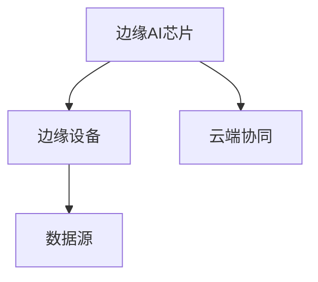
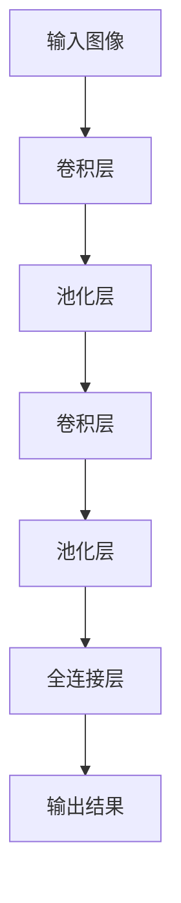
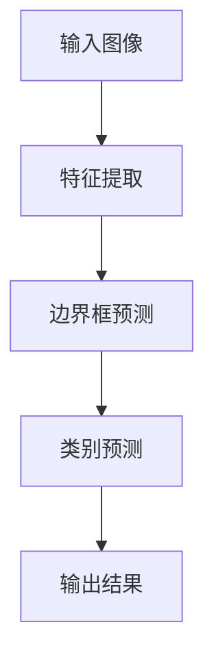
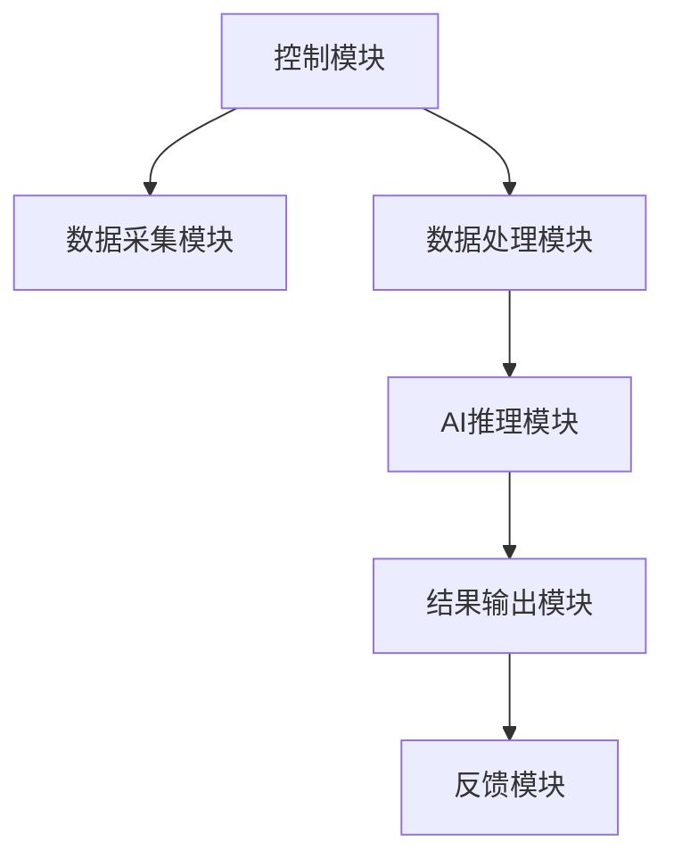

                 


# 如何识别企业的边缘AI芯片设计优势

## 关键词：边缘计算、AI芯片、设计优势、技术原理、企业应用、性能优化

## 摘要：边缘AI芯片在企业智能化转型中扮演着关键角色，本文深入分析边缘AI芯片的设计优势，从核心技术、算法原理、系统架构到项目实战，帮助企业识别和优化边缘AI芯片的设计，提升企业竞争力。

---

## 第1章：边缘计算的背景与发展

### 1.1 边缘计算的定义与特点

边缘计算是一种分布式计算范式，将数据处理和计算能力从云端转移到数据源附近的边缘设备上。其特点包括低延迟、高实时性、本地化数据处理和减少带宽消耗。

### 1.2 AI芯片的定义与分类

AI芯片是专为加速人工智能任务（如机器学习、深度学习）设计的硬件。主要分类包括GPU、TPU、NPU和 ASIC。边缘AI芯片是AI芯片的一种，专门优化边缘计算环境下的任务执行。

### 1.3 边缘AI芯片的重要性

边缘AI芯片在企业中的应用广泛，包括智能制造、智慧城市、自动驾驶和视频监控等领域。它们能够实时处理数据，减少对云端的依赖，提升系统的响应速度和稳定性。

---

## 第2章：边缘AI芯片的核心技术

### 2.1 边缘AI芯片的计算架构

边缘AI芯片通常采用专用的硬件架构，如ASIC（专用集成电路）和NPU（神经处理单元），以高效执行AI任务。这些架构优化了计算效率，降低了功耗。

### 2.2 边缘AI芯片的数据处理技术

边缘AI芯片采用数据压缩和高效传输技术，减少数据传输的带宽需求。同时，通过本地化数据处理，确保数据隐私和安全。

### 2.3 边缘AI芯片的功耗优化

边缘设备通常依赖电池供电，因此功耗优化是关键。边缘AI芯片通过低功耗设计和智能电源管理，延长设备续航时间。

---

## 第3章：边缘AI芯片的核心概念与联系

### 3.1 核心技术原理

边缘AI芯片通过高效的计算架构和优化的算法，快速处理和分析数据。其核心技术包括卷积神经网络（CNN）和目标检测算法（如YOLO、Faster R-CNN）。

### 3.2 核心概念对比表

| **技术特性**       | **边缘AI芯片**       | **传统芯片**         |
|--------------------|----------------------|----------------------|
| 计算效率           | 高，优化AI任务       | 一般，通用计算能力   |
| 功耗               | 低，适合边缘设备     | 高，不适合移动设备   |
| 延迟               | 低，实时响应         | 高，依赖云端处理     |

### 3.3 实体关系图（Mermaid）



---

## 第4章：边缘AI芯片的算法原理

### 4.1 卷积神经网络（CNN）

CNN通过卷积层、池化层和全连接层处理图像数据，实现目标识别和分类。

#### 4.1.1 CNN流程图（Mermaid）



#### 4.1.2 CNN数学模型

卷积操作公式：
$$
y[i][j] = \sum_{k=0}^{K} \sum_{l=0}^{L} w[k][l] \cdot x[i+k][j+l]
$$

### 4.2 目标检测算法

目标检测算法（如YOLO）在边缘AI芯片上实现高效检测。

#### 4.2.1 YOLO流程图（Mermaid）



#### 4.2.2 YOLO代码实现

```python
import torch
model = torch.hub.load('ultralytics/yolov5', 'yolov5s')
results = model(input_image)
```

---

## 第5章：边缘AI芯片的系统架构设计

### 5.1 系统架构图（Mermaid）



### 5.2 系统功能模块

- **数据采集模块**：从传感器或摄像头获取数据。
- **数据处理模块**：预处理和特征提取。
- **AI推理模块**：运行训练好的模型进行推理。
- **结果输出模块**：输出结果并可能反馈给控制模块。

---

## 第6章：边缘AI芯片的项目实战

### 6.1 环境安装

安装边缘AI芯片开发环境，包括硬件和软件的配置。

### 6.2 核心代码实现

```python
import torch
import torch.nn as nn
import torch.nn.functional as F

class SimpleCNN(nn.Module):
    def __init__(self):
        super(SimpleCNN, self).__init__()
        self.conv1 = nn.Conv2d(3, 6, 5)
        self.pool = nn.MaxPool2d(2, 2)
        self.conv2 = nn.Conv2d(6, 16, 5)
        self.fc1 = nn.Linear(16 * 5 * 5, 120)
        self.fc2 = nn.Linear(120, 10)

    def forward(self, x):
        x = self.pool(F.relu(self.conv1(x)))
        x = self.pool(F.relu(self.conv2(x)))
        x = x.view(-1, 16 * 5 * 5)
        x = F.relu(self.fc1(x))
        x = F.dropout(x, 0.5, training=True)
        x = self.fc2(x)
        return x
```

### 6.3 实际案例分析

以智能制造中的缺陷检测为例，展示边缘AI芯片如何实时检测产品缺陷，减少云端依赖，提升效率。

---

## 第7章：总结与展望

### 7.1 总结

边缘AI芯片在企业中的应用日益广泛，其设计优势包括高效计算、低功耗和实时响应。通过优化算法和系统架构，可以进一步提升性能。

### 7.2 展望

未来，边缘AI芯片将在更多领域得到应用，技术发展将朝着更高效、更智能的方向发展。

---

## 第8章：最佳实践与注意事项

### 8.1 最佳实践

- 选择合适的边缘AI芯片，根据具体应用场景和需求。
- 定期优化算法和系统架构，提升性能和效率。
- 确保数据安全和隐私保护，避免潜在风险。

### 8.2 注意事项

- 边缘AI芯片的部署需要考虑网络条件和设备兼容性。
- 数据处理和算法优化需要结合实际应用场景，避免过度复杂化。

---

## 结语

识别企业的边缘AI芯片设计优势需要从核心技术、算法原理、系统架构等多个方面综合考虑。通过本文的分析和指导，企业可以更好地优化边缘AI芯片设计，提升竞争力，抓住智能化转型的机遇。

