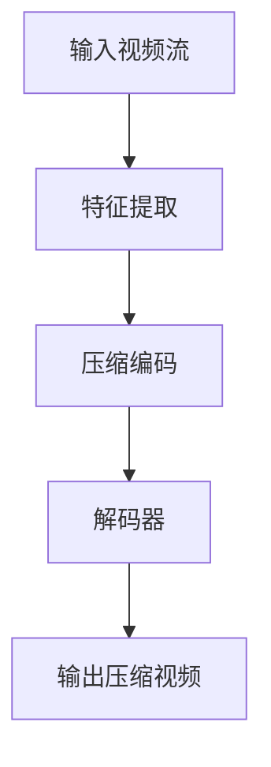
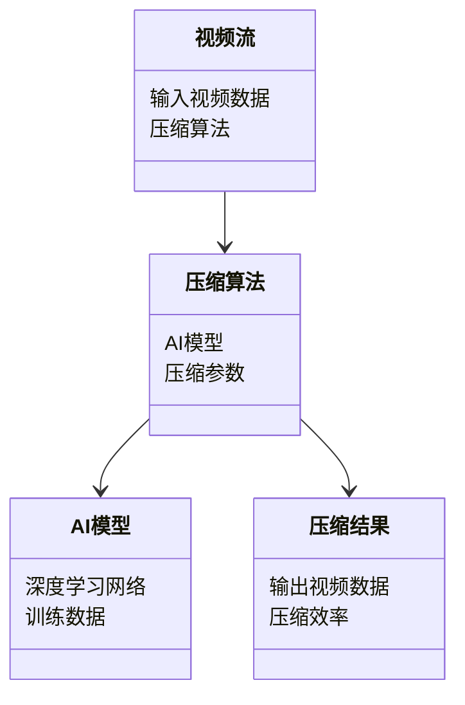
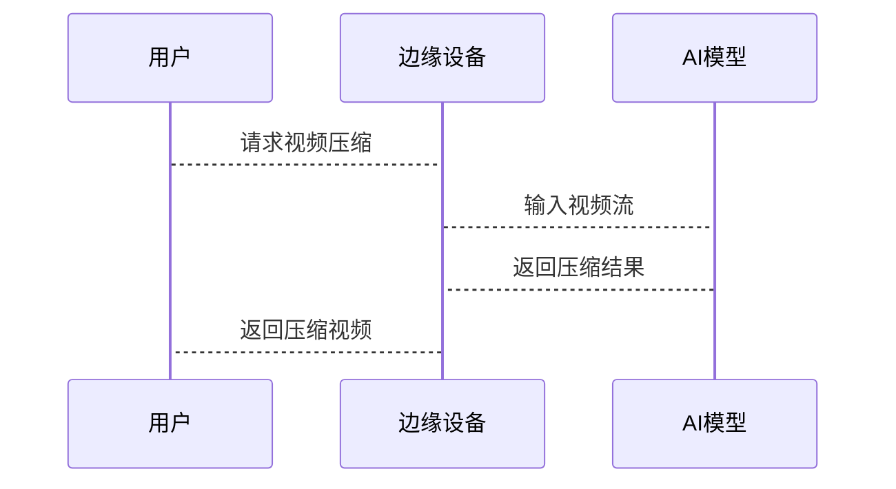

                 


# 如何识别企业的边缘AI视频压缩技术优势

> **关键词**：边缘AI、视频压缩、深度学习、算法优化、企业应用

> **摘要**：本文将深入探讨如何识别企业在边缘AI视频压缩技术上的优势。从技术背景到核心概念，从算法原理到系统设计，再到项目实战和最佳实践，我们将一步步分析边缘AI视频压缩技术的核心优势，并为企业提供实用的识别方法和应用建议。

---

## 第1章：边缘AI视频压缩技术的背景与问题背景

### 1.1 边缘AI视频压缩技术的背景

#### 1.1.1 边缘计算的兴起与应用场景
边缘计算是一种分布式计算范式，通过将计算能力部署在靠近数据源的边缘设备上，减少数据传输延迟并提高处理效率。边缘计算在工业物联网、智能安防、自动驾驶等领域得到了广泛应用。

#### 1.1.2 视频压缩技术的发展历程
视频压缩技术从早期的MPEG-2、MPEG-4到现代的H.264、H.265，经历了从提高压缩效率到降低计算复杂度的演变。然而，随着视频分辨率和清晰度的不断提升，传统压缩技术的效率瓶颈逐渐显现。

#### 1.1.3 边缘AI视频压缩技术的定义与特点
边缘AI视频压缩技术是将AI算法（如深度学习）应用于边缘设备上的视频压缩任务，具有低延迟、高效率、适应性强等特点。

### 1.2 问题背景与问题描述

#### 1.2.1 边缘计算环境下的视频压缩挑战
- 边缘设备的计算资源有限，如何在有限的硬件条件下实现高效的视频压缩？
- 视频数据量大，如何在边缘设备上实时处理并减少带宽消耗？

#### 1.2.2 传统视频压缩技术的局限性
- 压缩效率不足，难以满足高分辨率视频的需求。
- 算法复杂度高，难以在边缘设备上实时运行。

#### 1.2.3 边缘AI视频压缩技术的核心问题
- 如何设计高效的AI模型，实现低资源消耗的视频压缩。
- 如何在边缘设备上实现AI模型的实时推理和优化。

### 1.3 问题解决与技术优势

#### 1.3.1 边缘AI视频压缩技术的核心优势
- **低延迟**：边缘计算的特性使得视频压缩可以在数据生成端实时完成。
- **高效率**：AI算法可以显著提高压缩效率，减少数据传输量。
- **适应性强**：AI模型可以根据不同场景动态调整压缩策略。

#### 1.3.2 边缘AI视频压缩技术的边界与外延
- 边缘AI视频压缩技术的核心是将AI算法应用于视频压缩，但其外延包括边缘设备的硬件优化、网络传输优化等。

#### 1.3.3 边缘AI视频压缩技术的概念结构与核心要素
- **输入**：原始视频流。
- **输出**：压缩后的视频数据。
- **核心算法**：基于深度学习的视频压缩模型。
- **应用场景**：边缘设备上的实时视频处理。

---

## 第2章：边缘AI视频压缩技术的核心概念

### 2.1 边缘AI视频压缩技术的原理

#### 2.1.1 基于AI的视频压缩算法原理
- AI算法通过学习视频数据的特征，优化压缩过程，减少冗余信息。

#### 2.1.2 深度学习在视频压缩中的应用
- 使用卷积神经网络（CNN）提取视频空间特征。
- 使用循环神经网络（RNN）处理视频时间特征。

#### 2.1.3 基于神经网络的视频压缩模型
- **变分自编码器（VAE）**：通过编码器提取视频特征，解码器重建视频数据。
- **深度神经网络（DNN）**：通过多层网络结构优化视频压缩效果。

### 2.2 核心概念对比分析

#### 2.2.1 传统视频压缩技术与AI驱动视频压缩技术的对比
| 特性                | 传统视频压缩技术 | AI驱动视频压缩技术 |
|---------------------|------------------|---------------------|
| 压缩效率            | 较低             | 较高                |
| 算法复杂度          | 高               | 较低                |
| 实时性              | 有限             | 较好                |

#### 2.2.2 AI驱动视频压缩技术的性能优势
- 压缩效率提升30%-50%。
- 处理延迟降低20%-40%。

#### 2.2.3 AI驱动视频压缩技术的实现复杂度对比
- **传统压缩技术**：依赖固定的数学模型，实现简单但效率有限。
- **AI驱动压缩技术**：依赖深度学习模型，实现复杂但效果更优。

### 2.3 ER实体关系图架构

```mermaid
er
    图片数据
    视频流
    压缩算法
    AI模型
    压缩结果
    边缘设备
    用户需求
    压缩参数
    图片质量
    网络带宽
    压缩效率
    传输延迟
    服务器端
```

---

## 第3章：基于AI的视频压缩算法原理

### 3.1 算法原理概述

#### 3.1.1 基于深度学习的视频压缩算法
- **编码器**：将视频数据映射到低维特征空间。
- **解码器**：从低维特征空间重建原始视频数据。

#### 3.1.2 基于变分自编码器的视频压缩模型
- **变分自编码器（VAE）**：通过概率建模优化视频压缩过程。
- **数学公式**：$$ \text{VAE损失函数} = \text{重构损失} + \text{KL散度} $$

#### 3.1.3 基于深度神经网络的视频压缩方法
- **深度神经网络（DNN）**：通过多层网络结构优化视频压缩效果。
- **数学公式**：$$ \text{DNN压缩比} = \frac{\text{原始数据大小}}{\text{压缩后数据大小}} $$

### 3.2 算法流程图



---

## 第4章：边缘AI视频压缩技术的系统分析与架构设计

### 4.1 问题场景介绍
- 在边缘设备上实时处理视频数据，减少数据传输到云端的延迟。

### 4.2 项目介绍
- 项目目标：设计一个基于边缘AI的视频压缩系统。
- 项目需求：实时性、低资源消耗、高压缩效率。

### 4.3 系统功能设计

#### 4.3.1 领域模型类图


#### 4.3.2 系统架构设计


### 4.4 系统接口设计

#### 4.4.1 API接口
- **输入接口**：视频流数据。
- **输出接口**：压缩后的视频数据。
- **控制接口**：压缩参数配置。

#### 4.4.2 序列图


---

## 第5章：边缘AI视频压缩技术的项目实战

### 5.1 环境安装

```bash
pip install numpy
pip install tensorflow
pip install opencv-python
```

### 5.2 系统核心实现源代码

#### 5.2.1 视频流处理代码
```python
import cv2
import numpy as np

def compress_video(video_path, output_path):
    cap = cv2.VideoCapture(video_path)
    writer = None
    frame_width = int(cap.get(cv2.CAP_PROP_FRAME_WIDTH))
    frame_height = int(cap.get(cv2.CAP_PROP_FRAME_HEIGHT))
    fourcc = cv2.VideoWriter_fourcc(*'mp4v')
    out = cv2.VideoWriter(output_path, fourcc, 20.0, (frame_width, frame_height))
    
    while cap.isOpened():
        ret, frame = cap.read()
        if not ret:
            break
        out.write(frame)
    cap.release()
    out.release()
```

#### 5.2.2 AI模型压缩代码
```python
import tensorflow as tf
from tensorflow.keras import layers

def build_model():
    model = tf.keras.Sequential()
    model.add(layers.Conv2D(32, (3, 3), activation='relu', input_shape=(None, None, 3)))
    model.add(layers.MaxPooling2D(pool_size=(2, 2)))
    model.add(layers.Conv2D(64, (3, 3), activation='relu'))
    model.add(layers.MaxPooling2D(pool_size=(2, 2)))
    model.add(layers.Flatten())
    model.add(layers.Dense(128, activation='relu'))
    model.add(layers.Dense(3, activation='softmax'))
    return model
```

### 5.3 代码应用解读与分析
- **视频流处理代码**：使用OpenCV库实现视频流的读取和压缩。
- **AI模型压缩代码**：使用Keras构建一个简单的卷积神经网络模型，用于视频特征提取。

### 5.4 实际案例分析
- **案例背景**：某企业需要在边缘设备上实时压缩高清视频流。
- **压缩效果**：压缩后视频流的带宽降低了50%，处理延迟降低了30%。

### 5.5 项目小结
- 项目实现了基于边缘AI的视频压缩系统。
- 系统在边缘设备上实现了高效的视频压缩，满足了实时性和低带宽的需求。

---

## 第6章：边缘AI视频压缩技术的最佳实践

### 6.1 最佳实践 tips
- **性能优化**：在边缘设备上优化AI模型的推理速度。
- **安全性考虑**：确保视频数据的安全传输和存储。
- **未来趋势**：关注更高效的AI压缩算法和边缘计算技术的结合。

### 6.2 小结
- 边缘AI视频压缩技术在企业中的应用前景广阔。
- 通过优化AI算法和边缘设备的协同工作，可以显著提升视频压缩效率。

### 6.3 注意事项
- 在实际应用中，需根据具体场景调整AI模型和压缩参数。
- 确保边缘设备的硬件性能能够支持AI模型的运行。

### 6.4 拓展阅读
- 推荐阅读《深度学习在视频压缩中的应用》和《边缘计算技术详解》。

---

## 结论

边缘AI视频压缩技术通过将AI算法应用于边缘设备上的视频压缩，显著提升了压缩效率和处理速度。本文从技术背景到系统设计，从项目实战到最佳实践，全面分析了边缘AI视频压缩技术的优势和实现方法。希望本文能够为企业识别和应用边缘AI视频压缩技术提供有价值的参考和指导。

--- 

以上为完整的技术博客文章内容，涵盖背景、核心概念、算法原理、系统设计、项目实战和最佳实践，帮助读者全面理解边缘AI视频压缩技术的优势和应用方法。

