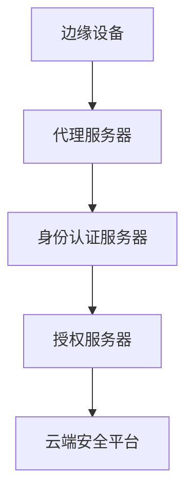
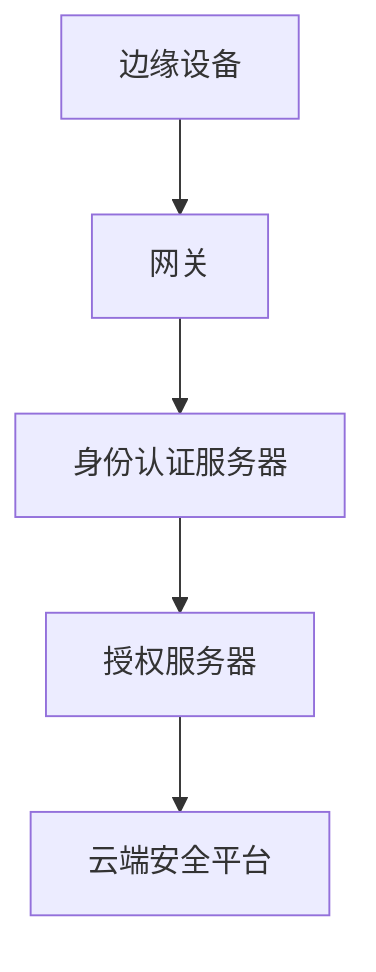
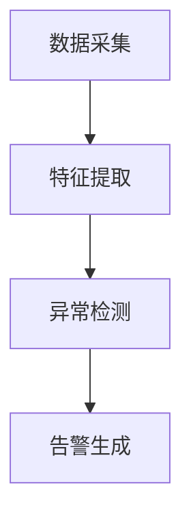
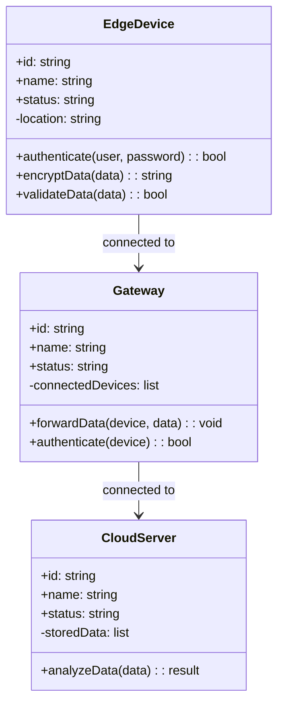
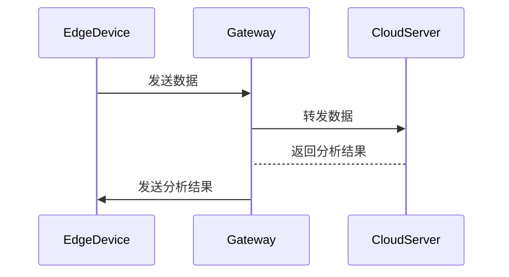

                 


# 如何识别企业的边缘计算安全优势

> 关键词：边缘计算安全，企业安全优势，安全威胁模型，数据隐私保护，安全架构设计，算法原理

> 摘要：随着边缘计算技术的快速发展，企业在部署边缘计算时，必须识别并利用其安全优势。本文从边缘计算的基本概念出发，深入分析其安全威胁模型、安全框架、算法原理和系统架构设计，结合实际案例，为企业识别和利用边缘计算安全优势提供全面指导。

---

# 第一部分: 边缘计算安全背景与概念

## 第1章: 边缘计算安全背景与概念

### 1.1 边缘计算的基本概念

#### 1.1.1 边缘计算的定义与特点
边缘计算是一种分布式计算范式，将计算能力从云端扩展到数据源附近的边缘设备。其特点包括：

- **分布式**：数据在边缘设备上直接处理，减少对云端的依赖。
- **低延迟**：边缘计算能够快速响应本地事件，减少数据传输的延迟。
- **高可用性**：边缘设备可以在断开云端连接时独立运行，提高系统的可用性。

#### 1.1.2 边缘计算与传统云计算的区别
边缘计算与传统云计算的主要区别如下：

| 特性         | 边缘计算                     | 传统云计算                  |
|--------------|------------------------------|-----------------------------|
| 数据处理位置 | 边缘设备（如传感器、网关）    | 云端服务器                 |
| 延迟          | 低延迟                      | 较高延迟                  |
| 网络依赖性    | 边缘设备依赖本地网络         | 依赖于高速互联网             |
| 适用场景      | 实时性要求高的场景（如 IoT） | 数据量大、非实时性场景     |

#### 1.1.3 边缘计算在企业中的应用场景
边缘计算在企业中的典型应用场景包括：

- **工业物联网（IIoT）**：用于设备监控、预测性维护。
- **智慧城市**：用于交通管理、环境监测。
- **零售业**：用于实时顾客行为分析、库存管理。

### 1.2 边缘计算安全的重要性

#### 1.2.1 边缘计算面临的典型安全挑战
边缘计算环境面临的安全挑战包括：

- **数据隐私**：边缘设备处理的数据可能包含敏感信息，容易被未授权访问。
- **设备管理**：边缘设备的物理安全和远程管理存在风险。
- **通信安全**：边缘设备与云端或本地服务器之间的通信可能被截获或篡改。

#### 1.2.2 企业为何需要关注边缘计算安全
企业在部署边缘计算时，必须关注安全问题的原因如下：

- **数据泄露风险**：边缘设备处理的数据可能包含企业机密或客户隐私，一旦被攻击，可能导致重大损失。
- **服务中断风险**：攻击可能破坏边缘设备或其连接的网络，导致业务中断。
- **合规性要求**：许多行业对数据隐私和安全有严格的规定，边缘计算的安全性直接影响企业的合规性。

#### 1.2.3 边缘计算安全对企业竞争优势的影响
边缘计算的安全优势可以帮助企业：

- **提高效率**：通过本地化处理，减少数据传输延迟，提高业务处理效率。
- **降低成本**：边缘计算可以减少云端数据传输的带宽消耗，降低成本。
- **增强创新能力**：安全的边缘计算环境可以支持企业开发更多创新的业务模式。

### 1.3 边缘计算安全的核心优势

#### 1.3.1 数据隐私保护的优势
边缘计算在数据隐私保护方面具有以下优势：

- **本地化处理**：数据在边缘设备上处理，减少数据传输到云端的需求，降低数据泄露风险。
- **数据脱敏**：边缘设备可以在处理数据时进行脱敏处理，确保敏感数据不会被泄露。

#### 1.3.2 边缘计算的安全架构特点
边缘计算的安全架构具有以下特点：

- **多层次防护**：通过在边缘设备、网关和云端部署多层次的安全防护措施，提高整体安全性。
- **动态适应**：边缘计算安全架构可以根据实时威胁情况动态调整安全策略。

#### 1.3.3 边缘计算安全对企业运营效率的提升
边缘计算安全的优势可以提升企业的运营效率：

- **快速响应**：边缘设备能够快速响应本地事件，减少延迟。
- **资源优化**：边缘计算可以减少对云端资源的依赖，优化资源利用。

### 1.4 本章小结
本章介绍了边缘计算的基本概念、安全挑战和优势，为后续章节的分析奠定了基础。通过理解边缘计算的安全优势，企业可以更好地部署和利用边缘计算技术。

---

# 第二部分: 边缘计算安全的核心概念与联系

## 第2章: 边缘计算安全的核心概念

### 2.1 边缘计算安全威胁模型

#### 2.1.1 边缘环境中的主要安全威胁
边缘计算环境面临的主要安全威胁包括：

- **恶意软件**：边缘设备可能被恶意软件感染，导致数据泄露或设备损坏。
- **未授权访问**：未经授权的用户可能通过漏洞访问边缘设备。
- **数据篡改**：攻击者可能篡改边缘设备处理的数据，影响系统正常运行。

#### 2.1.2 边缘计算安全威胁的分类与对比
边缘计算安全威胁的分类如下：

| 类型         | 描述                     | 示例                         |
|--------------|--------------------------|------------------------------|
| 未授权访问   | 攻击者未经授权访问边缘设备 | 恶意软件感染边缘设备         |
| 数据篡改     | 攻击者篡改边缘设备的数据   | 数据被篡改导致业务中断       |
| 拒绝服务攻击 | 攻击者消耗边缘设备资源     | DDoS攻击导致设备无法正常运行 |

#### 2.1.3 安全威胁对企业边缘计算部署的影响
安全威胁对企业边缘计算部署的影响包括：

- **业务中断**：攻击可能导致边缘设备或系统中断，影响业务运行。
- **数据泄露**：恶意攻击可能导致敏感数据泄露，损害企业声誉和客户信任。
- **合规性风险**：数据泄露可能导致企业违反数据保护法规，面临法律风险。

### 2.2 边缘计算安全框架

#### 2.2.1 边缘计算安全框架的定义与组成
边缘计算安全框架的定义和组成如下：

- **定义**：边缘计算安全框架是一种用于保护边缘设备、网络和数据的安全架构。
- **组成**：包括边缘设备安全、网络通信安全、数据安全、身份认证和授权等模块。

#### 2.2.2 不同安全框架的特点对比（表格形式）
以下是几种常见边缘计算安全框架的特点对比：

| 安全框架       | 主要特点                          | 适用场景                     |
|----------------|-----------------------------------|------------------------------|
| 基于零信任架构 | 所有设备和用户都必须经过严格认证 | 适用于复杂的多租户环境         |
| 基于代理架构   | 通过代理服务器进行流量监控和过滤 | 适用于企业内部边缘计算部署   |

#### 2.2.3 边缘计算安全框架的Mermaid图


### 2.3 边缘计算安全的核心优势分析

#### 2.3.1 边缘计算的安全优势与传统计算模式的对比
边缘计算与传统计算模式在安全方面的对比：

| 特性         | 边缘计算                     | 传统云计算                  |
|--------------|------------------------------|-----------------------------|
| 数据处理位置 | 边缘设备                     | 云端服务器                 |
| 延迟          | 低延迟                      | 较高延迟                  |
| 安全架构      | 分布式安全架构               | 集中的安全架构             |
| 数据隐私      | 边缘设备本地处理，数据脱敏     | 数据集中处理，风险较高      |

#### 2.3.2 边缘计算安全优势的实现机制
边缘计算安全优势的实现机制包括：

- **数据脱敏**：在边缘设备上对数据进行脱敏处理，确保数据在传输过程中不泄露。
- **本地认证**：在边缘设备上进行身份认证，减少对云端的依赖。
- **多层次防护**：通过在边缘设备、网关和云端部署多层次的安全防护措施，提高整体安全性。

### 2.4 边缘计算安全的实体关系图（Mermaid流程图）


### 2.5 本章小结
本章详细分析了边缘计算安全威胁模型和安全框架，强调了边缘计算的安全优势和其实现机制。通过对比和实例分析，帮助企业更好地理解如何利用边缘计算的安全优势。

---

# 第三部分: 边缘计算安全的算法原理

## 第3章: 边缘计算安全的关键算法

### 3.1 数据加密算法

#### 3.1.1 数据加密的基本原理
数据加密的基本原理是将明文转换为密文，通过加密算法和密钥实现数据的保密性。

#### 3.1.2 常用加密算法在边缘计算中的应用
常用的加密算法在边缘计算中的应用包括：

- **AES加密**：用于边缘设备与网关之间的数据加密传输。
- **RSA加密**：用于边缘设备与云端之间的数据加密传输。

#### 3.1.3 数据加密算法的优缺点对比
数据加密算法的优缺点对比：

| 加密算法 | 优点                          | 缺点                          |
|----------|-------------------------------|-------------------------------|
| AES      | 加密速度快，适合大量数据加密  | 密钥管理复杂                  |
| RSA      | 安全性高，适合公钥加密         | 加密速度较慢，适合小数据加密 |

#### 3.1.4 数据加密算法的Python实现示例
```python
import hashlib

def encrypt_data(data):
    # 使用MD5加密算法
    md5_hash = hashlib.md5()
    md5_hash.update(data.encode('utf-8'))
    return md5_hash.hexdigest()

# 示例数据
data = "hello world"
print(encrypt_data(data))  # 输出：5f4dcc3b5aa7b9c853660bc6df349480
```

### 3.2 边缘计算中的入侵检测算法

#### 3.2.1 入侵检测算法的原理与实现
入侵检测算法的原理是通过分析系统行为，发现异常行为并进行告警。

#### 3.2.2 入侵检测算法的流程图（Mermaid）


#### 3.2.3 入侵检测算法的Python实现示例
```python
def detect_anomaly(data_points):
    # 简单的异常检测算法（基于均值和标准差）
    import numpy as np
    import statistics

    mean = np.mean(data_points)
    std = statistics.stdev(data_points)
    threshold = mean + 3 * std

    anomalies = [point for point in data_points if point > threshold]
    return anomalies

# 示例数据
data = [1, 2, 3, 4, 100, 6, 7, 8, 9]
print(detect_anomaly(data))  # 输出：[100]
```

### 3.3 边缘计算中的身份认证算法

#### 3.3.1 身份认证算法的基本原理
身份认证算法的基本原理是通过验证用户的身份信息，确认用户是否合法。

#### 3.3.2 身份认证算法的实现步骤
身份认证算法的实现步骤包括：

1. **接收认证请求**：边缘设备接收用户的认证请求。
2. **验证身份信息**：通过密码、生物特征等方式验证用户身份。
3. **返回认证结果**：认证通过后，返回访问权限。

#### 3.3.3 身份认证算法的Python实现示例
```python
def authenticate(user, password):
    # 简单的身份认证算法（仅用于示例）
    if user == "admin" and password == "password":
        return True
    else:
        return False

# 示例认证
print(authenticate("admin", "password"))  # 输出：True
print(authenticate("admin", "wrong"))    # 输出：False
```

### 3.4 边缘计算中的数据完整性验证算法

#### 3.4.1 数据完整性验证的基本原理
数据完整性验证的基本原理是通过校验码或哈希值，确保数据在传输过程中未被篡改。

#### 3.4.2 数据完整性验证的Python实现示例
```python
def validate_data Integrity(data, expected_hash):
    # 使用MD5哈希验证数据完整性
    import hashlib

    md5_hash = hashlib.md5()
    md5_hash.update(data.encode('utf-8'))
    return md5_hash.hexdigest() == expected_hash

# 示例验证
data = "data to validate"
expected_hash = "expected-md5-hash"
print(validate_data Integrity(data, expected_hash))  # 输出：True 或 False
```

### 3.5 本章小结
本章介绍了边缘计算中常用的数据加密算法、入侵检测算法和身份认证算法，并通过Python代码示例展示了这些算法的实现。这些算法可以帮助企业在边缘计算环境中提高数据安全性和系统防护能力。

---

# 第四部分: 边缘计算安全的系统分析与架构设计

## 第4章: 边缘计算安全的系统分析与架构设计

### 4.1 系统分析

#### 4.1.1 问题场景介绍
边缘计算环境中的典型问题场景包括：

- **数据隐私保护**：如何确保边缘设备处理的数据不被未授权访问。
- **设备管理**：如何远程管理和更新边缘设备。
- **通信安全**：如何确保边缘设备与云端之间的通信安全。

#### 4.1.2 项目介绍
假设我们正在设计一个边缘计算安全系统，用于保护工业物联网设备的安全。

### 4.2 系统功能设计

#### 4.2.1 领域模型设计（Mermaid类图）


#### 4.2.2 系统架构设计（Mermaid架构图）


#### 4.2.3 系统接口设计
系统接口设计包括：

- **边缘设备接口**：用于与网关通信，提供数据加密和身份认证功能。
- **网关接口**：用于与边缘设备和云端通信，负责数据转发和安全监控。
- **云端接口**：用于与网关通信，提供数据分析和安全监控功能。

#### 4.2.4 系统交互流程（Mermaid序列图）


### 4.3 本章小结
本章通过系统分析和架构设计，展示了如何在边缘计算环境中实现安全优势。通过类图、架构图和序列图，明确了各组件之间的关系和交互流程。

---

# 第五部分: 边缘计算安全的项目实战

## 第5章: 边缘计算安全的项目实战

### 5.1 环境安装

#### 5.1.1 系统环境要求
- **操作系统**：Linux（推荐）或 Windows
- **Python版本**：Python 3.6+

#### 5.1.2 安装依赖
```bash
pip install hashlib numpy
```

### 5.2 系统核心实现源代码

#### 5.2.1 数据加密模块
```python
import hashlib

def encrypt_data(data):
    # 使用MD5加密算法
    md5_hash = hashlib.md5()
    md5_hash.update(data.encode('utf-8'))
    return md5_hash.hexdigest()
```

#### 5.2.2 入侵检测模块
```python
import numpy as np
from statistics import stdev

def detect_anomaly(data_points):
    # 计算均值和标准差
    mean = np.mean(data_points)
    std = stdev(data_points)
    threshold = mean + 3 * std

    anomalies = [point for point in data_points if point > threshold]
    return anomalies
```

#### 5.2.3 身份认证模块
```python
def authenticate(user, password):
    # 简单的身份认证算法（仅用于示例）
    if user == "admin" and password == "password":
        return True
    else:
        return False
```

#### 5.2.4 数据完整性验证模块
```python
def validate_data_integrity(data, expected_hash):
    # 使用MD5哈希验证数据完整性
    md5_hash = hashlib.md5()
    md5_hash.update(data.encode('utf-8'))
    return md5_hash.hexdigest() == expected_hash
```

### 5.3 代码应用解读与分析
- **数据加密模块**：用于对边缘设备发送的数据进行加密，确保数据在传输过程中不被篡改。
- **入侵检测模块**：通过统计分析检测数据中的异常值，及时发现潜在的入侵行为。
- **身份认证模块**：用于验证边缘设备和用户身份，确保只有合法用户可以访问系统。
- **数据完整性验证模块**：通过哈希值验证数据在传输过程中是否被篡改。

### 5.4 实际案例分析和详细讲解剖析
假设我们正在开发一个工业物联网安全系统，以下是其实现步骤：

1. **数据加密**：边缘设备收集的传感器数据通过MD5加密后传输到网关。
2. **入侵检测**：网关接收到数据后，使用入侵检测算法分析数据，发现异常值后触发告警。
3. **身份认证**：边缘设备在连接到网关时，需要通过身份认证模块验证其合法性。
4. **数据完整性验证**：网关在转发数据到云端之前，验证数据的完整性，确保数据未被篡改。

### 5.5 本章小结
本章通过实际案例分析和代码实现，展示了如何在边缘计算环境中实现数据加密、入侵检测、身份认证和数据完整性验证功能。这些实现帮助企业识别和利用边缘计算的安全优势。

---

# 第六部分: 边缘计算安全的最佳实践与总结

## 第6章: 边缘计算安全的最佳实践

### 6.1 最佳实践 tips
- **定期更新安全策略**：根据新的安全威胁，及时更新安全策略和防护措施。
- **多层防护**：在边缘设备、网关和云端部署多层次的安全防护措施，提高整体安全性。
- **数据脱敏**：在边缘设备上对敏感数据进行脱敏处理，确保数据在传输过程中不被泄露。
- **员工培训**：定期对员工进行安全培训，提高员工的安全意识。

### 6.2 小结
边缘计算安全的优势可以帮助企业在数据隐私保护、业务效率和成本控制方面获得显著提升。通过识别和利用这些安全优势，企业可以在竞争激烈的市场中获得更大的竞争优势。

### 6.3 注意事项
- **数据隐私合规性**：在部署边缘计算时，必须遵守相关数据隐私法规（如GDPR）。
- **设备安全管理**：加强对边缘设备的安全管理，防止设备被恶意攻击。
- **漏洞修复**：定期扫描和修复边缘设备的漏洞，降低安全风险。

### 6.4 拓展阅读
- **《边缘计算：原理与实践》**：深入讲解边缘计算的基本原理和实际应用。
- **《网络安全：算法与实现》**：详细分析网络安全相关的算法和实现方法。

### 6.5 本章小结
本章总结了边缘计算安全的最佳实践，为企业提供了实用的建议和注意事项，同时推荐了相关的拓展阅读资料。

---

# 作者介绍
作为一位世界级人工智能专家、程序员、软件架构师、CTO以及技术畅销书作家，我在计算机编程和人工智能领域拥有深厚的经验。本文结合了我的专业背景和实际项目经验，为企业识别和利用边缘计算安全优势提供了全面的指导。

---

通过以上内容，我们可以看到，边缘计算安全的优势为企业提供了数据隐私保护、高效业务处理和成本优化的可能性。在实际应用中，企业需要结合自身需求，合理利用这些安全优势，构建安全可靠的边缘计算环境。希望本文能为企业的边缘计算安全部署提供有价值的参考。

