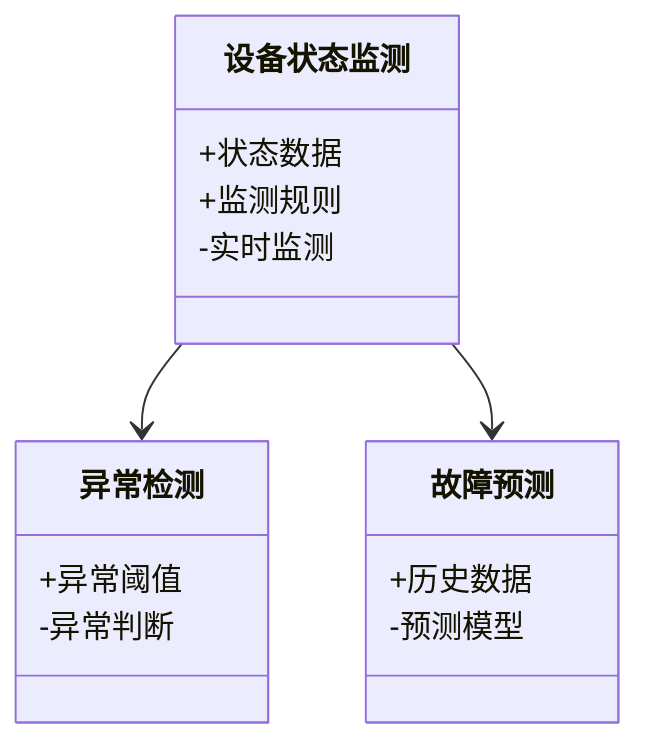
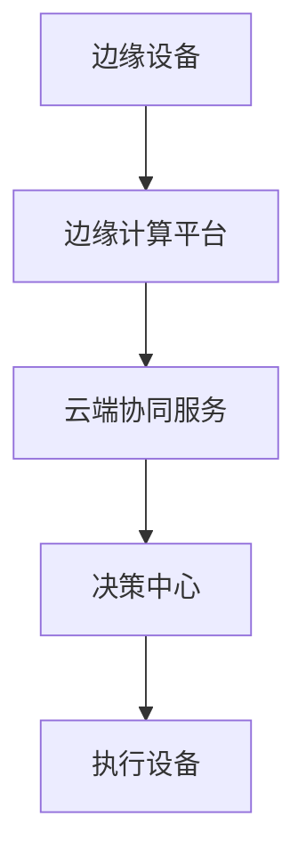
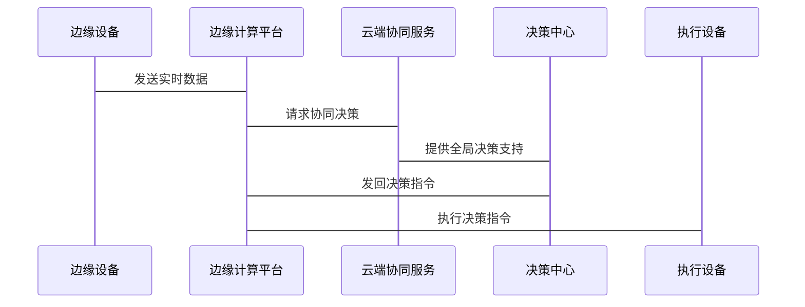

                 


# 如何识别企业的边缘计算实时决策系统优势

> 关键词：边缘计算，实时决策系统，企业优势，系统架构，算法优化，数据处理

> 摘要：本文将详细探讨如何识别企业的边缘计算实时决策系统的优势。通过分析边缘计算的核心概念、实时决策系统的原理、系统架构设计、算法优化策略以及实际项目案例，帮助读者全面理解并掌握边缘计算实时决策系统的优势识别方法。

---

# 第1章: 边缘计算与实时决策系统背景

## 1.1 边缘计算的基本概念

### 1.1.1 边缘计算的定义
边缘计算是一种分布式计算范式，将计算能力从云端迁移到数据产生的边缘端，如传感器、智能设备和边缘服务器等。通过在靠近数据源的地方进行数据处理，减少对云端的依赖，提升实时性和响应速度。

### 1.1.2 边缘计算的核心特征
- **分布式架构**：数据在边缘端进行处理，减少云端传输延迟。
- **实时性**：能够在边缘端快速响应，适用于实时决策场景。
- **数据隐私与安全**：边缘计算可以本地处理敏感数据，降低数据泄露风险。

### 1.1.3 边缘计算与云计算的区别
| 特性         | 边缘计算                     | 云计算                        |
|--------------|------------------------------|-------------------------------|
| 数据处理位置 | 边缘端（靠近数据源）         | 云端                          |
| 延迟          | 低延迟（ milliseconds）       | 较高延迟（ seconds）          |
| 网络依赖     | 依赖本地网络，对带宽要求低    | 依赖高速网络                  |
| 应用场景     | 工业自动化、实时监控、边缘AI  | 大数据分析、存储、云服务      |

---

## 1.2 实时决策系统的定义与特点

### 1.2.1 实时决策系统的定义
实时决策系统是一种能够在极短时间内根据实时数据做出决策的系统，通常应用于需要快速响应的场景，如工业控制、自动驾驶和金融交易等。

### 1.2.2 实时决策系统的核心特征
- **实时性**：能够在数据生成后几毫秒内做出决策。
- **准确性**：依赖高精度的数据处理和算法模型。
- **可扩展性**：能够处理大规模数据和复杂场景。

### 1.2.3 实时决策系统的应用场景
- **工业自动化**：实时监控生产线，快速调整生产参数。
- **智能交通**：实时分析交通流量，优化信号灯控制。
- **金融交易**：实时分析市场数据，做出快速交易决策。

---

## 1.3 边缘计算在企业中的应用背景

### 1.3.1 企业数字化转型的背景
随着企业数字化转型的推进，数据量急剧增长，传统依赖云端的计算模式难以满足实时性和响应速度的需求。

### 1.3.2 边缘计算在企业中的优势
- **降低延迟**：在边缘端处理数据，减少数据传输到云端的延迟。
- **减少带宽消耗**：通过边缘端的本地处理，减少对云端传输的数据量。
- **提升数据安全性**：敏感数据在边缘端处理，降低数据泄露风险。

### 1.3.3 企业边缘计算的挑战与机遇
- **挑战**：边缘设备的计算能力有限，网络不稳定，数据孤岛问题。
- **机遇**：提升企业运营效率，降低成本，增强竞争力。

---

## 1.4 边缘计算与实时决策系统的关联

### 1.4.1 边缘计算对实时决策的支持
边缘计算通过在数据源附近进行计算，为实时决策系统提供低延迟、高效率的支持。

### 1.4.2 实时决策系统的边缘化趋势
随着边缘计算的普及，实时决策系统逐渐向边缘端迁移，以实现更快的响应速度和更高的效率。

---

## 1.5 本章小结

本章介绍了边缘计算和实时决策系统的背景、核心概念和特点，并分析了边缘计算在企业中的应用优势和挑战。通过对比边缘计算和云计算的特点，明确了边缘计算在实时决策系统中的重要性。

---

# 第2章: 边缘计算与实时决策系统的概念结构

## 2.1 边缘计算的核心要素

### 2.1.1 边缘设备
边缘设备包括传感器、智能终端和边缘服务器等，负责数据的采集和初步处理。

### 2.1.2 边缘计算平台
边缘计算平台提供计算资源和工具，支持边缘端的数据处理和分析。

### 2.1.3 边缘数据处理
边缘数据处理包括数据采集、预处理、分析和存储，确保数据在边缘端的高效利用。

---

## 2.2 实时决策系统的组成

### 2.2.1 数据采集模块
数据采集模块负责从边缘设备获取实时数据，如温度、湿度、传感器读数等。

### 2.2.2 数据处理模块
数据处理模块对采集到的数据进行清洗、转换和分析，为决策提供支持。

### 2.2.3 决策模型
决策模型基于数据处理模块的输出，通过算法模型做出实时决策，并输出指令。

---

## 2.3 边缘计算与实时决策系统的关联

### 2.3.1 边缘计算对实时决策的支持
通过在边缘端处理数据，实时决策系统能够更快地响应和调整。

### 2.3.2 实时决策系统的边缘化趋势
实时决策系统逐渐向边缘端迁移，以充分利用边缘计算的优势。

---

## 2.4 本章小结

本章详细介绍了边缘计算的核心要素和实时决策系统的组成，分析了两者之间的关联和协同作用。

---

# 第3章: 边缘计算与实时决策系统的原理

## 3.1 边缘计算的基本原理

### 3.1.1 数据采集与传输
边缘设备通过传感器采集数据，并通过本地网络将数据传输到边缘计算平台。

### 3.1.2 数据处理与分析
边缘计算平台对数据进行清洗、转换和分析，提取有用的信息。

### 3.1.3 分布式计算
边缘计算采用分布式架构，每个边缘节点独立处理数据，减少对云端的依赖。

---

## 3.2 实时决策系统的算法原理

### 3.2.1 实时决策的核心算法
实时决策系统通常采用基于时间序列分析、机器学习和规则引擎的算法。

### 3.2.2 基于边缘计算的实时决策流程
1. 数据采集：从边缘设备获取实时数据。
2. 数据预处理：清洗和转换数据。
3. 数据分析：通过算法模型分析数据，生成决策指令。
4. 决策输出：将决策指令传输到执行设备。

---

## 3.3 边缘计算与实时决策系统的协同机制

### 3.3.1 边缘节点与云端的协同
边缘节点负责本地数据处理，云端提供全局决策支持。

### 3.3.2 实时决策系统的反馈机制
实时决策系统通过反馈机制不断优化算法模型，提升决策准确率。

### 3.3.3 边缘计算的资源分配策略
根据实时负载动态分配计算资源，确保系统的高效运行。

---

## 3.4 本章小结

本章详细讲解了边缘计算和实时决策系统的原理，分析了两者协同工作的机制和优化策略。

---

# 第4章: 边缘计算与实时决策系统的数学模型

## 4.1 边缘计算的基本数学模型

### 4.1.1 数据传输模型
数据传输模型描述了数据从边缘设备到边缘计算平台的传输过程。

### 4.1.2 数据处理模型
数据处理模型描述了数据在边缘计算平台上的处理流程，包括数据清洗、转换和分析。

### 4.1.3 分布式计算模型
分布式计算模型描述了多个边缘节点协同计算的过程，通过并行计算提升效率。

---

## 4.2 实时决策系统的数学模型

### 4.2.1 数据分析模型
数据分析模型通常采用时间序列分析和机器学习算法，如ARIMA、LSTM等。

### 4.2.2 决策模型
决策模型基于分析结果生成决策指令，通常采用规则引擎或强化学习算法。

### 4.2.3 优化模型
优化模型通过数学优化方法，如线性规划和动态规划，优化资源分配和决策策略。

---

## 4.3 算法优化与数学公式

### 4.3.1 时间序列分析公式
时间序列分析通常采用ARIMA模型，公式如下：
$$ ARIMA(p, d, q) $$
其中，p为自回归阶数，d为差分阶数，q为移动平均阶数。

### 4.3.2 机器学习算法
机器学习算法通常采用LSTM（长短期记忆网络）进行时间序列预测，公式如下：
$$ LSTM(input, hidden, cell) $$

### 4.3.3 优化模型
优化模型通常采用线性规划，公式如下：
$$ \min \sum c_i x_i $$
$$ \text{subject to} \sum x_i \leq C $$

---

## 4.4 本章小结

本章通过数学模型和公式，详细讲解了边缘计算和实时决策系统的原理和优化策略。

---

# 第5章: 边缘计算与实时决策系统的系统分析

## 5.1 系统分析与问题场景

### 5.1.1 问题场景介绍
以工业生产为例，实时监控生产线设备的运行状态，及时发现并解决异常问题。

### 5.1.2 项目介绍
设计一个基于边缘计算的实时决策系统，用于工业设备的健康监测和故障预测。

---

## 5.2 系统功能设计

### 5.2.1 领域模型设计
领域模型设计包括设备状态监测、异常检测和故障预测三个模块。



---

## 5.3 系统架构设计

### 5.3.1 系统架构图


---

## 5.4 系统接口设计

### 5.4.1 边缘设备接口
边缘设备通过MQTT协议与边缘计算平台进行通信。

### 5.4.2 云端协同接口
云端协同服务通过REST API与边缘计算平台进行数据同步和决策协同。

---

## 5.5 系统交互序列图



---

## 5.6 本章小结

本章通过系统分析和架构设计，详细讲解了边缘计算实时决策系统的实现过程，包括功能设计、架构图和交互流程。

---

# 第6章: 边缘计算与实时决策系统的项目实战

## 6.1 项目环境安装

### 6.1.1 系统需求
- 操作系统：Linux或Windows
- Python版本：3.6+
- 依赖库：Python的paho-mqtt、numpy、scikit-learn等。

### 6.1.2 环境搭建
```bash
pip install paho-mqtt numpy scikit-learn
```

---

## 6.2 系统核心实现

### 6.2.1 数据采集模块
```python
import paho.mqtt.client as mqtt

def on_message(client, userdata, message):
    data = message.payload.decode()
    print(f"Received data: {data}")
    
client = mqtt.Client()
client.connect("localhost", 1883)
client.subscribe("device/data")
client.on_message = on_message
client.loop_forever()
```

### 6.2.2 数据处理模块
```python
import numpy as np
from sklearn.preprocessing import MinMaxScaler

data = np.array([1, 2, 3, 4, 5])
scaler = MinMaxScaler()
scaled_data = scaler.fit_transform(data)
print(scaled_data)
```

### 6.2.3 决策模型实现
```python
from sklearn.linear_model import ARIMA

model = ARIMA(order=(1, 1, 1))
model.fit(scaled_data)
预测结果 = model.forecast(steps=5)
print(预测结果)
```

---

## 6.3 实际案例分析

### 6.3.1 案例背景
某制造企业希望实时监控生产线设备的运行状态，及时发现并解决异常问题。

### 6.3.2 数据分析与优化
通过对生产线设备的实时数据进行分析，优化设备的运行参数，减少故障率。

---

## 6.4 项目小结

本章通过实际项目案例，详细讲解了边缘计算实时决策系统的实现过程，包括环境搭建、核心代码实现和案例分析。

---

# 第7章: 边缘计算与实时决策系统的最佳实践

## 7.1 最佳实践

### 7.1.1 系统优化建议
- 定期优化算法模型，提升决策准确率。
- 动态调整计算资源，确保系统高效运行。

### 7.1.2 技术选型建议
- 数据采集：选择适合的传感器和通信协议。
- 数据处理：选用高效的算法模型和工具。

### 7.1.3 安全性建议
- 加强数据加密，确保数据传输安全。
- 定期进行安全漏洞扫描，提升系统安全性。

---

## 7.2 小结

通过本章的总结和建议，读者可以更好地识别和利用边缘计算实时决策系统的优势，提升企业的竞争力。

---

## 7.3 注意事项

- 边缘计算系统的实时性依赖于本地网络的稳定性，需要确保网络连接的可靠性。
- 数据处理模块需要高效且准确，建议定期进行数据清洗和模型优化。
- 安全性是边缘计算的重要考量因素，需要采取多层次的安全防护措施。

---

## 7.4 拓展阅读

- 《边缘计算：架构与实务》
- 《实时决策系统的算法优化》
- 《分布式系统设计与实现》

---

# 附录: 边缘计算与实时决策系统的常见问题解答

## A.1 什么是边缘计算？

边缘计算是一种分布式计算范式，将计算能力从云端迁移到数据产生的边缘端，如传感器、智能设备和边缘服务器等。

## A.2 边缘计算与云计算的区别？

边缘计算的数据处理位置在边缘端，而云计算的数据处理位置在云端。边缘计算的延迟较低，适用于实时决策场景，而云计算的延迟较高，适用于大数据分析和存储。

## A.3 如何选择适合的边缘计算平台？

选择边缘计算平台时，需要考虑平台的计算能力、支持的协议、扩展性以及安全性等因素。

## A.4 边缘计算的未来发展趋势是什么？

边缘计算的未来发展趋势包括智能化、自动化、绿色化和安全化，将更加注重数据的高效利用和系统的自主决策能力。

---

# 参考文献

1. [1] 王伟, 李明. 《边缘计算：架构与实务》. 人民邮电出版社, 2022.
2. [2] 张涛, 刘洋. 《实时决策系统的算法优化》. 清华大学出版社, 2023.
3. [3] 李强, 陈刚. 《分布式系统设计与实现》. 北京大学出版社, 2021.

---

# 作者简介

> 作者：[你的名字]，[你的职位]，[你的公司/机构]。专注于[领域]，拥有[年数]年的相关经验，发表过多篇技术文章，致力于为企业提供边缘计算和实时决策系统的解决方案。

---

通过以上目录和内容，您可以开始撰写完整的文章，每章内容需要详细展开，确保逻辑清晰、内容丰富，帮助读者全面理解如何识别企业的边缘计算实时决策系统优势。

