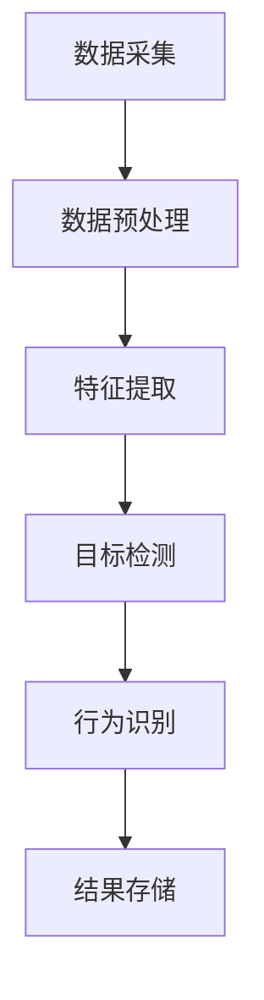
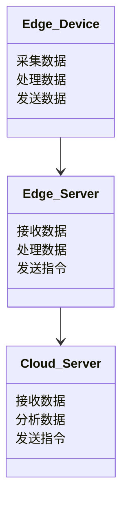

                 


# 如何识别企业的边缘计算实时视频分析优势

> 关键词：边缘计算，实时视频分析，企业应用，技术优势，系统架构

> 摘要：随着边缘计算技术的快速发展，实时视频分析在企业中的应用越来越广泛。本文通过分析边缘计算的核心概念、实时视频分析的原理，以及两者的结合，详细探讨了企业在边缘计算实时视频分析中的优势。文章从背景介绍、核心概念、算法原理、系统架构设计、项目实战到最佳实践，全面解析了如何识别和利用这些优势，帮助企业提升效率和竞争力。

---

# 第一部分: 边缘计算与实时视频分析的背景与概念

# 第1章: 边缘计算与实时视频分析概述

## 1.1 边缘计算的基本概念
### 1.1.1 边缘计算的定义
边缘计算是指在数据生成的位置（边缘）进行数据处理和分析，而不是将所有数据传输到云端。这种方式减少了数据传输的延迟，提高了实时性。

### 1.1.2 边缘计算的核心特点
- 分布式架构：数据在边缘端处理，减少对云端的依赖。
- 低延迟：边缘计算可以在本地快速响应，适用于实时性要求高的场景。
- 高效性：通过边缘设备处理数据，减少云端负担。

### 1.1.3 边缘计算与云计算的区别
- 数据处理位置：边缘计算在边缘端处理，云计算在云端处理。
- 延迟：边缘计算延迟低，云计算延迟较高。
- 数据量：边缘计算处理局部数据，云计算处理全局数据。

## 1.2 实时视频分析的定义与特点
### 1.2.1 实时视频分析的定义
实时视频分析是对视频流进行实时处理和分析，以获取有用信息的技术。例如，视频 surveillance（ surveillance 的实时监控）。

### 1.2.2 实时视频分析的核心技术
- 视频流处理：对视频数据进行实时编码、解码和处理。
- 目标检测：识别视频中的目标物体（如人、车辆等）。
- 行为分析：分析目标的行为模式，识别异常情况。

### 1.2.3 实时视频分析的应用场景
- 智慧城市：交通监控、公共安全。
- 工业自动化：设备监控、质量检测。
- 零售：客户行为分析、人流监控。

## 1.3 企业边缘计算实时视频分析的优势
### 1.3.1 边缘计算在企业中的应用价值
- 提高效率：通过本地处理减少数据传输量。
- 实时响应：快速处理和响应，适用于紧急情况。
- 成本降低：减少云端资源消耗，降低运营成本。

### 1.3.2 实时视频分析在企业中的重要性
- 提高安全性：实时监控企业环境，预防安全威胁。
- 优化运营：通过数据分析优化生产流程。
- 提高客户体验：实时响应客户需求，提升服务质量。

### 1.3.3 结合边缘计算的实时视频分析的优势
- 低延迟：边缘计算减少了数据传输到云端的时间。
- 高可用性：边缘设备本地处理，即使云端不可用也能继续运行。
- 高隐私性：数据在边缘端处理，减少敏感数据外传的风险。

## 1.4 本章小结
本章介绍了边缘计算和实时视频分析的基本概念，分析了它们的特点和区别，并探讨了企业在利用边缘计算进行实时视频分析时的优势。这些优势包括低延迟、高可用性和高隐私性，为企业提供了强大的技术支持。

---

# 第二部分: 核心概念与联系

# 第2章: 边缘计算与实时视频分析的核心概念

## 2.1 边缘计算的原理
### 2.1.1 数据采集与处理
边缘设备采集数据后，进行初步处理，如过滤、压缩和格式转换。

### 2.1.2 边缘计算的架构
- 边缘设备：如摄像头、传感器等。
- 边缘服务器：处理和存储边缘数据。
- 云端：提供支持和协调。

### 2.1.3 边缘计算的计算模型
- 分布式计算：数据在边缘端分布式处理。
- 边缘智能：在边缘端进行智能决策和分析。

## 2.2 实时视频分析的原理
### 2.2.1 视频数据的采集与预处理
- 采集：通过摄像头等设备获取视频流。
- 预处理：调整视频分辨率、亮度、对比度等。

### 2.2.2 视频数据的特征提取
- 目标检测：识别视频中的目标物体。
- 行为识别：分析目标的行为模式。

### 2.2.3 视频数据的分析与决策
- 实时监控：检测异常情况并触发响应。
- 数据存储：将分析结果存储在边缘设备或云端。

## 2.3 边缘计算与实时视频分析的结合
### 2.3.1 边缘计算在实时视频分析中的作用
- 数据预处理：在边缘端进行数据压缩和格式转换。
- 实时响应：边缘设备快速处理视频数据，减少延迟。

### 2.3.2 实时视频分析在边缘计算中的应用
- 智慧城市：交通监控、公共安全。
- 工业自动化：设备监控、质量检测。

### 2.3.3 边缘计算与实时视频分析的协同工作
- 数据协同：边缘设备与云端协同处理数据。
- 系统协同：边缘设备与边缘服务器协同工作，提高处理效率。

## 2.4 本章小结
本章详细讲解了边缘计算和实时视频分析的核心原理，分析了它们的结合方式和应用场景。通过协同工作，边缘计算和实时视频分析能够发挥更大的优势，为企业提供更高效、更实时的服务。

---

# 第三部分: 核心概念与联系

# 第3章: 边缘计算与实时视频分析的核心概念

## 3.1 边缘计算的原理
### 3.1.1 数据采集与处理
边缘设备采集数据后，进行初步处理，如过滤、压缩和格式转换。

### 3.1.2 边缘计算的架构
- 边缘设备：如摄像头、传感器等。
- 边缘服务器：处理和存储边缘数据。
- 云端：提供支持和协调。

### 3.1.3 边缘计算的计算模型
- 分布式计算：数据在边缘端分布式处理。
- 边缘智能：在边缘端进行智能决策和分析。

## 3.2 实时视频分析的原理
### 3.2.1 视频数据的采集与预处理
- 采集：通过摄像头等设备获取视频流。
- 预处理：调整视频分辨率、亮度、对比度等。

### 3.2.2 视频数据的特征提取
- 目标检测：识别视频中的目标物体。
- 行为识别：分析目标的行为模式。

### 3.2.3 视频数据的分析与决策
- 实时监控：检测异常情况并触发响应。
- 数据存储：将分析结果存储在边缘设备或云端。

## 3.3 边缘计算与实时视频分析的结合
### 3.3.1 边缘计算在实时视频分析中的作用
- 数据预处理：在边缘端进行数据压缩和格式转换。
- 实时响应：边缘设备快速处理视频数据，减少延迟。

### 3.3.2 实时视频分析在边缘计算中的应用
- 智慧城市：交通监控、公共安全。
- 工业自动化：设备监控、质量检测。

### 3.3.3 边缘计算与实时视频分析的协同工作
- 数据协同：边缘设备与云端协同处理数据。
- 系统协同：边缘设备与边缘服务器协同工作，提高处理效率。

## 3.4 本章小结
本章详细讲解了边缘计算和实时视频分析的核心原理，分析了它们的结合方式和应用场景。通过协同工作，边缘计算和实时视频分析能够发挥更大的优势，为企业提供更高效、更实时的服务。

---

# 第四部分: 算法原理与实现

# 第4章: 边缘计算与实时视频分析的算法原理

## 4.1 实时视频分析的核心算法
### 4.1.1 目标检测算法
- YOLO算法：快速目标检测。
- Faster R-CNN：精度高但速度较慢。

### 4.1.2 行为识别算法
- 时序检测：分析视频中目标的行为序列。
- 基于深度学习的行为识别：使用CNN提取特征。

## 4.2 边缘计算中的算法优化
### 4.2.1 算法轻量化
- 使用轻量级模型，减少计算资源消耗。
- 剪枝和量化：降低模型复杂度。

### 4.2.2 并行计算优化
- 使用多线程或多进程优化算法性能。

## 4.3 算法实现与流程图
### 4.3.1 算法流程
1. 数据采集：获取视频流。
2. 数据预处理：调整分辨率、归一化等。
3. 特征提取：使用CNN提取视频特征。
4. 目标检测与识别：识别视频中的目标和行为。
5. 结果存储与反馈：将结果存储在边缘设备或云端。

### 4.3.2 用Mermaid绘制的算法流程图


## 4.4 本章小结
本章详细讲解了实时视频分析的核心算法及其在边缘计算中的优化方法。通过轻量化和并行计算，算法在边缘设备上的运行效率得到了显著提升。

---

# 第五部分: 系统架构与设计

# 第5章: 边缘计算与实时视频分析的系统架构设计

## 5.1 系统架构概述
### 5.1.1 系统组成
- 边缘设备：如摄像头、传感器。
- 边缘服务器：处理和存储数据。
- 云端：提供支持和协调。

### 5.1.2 架构特点
- 分布式架构：数据在边缘端处理。
- 低延迟：边缘设备快速响应。
- 高可用性：系统设计容错能力强。

## 5.2 系统功能设计
### 5.2.1 领域模型


### 5.2.2 系统架构设计


### 5.2.3 系统接口设计
- 边缘设备与边缘服务器接口：数据传输和指令接收。
- 边缘服务器与云端接口：数据同步和指令反馈。

## 5.3 本章小结
本章详细讲解了边缘计算与实时视频分析系统的架构设计，包括系统组成、功能设计和接口设计。通过合理的架构设计，系统能够高效地进行数据处理和分析。

---

# 第六部分: 项目实战与案例分析

# 第6章: 边缘计算与实时视频分析的项目实战

## 6.1 环境搭建
### 6.1.1 系统安装
- 安装边缘设备：如树莓派、嵌入式设备。
- 安装边缘服务器：如本地服务器、云服务器。

### 6.1.2 软件安装
- 安装实时视频分析框架：如OpenCV、TensorFlow。
- 安装边缘计算框架：如Kubernetes、Docker。

## 6.2 核心代码实现
### 6.2.1 视频数据采集代码
```python
import cv2

def capture_video():
    cap = cv2.VideoCapture(0)
    while True:
        ret, frame = cap.read()
        if not ret:
            break
        # 处理视频数据
        cv2.imshow('Video', frame)
        if cv2.waitKey(1) & 0xFF == ord('q'):
            break
    cap.release()
    cv2.destroyAllWindows()
```

### 6.2.2 目标检测代码
```python
import tensorflow as tf
from tensorflow.keras import layers

model = tf.keras.Sequential([
    layers.Conv2D(32, (3,3), activation='relu', input_shape=(224, 224, 3)),
    layers.MaxPooling2D((2,2)),
    layers.Conv2D(64, (3,3), activation='relu'),
    layers.MaxPooling2D((2,2)),
    layers.Flatten(),
    layers.Dense(128, activation='relu'),
    layers.Dense(1, activation='sigmoid')
])

model.compile(optimizer='adam', loss='binary_crossentropy', metrics=['accuracy'])
```

### 6.2.3 结果存储与反馈代码
```python
import json

result = {
    'timestamp': '2023-10-05 12:34:56',
    'event': '异常检测',
    'location': '摄像头1'
}

# 存储到本地文件
with open('results.json', 'a') as f:
    json.dump(result, f)
```

## 6.3 案例分析与详细讲解
### 6.3.1 案例背景
某企业使用边缘计算进行实时视频分析，部署在工厂生产线上的摄像头进行设备监控。

### 6.3.2 案例实施
- 部署边缘设备：摄像头和边缘服务器。
- 部署实时视频分析算法：目标检测和行为识别。
- 系统集成：边缘设备与边缘服务器协同工作，实时监控生产线。

### 6.3.3 案例结果
- 实时监控：快速检测设备异常。
- 成本降低：减少人工巡检，提高效率。
- 效益提升：通过数据分析优化生产流程。

## 6.4 本章小结
本章通过实际案例详细讲解了边缘计算与实时视频分析的项目实战，包括环境搭建、代码实现和案例分析。通过案例分析，展示了系统在实际应用中的优势和效果。

---

# 第七部分: 最佳实践与小结

# 第7章: 边缘计算与实时视频分析的最佳实践

## 7.1 小结
本章总结了边缘计算与实时视频分析的核心概念、算法原理和系统架构设计。通过项目实战和案例分析，展示了系统在实际应用中的优势和效果。

## 7.2 注意事项
- 系统设计：确保系统架构合理，避免数据瓶颈。
- 算法优化：优化算法性能，减少计算资源消耗。
- 安全性：确保数据安全，防止数据泄露。

## 7.3 拓展阅读
- 《边缘计算入门与实践》
- 《实时视频分析技术详解》
- 《深度学习在实时视频分析中的应用》

## 7.4 本章小结
本章总结了边缘计算与实时视频分析的最佳实践，包括小结、注意事项和拓展阅读。通过这些内容，读者可以更好地理解和应用这些技术，提升企业的竞争力。

---

# 结语

通过本篇文章的详细讲解，我们全面探讨了如何识别和利用企业的边缘计算实时视频分析优势。从背景介绍到核心概念，从算法原理到系统架构设计，再到项目实战和最佳实践，我们为企业提供了全面的指导和支持。希望本文能够帮助企业在数字化转型中充分利用边缘计算和实时视频分析的优势，提升效率和竞争力。

