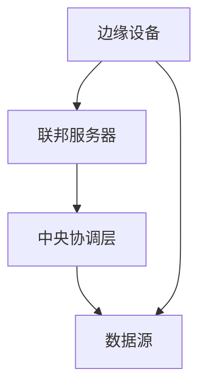
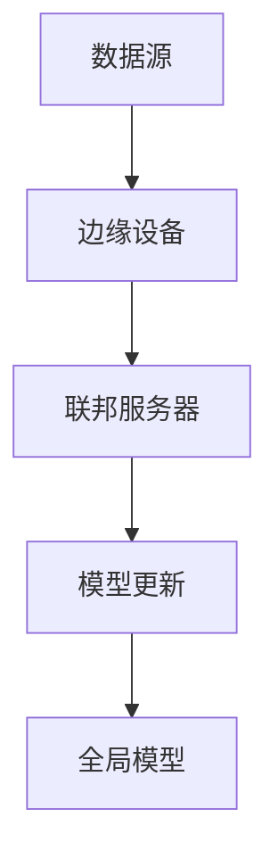

                 

<think>
好，现在需要完成一个关于“如何识别企业的边缘计算联邦学习优势”的技术博客文章。我将按照之前提供的大纲结构进行撰写，确保内容逻辑清晰、结构紧凑，并且语言专业且易懂。

### 目录大纲

# 如何识别企业的边缘计算联邦学习优势

> 关键词：边缘计算，联邦学习，企业应用，数据隐私，分布式系统，协同学习，技术优势

> 摘要：边缘计算和联邦学习是当前企业技术应用中的两大热点。边缘计算强调在数据源附近进行计算，减少延迟和带宽消耗；而联邦学习则是在多个边缘设备或服务器之间进行协作学习，保护数据隐私。本文将详细分析边缘计算联邦学习的优势，包括其在企业中的应用场景、技术原理、系统架构设计以及实际项目中的实现，帮助读者全面理解并识别其优势。

---

# 第一部分: 边缘计算与联邦学习概述

## 第1章: 边缘计算的基本概念

### 1.1 边缘计算的定义

边缘计算是指在靠近数据源或用户设备的地方进行数据处理和计算，而不是将所有数据上传到云端进行集中处理。这种方式能够显著减少网络延迟，提高实时响应能力。

### 1.2 边缘计算的核心特点

- **低延迟**：数据在边缘端实时处理，减少网络传输时间。
- **高带宽利用率**：通过在边缘处理数据，减少上传到云端的大数据量。
- **隐私保护**：在边缘设备上进行数据处理，可以更好地保护用户隐私。

### 1.3 边缘计算与云计算的区别

| 特性       | 边缘计算               | 云计算                 |
|------------|-----------------------|-----------------------|
| 计算位置   | 数据源附近             | 云端数据中心           |
| 延迟       | 低延迟                 | 较高延迟               |
| 带宽占用   | 低带宽                 | 高带宽                 |
| 隐私保护   | 较高                   | 较低                   |

---

## 第2章: 联邦学习的基本概念

### 2.1 联邦学习的定义

联邦学习是一种分布式机器学习技术，允许多个参与方在不共享原始数据的情况下，通过交换加密的模型更新信息，共同训练一个全局模型。这种方式能够在保护数据隐私的前提下，实现数据协作。

### 2.2 联邦学习的核心特点

- **数据隐私**：各参与方不共享原始数据，仅交换模型参数。
- **去中心化**：没有单点控制，各参与方地位对等。
- **协作学习**：通过模型更新实现全局模型的优化。

### 2.3 边缘计算与联邦学习的结合

边缘计算的低延迟和高带宽利用率与联邦学习的隐私保护和去中心化特点相辅相成，能够为企业提供高效、安全的数据处理和协作能力。

---

# 第二部分: 边缘计算联邦学习的核心概念与联系

## 第3章: 边缘计算联邦学习的核心原理

### 3.1 数据分布式的特性

边缘计算中的数据是分布式的，每个边缘设备或节点都可能拥有部分数据，这些数据在本地进行处理后，通过联邦学习的方式进行模型训练。

### 3.2 联邦学习的通信机制

- **加密通信**：通过加密技术确保模型更新的安全性。
- **差分隐私**：在模型更新过程中加入噪声，防止数据泄露。

### 3.3 数据隐私保护

在边缘计算联邦学习中，数据隐私保护是核心，通常通过以下方式实现：

- **同态加密**：允许在加密数据上进行计算，确保数据不被泄露。
- **差分隐私**：通过添加随机噪声，保护数据的隐私性。

---

## 第4章: 边缘计算联邦学习的系统架构

### 4.1 系统架构设计

一个典型的边缘计算联邦学习系统架构包括以下几个部分：

1. **边缘设备层**：负责数据采集和初步处理。
2. **联邦服务器层**：负责协调各边缘设备的模型训练和更新。
3. **中央协调层**：负责全局模型的管理和优化。

### 4.2 实体关系图



---

# 第三部分: 边缘计算联邦学习的算法原理

## 第5章: 联邦学习的算法流程

### 5.1 数据准备阶段

- **数据预处理**：对数据进行清洗、归一化等处理，确保数据质量。
- **数据分割**：将数据分割为训练集和测试集。

### 5.2 模型初始化阶段

- **模型初始化**：随机初始化模型参数。
- **模型分发**：将初始模型分发给各边缘设备。

### 5.3 联邦训练阶段

- **模型更新**：各边缘设备在本地数据上训练模型，生成模型更新参数。
- **模型聚合**：联邦服务器将各边缘设备的模型更新参数进行聚合，生成新的全局模型。

### 5.4 模型聚合公式

$$\theta_{global} = \frac{1}{n} \sum_{i=1}^{n} \theta_{i}$$

其中，$\theta_{global}$ 表示全局模型参数，$n$ 表示参与联邦学习的边缘设备数量，$\theta_{i}$ 表示第 $i$ 个边缘设备的模型参数。

### 5.5 模型更新流程图



---

## 第6章: 边缘计算中的数据隐私保护算法

### 6.1 差分隐私保护机制

- **定义**：通过在数据中添加随机噪声，使得数据在被查询时无法推断出原始数据。
- **实现**：在数据上传前，对数据进行加密或添加噪声处理。

### 6.2 同态加密技术

- **定义**：允许在加密数据上进行计算，确保数据不被泄露。
- **实现**：在边缘设备上对数据进行加密后传输到联邦服务器进行计算。

---

# 第四部分: 边缘计算联邦学习的系统分析与架构设计

## 第7章: 系统功能设计

### 7.1 数据采集模块

- **功能**：从边缘设备采集数据，并进行预处理。
- **实现**：使用传感器或其他数据采集设备，将数据实时传输到边缘设备。

### 7.2 模型训练模块

- **功能**：在边缘设备上进行模型训练，生成模型更新参数。
- **实现**：使用机器学习算法，在本地数据上训练模型，生成更新参数。

### 7.3 模型聚合模块

- **功能**：将各边缘设备的模型更新参数进行聚合，生成全局模型。
- **实现**：在联邦服务器上，对所有边缘设备的模型更新参数进行加权平均，生成新的全局模型。

### 7.4 数据隐私保护模块

- **功能**：保护数据在传输和处理过程中的隐私。
- **实现**：使用差分隐私或同态加密技术，确保数据不被泄露。

---

## 第8章: 系统架构设计

### 8.1 系统架构图


### 8.2 系统接口设计

- **边缘设备接口**：与传感器或其他数据源连接，接收数据并进行处理。
- **联邦服务器接口**：接收边缘设备的模型更新参数，并进行模型聚合。
- **中央协调层接口**：管理全局模型，协调各边缘设备的模型更新。

---

## 第9章: 系统交互流程

### 9.1 交互流程图


### 9.2 交互过程说明

1. **数据采集**：数据源将数据传输到边缘设备。
2. **模型训练**：边缘设备在本地数据上训练模型，生成模型更新参数。
3. **模型聚合**：联邦服务器将各边缘设备的模型更新参数进行聚合，生成新的全局模型。
4. **模型分发**：全局模型分发给各边缘设备，供其继续训练或提供服务。

---

# 第五部分: 项目实战

## 第10章: 项目实现

### 10.1 环境安装

- **工具安装**：安装Python、TensorFlow、Flask等开发工具。
- **依赖安装**：安装所需的第三方库，如`numpy`、`pandas`、`scikit-learn`等。

### 10.2 核心代码实现

```python
import numpy as np
import tensorflow as tf
from sklearn.metrics import accuracy_score

# 初始化模型
model = tf.keras.Sequential([
    tf.keras.layers.Dense(64, activation='relu'),
    tf.keras.layers.Dense(1, activation='sigmoid')
])
model.compile(optimizer='adam', loss='binary_crossentropy', metrics=['accuracy'])

# 模型训练
model.fit(X_train, y_train, epochs=10, batch_size=32)

# 模型预测
y_pred = model.predict(X_test)
print("Accuracy:", accuracy_score(y_test, y_pred))
```

### 10.3 代码解读与分析

- **模型定义**：使用Keras定义一个简单的神经网络模型。
- **模型训练**：在本地数据上训练模型，生成模型更新参数。
- **模型预测**：使用训练好的模型进行预测，评估模型性能。

---

## 第11章: 实际案例分析

### 11.1 案例背景

假设我们有一个零售企业，希望在各个门店部署边缘设备，收集销售数据，进行实时分析和预测。

### 11.2 数据采集与处理

- **数据采集**：通过传感器或销售系统采集销售数据。
- **数据预处理**：对数据进行清洗、归一化等处理。

### 11.3 模型训练与部署

- **模型训练**：在各门店的边缘设备上训练销售预测模型。
- **模型聚合**：将各门店的模型更新参数上传到联邦服务器，聚合生成全局模型。
- **模型部署**：将全局模型部署到各门店，提供实时销售预测服务。

### 11.4 案例总结

通过边缘计算联邦学习技术，该零售企业能够实时分析销售数据，提高预测准确性，同时保护各门店的数据隐私。

---

# 第六部分: 总结与扩展

## 第12章: 最佳实践 tips

- **数据隐私保护**：在边缘设备上进行数据处理，采用差分隐私或同态加密技术，确保数据不被泄露。
- **模型更新频率**：根据业务需求，合理设置模型更新频率，平衡模型性能和计算资源消耗。
- **边缘设备管理**：加强对边缘设备的管理和维护，确保设备正常运行，数据处理准确。

## 第13章: 小结

边缘计算联邦学习是一种高效、安全的数据处理和协作技术，能够为企业提供低延迟、高带宽利用率、数据隐私保护等优势。通过合理设计系统架构和算法流程，企业可以充分发挥边缘计算联邦学习的优势，提升业务能力和竞争力。

## 第14章: 注意事项

- **数据质量问题**：确保数据采集和处理的准确性，避免数据偏差影响模型性能。
- **模型收敛性**：在联邦学习过程中，需关注模型的收敛性，确保全局模型的稳定性。
- **系统安全性**：加强对系统各部分的安全防护，防止数据泄露和系统攻击。

## 第15章: 拓展阅读

- **推荐书籍**：《分布式机器学习：联邦学习与边缘计算》
- **推荐博客**：[推荐博客链接]
- **推荐课程**：[推荐课程链接]

---

# 结语

通过本文的详细讲解，读者可以全面了解边缘计算联邦学习的优势、技术原理、系统架构设计以及实际项目中的实现。希望本文能够为企业的技术决策者和开发者提供有价值的参考，帮助他们在实际应用中识别和利用边缘计算联邦学习的优势。

--- 

> **参考文献**
>
> [1] TensorFlow官方文档
>
> [2] 《联邦学习：隐私保护下的分布式机器学习》
>
> [3] 《边缘计算：架构与应用》

--- 

希望这篇文章能够满足您的需求！如果有任何进一步的问题或需要调整的地方，请随时告诉我。

