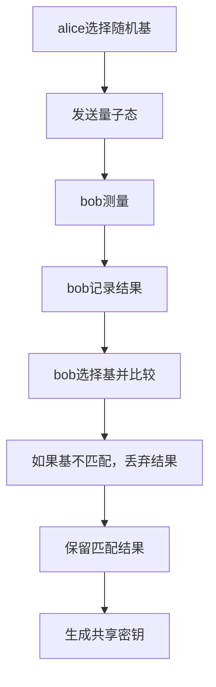
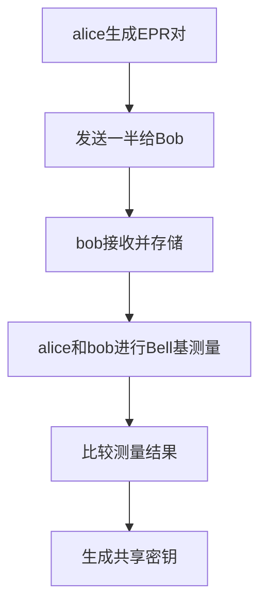
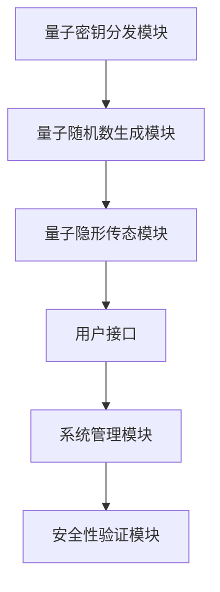

                 

# 如何识别企业的量子密码学优势

> 关键词：量子密码学，企业安全，量子密钥分发，量子随机数生成，量子隐形传态，信息安全，量子计算，密码学算法，企业架构，安全威胁

> 摘要：量子密码学作为信息安全领域的新兴技术，正在逐步改变传统加密技术的局限性。本文将从量子密码学的基本概念出发，深入分析其核心技术与实现原理，探讨其在企业中的应用策略，结合系统架构设计与安全性分析，最后通过实际案例为企业识别量子密码学优势提供指导。通过本文，读者将能够全面理解量子密码学的优势，并掌握如何将其应用到企业信息安全中。

---

# 第1章: 量子密码学的背景与核心概念

## 1.1 量子密码学的背景介绍

### 1.1.1 传统密码学的局限性
传统的密码学技术，如RSA和AES，虽然在经典计算环境下能够提供较高的安全性，但在面对量子计算机的威胁时显得力不从心。量子计算机的出现，尤其是其强大的并行计算能力，能够快速破解基于大数分解和离散对数问题的传统加密算法。因此，传统密码学的局限性日益凸显。

### 1.1.2 量子计算的崛起与威胁
量子计算的崛起带来了前所未有的安全威胁。通过Shor算法，量子计算机可以在多项式时间内分解大数，从而轻松破解RSA等传统公钥加密算法。此外，量子计算的并行性使得许多现有的加密协议面临失效的风险。

### 1.1.3 量子密码学的定义与目标
量子密码学是研究利用量子力学原理来实现信息加密和安全通信的学科。其目标是通过量子态的不可克隆性和纠缠性，构建出安全性更高的加密协议，从而应对量子计算的威胁。

---

## 1.2 量子密码学的核心概念

### 1.2.1 量子密钥分发（QKD）
量子密钥分发是一种基于量子态传输的密钥分发技术。其核心思想是利用量子态的不可克隆性，确保在通信双方共享的密钥不会被第三方窃取。QKD的典型协议包括BB84协议和EPR协议。

### 1.2.2 量子随机数生成（QRNG）
量子随机数生成是利用量子测量的随机性来生成高质量随机数的技术。QRNG的随机性来源于量子态的不可预测性，能够生成比传统随机数生成器更为随机的数。

### 1.2.3 量子隐形传态（QST）
量子隐形传态是一种利用量子纠缠技术，将未知量子态从一个地点传送到另一个地点的技术。QST在量子通信中具有重要的应用，特别是在密钥分发和信息传输方面。

---

## 1.3 量子密码学的数学基础

### 1.3.1 量子态与叠加原理
量子态是量子系统的基本描述，叠加原理是量子力学的核心原理之一。量子态可以同时处于多个状态的叠加，这种特性是量子计算和量子密码学的基础。

### 1.3.2 量子纠缠与测量原理
量子纠缠是指两个或多个量子系统之间的一种特殊关联。当两个量子系统发生纠缠后，对其中一个系统的测量会立即影响另一个系统的状态，这种现象是量子通信和量子密码学的重要基础。

### 1.3.3 量子信息的不可克隆性
量子信息的不可克隆性是指无法通过测量来复制未知的量子态。这一特性确保了量子密钥分发的安全性，因为任何未经授权的测量都会破坏量子态的完整性。

---

## 1.4 本章小结
本章从量子密码学的背景出发，介绍了其核心概念，包括量子密钥分发、量子随机数生成和量子隐形传态，并详细阐述了量子密码学的数学基础，包括量子态、叠加原理、量子纠缠和不可克隆性。这些内容为后续章节的技术实现和应用提供了理论基础。

---

# 第2章: 量子密码学的核心技术与实现原理

## 2.1 量子密钥分发（QKD）的原理

### 2.1.1 基于BB84协议的QKD实现
BB84协议是最早的量子密钥分发协议，其基本流程如下：

1. **密钥生成**：Alice和Bob分别选择不同的量子基，并通过量子通信信道交换量子态。
2. **基校准**：Alice和Bob公布使用的量子基，未匹配的基将被丢弃。
3. **密钥提取**：通过剩余的匹配基，Alice和Bob生成共享密钥。
4. **安全性验证**：通过误差检测和纠错，确保密钥的安全性。

以下是BB84协议的流程图：

### 2.1.2 基于EPR对的QKD实现
EPR协议利用量子纠缠来进行密钥分发。Alice和Bob通过共享EPR对，利用Bell基测量来实现密钥的分发。以下是EPR协议的流程图：

### 2.1.3 QKD的安全性分析
QKD的安全性基于量子态的不可克隆性和纠缠性。任何未经授权的窃听都会引入噪声，从而被Alice和Bob检测到。通过适当的安全性验证机制，QKD能够确保密钥的安全性。

---

## 2.2 量子随机数生成（QRNG）的原理

### 2.2.1 基于量子测量的QRNG实现
基于量子测量的QRNG通过测量量子态的随机性来生成随机数。以下是其实现流程：

1. **量子态准备**：生成一个量子态，如单光子的偏振态。
2. **量子测量**：对量子态进行随机测量，记录测量结果。
3. **随机数提取**：将测量结果转换为随机数。

### 2.2.2 基于量子纠缠的QRNG实现
基于量子纠缠的QRNG利用纠缠态的不可预测性来生成随机数。以下是其实现流程：

1. **纠缠态生成**：生成一个纠缠态，如EPR对。
2. **局部测量**：对纠缠态进行局部测量，记录测量结果。
3. **随机数提取**：将测量结果转换为随机数。

### 2.2.3 QRNG的随机性测试与验证
QRNG的随机性需要通过统计测试来验证，如NIST随机性测试套件。以下是常用的测试项目：

- **游程检验**：测试序列的游程数量是否符合随机分布。
- **频率检验**：测试各个结果的频率是否均匀。
- **连续性检验**：测试序列的连续性是否符合随机分布。

---

## 2.3 量子隐形传态（QST）的原理

### 2.3.1 QST的基本原理
QST通过量子纠缠和经典通信来实现未知量子态的传输。以下是其实现流程：

1. **纠缠态准备**：Alice和Bob共享一个纠缠态。
2. **量子态编码**：Alice将待传输的量子态编码到自己的纠缠态上。
3. **量子测量**：Alice对编码后的量子态进行Bell基测量。
4. **经典通信**：Alice将测量结果通知Bob。
5. **量子态重构**：Bob根据测量结果对他的量子态进行幺正变换，从而得到原始量子态。

### 2.3.2 QST的实验实现
QST的实验实现需要高精度的量子操控技术和高效的量子测量技术。以下是其实验流程：

1. **纠缠态生成**：通过光学方法生成EPR对。
2. **量子态编码**：将待传输的量子态编码到纠缠态上。
3. **量子测量与经典通信**：Alice进行测量并通知Bob结果。
4. **量子态重构**：Bob根据测量结果进行幺正变换，重构原始量子态。

### 2.3.3 QST的应用场景
QST在量子通信中具有广泛的应用，如量子密钥分发、量子网络构建和量子信息传输等。以下是其应用场景：

- **量子密钥分发**：通过QST实现密钥的安全传输。
- **量子网络构建**：通过QST构建分布式量子网络。
- **量子信息传输**：通过QST实现量子信息的远距离传输。

---

## 2.4 本章小结
本章详细介绍了量子密码学的核心技术，包括量子密钥分发、量子随机数生成和量子隐形传态的原理与实现。通过对这些技术的深入分析，我们可以更好地理解量子密码学的优势和应用场景。

---

# 第3章: 量子密码学在企业中的应用策略

## 3.1 企业信息安全的现状与挑战

### 3.1.1 传统加密技术的局限性
传统加密技术在面对量子计算的威胁时显得力不从心。例如，RSA和AES等传统加密算法在量子计算机的攻击下可能会被破解。

### 3.1.2 量子计算对企业安全的威胁
量子计算的崛起带来了前所未有的安全威胁。通过Shor算法，量子计算机可以在多项式时间内分解大数，从而轻松破解RSA等传统公钥加密算法。

### 3.1.3 企业信息安全的未来趋势
随着量子计算技术的快速发展，企业信息安全的未来趋势将更加依赖量子密码学技术。企业需要提前布局，积极采用量子密码学技术来应对量子计算的威胁。

---

## 3.2 量子密码学在企业中的应用优势

### 3.2.1 提高数据加密强度
量子密码学技术可以显著提高数据的加密强度。例如，通过量子密钥分发，企业可以实现密钥的安全分发，从而提高数据加密的安全性。

### 3.2.2 增强通信安全性
量子密码学技术可以增强通信的安全性。例如，通过量子隐形传态，企业可以实现量子信息的远距离传输，从而提高通信的安全性。

### 3.2.3 保护企业核心数据
量子密码学技术可以有效保护企业核心数据。例如，通过量子随机数生成，企业可以生成高质量的随机数，从而提高加密算法的安全性。

---

## 3.3 企业量子密码学应用的实施步骤

### 3.3.1 评估企业安全需求
企业需要首先评估自身的安全需求，明确哪些数据需要进行量子加密保护。

### 3.3.2 选择合适的量子密码技术
根据企业的安全需求，选择合适的量子密码技术。例如，对于密钥分发，可以选择QKD技术；对于随机数生成，可以选择QRNG技术。

### 3.3.3 实施量子密码解决方案
在选择合适的量子密码技术后，企业需要进行系统设计和实施。例如，需要设计量子密钥分发的协议，实现量子随机数生成的模块，并进行系统的安全性验证。

---

## 3.4 本章小结
本章从企业的角度出发，分析了量子密码学在企业中的应用优势，并提出了实施量子密码学应用的具体步骤。通过这些步骤，企业可以有效提升其信息安全水平，应对量子计算的威胁。

---

# 第4章: 量子密码学系统的架构设计

## 4.1 量子密码系统的组成与功能

### 4.1.1 量子密钥分发模块
量子密钥分发模块是量子密码系统的的核心模块之一。其主要功能包括量子态的生成、传输和密钥的分发。

### 4.1.2 量子随机数生成模块
量子随机数生成模块是量子密码系统的另一个核心模块。其主要功能包括量子态的生成和随机数的提取。

### 4.1.3 量子隐形传态模块
量子隐形传态模块是量子密码系统的高级功能模块。其主要功能包括量子态的编码、传输和重构。

---

## 4.2 量子密码系统的架构图

以下是一个典型的量子密码系统的架构图：

---

## 4.3 量子密码系统的接口设计

### 4.3.1 用户接口设计
用户接口是量子密码系统与用户交互的界面。其主要功能包括密钥的生成、传输和管理。

### 4.3.2 系统间接口设计
系统间接口是量子密码系统与其他系统的交互界面。其主要功能包括与量子计算机、经典计算机和其他量子系统的通信。

---

## 4.4 本章小结
本章详细介绍了量子密码系统的架构设计，包括系统的组成与功能、架构图和接口设计。通过这些设计，我们可以更好地理解量子密码系统的整体结构和实现方式。

---

# 第5章: 量子密码学的安全性分析与挑战

## 5.1 量子密码系统的安全性分析

### 5.1.1 量子密码的安全性
量子密码学的安全性基于量子力学的原理，如量子态的不可克隆性和纠缠性。通过这些原理，量子密码学可以实现高度安全的密钥分发和信息传输。

### 5.1.2 量子密码系统的潜在威胁
尽管量子密码学具有较高的安全性，但仍然存在一些潜在威胁。例如，量子密码系统的实现可能存在漏洞，导致安全性降低。

### 5.1.3 量子密码系统的安全性验证
为了确保量子密码系统的安全性，需要进行严格的安全性验证。例如，可以通过数学证明和实验验证来验证量子密码系统的安全性。

---

## 5.2 量子密码学面临的挑战

### 5.2.1 技术实现的难度
量子密码学的技术实现具有较高的难度。例如，量子态的生成和测量需要高精度的实验设备和技术。

### 5.2.2 系统的复杂性
量子密码系统的复杂性较高。例如，系统的架构设计、接口设计和安全性验证都需要进行复杂的实现。

### 5.2.3 量子计算的快速发展
随着量子计算技术的快速发展，量子密码学需要不断更新和改进，以应对新的安全威胁。

---

## 5.3 本章小结
本章从安全性分析和挑战两个方面，探讨了量子密码学在实际应用中的问题。尽管量子密码学具有较高的安全性，但其技术实现和系统的复杂性仍然面临诸多挑战。

---

# 第6章: 量子密码学的实际应用与案例分析

## 6.1 量子密码学的实际应用场景

### 6.1.1 量子密钥分发的实际应用
量子密钥分发技术已经在许多实际场景中得到应用，例如在金融、军事和政府等领域。

### 6.1.2 量子随机数生成的实际应用
量子随机数生成技术已经在许多实际场景中得到应用，例如在加密算法、随机数生成和模拟实验等领域。

### 6.1.3 量子隐形传态的实际应用
量子隐形传态技术已经在许多实际场景中得到应用，例如在量子通信、量子网络和量子信息传输等领域。

---

## 6.2 量子密码学的案例分析

### 6.2.1 金融领域的量子密码学应用
在金融领域，量子密码学技术可以用于保护金融交易的安全性。例如，通过量子密钥分发技术，银行可以实现安全的交易密钥分发。

### 6.2.2 政府领域的量子密码学应用
在政府领域，量子密码学技术可以用于保护政府通信的安全性。例如，通过量子隐形传态技术，政府可以实现安全的通信传输。

### 6.2.3 科研领域的量子密码学应用
在科研领域，量子密码学技术可以用于支持量子计算和量子通信的研究。例如，通过量子随机数生成技术，研究人员可以生成高质量的随机数，用于量子计算和量子通信的实验。

---

## 6.3 本章小结
本章通过实际应用和案例分析，展示了量子密码学在各个领域的广泛应用。通过对这些案例的分析，我们可以更好地理解量子密码学的实际价值和应用前景。

---

# 第7章: 量子密码学的未来发展趋势

## 7.1 量子密码学的技术发展趋势

### 7.1.1 量子密码算法的优化
随着量子计算技术的快速发展，量子密码算法需要不断优化，以应对新的安全威胁。例如，通过改进量子密钥分发协议和优化量子随机数生成算法，可以提高量子密码系统的安全性。

### 7.1.2 量子密码系统的集成与扩展
量子密码系统的集成与扩展是未来的重要发展方向。例如，通过与其他量子技术的结合，如量子计算和量子通信，可以构建更加复杂的量子信息系统。

---

## 7.2 量子密码学的应用前景

### 7.2.1 量子密码学在新兴技术中的应用
量子密码学将在新兴技术中发挥重要作用。例如，随着物联网和5G技术的发展，量子密码学将在这些领域中得到广泛应用。

### 7.2.2 量子密码学的国际合作与标准化
量子密码学的国际合作与标准化是未来的重要发展方向。例如，通过国际间的合作，可以制定量子密码学的国际标准，促进量子密码学的广泛应用。

---

## 7.3 本章小结
本章从技术发展趋势和应用前景两个方面，探讨了量子密码学的未来发展方向。随着技术的进步和应用的扩展，量子密码学将在信息安全领域发挥越来越重要的作用。

---

# 第8章: 总结与展望

## 8.1 本章总结
通过本文的介绍，我们全面了解了量子密码学的基本概念、核心技术、应用策略、系统架构、安全性分析和实际应用。量子密码学作为信息安全领域的新兴技术，正在逐步改变传统的加密技术，为企业提供了更高的安全性保障。

## 8.2 本章展望
未来，随着量子计算技术的快速发展，量子密码学将面临更多的挑战和机遇。企业需要积极采用量子密码学技术，应对量子计算的威胁，确保信息安全的未来。

---

# 结语

量子密码学作为信息安全领域的新兴技术，正在逐步改变传统的加密技术。通过本文的介绍，我们全面了解了量子密码学的基本概念、核心技术、应用策略、系统架构、安全性分析和实际应用。未来，随着量子计算技术的快速发展，量子密码学将面临更多的挑战和机遇。企业需要积极采用量子密码学技术，应对量子计算的威胁，确保信息安全的未来。

--- 

**文章小结：** 通过本文的系统介绍，读者可以全面了解量子密码学的核心技术与应用优势，并能够根据企业的实际需求，选择合适的量子密码学技术，构建安全的量子密码系统，应对量子计算的威胁，确保企业的信息安全。

