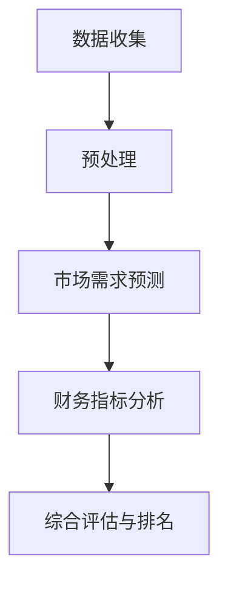
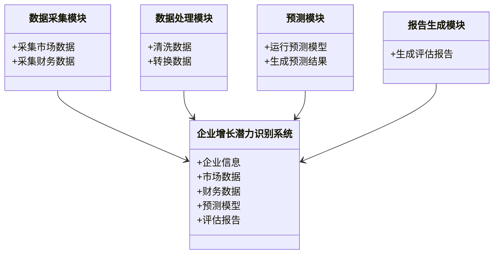
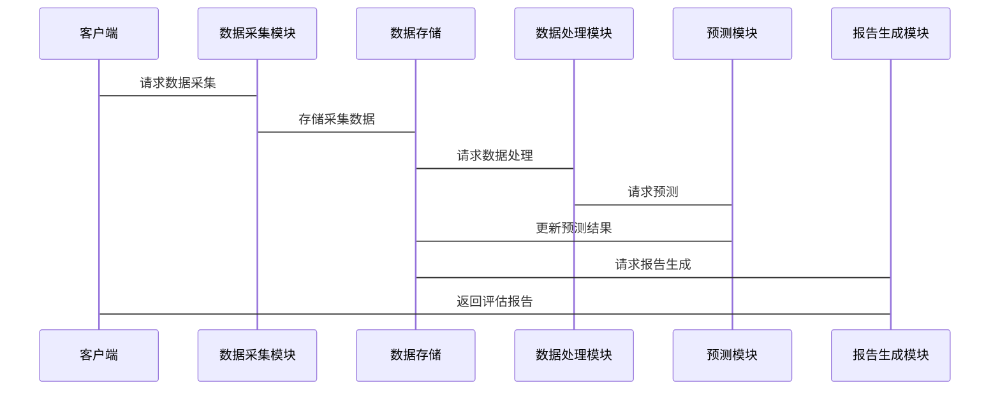

                 


# 如何识别企业的长期增长潜力

---

## 关键词：
企业增长潜力、长期增长、商业模式、财务指标、市场趋势、系统架构、算法原理、案例分析

---

## 摘要：
识别企业的长期增长潜力是企业在复杂多变的商业环境中保持竞争力的关键。本文从背景介绍、核心概念、算法原理、数学模型、系统架构设计、项目实战等多维度，详细分析如何通过技术手段识别和评估企业的长期增长潜力。通过实际案例和最佳实践，为读者提供实用的工具和方法，帮助企业在不确定性中把握增长机遇。

---

## 第1章: 企业长期增长潜力的背景介绍

### 1.1 问题背景
#### 1.1.1 企业增长的核心挑战
在当前全球化和数字化的商业环境中，企业面临着前所未有的竞争压力和不确定性。企业需要在复杂多变的市场中找到持续增长的路径。然而，许多企业在制定增长战略时缺乏系统性，导致增长潜力未能得到充分挖掘。

#### 1.1.2 当前商业环境的变化对企业增长的影响
技术的进步、消费者需求的变化、政策的调整等因素都在不断影响企业的增长模式。例如，新冠疫情的爆发加速了线上商业模式的普及，这对企业的增长策略提出了新的要求。

#### 1.1.3 长期增长潜力对企业战略的重要性
企业的长期增长潜力不仅关系到企业的生存，还决定了其在市场中的地位。识别和评估这种潜力，能够帮助企业制定更有效的战略，优化资源配置，抓住增长机会。

### 1.2 问题描述
#### 1.2.1 企业增长潜力的定义
企业增长潜力是指企业在未来一定时期内，在现有资源和市场条件下，通过优化运营和战略调整，能够实现的收入和利润的潜在增长空间。

#### 1.2.2 影响企业长期增长的关键因素
- 市场需求：包括市场规模、增长速度和竞争状况。
- 商业模式：企业的盈利模式和价值主张。
- 财务状况：企业的盈利能力、现金流和资产负债情况。
- 管理团队：领导层的战略眼光和执行能力。
- 技术创新：企业的研发能力和技术储备。

#### 1.2.3 企业增长潜力的评估标准
- 市场渗透率：企业在目标市场中的份额。
- 盈利能力：企业的净利润率和ROE（净资产收益率）。
- 现金流：企业的经营活动现金流情况。
- 管理团队的稳定性：领导层的决策能力和团队凝聚力。

### 1.3 问题解决方法
#### 1.3.1 核心问题的识别
- 明确企业在市场中的定位。
- 分析企业的核心竞争力。
- 识别影响增长的关键因素。

#### 1.3.2 问题解决的思路与框架
- 从市场、财务、管理、技术等多个维度全面评估企业的增长潜力。
- 制定系统的增长策略，包括产品创新、市场拓展、成本优化等。

#### 1.3.3 解决方案的可行性分析
- 评估企业的资源和能力是否能够支撑增长战略的实施。
- 分析外部环境的潜在风险和机会。

### 1.4 边界与外延
#### 1.4.1 企业增长潜力的边界条件
- 企业所处的行业特性。
- 企业的规模和资源限制。
- 外部政策和经济环境的变化。

#### 1.4.2 相关概念的外延与区别
- 企业增长潜力与企业生命周期的关系。
- 企业增长潜力与企业风险管理的联系。
- 企业增长潜力与企业战略管理的区别。

#### 1.4.3 概念结构与核心要素
- 核心概念：企业增长潜力。
- 组成要素：市场需求、商业模式、财务状况、管理团队、技术创新。
- 要素之间的关系：市场需求是基础，商业模式是载体，财务状况是结果，管理团队是推动者，技术创新是催化剂。

### 1.5 本章小结
本章通过对企业增长潜力的背景分析，明确了其定义、关键影响因素和评估标准。同时，提出了系统解决问题的思路和框架，为后续的分析奠定了基础。

---

## 第2章: 核心概念与联系

### 2.1 核心概念的定义与属性
#### 2.1.1 核心概念的定义
企业增长潜力是企业在现有资源和市场条件下，通过优化运营和战略调整，所能实现的收入和利润的潜在增长空间。

#### 2.1.2 核心概念的属性特征
| 属性 | 特征 |
|------|------|
| 市场需求 | 市场规模、增长速度、竞争状况 |
| 商业模式 | 盈利模式、价值主张 |
| 财务状况 | 净利润率、ROE、现金流 |
| 管理团队 | 战略眼光、执行能力 |
| 技术创新 | 研发能力、技术储备 |

#### 2.1.3 核心概念的对比分析
通过对比分析，可以识别企业在不同维度上的优势和劣势，从而制定针对性的增长策略。

### 2.2 核心概念的联系与对比
#### 2.2.1 核心概念之间的关系
使用Mermaid绘制企业增长潜力的概念关系图：


#### 2.2.2 核心概念的ER实体关系图
使用Mermaid绘制企业增长潜力的实体关系图：

```mermaid
erd
    客户 --- o--> 市场需求
    产品 <--- o--> 商业模式
    财务数据 <---> 管理团队
    技术创新 <---> 产品
```

---

## 第3章: 算法原理讲解

### 3.1 算法原理概述
识别企业增长潜力的算法通常包括以下步骤：
1. 数据收集与预处理。
2. 市场需求预测。
3. 财务指标分析。
4. 综合评估与排名。

### 3.2 算法流程图
使用Mermaid绘制算法流程图：



### 3.3 算法实现
以下是使用Python实现的市场需求预测算法示例：

```python
import numpy as np
import pandas as pd
from sklearn.linear_model import LinearRegression

# 数据预处理
data = pd.read_csv('market_data.csv')
X = data[['market_size', 'growth_rate']]
y = data['revenue']

# 模型训练
model = LinearRegression()
model.fit(X, y)

# 预测需求
new_data = np.array([[50, 10]], dtype=float)
predicted_revenue = model.predict(new_data)
print(predicted_revenue)
```

### 3.4 数学模型与公式
市场需求预测的线性回归模型可以表示为：
$$ y = \beta_0 + \beta_1 x_1 + \beta_2 x_2 + \epsilon $$
其中：
- $y$ 是目标变量（如收入）。
- $x_1$ 和 $x_2$ 是自变量（如市场规模、增长率）。
- $\beta_0$、$\beta_1$、$\beta_2$ 是回归系数。
- $\epsilon$ 是误差项。

---

## 第4章: 数学模型和公式

### 4.1 财务指标分析模型
企业增长潜力的评估可以通过以下财务指标公式进行：
$$ \text{净利润率} = \frac{\text{净利润}}{\text{营业收入}} \times 100 $$
$$ \text{ROE} = \frac{\text{净利润}}{\text{股东权益}} \times 100 $$

### 4.2 市场趋势预测模型
使用ARIMA模型进行市场趋势预测：
$$ \text{ARIMA}(p, d, q) $$

---

## 第5章: 系统分析与架构设计

### 5.1 问题场景介绍
我们假设一个中型制造企业，希望通过技术手段识别其长期增长潜力。

### 5.2 系统功能设计
使用Mermaid绘制领域模型类图：



### 5.3 系统架构设计
使用Mermaid绘制系统架构图：

```mermaid
docker
    客户端 --> API网关
    API网关 --> 数据采集模块
    数据采集模块 --> 数据存储
    数据处理模块 --> 数据存储
    预测模块 --> 数据存储
    报告生成模块 --> 数据存储
```

### 5.4 系统接口设计
- 数据采集接口：用于采集市场和财务数据。
- 数据处理接口：用于清洗和转换数据。
- 预测接口：用于运行预测模型。
- 报告生成接口：用于生成评估报告。

### 5.5 系统交互序列图
使用Mermaid绘制系统交互序列图：



---

## 第6章: 项目实战

### 6.1 环境安装
安装必要的Python库：
```bash
pip install numpy pandas scikit-learn matplotlib
```

### 6.2 核心代码实现
市场需求预测代码：
```python
import numpy as np
import pandas as pd
from sklearn.linear_model import LinearRegression
import matplotlib.pyplot as plt

# 数据预处理
data = pd.read_csv('market_data.csv')
X = data[['market_size', 'growth_rate']]
y = data['revenue']

# 模型训练
model = LinearRegression()
model.fit(X, y)

# 可视化
plt.scatter(X['market_size'], y)
plt.plot(X['market_size'], model.predict(X[['market_size', 'growth_rate']]), color='red')
plt.xlabel('Market Size')
plt.ylabel('Revenue')
plt.show()
```

### 6.3 代码解读与分析
- 数据预处理：清洗和转换数据，确保模型输入的正确性。
- 模型训练：使用线性回归算法拟合数据，得到预测模型。
- 可视化：绘制散点图和回归线，验证模型的拟合效果。

### 6.4 实际案例分析
以某制造企业为例，分析其增长潜力：
1. 收集企业过去5年的财务数据和市场数据。
2. 使用线性回归模型预测未来3年的市场需求和收入。
3. 结合财务指标分析，评估企业的增长潜力。

### 6.5 项目小结
通过实际案例分析，验证了算法的有效性和实用性。同时，发现了在实际应用中需要注意的问题，如数据质量、模型选择和结果解释。

---

## 第7章: 最佳实践、小结、注意事项和拓展阅读

### 7.1 最佳实践
- 定期更新数据和模型，以反映市场变化。
- 结合定性分析，全面评估企业的增长潜力。
- 建立反馈机制，及时调整增长策略。

### 7.2 小结
本文从多个维度详细分析了如何识别企业的长期增长潜力，结合理论和实践，为读者提供了实用的工具和方法。

### 7.3 注意事项
- 数据的准确性和完整性对模型的预测结果有直接影响。
- 在实际应用中，需要考虑企业的独特性和外部环境的复杂性。
- 模型的结果仅供参考，需结合实际情况进行调整。

### 7.4 拓展阅读
推荐阅读以下书籍和文章：
- 《增长黑客》：范冰著。
- 《企业战略管理》：迈克尔·波特著。
- 《数据分析实战》：范冰著。

---

通过以上目录结构，文章将系统地引导读者识别和评估企业的长期增长潜力，帮助企业在复杂多变的商业环境中找到持续增长的方向。

