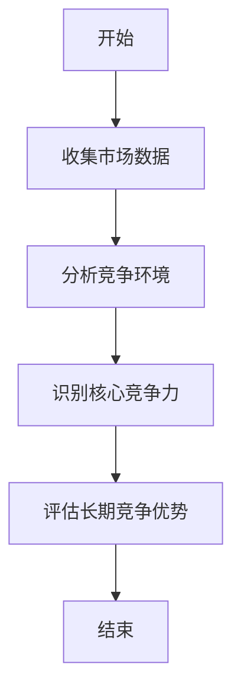
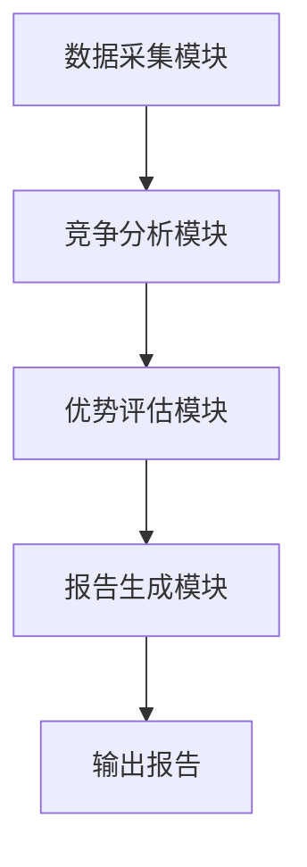
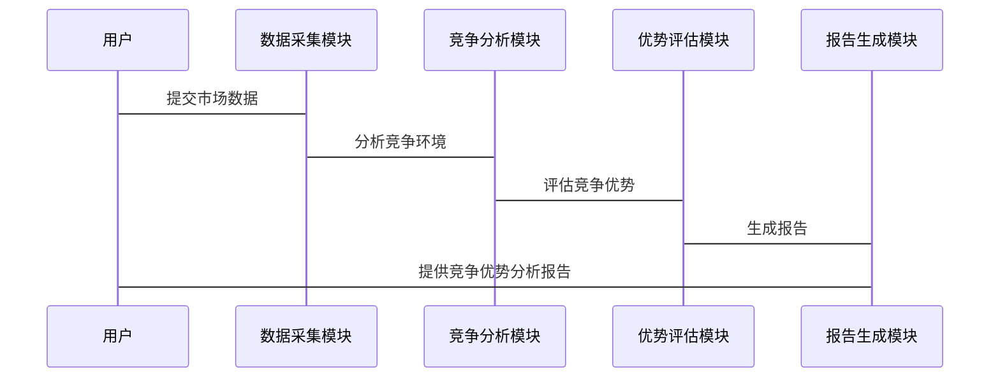

                 


# 如何识别企业的长期竞争优势

> 关键词：企业竞争优势、长期竞争优势、SWOT分析、五力模型、价值链分析、竞争优势识别系统

> 摘要：本文详细探讨了如何识别企业的长期竞争优势，从核心概念、分析模型到系统架构设计，结合实际案例和系统实现，为企业提供一套完整的竞争优势识别方法论。

---

## 第一部分：企业的长期竞争优势概述

### 第1章：企业的长期竞争优势背景

#### 1.1 长期竞争优势的定义与重要性

- **1.1.1 什么是长期竞争优势**  
  长期竞争优势是指企业在较长的时间周期内，在市场上能够持续保持领先地位的核心能力。这种优势通常基于企业的资源、能力、创新能力和市场定位。

- **1.1.2 长期竞争优势对企业的影响**  
  - 提升市场份额  
  - 增强客户忠诚度  
  - 提高抗风险能力  
  - 降低成本，提高效率  

- **1.1.3 识别长期竞争优势的必要性**  
  在竞争激烈的市场环境中，企业需要不断识别和优化自身的竞争优势，以应对市场的变化和挑战。

---

#### 1.2 企业的核心竞争力分析

- **1.2.1 核心竞争力的定义**  
  核心竞争力是企业在市场中能够提供独特价值的能力，通常涉及企业的技术、管理、人才和资源等方面。

- **1.2.2 核心竞争力与竞争优势的关系**  
  核心竞争力是竞争优势的基础，而竞争优势则是核心竞争力的外在表现。

- **1.2.3 核心竞争力的评估方法**  
  - 资源评估法  
  - 能力评估法  
  - 市场反馈法  

---

### 第2章：企业竞争优势的类型与特点

#### 2.1 不同类型企业的竞争优势

- **2.1.1 制造业企业的竞争优势**  
  - 成本优势  
  - 质量优势  
  - 创新能力  

- **2.1.2 服务业企业的竞争优势**  
  - 服务质量  
  - 品牌影响力  
  - 客户关系  

- **2.1.3 高科技企业的竞争优势**  
  - 技术创新  
  - 知识资本  
  - 专利优势  

#### 2.2 企业竞争优势的特点

- **2.2.1 竞争优势的动态性**  
  竞争优势不是一成不变的，会随着市场环境的变化而变化。

- **2.2.2 竞争优势的可持续性**  
  长期竞争优势需要企业在资源、能力和创新方面保持持续投入。

- **2.2.3 竞争优势的可复制性**  
  一些竞争优势可以被竞争对手复制，但核心竞争力往往难以模仿。

---

## 第二部分：竞争优势识别的核心概念与联系

### 第3章：竞争优势识别的核心概念

#### 3.1 核心概念原理

- **3.1.1 市场定位与竞争优势**  
  市场定位是企业确定自身在市场中的位置，从而形成竞争优势的重要步骤。

- **3.1.2 价值链分析与竞争优势**  
  价值链分析帮助企业识别在各个价值创造环节中的优势和劣势。

- **3.1.3 资源与能力分析**  
  企业通过分析自身的资源和能力，确定其在市场中的独特优势。

#### 3.2 核心概念属性特征对比表格

| 比较维度 | 核心竞争力 | 长期竞争优势 |
|----------|------------|--------------|
| 定义     | 核心能力   | 长期市场优势 | 
| 特征     | 不可替代性 | 可持续性     |
| 作用     | 核心价值   | 长期发展     |

#### 3.3 ER实体关系图

```mermaid
er
    企业(企业ID, 企业名称, 行业)
    竞争优势(竞争优势ID, 竞争优势名称, 竞争优势描述)
    市场环境(市场环境ID, 市场环境描述)
    企业-竞争优势(企业ID, 竞争优势ID, 关系描述)
```

---

### 第4章：竞争优势识别的分析模型

#### 4.1 常见分析模型介绍

- **4.1.1 SWOT分析模型**  
  SWOT分析模型通过分析企业的优势（Strengths）、劣势（Weaknesses）、机会（Opportunities）和威胁（Threats），帮助企业识别竞争优势。

- **4.1.2 五力分析模型**  
  五力分析模型（波特五力模型）通过分析行业内竞争者、新进入者、替代品、供应商和买主的力量，帮助企业识别市场竞争中的优势。

- **4.1.3 价值链分析模型**  
  价值链分析模型通过分解企业的价值链，识别各个环节中的竞争优势。

#### 4.2 竞争优势识别的算法原理

- **4.2.1 竞争优势识别算法流程图**



- **4.2.2 竞争优势识别的数学模型**

  竞争优势评分公式：

  $$ \text{竞争优势评分} = \sum_{i=1}^{n} (\text{权重}_i \times \text{评分}_i) $$

  其中，$n$ 是竞争优势的维度数量，$\text{权重}_i$ 是第 $i$ 个维度的权重，$\text{评分}_i$ 是第 $i$ 个维度的评分。

---

## 第三部分：竞争优势识别的系统架构设计

### 第5章：竞争优势识别系统设计

#### 5.1 系统功能设计

- **5.1.1 系统功能模块**

| 模块名称         | 功能描述                                 |
|------------------|----------------------------------------|
| 数据采集模块     | 收集市场、竞争者和企业数据             |
| 竞争分析模块     | 分析竞争环境，识别竞争优势             |
| 优势评估模块     | 评估竞争优势的可持续性和可复制性       |
| 报告生成模块     | 生成竞争优势分析报告                   |

- **5.1.2 系统功能流程图**



#### 5.2 系统架构设计

- **5.2.1 系统架构图**


- **5.2.2 系统接口设计**

| 接口名称         | 接口描述                                 |
|------------------|----------------------------------------|
| 数据接口         | 提供市场数据输入                         |
| 分析接口         | 提供竞争分析结果                         |
| 报告接口         | 提供竞争优势分析报告                     |

#### 5.3 系统交互流程图



---

## 第四部分：竞争优势识别的项目实战

### 第6章：竞争优势识别系统实现

#### 6.1 项目环境安装

- 安装Python和相关库：
  ```bash
  pip install numpy pandas scikit-learn
  ```

- 安装Mermaid和系统架构工具：
  ```bash
  npm install -g mermaidjs
  ```

#### 6.2 竞争优势识别系统核心代码实现

- 数据采集模块：
  ```python
  import pandas as pd

  def collect_data():
      # 数据采集逻辑
      data = pd.DataFrame({
          '市场': ['A', 'B', 'C'],
          '竞争者': ['X', 'Y', 'Z'],
          '竞争优势': ['成本', '质量', '创新']
      })
      return data

  if __name__ == "__main__":
      data = collect_data()
      print(data)
  ```

- 竞争分析模块：
  ```python
  from sklearn.metrics import pairwise_distances

  def analyze_competition(data):
      # 竞争分析逻辑
      distances = pairwise_distances(data)
      return distances

  if __name__ == "__main__":
      data = collect_data()
      result = analyze_competition(data)
      print(result)
  ```

- 优势评估模块：
  ```python
  def assess_advantages(data):
      # 优势评估逻辑
      advantages = {}
      for competitor in data['竞争者']:
          advantages[competitor] = data[data['竞争者'] == competitor]['竞争优势'].tolist()
      return advantages

  if __name__ == "__main__":
      data = collect_data()
      result = assess_advantages(data)
      print(result)
  ```

- 报告生成模块：
  ```python
  def generate_report(data):
      # 报告生成逻辑
      report = "竞争优势分析报告:\n"
      for competitor in data['竞争者']:
          report += f"竞争者 {competitor} 的竞争优势为 {data[data['竞争者'] == competitor]['竞争优势'].tolist()[0]}\n"
      return report

  if __name__ == "__main__":
      data = collect_data()
      result = generate_report(data)
      print(result)
  ```

#### 6.3 竞争优势识别系统实现总结

- 通过代码实现，企业可以自动化地识别和评估竞争优势。
- 系统可以根据实际需求进行扩展和优化，例如增加更多的分析模块或数据源。

---

## 第五部分：竞争优势识别的结论与展望

### 第7章：竞争优势识别的结论

- **7.1 本文总结**  
  本文通过理论分析和系统实现，详细探讨了如何识别企业的长期竞争优势，提供了从理论到实践的完整方法论。

- **7.2 未来展望**  
  随着人工智能和大数据技术的发展，竞争优势识别将更加智能化和精准化。未来的研究可以进一步结合这些技术，提升竞争优势识别的效率和准确性。

---

## 第六部分：竞争优势识别的最佳实践与小结

### 7.1 最佳实践 tips

- 定期评估竞争优势，保持动态调整。
- 结合企业的实际情况，选择合适的分析模型。
- 建立数据驱动的决策机制，提升竞争优势识别的准确性。

### 7.2 小结

- 识别企业的长期竞争优势是一个复杂而系统的过程，需要结合企业的资源、能力和市场环境进行综合分析。
- 通过本文的方法论，企业可以更好地识别和优化其竞争优势，从而在激烈的市场竞争中占据优势地位。

---

## 第七部分：竞争优势识别的注意事项与拓展阅读

### 7.1 注意事项

- 竞争优势识别需要结合企业的实际情况，避免过于依赖单一的分析模型。
- 数据的准确性和完整性是竞争优势识别的基础，需要注意数据的质量控制。

### 7.2 拓展阅读

- 《竞争优势：如何识别和构建企业的核心竞争力》
- 《SWOT分析与企业战略管理》
- 《五力模型在市场竞争中的应用》

---

## 结语

识别企业的长期竞争优势是一个需要长期关注和不断优化的过程。通过本文提供的方法论和系统实现，企业可以更好地识别和优化其竞争优势，从而在市场竞争中保持领先地位。

