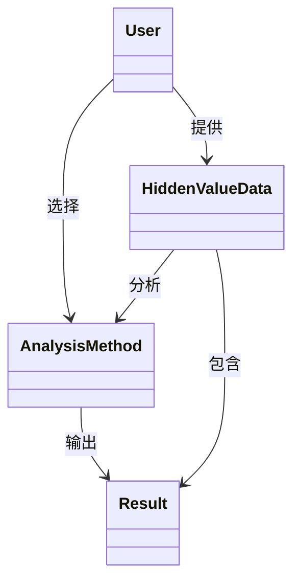
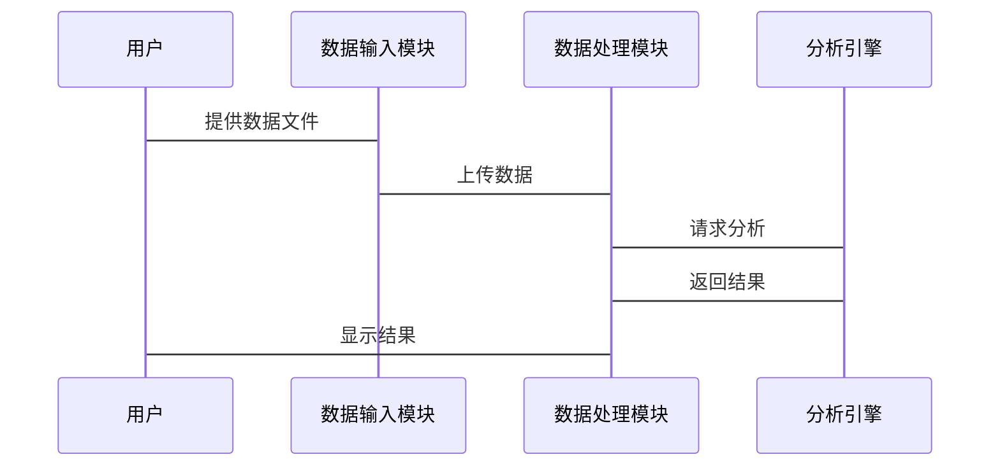

                 


# 如何识别企业的隐藏价值

> 关键词：企业价值识别、数据分析、流程优化、系统架构、项目实战

> 摘要：本文章详细探讨了如何识别企业的隐藏价值，从核心概念到算法原理，从系统设计到项目实战，全面解析隐藏价值的识别方法，结合实际案例分析，为企业提供实用的建议和指导。

---

## 目录大纲

### 第一部分：背景介绍

#### 第1章：企业隐藏价值概述

##### 1.1 隐藏价值的定义与特征

- **1.1.1 隐藏价值的定义**
  - 隐藏价值指的是企业内部未被充分挖掘或利用的资源、机会或优势，通常隐藏在数据、流程或员工能力中。
  - 例如，未被充分利用的员工技能或未被发现的市场机会。

- **1.1.2 隐藏价值的特征**
  - 隐性：不易被发现，通常隐藏在表面现象之后。
  - 可转换性：通过适当的方法可以转化为实际价值。
  - 战略性：能够为企业带来竞争优势。

- **1.1.3 隐藏价值的重要性**
  - 提升企业竞争力。
  - 优化资源配置。
  - 创新驱动增长。

##### 1.2 识别隐藏价值的背景与问题

- **1.2.1 企业为何需要识别隐藏价值**
  - 激烈的市场竞争要求企业不断优化和创新。
  - 隐藏价值往往蕴含着新的业务机会或效率提升的潜力。

- **1.2.2 当前企业在识别隐藏价值方面存在的问题**
  - 数据分散，难以整合。
  - 缺乏有效的分析工具和方法。
  - 内部沟通不畅，导致资源浪费。

- **1.2.3 识别隐藏价值的必要性与紧迫性**
  - 抢占市场先机。
  - 降低成本，提升效率。
  - 提高员工满意度和生产力。

##### 1.3 隐藏价值的识别方法

- **1.3.1 信息收集与初步分析**
  - 通过调查、访谈等方式收集内部数据。
  - 初步分析数据，识别潜在的隐藏价值点。

- **1.3.2 数据分析与挖掘**
  - 使用数据分析技术，从数据中提取隐藏信息。
  - 通过数据可视化工具，直观展示隐藏价值。

- **1.3.3 内部流程优化与重组**
  - 分析现有流程，发现瓶颈和浪费。
  - 通过流程优化，释放隐藏价值。

---

### 第二部分：核心概念与联系

#### 第2章：隐藏价值识别的核心概念

##### 2.1 隐藏价值识别的基本原理

- **2.1.1 隐藏价值识别的理论基础**
  - 基于数据挖掘和知识发现的方法，从数据中提取有价值的信息。
  - 结合企业战略目标，将隐藏价值转化为实际效益。

- **2.1.2 隐藏价值识别的关键要素**
  - 数据质量：数据的准确性和完整性直接影响识别结果。
  - 分析方法：选择合适的算法和技术是关键。
  - 业务理解：深入理解业务需求，确保识别的隐藏价值具有实际意义。

##### 2.2 核心概念的属性特征对比

- **2.2.1 对比表格展示**

| 特征     | 隐藏价值 | 显性价值 |
|----------|----------|----------|
| 可见性   | 隐性      | 显性      |
| 发现难度 | 高        | 低        |
| 战略价值 | 高        | 中        |

- **2.2.2 表格解释与分析**
  - 隐藏价值的发现需要更多的时间和资源，但一旦识别成功，往往能带来更大的战略价值。

##### 2.3 ER实体关系图

- **2.3.1 实体关系图展示**

```mermaid
er
  actor: 用户
  hidden_value: 隐藏价值
  data: 数据
  analysis_method: 分析方法
  result: 结果

  actor --> data: 提供
  actor --> analysis_method: 应用
  data --> analysis_method: 分析
  analysis_method --> result: 输出
  data --> hidden_value: 包含
  result --> hidden_value: 显示
```

- **2.3.2 图的解释与分析**
  - 用户通过提供数据和选择分析方法，系统进行分析，最终输出隐藏价值的结果。

---

### 第三部分：算法原理讲解

#### 第3章：隐藏价值识别的算法原理

##### 3.1 数据预处理与清洗

- **3.1.1 数据清洗的必要性**
  - 数据清洗是数据分析的第一步，确保数据的准确性和一致性。
  - 清洗步骤包括删除重复数据、处理缺失值、标准化数据等。

- **3.1.2 数据清洗的步骤与方法**
  - **删除重复数据**：使用去重方法，确保数据唯一性。
  - **处理缺失值**：根据业务需求，选择填补、删除或标记缺失值。
  - **标准化数据**：将数据转换为统一的格式，便于后续分析。

##### 3.2 特征提取与选择

- **3.2.1 特征提取的基本原理**
  - 从数据中提取有意义的特征，降低维度，提升模型性能。
  - 常用的特征提取方法包括主成分分析（PCA）和线性判别分析（LDA）。

- **3.2.2 特征选择的常用方法**
  - **过滤法**：基于统计指标，选择相关性高的特征。
  - **包裹法**：通过训练模型，评估特征的重要性。
  - **嵌入法**：在模型训练过程中自动提取特征。

##### 3.3 预测模型构建

- **3.3.1 预测模型的数学模型和公式**
  - **线性回归**：用于预测数值型的隐藏价值。
    $$ y = \beta_0 + \beta_1 x_1 + \beta_2 x_2 + \dots + \beta_n x_n + \epsilon $$
  - **决策树**：用于分类或回归，通过树状结构进行预测。
    $$ \text{决策树模型} $$

- **3.3.2 使用Python实现预测模型**

```python
import pandas as pd
from sklearn.tree import DecisionTreeClassifier
from sklearn.model_selection import train_test_split
from sklearn.metrics import accuracy_score

# 加载数据
data = pd.read_csv('hidden_value_data.csv')

# 分割特征与目标变量
X = data.drop('target', axis=1)
y = data['target']

# 分割训练集和测试集
X_train, X_test, y_train, y_test = train_test_split(X, y, test_size=0.2, random_state=42)

# 初始化决策树模型
model = DecisionTreeClassifier()

# 训练模型
model.fit(X_train, y_train)

# 预测
y_pred = model.predict(X_test)

# 评估准确率
print('准确率:', accuracy_score(y_test, y_pred))
```

- **3.3.3 代码应用解读与分析**
  - 数据加载：使用pandas读取CSV文件。
  - 数据分割：将数据分为训练集和测试集。
  - 模型训练：使用决策树模型进行训练。
  - 模型预测：对测试集进行预测，并评估准确率。

---

### 第四部分：系统分析与架构设计方案

#### 第4章：隐藏价值识别系统的架构设计

##### 4.1 系统功能设计

- **4.1.1 领域模型mermaid类图**



- **4.1.2 系统架构设计mermaid架构图**


- **4.1.3 系统接口设计**
  - 数据输入接口：接收数据文件。
  - 分析接口：调用分析方法，执行数据处理。
  - 结果输出接口：展示分析结果。

- **4.1.4 系统交互mermaid序列图**



---

### 第五部分：项目实战

#### 第5章：隐藏价值识别的实战应用

##### 5.1 环境安装与配置

- **5.1.1 环境需求**
  - 安装Python 3.6及以上版本。
  - 安装必要的库：pandas、scikit-learn、mermaid、matplotlib。

- **5.1.2 安装步骤**
  ```bash
  pip install pandas scikit-learn mermaid matplotlib
  ```

##### 5.2 系统核心实现源代码

- **5.2.1 数据加载与预处理代码**

```python
import pandas as pd
import numpy as np

# 加载数据
data = pd.read_csv('hidden_value_data.csv')

# 删除重复数据
data = data.drop_duplicates()

# 处理缺失值
data = data.dropna()

# 标准化数据
data = (data - data.mean()) / data.std()
```

- **5.2.2 分析方法实现代码**

```python
from sklearn.ensemble import RandomForestClassifier
from sklearn.metrics import classification_report

# 初始化模型
model = RandomForestClassifier(n_estimators=100, random_state=42)

# 训练模型
model.fit(X_train, y_train)

# 预测
y_pred = model.predict(X_test)

# 生成报告
print(classification_report(y_test, y_pred))
```

- **5.2.3 代码应用解读与分析**
  - 数据预处理：确保数据质量，为后续分析做好准备。
  - 模型训练：使用随机森林算法，提升分类准确率。
  - 结果分析：通过分类报告，评估模型性能。

##### 5.3 实际案例分析

- **5.3.1 案例背景**
  - 某制造企业，希望通过分析生产数据，识别隐藏的生产效率提升机会。

- **5.3.2 数据分析与处理**
  - 加载生产数据，识别关键指标的异常值。
  - 使用时间序列分析，预测未来生产情况。

- **5.3.3 分析结果与应用**
  - 识别出设备维护时间过长的问题。
  - 提出优化建议，提升设备利用率。

##### 5.4 项目小结

- **5.4.1 项目总结**
  - 成功识别了企业的隐藏价值，提升了生产效率。
  - 项目过程中，数据预处理和模型选择是关键步骤。

- **5.4.2 经验与教训**
  - 数据质量直接影响分析结果，必须重视数据清洗。
  - 业务理解是项目成功的重要因素，需深入与业务部门沟通。

---

### 第六部分：最佳实践 tips、小结、注意事项、拓展阅读

#### 第6章：最佳实践与小结

##### 6.1 tips

- **数据驱动决策**：依赖数据而非直觉，确保分析结果的客观性。
- **持续优化**：定期重新评估和优化分析模型，适应业务变化。
- **团队协作**：数据分析团队与业务团队紧密合作，确保分析结果的实用性和可操作性。

##### 6.2 小结

- 本文章详细探讨了如何识别企业的隐藏价值，从理论到实践，提供了全面的指导。
- 通过实际案例分析，展示了隐藏价值识别的实用性和重要性。

##### 6.3 注意事项

- 数据隐私与安全：确保数据分析过程中遵守相关法律法规，保护数据隐私。
- 选择合适的工具和方法：根据具体需求，选择适合的分析工具和方法。
- 沟通与反馈：及时与业务部门沟通，确保分析结果的有效应用。

##### 6.4 拓展阅读

- 推荐阅读《数据分析实战》、《机器学习实战》等书籍，深入学习数据分析和机器学习技术。
- 关注行业动态，了解最新的数据分析工具和方法。

---

通过以上详细的目录和内容设计，希望为企业提供一套系统、实用的隐藏价值识别方法，帮助企业发现潜在的机会，提升竞争力。

