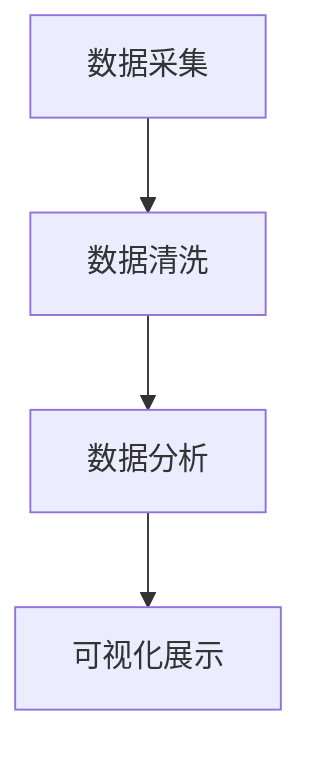
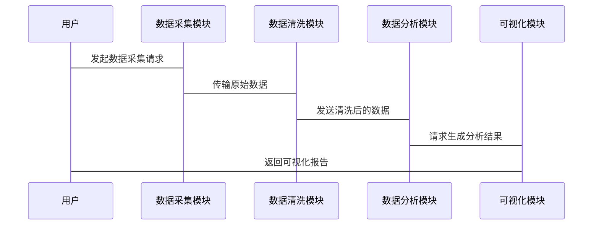

                 


# 如何识别企业的隐藏资产

## 关键词
- 企业资产管理
- 隐藏资产
- 数据分析
- 系统架构
- 项目实战

## 摘要
在数字化时代，企业隐藏资产的识别变得越来越重要。隐藏资产是指那些未被传统财务报表或管理系统记录但为企业创造价值的资源。本文将通过系统化的分析方法，结合实际案例，详细讲解如何识别和评估企业隐藏资产，为企业提升价值和竞争力提供实用指导。

---

# 第5章: 系统分析与架构设计方案

## 5.1 项目背景与目标

### 5.1.1 项目背景
某制造企业在日常运营中发现部分设备和工艺参数的优化潜力未被充分挖掘，这些优化点可能转化为隐藏资产。然而，由于数据分散、分析手段不足，企业难以系统性地识别和评估这些潜在价值。

### 5.1.2 项目目标
- **目标1**: 通过数据分析和系统集成，识别设备运行中的隐藏资产。
- **目标2**: 建立一个实时监控和分析系统，评估这些隐藏资产的价值。
- **目标3**: 为后续优化和投资决策提供数据支持。

## 5.2 系统功能设计

### 5.2.1 系统功能模块
- 数据采集模块：实时采集设备运行数据，包括生产效率、能耗、故障率等。
- 数据分析模块：对采集的数据进行清洗、建模和分析，识别隐藏资产。
- 可视化模块：将分析结果以图表形式展示，便于管理层决策。

### 5.2.2 系统功能流程图（Mermaid）



## 5.3 系统架构设计

### 5.3.1 系统架构图（Mermaid）

```mermaid
rectangle 数据源 {
    数据采集模块
    数据清洗模块
}
rectangle 数据分析模块 {
    数据建模
    数据挖掘
}
rectangle 可视化模块 {
    图表展示
    报告生成
}
数据源 --> 数据分析模块
数据分析模块 --> 可视化模块
```

## 5.4 系统接口设计

### 5.4.1 数据接口
- 数据源接口：与生产设备的传感器连接，获取实时数据。
- 数据存储接口：将清洗后的数据存储到数据库中，供后续分析使用。

### 5.4.2 用户接口
- 管理界面：供管理员进行数据查看和系统配置。
- 分析界面：供数据分析师进行深度分析和模型训练。

## 5.5 系统交互设计

### 5.5.1 交互流程图（Mermaid）



---

# 第6章: 项目实战

## 6.1 环境配置与数据准备

### 6.1.1 环境配置
- **操作系统**: Linux（推荐 CentOS 7+）
- **编程语言**: Python 3.8+
- **工具安装**: 安装 Pandas、NumPy、Scikit-learn、Matplotlib 等库。
  ```bash
  pip install pandas numpy scikit-learn matplotlib
  ```

### 6.1.2 数据准备
- 数据来源：生产设备的运行数据，包括时间戳、设备ID、生产量、能耗等。
- 数据格式：CSV 文件，每行代表一个时间点的数据。

## 6.2 核心代码实现

### 6.2.1 数据清洗与预处理

```python
import pandas as pd
import numpy as np

# 读取数据
data = pd.read_csv('production_data.csv')

# 删除缺失值
data = data.dropna()

# 去除异常值（基于标准差）
mean = data['energy_consumption'].mean()
std = data['energy_consumption'].std()
threshold = mean + 3 * std
data = data[data['energy_consumption'] < threshold]
```

### 6.2.2 数据分析与建模

```python
from sklearn.ensemble import RandomForestRegressor
from sklearn.metrics import mean_absolute_error

# 特征选择
features = ['timestamp', 'device_id', 'production']
target = 'energy_consumption'

# 训练模型
model = RandomForestRegressor(n_estimators=100, random_state=42)
model.fit(data[features], data[target])

# 预测与评估
predictions = model.predict(data[features])
mae = mean_absolute_error(data[target], predictions)
print(f'Mean Absolute Error: {mae}')
```

### 6.2.3 可视化与报告生成

```python
import matplotlib.pyplot as plt

plt.figure(figsize=(10,6))
plt.plot(data['timestamp'], data['energy_consumption'], label='实际能耗')
plt.plot(data['timestamp'], predictions, label='预测能耗')
plt.xlabel('时间')
plt.ylabel('能耗')
plt.legend()
plt.show()
```

## 6.3 案例分析与结果解读

### 6.3.1 分析结果
通过模型分析，发现某些设备在特定时间段内能耗显著高于预期，这可能意味着设备运行效率低下，存在优化空间。

### 6.3.2 优化建议
- 对低效设备进行维护和升级，降低能耗。
- 调整生产排程，避免设备在高能耗时段运行。

## 6.4 项目小结
通过项目实战，我们成功识别了设备运行中的隐藏资产，并通过数据分析和建模找到了优化点，为企业创造了额外价值。

---

# 第7章: 总结与展望

## 7.1 总结
通过本文的系统分析和项目实战，我们展示了如何识别和评估企业隐藏资产。从数据采集到建模分析，再到可视化呈现，每一步都至关重要。隐藏资产的识别不仅提升了企业的资产价值，还为企业优化运营提供了数据支持。

## 7.2 展望
未来，随着人工智能和大数据技术的不断发展，隐藏资产的识别将更加精准和高效。企业可以利用更先进的算法和工具，进一步挖掘潜在价值，提升竞争力。

---

# 第8章: 注意事项

## 8.1 数据质量
- 确保数据的完整性和准确性，避免因数据问题导致分析结果偏差。

## 8.2 模型选择
- 根据具体场景选择合适的算法，避免盲目使用复杂模型。

## 8.3 安全与隐私
- 在处理企业数据时，必须遵守相关法律法规，确保数据安全和隐私保护。

---

# 第9章: 拓展阅读

## 9.1 推荐书籍
- 《数据挖掘导论》（Introduction to Data Mining）
- 《机器学习实战》（Hands-On Machine Learning with Scikit-Learn, Keras, and TensorFlow）

## 9.2 在线资源
- [Towards Data Science](https://towardsdatascience.com/)
- [Kaggle](https://www.kaggle.com/)

---

通过本文的系统化分析和实际案例，我们希望读者能够掌握如何识别和评估企业隐藏资产，为企业创造更大的价值。

