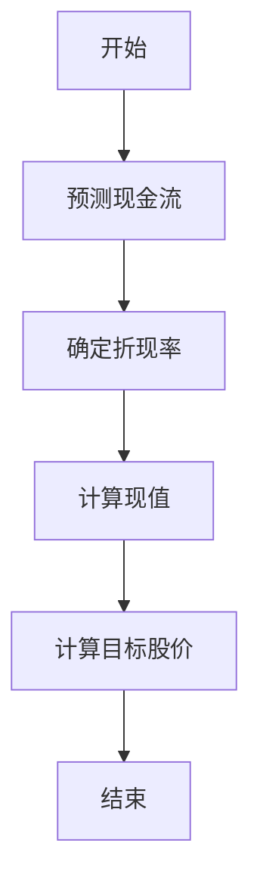
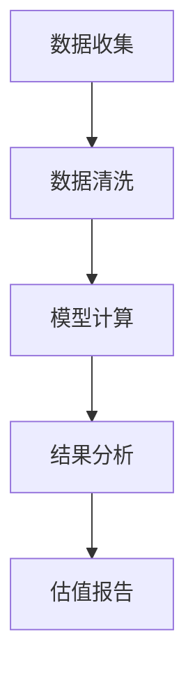

                 


# 如何识别被低估的优质企业

> **关键词**：企业估值、低估企业、DCF模型、投资分析、财务指标

> **摘要**：本文详细介绍了如何识别被低估的优质企业，从企业估值的基本概念到具体实战案例，结合数学公式、流程图和代码示例，系统地分析了识别被低估企业的关键步骤和方法。

---

## 第1章：企业估值的基本概念

### 1.1 什么是企业估值
企业估值是通过对企业财务数据、市场地位、行业前景等多方面因素的分析，确定企业价值的过程。其核心目标是发现那些市场价格低于实际价值的企业，从而为投资者提供潜在的投资机会。

#### 1.1.1 企业估值的定义
企业估值是通过对企业的资产、盈利能力、成长潜力等多方面的分析，使用特定的模型和方法，估算出企业在市场上的合理价值。企业价值通常包括企业股权的价值，也可能包括债权的价值。

#### 1.1.2 企业估值的意义
- **发现投资机会**：通过估值，投资者可以找到市场价格低于内在价值的企业，从而获得超额收益。
- **评估企业表现**：帮助企业管理层了解企业的真实价值，优化经营策略。
- **辅助决策**：为企业并购、融资等重大决策提供参考依据。

#### 1.1.3 企业估值的核心要素
- **财务数据**：收入、利润、现金流等。
- **行业地位**：市场占有率、竞争格局。
- **成长潜力**：未来盈利能力的增长预期。
- **风险因素**：行业风险、财务风险等。

### 1.2 为什么企业会被低估
企业被低估的原因多种多样，主要包括市场认知偏差、行业周期性影响和信息不对称问题。

#### 1.2.1 市场认知偏差
投资者的非理性行为可能导致对企业价值的误判，例如市场恐慌时的抛售行为。

#### 1.2.2 行业周期性影响
行业周期波动可能导致企业在特定周期内被低估。

#### 1.2.3 信息不对称问题
信息的不透明可能导致市场无法准确评估企业的实际价值。

---

## 第2章：企业估值的关键指标

### 2.1 常见企业估值指标
以下是几种常用的估值指标：

#### 2.1.1 市盈率（P/E）
市盈率 = 股价 / 每股净利润

- **优点**：简单易用，适用于净利润稳定的公司。
- **缺点**：无法反映公司的资产价值，且受行业周期影响较大。

#### 2.1.2 市净率（P/B）
市净率 = 股价 / 每股净资产

- **优点**：适用于净资产驱动型的公司，如银行、房地产。
- **缺点**：对高负债公司可能不适用。

#### 2.1.3 市销率（P/S）
市销率 = 股价 / 每股收入

- **优点**：适用于收入稳定但利润较低的公司。
- **缺点**：对高成本行业可能不适用。

### 2.2 指标对比与选择
下表对比了三种估值指标的优缺点：

| 指标 | 优点 | 缺点 |
|------|------|------|
| P/E | 简单，适合净利润稳定的公司 | 受行业周期影响大，无法反映资产价值 |
| P/B | 适合净资产驱动型公司 | 不能反映盈利能力，高负债公司不适用 |
| P/S | 适合收入稳定公司 | 无法反映利润，高成本行业不适用 |

---

## 第3章：企业估值模型

### 3.1 现金流折现模型（DCF）
现金流折现模型是企业估值中最常用的方法之一。

#### 3.1.1 DCF模型的原理
DCF模型通过预测企业未来现金流，并将其折现为现值，以确定企业价值。

#### 3.1.2 DCF模型的计算步骤
1. 预测企业未来现金流。
2. 确定合适的折现率。
3. 将未来现金流折现，计算现值。
4. 计算目标股价。

#### 3.1.3 DCF模型的优缺点
- **优点**：考虑了时间价值，适合长期价值评估。
- **缺点**：现金流预测难度大，折现率选择主观。

#### 3.1.4 DCF模型的流程图



#### 3.1.5 DCF模型的数学公式
$$企业价值 = \sum_{t=1}^{n} \frac{CF_t}{(1 + r)^t}$$

其中，$CF_t$ 为第 t 年的现金流，$r$ 为折现率。

### 3.2 企业价值公式
企业价值公式是将企业各部分价值相加，减去现金，加上金融负债后的结果。

#### 3.2.1 企业价值公式推导
$$企业价值 = 股东权益 + 现金 + 其他资产 - 金融负债$$

#### 3.2.2 企业价值公式应用
假设某公司股东权益为100万元，现金为20万元，其他资产为30万元，金融负债为50万元，则企业价值为：
$$企业价值 = 100 + 20 + 30 - 50 = 100万元$$

---

## 第4章：企业估值系统的构建

### 4.1 系统功能设计
企业估值系统需要具备以下功能：

#### 4.1.1 数据收集模块
- 数据来源：公开财务报表、行业报告等。
- 数据清洗：去除无效数据，处理异常值。

#### 4.1.2 模型计算模块
- 选择合适的估值模型（如DCF模型）。
- 输入参数，计算企业价值。

#### 4.1.3 结果分析模块
- 对比市场价格与估算价值。
- 输出估值报告。

### 4.2 系统架构设计
下图展示了企业估值系统的架构：



---

## 第5章：识别被低估企业的具体步骤

### 5.1 确定目标行业
选择具有增长潜力的行业，如科技、医疗等。

### 5.2 数据收集与处理
- 收集目标企业的财务数据。
- 清洗数据，确保数据准确性。

### 5.3 应用估值模型
- 选择合适的模型（如DCF模型）。
- 输入参数，计算企业价值。

### 5.4 对比分析
- 对比市场价格与估算价值。
- 确认是否存在低估。

---

## 第6章：总结与注意事项

### 6.1 识别被低估企业的关键点
- 准确的数据收集与处理。
- 合适的估值模型选择。
- 合理的参数假设。

### 6.2 投资中的注意事项
- 风险控制：分散投资，避免过度集中。
- 长期视角：关注企业的长期价值。
- 持续学习：关注行业动态，更新估值方法。

### 6.3 拓展阅读推荐
- 《价值投资入门》：介绍价值投资的基本理念。
- 《投资之道》：分享投资大师的实践经验。
- 《财务报表分析》：深入解析企业财务数据。

---

## 附录：代码实现

### 6.4.1 DCF模型的Python代码

```python
import numpy as np

def discounted_cash_flow(free_cash_flow, discount_rate, growth_rate, perpetuity):
    terminal_value = free_cash_flow[-1] * (1 + growth_rate) / (discount_rate - growth_rate)
    horizon_value = terminal_value / (1 + discount_rate)**len(free_cash_flow)
    total_value = horizon_value + sum(free_cash_flow[i] / (1 + discount_rate)**(i+1) for i in range(len(free_cash_flow)))
    return total_value

# 示例数据
free_cash_flow = [100, 120, 140]
discount_rate = 0.1
growth_rate = 0.05
print(discounted_cash_flow(free_cash_flow, discount_rate, growth_rate, True))
```

### 6.4.2 企业价值公式应用

```python
def calculate_enterprise_value(equity, cash, other_assets, debt):
    enterprise_value = equity + cash + other_assets - debt
    return enterprise_value

# 示例数据
equity = 100
cash = 20
other_assets = 30
debt = 50
print(calculate_enterprise_value(equity, cash, other_assets, debt))
```

---

通过以上步骤，您可以系统地识别出被低估的优质企业，并在投资中获得超额收益。

