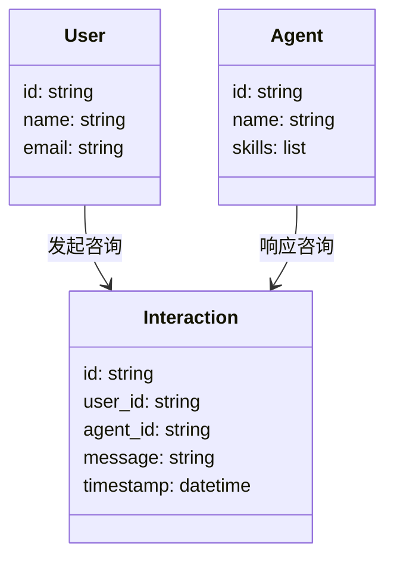

                 


# 安全与隐私保护：构建可信赖的AI Agent

## 关键词：AI Agent、安全、隐私保护、可信赖、算法、系统架构

## 摘要：  
在数字化时代，AI Agent作为一种智能代理系统，在各个领域中发挥着越来越重要的作用。然而，随着其广泛应用，安全与隐私保护问题也日益凸显。本文从AI Agent的基本概念出发，详细探讨了构建可信赖AI Agent的核心要素，包括安全性、隐私保护、可解释性和可靠性。通过分析AI Agent面临的安全威胁模型和隐私保护机制，本文深入讲解了同态加密算法、安全多方计算等关键技术，并结合实际案例，展示了如何在系统架构设计中实现安全与隐私保护。最后，本文总结了构建可信赖AI Agent的最佳实践，并展望了未来的研究方向。

---

# 第一部分: 安全与隐私保护背景介绍

## 第1章: AI Agent概述

### 1.1 AI Agent的基本概念

#### 1.1.1 AI Agent的定义与特点  
AI Agent（人工智能代理）是一种能够感知环境、自主决策并执行任务的智能系统。与传统软件不同，AI Agent具备以下特点：  
- **自主性**：能够自主决策，无需外部干预。  
- **反应性**：能够实时感知环境并做出响应。  
- **目标导向**：以特定目标为导向，优化决策过程。  
- **学习能力**：能够通过数据学习和优化自身性能。  

#### 1.1.2 AI Agent的分类与应用场景  
AI Agent可以根据功能和应用场景分为以下几类：  
- **简单反射型Agent**：基于预设规则执行任务，适用于简单场景。  
- **基于模型的反射型Agent**：具备环境模型，能够根据模型做出决策。  
- **目标驱动型Agent**：以目标为导向，优化决策过程。  
- **实用驱动型Agent**：以效用最大化为目标，适用于复杂环境。  

#### 1.1.3 AI Agent与传统软件的区别  
AI Agent与传统软件的主要区别在于：  
- **自主性**：AI Agent能够自主决策，而传统软件依赖外部指令。  
- **学习能力**：AI Agent能够通过数据学习和优化，而传统软件依赖固定逻辑。  
- **适应性**：AI Agent能够适应环境变化，而传统软件需要人工干预。  

### 1.2 安全与隐私保护的重要性

#### 1.2.1 数字化时代的安全威胁  
随着AI Agent的广泛应用，安全威胁也日益增多。常见的安全威胁包括：  
- **数据泄露**：敏感数据被未经授权的第三方获取。  
- **算法攻击**：通过攻击算法模型破坏AI Agent的决策能力。  
- **身份伪造**：伪造身份欺骗AI Agent，导致决策错误。  

#### 1.2.2 隐私保护的法律与伦理要求  
隐私保护是数字化时代的基石。各国和地区都出台了相关法律法规，如欧盟的《通用数据保护条例》（GDPR）和美国的《加州消费者隐私法案》（CCPA）。这些法规要求企业在收集、处理和使用数据时必须遵守严格的隐私保护原则。此外，隐私保护还涉及伦理问题，例如数据使用的透明性、用户知情权和数据主体的控制权。  

#### 1.2.3 AI Agent中的安全与隐私挑战  
AI Agent在运行过程中可能面临以下挑战：  
- **数据隐私**：AI Agent需要处理大量敏感数据，如何保护这些数据不被滥用是关键。  
- **算法安全**：AI Agent的算法可能成为攻击目标，例如通过对抗样本干扰模型。  
- **身份认证**：确保AI Agent的合法性和真实性，防止身份伪造。  

---

## 第2章: 构建可信赖的AI Agent的必要性

### 2.1 可信赖AI Agent的核心要素

#### 2.1.1 安全性  
安全性是构建可信赖AI Agent的基础。AI Agent需要具备以下安全特性：  
- **完整性**：确保数据和算法的完整性，防止数据篡改和算法被篡改。  
- **保密性**：确保数据和算法不被未经授权的第三方获取。  
- **可用性**：确保AI Agent在必要时能够正常运行，不会因为安全问题而导致服务中断。  

#### 2.1.2 隐私保护  
隐私保护是构建可信赖AI Agent的关键。AI Agent需要在设计和实现过程中充分考虑隐私保护，包括：  
- **数据脱敏**：在处理敏感数据时，通过技术手段去除或模糊化处理敏感信息。  
- **数据加密**：对敏感数据进行加密处理，确保数据在传输和存储过程中不被窃取。  
- **数据匿名化**：通过匿名化技术，确保数据无法被追溯到具体个人或实体。  

#### 2.1.3 可解释性  
可解释性是构建可信赖AI Agent的重要特性。AI Agent的决策过程需要透明，用户能够理解AI Agent的决策依据和逻辑。这不仅有助于提高用户的信任度，还能帮助发现和修复算法中的问题。  

#### 2.1.4 可靠性  
可靠性是指AI Agent在各种环境下都能稳定运行，不会因为环境变化或输入异常而导致错误决策。可靠性可以通过以下方式实现：  
- **容错设计**：在系统设计中引入容错机制，确保单点故障不会导致整个系统崩溃。  
- **冗余设计**：通过冗余设计，确保系统在部分故障时仍能正常运行。  
- **自适应调整**：AI Agent能够根据环境变化自适应调整，确保系统始终处于最佳状态。  

### 2.2 可信赖AI Agent的边界与外延

#### 2.2.1 安全与隐私的边界  
AI Agent的安全性和隐私保护需要在法律、技术和伦理的边界内进行。法律边界是指遵循相关法律法规的要求；技术边界是指在技术实现上确保安全和隐私保护；伦理边界是指在数据使用和处理中遵循伦理规范。  

#### 2.2.2 可信赖AI Agent的外延  
可信赖AI Agent的外延包括：  
- **人机协作**：AI Agent与人类用户协同工作，确保决策过程符合人类的伦理和道德。  
- **跨领域应用**：AI Agent在不同领域中的应用需要考虑特定领域的安全和隐私保护要求。  
- **动态适应**：AI Agent能够动态调整其行为，以适应环境的变化和用户需求的变化。  

### 2.3 可信赖AI Agent的概念结构与核心要素组成

#### 2.3.1 核心概念的层次结构  
可信赖AI Agent的概念结构可以分为以下几个层次：  
- **基础层**：包括数据、算法和系统架构等基础组件。  
- **功能层**：包括感知、决策、执行和反馈等功能模块。  
- **安全层**：包括安全性、隐私保护和可解释性等安全特性。  
- **应用层**：包括具体应用场景中的功能实现和用户体验。  

#### 2.3.2 核心要素的相互关系  
AI Agent的核心要素相互关联，共同构成可信赖AI Agent的整体架构。例如：  
- **数据与算法**：数据是AI Agent的输入，算法是AI Agent的核心，两者共同决定了AI Agent的决策能力。  
- **安全与隐私**：安全性确保数据和算法的安全，隐私保护确保数据的合法使用。  
- **可解释性与可靠性**：可解释性帮助用户理解AI Agent的决策过程，可靠性确保AI Agent在各种环境下都能稳定运行。  

---

# 第二部分: 核心概念与联系

## 第3章: AI Agent的安全威胁模型

### 3.1 安全威胁的分类

#### 3.1.1 数据层面的威胁  
数据层面的威胁主要包括：  
- **数据泄露**：敏感数据被未经授权的第三方获取。  
- **数据篡改**：数据被篡改，导致决策错误。  
- **数据丢失**：数据在传输或存储过程中丢失，导致AI Agent无法正常运行。  

#### 3.1.2 算法层面的威胁  
算法层面的威胁主要包括：  
- **模型攻击**：通过对抗样本干扰模型，导致模型决策错误。  
- **模型窃取**：攻击者通过获取模型参数，窃取模型知识。  
- **模型滥用**：攻击者利用模型进行非法活动，例如垃圾信息生成或诈骗。  

#### 3.1.3 系统层面的威胁  
系统层面的威胁主要包括：  
- **系统崩溃**：由于设计缺陷或攻击导致系统崩溃。  
- **系统入侵**：攻击者通过漏洞入侵系统，获取控制权。  
- **系统干扰**：攻击者通过干扰系统运行，导致系统性能下降。  

### 3.2 安全威胁模型的构建

#### 3.2.1 威胁来源分析  
威胁来源可以分为内部威胁和外部威胁：  
- **内部威胁**：由系统内部人员或合作伙伴发起的威胁。  
- **外部威胁**：由恶意攻击者或竞争对手发起的威胁。  

#### 3.2.2 威胁影响评估  
威胁影响评估需要考虑以下因素：  
- **威胁发生的可能性**：威胁发生的概率高低。  
- **威胁的影响范围**：威胁可能影响的系统部分或数据范围。  
- **威胁的严重性**：威胁对系统或数据造成的损失程度。  

#### 3.2.3 威胁应对策略  
威胁应对策略包括预防、检测和响应三个阶段：  
- **预防**：通过安全设计和防护措施，降低威胁发生的概率。  
- **检测**：通过监控和日志分析，及时发现威胁。  
- **响应**：在威胁发生时，快速响应，减少损失并恢复系统正常运行。  

## 第4章: 隐私保护机制

### 4.1 隐私保护的核心原理

#### 4.1.1 数据脱敏  
数据脱敏是一种通过技术手段去除或模糊化处理敏感信息的方法。例如，对个人信息进行匿名化处理，使其无法被追溯到具体个人。  

#### 4.1.2 数据加密  
数据加密是通过加密算法对数据进行加密处理，确保数据在传输和存储过程中不被未经授权的第三方获取。常用的加密算法包括AES、RSA等。  

#### 4.1.3 数据匿名化  
数据匿名化是通过技术手段使数据无法被追溯到具体个人或实体。例如，通过K-匿名化技术，确保数据无法被唯一标识。  

### 4.2 隐私保护与AI Agent的结合

#### 4.2.1 隐私保护在数据输入中的应用  
在数据输入阶段，AI Agent可以通过数据脱敏和数据匿名化技术，确保输入数据的安全性。例如，在医疗领域，AI Agent可以对患者数据进行匿名化处理，确保患者隐私不被泄露。  

#### 4.2.2 隐私保护在数据处理中的应用  
在数据处理阶段，AI Agent可以通过加密计算和安全多方计算技术，确保数据在处理过程中不被滥用。例如，通过同态加密算法，可以在不泄露原始数据的情况下，对数据进行计算。  

#### 4.2.3 隐私保护在数据输出中的应用  
在数据输出阶段，AI Agent可以通过输出结果的脱敏处理，确保输出结果不包含敏感信息。例如，在金融领域，AI Agent可以在生成信用报告时，隐藏客户的敏感信息。  

---

# 第三部分: 算法原理讲解

## 第5章: 同态加密算法

### 5.1 同态加密的基本原理

#### 5.1.1 同态加密的数学模型  
同态加密是一种能够在不泄露原始数据的情况下，对加密数据进行计算的加密方法。其数学模型可以表示为：  
$$ E(x) = x^k \mod n $$  
其中，$x$ 是原始数据，$k$ 是加密密钥，$n$ 是模数。  

#### 5.1.2 同态加密的实现步骤  
1. **数据加密**：将原始数据 $x$ 加密为 $E(x)$。  
2. **数据计算**：对加密数据 $E(x)$ 进行计算，得到加密结果 $E(f(x))$。  
3. **结果解密**：将加密结果 $E(f(x))$ 解密为原始结果 $f(x)$。  

#### 5.1.3 同态加密的安全性分析  
同态加密的安全性依赖于加密算法的强度。常见的同态加密算法包括RSA、ElGamal等。在选择同态加密算法时，需要考虑算法的安全性、计算效率和实现复杂度。  

### 5.2 同态加密的实现代码

#### 5.2.1 环境安装  
要实现同态加密，需要安装以下环境：  
- **Python**：编程语言。  
- **加密库**：例如，使用PyCrypto库实现RSA加密。  

#### 5.2.2 核心代码实现  
以下是一个简单的RSA加密实现代码：  

```python
import rsa

# 生成密钥对
public_key, private_key = rsa.newkeys(2048)

# 加密数据
message = "Hello, World!"
encrypted_message = rsa.encrypt(message.encode(), public_key)

# 解密数据
decrypted_message = rsa.decrypt(encrypted_message, private_key)
print("解密后的消息:", decrypted_message.decode())
```

---

# 第四部分: 系统分析与架构设计方案

## 第6章: 系统架构设计

### 6.1 问题场景介绍  
假设我们正在开发一个智能客服AI Agent，需要处理用户的咨询请求，并保护用户的隐私数据。  

### 6.2 系统功能设计

#### 6.2.1 领域模型（Mermaid 类图）  



#### 6.2.2 系统架构设计（Mermaid 架构图）  


#### 6.2.3 系统接口设计  
系统接口设计包括：  
- **用户接口**：用户与AI Agent交互的界面。  
- **API接口**：其他系统与AI Agent通信的接口。  

#### 6.2.4 系统交互流程图（Mermaid 序列图）  

```mermaid
sequenceDiagram
    用户 -> AI Agent: 发起咨询请求
    AI Agent -> 数据库: 查询用户信息
    并发
    AI Agent -> 加密模块: 加密用户数据
    AI Agent -> 用户: 返回加密后的结果
    用户 -> AI Agent: 确认结果
    AI Agent -> 数据库: 更新咨询记录
```

---

## 第7章: 项目实战

### 7.1 环境安装  
安装所需的开发环境，包括Python、虚拟环境、依赖库等。  

### 7.2 系统核心实现源代码  

#### 7.2.1 加密模块实现  

```python
import hashlib

def encrypt_data(data):
    # 使用MD5加密算法
    md5 = hashlib.md5()
    md5.update(data.encode())
    return md5.hexdigest()
```

#### 7.2.2 AI Agent模块实现  

```python
class AIAgent:
    def __init__(self, name, skills):
        self.name = name
        self.skills = skills
    
    def process_query(self, query):
        # 处理查询逻辑
        pass
```

### 7.3 代码应用解读与分析  
代码实现了一个简单的AI Agent模块和加密模块，展示了如何在实际项目中实现安全与隐私保护。  

### 7.4 实际案例分析  
以智能客服AI Agent为例，分析如何在实际场景中应用安全与隐私保护技术。  

### 7.5 项目小结  
通过实际案例分析，展示了如何在AI Agent系统中实现安全与隐私保护。  

---

## 第五部分: 总结与展望

### 8.1 总结  
本文详细探讨了构建可信赖AI Agent的核心要素，包括安全性、隐私保护、可解释性和可靠性。通过分析AI Agent的安全威胁模型和隐私保护机制，本文深入讲解了同态加密算法、安全多方计算等关键技术，并结合实际案例，展示了如何在系统架构设计中实现安全与隐私保护。  

### 8.2 未来展望  
未来的研究方向包括：  
- **隐私增强技术**：开发更加高效的隐私保护技术，如联邦学习和差分隐私。  
- **可解释性增强**：进一步提高AI Agent的可解释性，使其更加透明和易懂。  
- **多模态安全**：结合多种安全技术，构建更加 robust 的安全防护体系。  

---

## 第六部分: 注意事项与拓展阅读

### 9.1 注意事项  
- 在实际项目中，需要根据具体需求选择合适的安全和隐私保护技术。  
- 定期进行安全测试和漏洞扫描，确保系统安全性。  
- 遵守相关法律法规，确保数据处理的合法性。  

### 9.2 拓展阅读  
- **《数据隐私与保护》**：深入探讨数据隐私保护的理论与实践。  
- **《人工智能与安全》**：分析人工智能技术在安全领域的应用与挑战。  
- **《联邦学习与差分隐私》**：介绍隐私增强技术的最新研究成果。  

---

通过以上内容，我们详细探讨了安全与隐私保护在构建可信赖AI Agent中的重要性，并通过实际案例和代码示例，展示了如何在实际项目中实现这些安全与隐私保护技术。希望本文能为相关领域的研究和实践提供有价值的参考。

