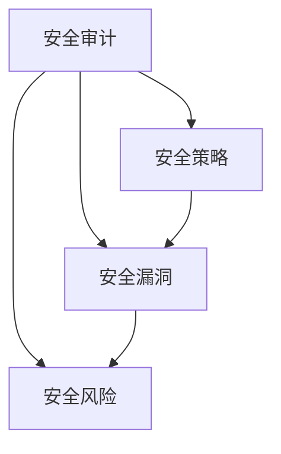
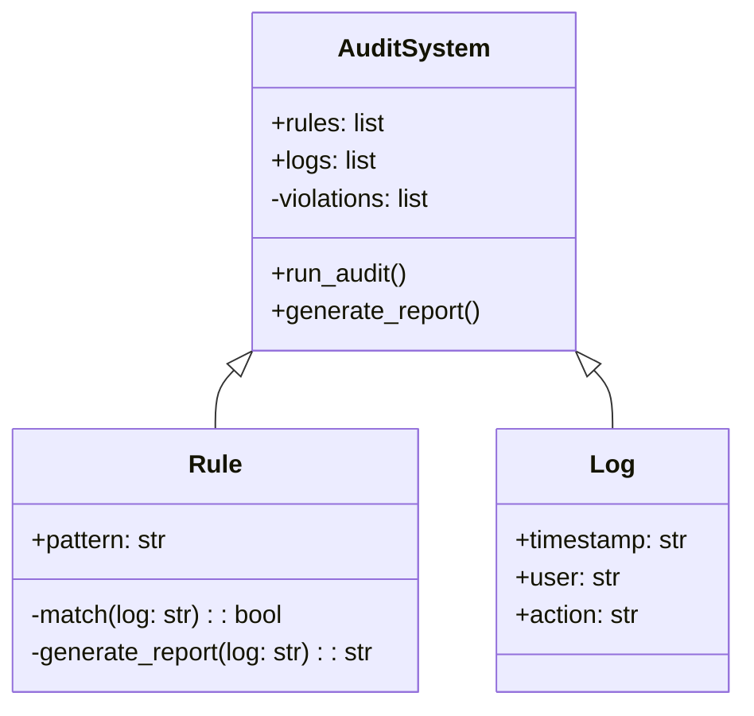

                 


# 安全审计：定期检查AI Agent的安全漏洞

## 关键词
安全审计，AI Agent，漏洞检测，风险评估，算法原理，系统架构，项目实战

## 摘要
本文将详细介绍安全审计在AI Agent中的重要性，从基本概念到具体实施，涵盖安全审计的核心概念、算法原理、系统架构设计、项目实战和最佳实践。通过丰富的案例和详细的代码示例，帮助读者掌握如何定期检查和修复AI Agent的安全漏洞。

---

# 第一部分: 安全审计基础

## 第1章: 安全审计的基本概念

### 1.1 安全审计的定义与作用
安全审计是通过系统化的方法对计算机系统或网络进行检查，以识别潜在的安全漏洞和威胁。其主要作用包括验证安全策略的执行情况、评估安全风险、发现并修复漏洞，以及提供安全事件的证据。

### 1.2 AI Agent的定义与特点
AI Agent是一种能够感知环境并采取行动以实现目标的智能实体。其特点包括自主性、反应性、社会性和社会性，能够适应动态变化的环境。

### 1.3 安全审计与AI Agent的关系
AI Agent的安全审计是确保其行为符合预期，防止恶意攻击和数据泄露的关键。安全审计通过检查AI Agent的行为、数据流和系统配置，识别潜在风险，确保其安全性和合规性。

---

## 第2章: 安全审计的核心概念

### 2.1 安全审计的三要素
安全审计的三要素包括安全策略、安全漏洞和安全风险。以下是三要素的对比表：

| 要素 | 定义 | 作用 |
|------|------|------|
| 安全策略 | 系统的安全规则和标准 | 指导安全审计的实施 |
| 安全漏洞 | 系统中存在的弱点 | 识别潜在攻击点 |
| 安全风险 | 漏洞可能带来的危害 | 评估风险的严重性 |

### 2.2 安全审计的实体关系图
以下是安全审计的实体关系图：



---

## 第3章: 安全审计的算法原理

### 3.1 基于规则的漏洞检测算法
基于规则的漏洞检测算法通过预定义的规则来识别系统中的异常行为。以下是算法的实现步骤：

1. **规则库构建**：定义安全相关的规则，例如异常日志、未授权访问等。
2. **数据采集**：收集系统日志和操作记录。
3. **规则匹配**：将采集的数据与规则库进行匹配，识别异常行为。
4. **结果输出**：输出匹配到的异常行为报告。

以下是基于规则的漏洞检测算法的Python实现示例：

```python
def rule_based_audit(logs, rules):
    violations = []
    for log in logs:
        for rule in rules:
            if rule.match(log):
                violations.append(rule.generate_report(log))
    return violations

# 示例规则
class Rule:
    def __init__(self, pattern):
        self.pattern = pattern

    def match(self, log):
        return self.pattern in log

    def generate_report(self, log):
        return f"Violation detected: {self.pattern} found in {log}"
```

### 3.2 基于机器学习的漏洞预测算法
基于机器学习的漏洞预测算法通过训练模型来预测系统中的潜在漏洞。以下是算法的实现步骤：

1. **数据预处理**：清洗和归一化数据。
2. **特征提取**：提取与安全相关的特征。
3. **模型训练**：使用训练数据训练分类模型。
4. **模型预测**：对新数据进行预测，识别潜在漏洞。

以下是基于机器学习的漏洞预测算法的Python实现示例：

```python
from sklearn import tree

# 数据预处理
X = df.drop('label', axis=1)
y = df['label']

# 模型训练
model = tree.DecisionTreeClassifier()
model.fit(X, y)

# 模型预测
new_data = X.iloc[[-1]]
prediction = model.predict(new_data)
```

### 3.3 风险评估模型
风险评估模型用于量化安全漏洞带来的风险。以下是风险评估模型的公式：

$$ R = V \times I \times A $$

其中，R表示风险值，V表示漏洞的严重性，I表示影响范围，A表示资产价值。

---

## 第4章: 系统架构设计

### 4.1 系统功能设计
以下是系统功能设计的类图：



### 4.2 系统架构设计
以下是系统架构设计的架构图：


### 4.3 系统接口设计
以下是系统接口设计的交互图：

```mermaid
sequenceDiagram
    client -> API Gateway: 发送审计请求
    API Gateway -> Load Balancer: 分发请求
    Load Balancer -> AI Agent: 执行审计
    AI Agent -> Database: 查询规则
    AI Agent -> Monitor: 输出报告
    client <- API Gateway: 返回审计结果
```

---

## 第5章: 项目实战

### 5.1 环境安装
安装必要的软件和库，例如Python、Scikit-learn、Mermaid等。

### 5.2 核心代码实现
以下是AI Agent安全审计的核心代码实现：

```python
import pandas as pd
from sklearn import tree

# 数据预处理
df = pd.read_csv('logs.csv')
X = df.drop('label', axis=1)
y = df['label']

# 模型训练
model = tree.DecisionTreeClassifier()
model.fit(X, y)

# 模型预测
new_data = X.iloc[[-1]]
prediction = model.predict(new_data)

# 生成报告
if prediction[-1] == 1:
    print("检测到漏洞")
else:
    print("未检测到漏洞")
```

### 5.3 代码解读与分析
代码通过机器学习模型对日志数据进行分析，预测系统中的潜在漏洞。模型训练完成后，对新的数据进行预测，输出检测结果。

### 5.4 实际案例分析
以下是一个实际案例分析：

1. **环境介绍**：某公司的AI Agent系统出现异常日志。
2. **数据采集**：收集过去一个月的日志数据。
3. **模型训练**：使用历史数据训练风险评估模型。
4. **模型预测**：识别出一个高风险漏洞。
5. **漏洞修复**：修复漏洞并更新安全策略。

### 5.5 项目小结
通过项目实战，读者可以掌握如何将安全审计算法应用于实际场景，识别和修复AI Agent中的安全漏洞。

---

## 第6章: 最佳实践

### 6.1 小结
定期检查AI Agent的安全漏洞是保障系统安全的关键。通过安全审计，可以及时发现和修复潜在风险，确保系统的安全性和稳定性。

### 6.2 注意事项
- 安全审计应定期进行，频率根据系统的重要性而定。
- 安全策略应根据实际情况动态调整。
- 安全审计结果应及时反馈给相关团队。

### 6.3 拓展阅读
- 《网络安全实战：从入门到精通》
- 《人工智能与安全审计》
- 《机器学习在安全审计中的应用》

---

通过本文的详细讲解，读者可以全面了解AI Agent安全审计的核心概念、算法原理和实际应用。希望本文能为读者在安全审计领域提供有价值的参考和指导。

