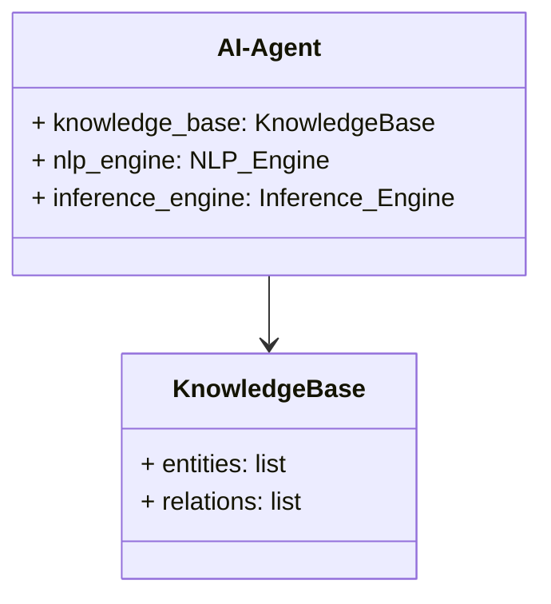
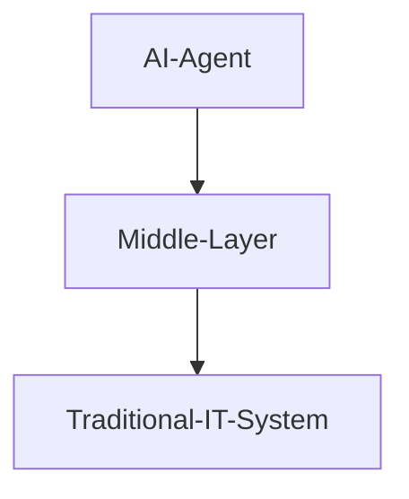
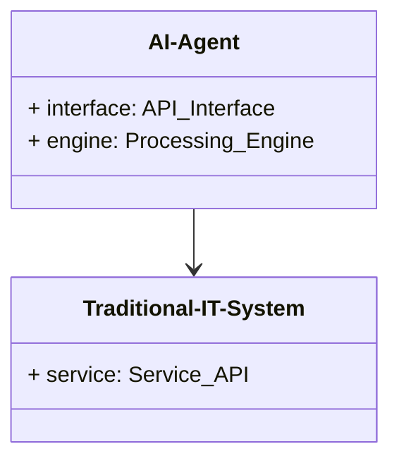
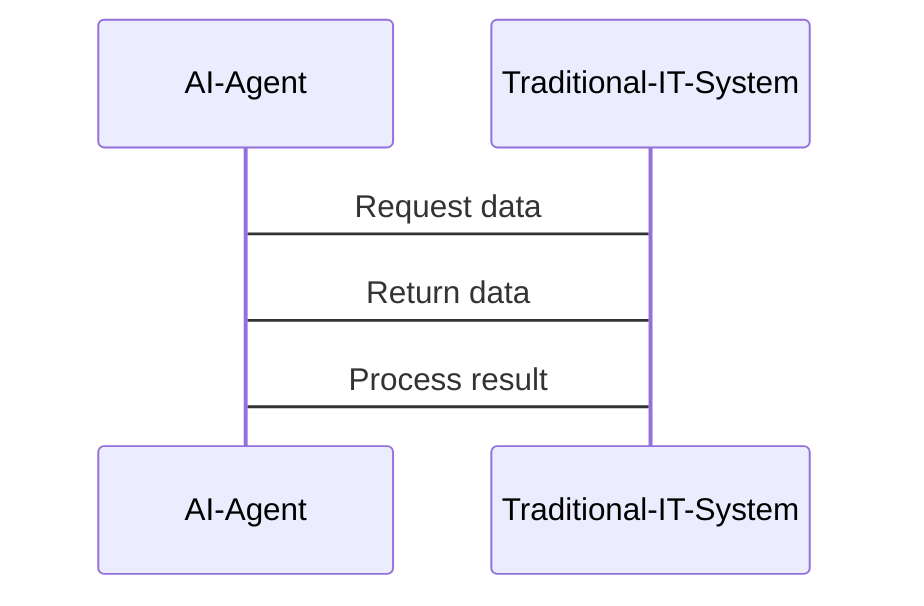

                 


# 实现AI Agent与传统IT系统的无缝集成

## 关键词：AI Agent，传统IT系统，无缝集成，系统架构，项目实战

## 摘要：随着人工智能技术的快速发展，AI Agent（智能代理）逐渐成为提升传统IT系统智能化水平的关键技术。本文将详细探讨AI Agent的核心技术、传统IT系统的结构特点，以及如何实现两者的无缝集成。通过分析系统架构、接口设计、交互流程等关键环节，结合实际案例和代码实现，为读者提供全面的技术指导。

---

## 目录

1. [引言](#引言)
2. [AI Agent的技术基础](#ai-agent的技术基础)
3. [传统IT系统的概述](#传统it系统的概述)
4. [AI Agent与传统IT系统的集成方法](#ai-agent与传统it系统的集成方法)
5. [系统架构设计](#系统架构设计)
6. [项目实战](#项目实战)
7. [安全与伦理问题](#安全与伦理问题)
8. [未来趋势与挑战](#未来趋势与挑战)

---

## 1. 引言

### 1.1 AI Agent的基本概念

AI Agent（人工智能代理）是一种能够感知环境、自主决策并执行任务的智能实体。它可以分为简单反射型、基于模型的反射型、目标驱动型和效用驱动型。AI Agent的核心特征包括自主性、反应性、目标导向和学习能力。

### 1.2 传统IT系统的概述

传统IT系统主要由硬件层、软件层和网络层构成，依赖于固定的程序规则运行。其特点包括确定性、结构化、依赖硬件等。这些特点使其在处理复杂、动态的任务时显得力不从心。

### 1.3 AI Agent与传统IT系统集成的重要性

集成AI Agent可以提升传统IT系统的智能化水平，增强实时数据分析能力，提供更智能的用户交互。例如，在企业管理系统中，AI Agent可以自动处理订单，优化库存管理，显著提高效率。

---

## 2. AI Agent的技术基础

### 2.1 自然语言处理技术

自然语言处理（NLP）使AI Agent能够理解人类语言。常见算法包括分词、实体识别和情感分析。NLP在对话系统中的应用展示其在AI Agent中的重要性。

### 2.2 AI推理引擎

推理引擎通过逻辑推理帮助AI Agent做出决策。常见的推理算法包括基于规则的推理和概率推理。例如，贝叶斯网络用于概率推理，公式如下：

$$P(A|B) = \frac{P(B|A)P(A)}{P(B)}$$

### 2.3 知识表示与知识图谱

知识表示用于存储和管理知识，知识图谱通过图结构表示实体及其关系。Mermaid类图展示AI Agent与知识库的交互：



---

## 3. 传统IT系统的概述

### 3.1 传统IT系统的构成

传统IT系统由硬件层、软件层和网络层构成。硬件层包括服务器和存储设备，软件层包括操作系统和应用程序，网络层负责数据传输。

### 3.2 传统IT系统的局限性

传统IT系统在处理复杂任务时效率低下，缺乏灵活性和智能化。例如，在处理大量数据时，传统系统依赖人工干预，效率低且容易出错。

### 3.3 传统IT系统与AI Agent的结合潜力

通过集成AI Agent，传统IT系统可以实现智能化升级，提升数据分析和决策能力。例如，AI Agent可以实时监控系统日志，自动识别异常情况。

---

## 4. AI Agent与传统IT系统的集成方法

### 4.1 集成策略

AI Agent与传统IT系统的集成可以通过API接口进行数据交互。例如，AI Agent可以调用传统系统提供的API，获取数据并进行处理。

### 4.2 系统设计

系统架构采用中间层设计，AI Agent通过中间层与传统系统交互。Mermaid架构图展示整体结构：



---

## 5. 系统架构设计

### 5.1 领域模型

领域模型展示AI Agent与传统系统之间的交互关系。Mermaid类图如下：



### 5.2 系统架构设计

整体架构采用分层设计，包括AI Agent层、中间层和传统系统层。Mermaid架构图：


### 5.3 接口设计

AI Agent通过API接口与传统系统交互。例如，AI Agent调用传统系统的API获取数据，处理后返回结果。

### 5.4 交互流程

Mermaid序列图展示交互流程：



---

## 6. 项目实战

### 6.1 环境安装

安装Python和必要的库，如TensorFlow和Flask。

### 6.2 核心实现

编写AI Agent的代码，展示接口调用和数据处理。

示例代码：

```python
import requests

class AI-Agent:
    def __init__(self, api_url):
        self.api_url = api_url

    def request_data(self):
        response = requests.get(f"{self.api_url}/data")
        return response.json()

    def process_data(self, data):
        # 数据处理逻辑
        return processed_data
```

### 6.3 案例分析

通过具体案例展示集成过程，分析代码实现，讨论实际应用中的问题和解决方案。

---

## 7. 安全与伦理问题

### 7.1 数据隐私

AI Agent的集成可能涉及敏感数据，需确保数据加密和访问控制。

### 7.2 责任归属

明确AI Agent和传统系统在错误发生时的责任归属，建立清晰的法律框架。

### 7.3 伦理问题

处理过程中需遵守伦理规范，避免偏见和歧视。

---

## 8. 未来趋势与挑战

### 8.1 技术发展

AI Agent在各领域的应用前景广阔，如医疗、金融等。

### 8.2 挑战

包括数据隐私、系统兼容性和性能优化等问题。

---

## 总结

通过本文的详细讲解，读者可以全面了解AI Agent与传统IT系统集成的背景、技术基础、系统架构设计及实际应用。未来，随着技术的进步，AI Agent将发挥更大作用，推动传统IT系统的智能化升级。

