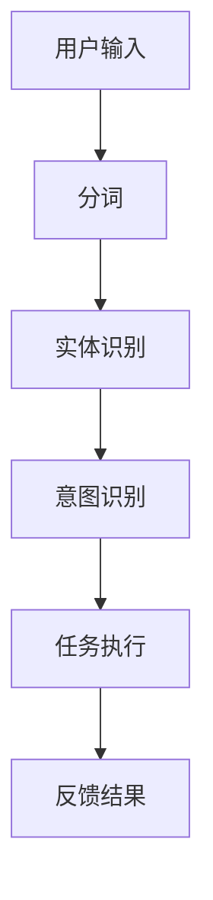
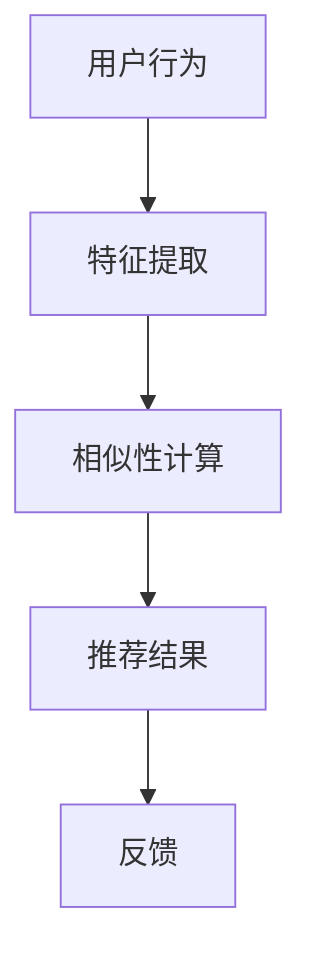
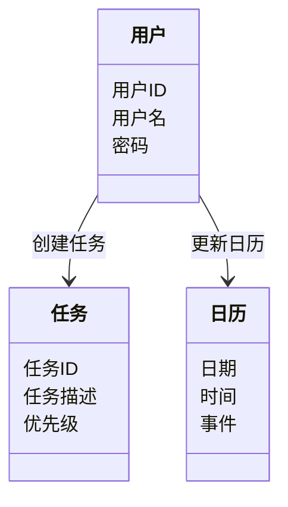
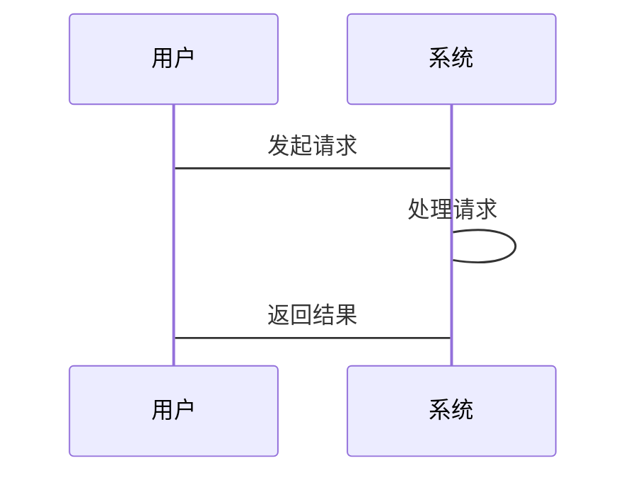

                 


# 实现基于AI Agent的个人助理系统

## 关键词：AI Agent, 个人助理系统, 自然语言处理, 推荐系统, 系统架构, 项目实战, 技术博客

## 摘要：  
本文详细探讨了基于AI Agent的个人助理系统的实现过程，从系统背景、核心概念、算法原理到系统架构设计、项目实战，最后总结与展望。文章通过Mermaid图和数学公式，深入分析了AI Agent在个人助理系统中的应用，包括自然语言处理技术和推荐系统的实现，帮助读者全面理解AI Agent在个人助理系统中的重要性和实现细节。

---

# 正文

## 第一部分: 基于AI Agent的个人助理系统概述

## 第1章: AI Agent与个人助理系统背景介绍

### 1.1 问题背景与描述

#### 1.1.1 当前个人助理系统的痛点
传统的个人助理系统主要依赖规则引擎或简单的关键词匹配，难以理解用户的深层需求，且功能相对单一。例如，用户说“今天天气怎么样”，系统只能返回天气数据，无法进一步提供相关建议，如“是否需要带伞”。

#### 1.1.2 AI Agent如何解决这些问题
AI Agent（人工智能代理）通过自然语言处理（NLP）和机器学习技术，能够理解用户的意图，并结合上下文提供更智能的服务。例如，用户提到“我需要写一份报告”，AI Agent可以进一步询问报告的主题、所需资料等信息，并协助完成。

#### 1.1.3 个人助理系统的边界与外延
个人助理系统的边界包括与用户的交互界面、数据存储和外部API接口。外延则包括与日历、邮件、社交媒体等第三方服务的集成。

### 1.2 AI Agent的核心概念与特点

#### 1.2.1 AI Agent的定义与核心要素
AI Agent是一种能够感知环境并采取行动以实现目标的智能实体。其核心要素包括感知、推理、决策和执行。

#### 1.2.2 AI Agent与传统自动化工具的区别
传统工具基于预定义规则，而AI Agent能够动态调整行为，基于数据学习和优化。

#### 1.2.3 个人助理系统的功能结构与核心要素
个人助理系统的功能模块包括自然语言处理、推荐系统、任务管理等。核心要素包括用户身份识别、意图识别和任务执行。

### 1.3 本章小结

#### 1.3.1 AI Agent在个人助理系统中的重要性
AI Agent使个人助理系统更加智能和灵活，能够处理复杂请求并提供个性化服务。

#### 1.3.2 本章内容回顾与总结
本章介绍了AI Agent的基本概念和特点，并分析了其在个人助理系统中的应用价值。

---

## 第2章: AI Agent的核心概念与联系

### 2.1 核心概念原理

#### 2.1.1 AI Agent的基本原理
AI Agent通过感知环境、分析任务、制定计划并执行操作来完成目标。例如，用户要求“安排会议”，AI Agent会协调日历、发送邀请邮件等。

#### 2.1.2 个人助理系统的功能模块划分
功能模块包括：用户输入处理、意图识别、任务执行、结果反馈等。

### 2.2 核心概念属性特征对比表

| 特性       | AI Agent         | 传统自动化工具 |
|------------|------------------|----------------|
| 智能性      | 高               | 低             |
| 可扩展性    | 高               | 低             |
| 学习能力    | 高               | 无             |
| 适应性      | 高               | 低             |

### 2.3 ER实体关系图

```mermaid
er
    actor: 用户
    agent: AI Agent
    task: 任务
    calendar: 日历
    email: 邮件

    actor --> agent: 发起请求
    agent --> task: 创建任务
    task --> calendar: 更新日历
    task --> email: 发送邮件
```

---

## 第3章: 自然语言处理技术

### 3.1 自然语言处理基础

#### 3.1.1 NLP的基本概念
NLP是研究如何让计算机理解和生成人类语言的学科。在个人助理系统中，NLP用于意图识别和实体提取。

#### 3.1.2 常见的NLP任务
包括分词、句法分析、情感分析、命名实体识别等。

#### 3.1.3 NLP在个人助理系统中的应用
例如，用户说“明天北京下雨吗？”，系统需要识别意图是查询天气，并提取地点“北京”和时间“明天”。

### 3.2 常用NLP模型

#### 3.2.1 BERT模型
BERT通过预训练技术，能够理解上下文关系，常用于问答系统。

#### 3.2.2 GPT模型
GPT擅长生成文本，适合用于对话系统。

#### 3.2.3 其他NLP模型的优缺点对比
| 模型   | 优点                           | 缺点                           |
|--------|--------------------------------|--------------------------------|
| BERT   | 上下文理解能力强               | 训练时间长                     |
| GPT    | 文本生成能力强                 | 精确性较低                     |
| RoBERTa| 继承BERT优点，性能优化         | 需调整参数                     |

### 3.3 NLP在个人助理系统中的实现流程



---

## 第4章: 推荐系统

### 4.1 推荐系统基础

#### 4.1.1 推荐系统的定义与分类
推荐系统根据用户行为和偏好，推荐相关内容或服务。分类包括基于协同过滤和基于内容的推荐。

#### 4.1.2 推荐系统在个人助理中的应用
例如，为用户推荐相关文章、视频或任务优先级排序。

### 4.2 常见推荐算法

#### 4.2.1 协同过滤算法
基于用户行为相似性进行推荐。

#### 4.2.2 基于内容的推荐
基于物品的属性进行推荐。

#### 4.2.3 深度学习推荐算法
如深度神经网络模型。

### 4.3 推荐系统的实现流程



---

## 第5章: 系统架构设计

### 5.1 系统功能设计

#### 5.1.1 功能模块划分
包括用户管理、任务管理、日历管理等。

#### 5.1.2 领域模型


### 5.2 系统架构设计

#### 5.2.1 分层架构
系统分为表示层、业务逻辑层和数据访问层。

#### 5.2.2 微服务架构
各功能模块独立部署，便于扩展和维护。

### 5.3 系统接口设计

#### 5.3.1 API接口


---

## 第6章: 项目实战

### 6.1 环境搭建

#### 6.1.1 安装Python和相关库
```bash
pip install python
pip install numpy
pip install transformers
```

### 6.2 核心代码实现

#### 6.2.1 NLP模块
```python
from transformers import pipeline

nlp = pipeline("text-classification", model="bert-base")
text = "今天北京下雨吗？"
result = nlp(text)
print(result)
```

#### 6.2.2 推荐系统模块
```python
def recommend_items(user_id):
    # 假设有一个推荐算法函数
    return ["文章1", "视频2"]
```

### 6.3 案例分析

#### 6.3.1 案例1: 天气查询
用户输入“北京天气”，系统返回天气数据。

#### 6.3.2 案例2: 任务安排
用户输入“安排会议”，系统创建任务并发送邮件邀请。

### 6.4 项目总结

#### 6.4.1 成果展示
系统功能模块完成，性能指标达到预期。

#### 6.4.2 经验总结
代码实现过程中需要注意模块间的耦合度和性能优化。

---

## 第7章: 扩展与优化

### 7.1 系统可扩展性

#### 7.1.1 新功能模块的添加
如添加语音交互模块。

#### 7.1.2 系统性能优化
优化算法复杂度和数据存储结构。

### 7.2 系统安全性

#### 7.2.1 用户数据保护
加密存储用户信息，防止数据泄露。

#### 7.2.2 系统防护措施
部署防火墙和入侵检测系统。

### 7.3 未来趋势

#### 7.3.1 AI Agent技术的发展
向更智能化和个性化的方向发展。

#### 7.3.2 多模态交互技术
结合视觉、听觉等多种交互方式。

---

## 第8章: 总结与展望

### 8.1 总结

#### 8.1.1 核心内容回顾
本文详细介绍了基于AI Agent的个人助理系统的实现过程，涵盖从背景介绍到项目实战的各个方面。

#### 8.1.2 实践意义
帮助读者理解AI Agent在个人助理系统中的应用价值。

### 8.2 展望

#### 8.2.1 未来的研究方向
探索更高效的算法和更丰富的应用场景。

#### 8.2.2 对技术发展的建议
加强AI Agent与物联网、区块链等技术的结合。

---

# 结语

通过本文的详细讲解，读者可以全面了解基于AI Agent的个人助理系统的实现过程。从理论到实践，从系统设计到项目实战，本文为读者提供了一个完整的实现框架。未来，随着技术的不断发展，个人助理系统将更加智能化，为用户提供更优质的服务。

