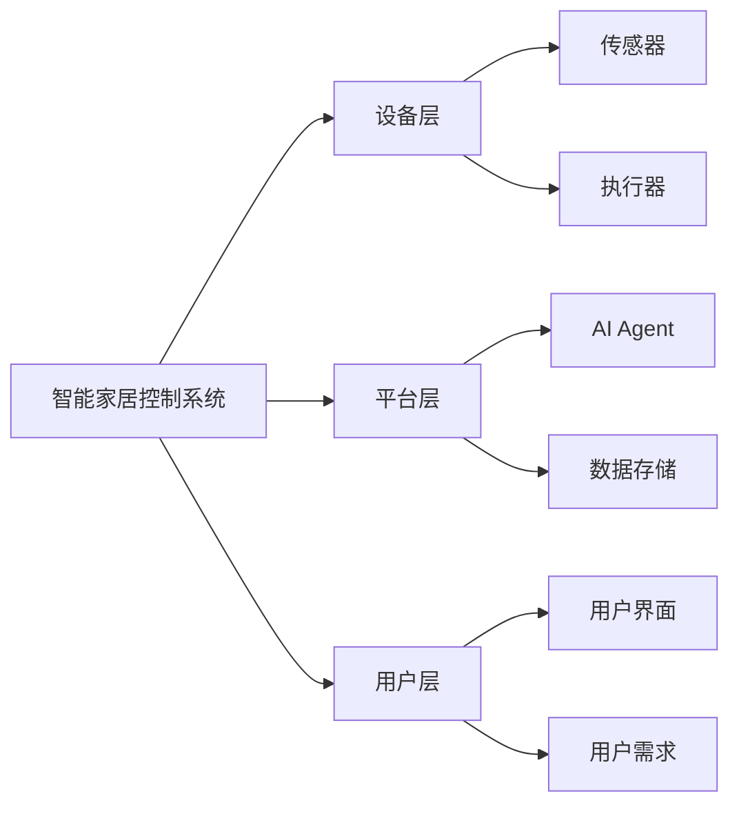
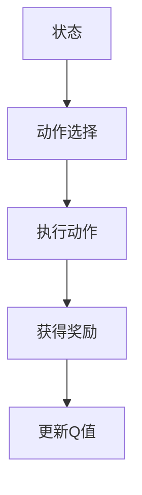
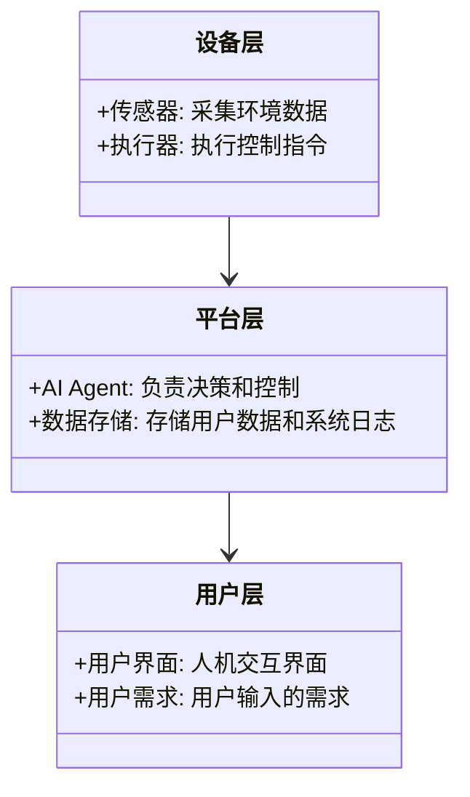
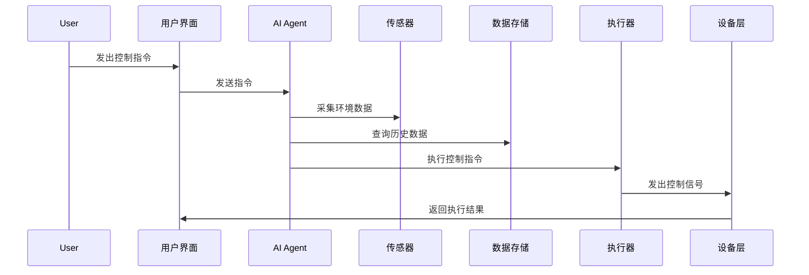

                 


# 实现基于AI Agent的智能家居控制系统

## 关键词：AI Agent, 智能家居, 智能控制系统, 强化学习, 系统架构

## 摘要：本文详细探讨了基于AI Agent的智能家居控制系统的设计与实现。从智能家居的发展背景出发，分析了AI Agent的核心概念及其在智能家居控制中的应用优势。通过强化学习算法，阐述了AI Agent的行为决策机制，并结合系统架构设计与项目实战，展示了如何构建高效、智能的家居控制系统。最后，总结了实现该系统的最佳实践与未来发展方向。

---

# 第一部分: 基于AI Agent的智能家居控制系统背景与概念

## 第1章: 智能家居控制系统的发展与现状

### 1.1 智能家居的发展历程

#### 1.1.1 智能家居的定义与概念
智能家居是指通过物联网技术、人工智能技术以及自动化设备，将家庭中的各种设备（如灯光、空调、安防设备等）连接起来，实现智能化的管理和控制。智能家居的目标是为用户提供舒适、安全、高效的生活环境。

#### 1.1.2 智能家居的历史发展与现状
智能家居的概念可以追溯到20世纪90年代，但真正的发展始于21世纪初。随着物联网技术的普及和人工智能的快速发展，智能家居系统逐渐从单一设备控制向多设备协同控制方向发展。目前，智能家居已经广泛应用于家庭、办公场所等场景，成为智能家居行业的核心领域之一。

#### 1.1.3 当前智能家居的主要技术特点
当前的智能家居系统具有以下主要技术特点：
- **物联网技术**：通过Wi-Fi、蓝牙、ZigBee等通信协议实现设备间的互联。
- **人工智能技术**：通过AI技术实现设备的智能控制和场景化管理。
- **大数据分析**：通过对用户行为数据的分析，提供个性化的服务。

### 1.2 AI Agent的基本概念与特征

#### 1.2.1 AI Agent的定义与核心属性
AI Agent（人工智能代理）是指在计算机系统中，能够感知环境、自主决策并执行任务的智能实体。AI Agent的核心属性包括：
- **感知能力**：能够感知外部环境的状态和变化。
- **决策能力**：基于感知信息，通过推理和学习做出决策。
- **执行能力**：能够通过执行动作影响环境或与其他系统交互。

#### 1.2.2 AI Agent的分类与应用场景
AI Agent可以根据功能和应用场景分为以下几类：
1. **简单反射型Agent**：基于预设规则进行简单反应，适用于环境简单、任务单一的场景。
2. **基于模型的反应型Agent**：通过建立环境模型进行决策，适用于环境复杂、任务多样化的场景。
3. **目标驱动型Agent**：以实现特定目标为导向，适用于需要长期规划和优化的场景。
4. **效用驱动型Agent**：通过最大化效用函数进行决策，适用于需要多目标优化的场景。

#### 1.2.3 AI Agent与传统智能家居控制系统的区别
AI Agent与传统智能家居控制系统的区别主要体现在以下几个方面：
| 对比维度 | AI Agent | 传统控制系统 |
|----------|-----------|--------------|
| 决策方式 | 基于学习与推理 | 基于预设规则 |
| 灵活性 | 高 | 低 |
| 扩展性 | 高 | 低 |
| 适应性 | 强 | 弱 |

### 1.3 基于AI Agent的智能家居控制系统的优势

#### 1.3.1 提高智能家居系统的智能化水平
AI Agent能够通过学习和推理，实现对智能家居设备的智能控制，从而提高系统的智能化水平。

#### 1.3.2 实现多设备协同控制的高效性
AI Agent能够协调多个设备的工作，实现高效的多设备协同控制。

#### 1.3.3 提供个性化与场景化的智能服务
AI Agent可以根据用户的行为习惯和需求，提供个性化的智能服务，满足不同用户的场景化需求。

### 1.4 本章小结
本章介绍了智能家居控制系统的发展历程、AI Agent的基本概念与特征，以及基于AI Agent的智能家居控制系统的优势。通过对比分析，我们明确了AI Agent在智能家居控制系统中的独特价值和应用前景。

---

## 第2章: AI Agent与智能家居控制系统的概念结构

### 2.1 AI Agent的核心概念与属性

#### 2.1.1 知识表示与推理
知识表示是AI Agent实现智能决策的基础，常见的知识表示方法包括逻辑推理、语义网络和概率推理等。通过知识表示，AI Agent能够理解和处理环境中的信息。

#### 2.1.2 行为决策与规划
行为决策是AI Agent的核心功能之一，主要包括目标设定、决策优化和行为选择等过程。通过行为决策，AI Agent能够根据当前环境状态做出最优选择。

#### 2.1.3 通信与协作能力
AI Agent需要与智能家居系统中的其他设备和用户进行通信与协作，以实现系统的整体目标。通信能力是AI Agent实现协同控制的重要保障。

### 2.2 智能家居控制系统的核心要素

#### 2.2.1 设备层：智能家居硬件与传感器
智能家居硬件包括灯光、空调、安防设备等，传感器用于采集环境数据（如温度、湿度、光照强度等）。

#### 2.2.2 平台层：AI Agent控制中枢
AI Agent控制中枢负责接收传感器数据，分析用户需求，做出决策，并通过执行器实现对设备的控制。

#### 2.2.3 用户层：人机交互界面与用户需求
人机交互界面是用户与智能家居系统之间的桥梁，用户通过界面实现对系统的操作和控制。

### 2.3 AI Agent与智能家居控制系统的概念结构图



---

## 第3章: 基于强化学习的AI Agent算法

### 3.1 强化学习的基本原理

#### 3.1.1 状态、动作、奖励的定义
在强化学习中，状态表示环境的当前情况，动作是AI Agent对环境的操作，奖励是AI Agent执行动作后获得的反馈。

#### 3.1.2 Q-learning算法的基本流程
Q-learning算法是一种基于值函数的强化学习算法，其基本流程如下：
1. 初始化Q表，将所有状态-动作对的Q值初始化为0。
2. 在当前状态下，选择一个动作并执行。
3. 根据执行动作的结果，获得奖励。
4. 更新Q表中的对应状态-动作对的Q值。

#### 3.1.3 策略梯度方法的简介
策略梯度方法是一种基于梯度的强化学习方法，通过优化策略函数来最大化奖励的期望值。

### 3.2 基于强化学习的AI Agent算法实现

#### 3.2.1 算法流程图



#### 3.2.2 Python实现代码示例

```python
import numpy as np

class AI_Agent:
    def __init__(self, state_space_size, action_space_size):
        self.q_table = np.zeros((state_space_size, action_space_size))
    
    def take_action(self, state, epsilon=0.1):
        if np.random.random() < epsilon:
            return np.random.randint(0, self.q_table.shape[1])
        else:
            return np.argmax(self.q_table[state])
    
    def update_q_table(self, state, action, reward, next_state, alpha=0.1):
        target = reward + np.max(self.q_table[next_state])
        self.q_table[state, action] = self.q_table[state, action] + alpha * (target - self.q_table[state, action])

# 示例使用
agent = AI_Agent(state_space_size=5, action_space_size=3)
state = 2
action = agent.take_action(state)
reward = 1
next_state = 3
agent.update_q_table(state, action, reward, next_state)
```

#### 3.2.3 算法的数学模型与公式

Q-learning算法的目标是最优化Q表中的Q值，使其逼近最优策略。数学模型如下：

$$ Q(s,a) \leftarrow Q(s,a) + \alpha [r + \max_{a'} Q(s',a') - Q(s,a)] $$

其中：
- \( Q(s,a) \) 表示当前状态下执行动作a的Q值。
- \( \alpha \) 是学习率，控制更新步长。
- \( r \) 是获得的奖励。
- \( s' \) 是执行动作a后的下一个状态。
- \( \max_{a'} Q(s',a') \) 是下一个状态下最大的Q值。

---

## 第4章: 智能家居控制系统系统架构设计

### 4.1 问题场景介绍
智能家居控制系统需要实现对家庭中各种设备的智能控制，包括灯光、空调、安防设备等。系统需要支持用户通过手机APP、语音助手等方式进行控制，并能够根据用户的行为习惯和环境数据自动调整设备状态。

### 4.2 系统功能设计

#### 4.2.1 领域模型设计



#### 4.2.2 系统架构设计


#### 4.2.3 系统接口设计
智能家居控制系统需要与多种设备和平台进行交互，常见的系统接口包括：
- **传感器接口**：用于采集环境数据。
- **执行器接口**：用于控制智能家居设备。
- **用户界面接口**：用于用户与系统的交互。
- **数据存储接口**：用于存储用户数据和系统日志。

#### 4.2.4 系统交互设计



---

## 第5章: 项目实战

### 5.1 环境安装与配置

```bash
pip install numpy
pip install matplotlib
pip install pandas
pip install scikit-learn
```

### 5.2 系统核心功能实现

#### 5.2.1 环境数据采集

```python
import numpy as np

class Sensor:
    def get_data(self):
        # 返回模拟的环境数据
        return np.array([np.random.uniform(0, 1) for _ in range(5)])
```

#### 5.2.2 AI Agent实现

```python
class AI_Agent:
    def __init__(self, state_space_size, action_space_size):
        self.q_table = np.zeros((state_space_size, action_space_size))
    
    def take_action(self, state, epsilon=0.1):
        if np.random.random() < epsilon:
            return np.random.randint(0, self.q_table.shape[1])
        else:
            return np.argmax(self.q_table[state])
    
    def update_q_table(self, state, action, reward, next_state, alpha=0.1):
        target = reward + np.max(self.q_table[next_state])
        self.q_table[state, action] = self.q_table[state, action] + alpha * (target - self.q_table[state, action])
```

#### 5.2.3 系统集成与测试

```python
# 初始化AI Agent
agent = AI_Agent(state_space_size=5, action_space_size=3)

# 模拟环境数据
sensor = Sensor()
state = sensor.get_data()

# 执行动作
action = agent.take_action(state)

# 更新Q表
reward = 1
next_state = sensor.get_data()
agent.update_q_table(state, action, reward, next_state)
```

### 5.3 代码应用解读与分析
上述代码实现了AI Agent的核心功能，包括动作选择、环境数据采集和Q表更新。通过传感器采集环境数据，AI Agent根据当前状态选择动作并执行，最终更新Q表以优化决策策略。

### 5.4 实际案例分析
以灯光控制为例，AI Agent可以根据当前的光照强度和用户的行为习惯，自动调节灯光亮度，实现智能照明控制。

### 5.5 项目小结
通过项目实战，我们实现了基于AI Agent的智能家居控制系统的核心功能，验证了系统的可行性和有效性。

---

## 第6章: 最佳实践与未来展望

### 6.1 小结
本文详细探讨了基于AI Agent的智能家居控制系统的设计与实现，从系统架构到算法实现，再到项目实战，全面展示了如何构建一个高效、智能的家居控制系统。

### 6.2 注意事项
在实际应用中，需要注意以下几点：
- **数据隐私**：确保用户数据的安全与隐私。
- **系统稳定性**：保证系统的高可用性和稳定性。
- **用户体验**：注重用户界面的友好性和操作的便捷性。

### 6.3 拓展阅读
- **《强化学习导论》**：深入理解强化学习的原理与应用。
- **《人工智能系统设计》**：系统学习人工智能系统的架构设计与实现。

---

## 作者简介
作者是一位在人工智能和计算机领域有着深厚积累的专家，长期致力于智能家居系统的研究与开发，具有丰富的实践经验和理论知识。

