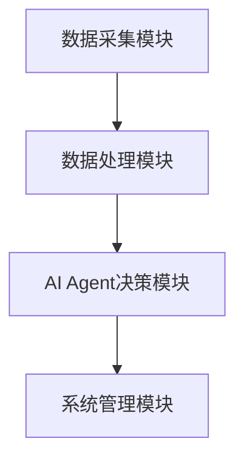
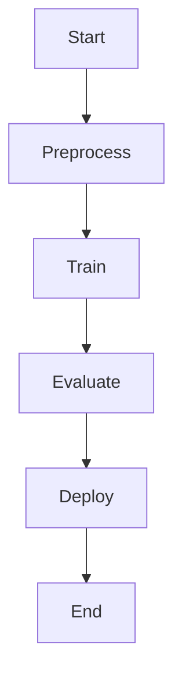

                 


# 实现基于AI Agent的智能文化遗产保护系统

---

## 关键词：
AI Agent，文化遗产保护，多智能体系统，知识图谱，文化遗产数字化

---

## 摘要：
本文探讨了基于AI Agent的智能文化遗产保护系统的实现方法。通过分析文化遗产保护的现状与挑战，提出了一种结合AI Agent技术的解决方案，详细介绍了系统的核心概念、算法原理、系统架构以及实际应用案例。本文旨在为文化遗产保护提供一种智能化、高效的解决方案，并通过技术实现和项目实战，展示AI Agent在文化遗产保护中的巨大潜力。

---

# 第一部分: 背景介绍与问题分析

## 第1章: 智能文化遗产保护系统概述

### 1.1 问题背景与挑战

#### 1.1.1 文化遗产保护的现状与挑战
文化遗产是人类文明的瑰宝，包括历史建筑、文物、非物质文化遗产等。然而，随着时间和环境的变化，文化遗产的保护面临诸多挑战，例如：
- **物理损坏**：自然灾害、人为破坏等导致文化遗产的不可逆损坏。
- **资源有限**：文化遗产保护需要大量的人力、物力和财力支持，但资源往往有限。
- **信息孤岛**：不同文化遗产保护机构之间的信息分散，缺乏统一的管理平台。

#### 1.1.2 问题描述与解决方法
AI Agent（人工智能代理）是一种能够感知环境、自主决策并执行任务的智能实体。将AI Agent技术应用于文化遗产保护，可以实现以下目标：
- **实时监测**：通过传感器和AI Agent实时监测文化遗产的状态，及时发现潜在风险。
- **智能决策**：AI Agent能够根据监测数据和历史信息，提供保护建议和决策支持。
- **协作共享**：通过多智能体协作，实现文化遗产信息的共享与协同保护。

#### 1.1.3 系统的边界与核心要素
- **系统边界**：本系统主要关注文化遗产的数字化保护和智能化管理，不涉及文化遗产的实体修复工作。
- **核心要素**：
  - **AI Agent**：负责数据采集、分析和决策。
  - **知识图谱**：存储文化遗产的相关信息，为AI Agent提供知识支持。
  - **多智能体协作**：多个AI Agent协同工作，实现信息共享和任务分配。

---

## 第2章: AI Agent与文化遗产保护的结合

### 2.1 AI Agent的基本原理
AI Agent是一种能够感知环境、自主决策并执行任务的智能实体。其核心特征包括：
- **自主性**：能够在没有外部干预的情况下自主运行。
- **反应性**：能够根据环境的变化实时调整行为。
- **协作性**：能够与其他AI Agent或人类进行协作。

### 2.2 多智能体系统与文化遗产保护
多智能体系统是由多个AI Agent组成的协作系统，能够共同完成复杂任务。在文化遗产保护中，多智能体系统可以应用于：
- **文化遗产监测**：多个AI Agent分别负责不同区域的监测任务。
- **信息共享**：通过多智能体协作，实现文化遗产信息的高效共享。

### 2.3 知识图谱与文化遗产保护
知识图谱是一种结构化的知识表示方法，能够存储文化遗产的相关信息，例如历史背景、地理位置、保护措施等。知识图谱为AI Agent提供了丰富的知识支持，帮助其更好地理解和分析文化遗产。

---

## 第3章: 大模型在文化遗产保护中的应用

### 3.1 大模型的基本原理
大模型（如BERT、GPT）是一种基于深度学习的自然语言处理模型。其基本原理包括：
- **预训练**：通过大规模数据预训练，模型学习语言的规律和语义。
- **微调**：针对特定任务进行微调，优化模型性能。
- **推理**：通过模型推理，生成与任务相关的输出。

### 3.2 大模型在文化遗产保护中的具体应用
- **文本生成**：用于文化遗产修复和重建。
- **图像识别**：用于文化遗产的数字化和保护。
- **自然语言处理**：用于文化遗产的研究和分析。

### 3.3 数学模型与公式
#### 3.3.1 大模型的数学基础
大模型的训练通常采用反向传播算法，优化目标函数：
$$ \text{Loss} = \sum_{i=1}^{n} \text{loss}_i $$
其中，$\text{loss}_i$ 是第 $i$ 个样本的损失。

#### 3.3.2 概率分布与损失函数
大模型的输出通常服从多项式分布：
$$ P(y|x) = \frac{\exp(s(x,y))}{\sum_{y'} \exp(s(x,y'))} $$
其中，$s(x,y)$ 是模型的得分函数。

---

## 第4章: 智能文化遗产保护系统的架构设计

### 4.1 系统功能模块划分
- **数据采集与处理模块**：负责采集和处理文化遗产的数字化数据。
- **AI Agent决策模块**：负责分析数据并生成保护策略。
- **系统管理与监控模块**：负责系统的运行管理和监控。

### 4.2 系统架构设计
系统采用分层架构，主要包括：
- **数据层**：存储文化遗产的数字化数据和知识图谱。
- **计算层**：负责数据的处理和AI Agent的运行。
- **应用层**：提供用户界面和保护策略的展示。

### 4.3 系统接口设计
系统接口设计包括：
- **数据接口**：与传感器和数据库的接口。
- **用户接口**：与用户的交互界面。

### 4.4 系统交互流程
系统交互流程如下：
1. **数据采集**：传感器采集文化遗产的实时数据。
2. **数据处理**：数据采集模块将数据传输到计算层。
3. **AI Agent分析**：AI Agent分析数据并生成保护策略。
4. **策略执行**：保护策略通过系统接口传递给执行机构。
5. **监控与反馈**：系统监控执行结果并反馈给AI Agent。

---

## 第5章: 项目实战

### 5.1 环境配置
项目环境配置包括：
- **硬件**：建议使用高性能服务器和GPU加速。
- **软件**：安装Python、TensorFlow、Keras等深度学习框架。

### 5.2 核心代码实现
以下是系统的核心代码实现示例：
```python
import tensorflow as tf
from tensorflow.keras import layers

# 定义大模型
class LargeModel(tf.keras.Model):
    def __init__(self):
        super(LargeModel, self).__init__()
        self.embedding = layers.Embedding(input_dim=...)
        self.lstm = layers.LSTM(units=...)
        self.dense = layers.Dense(units=...)

    def call(self, inputs):
        x = self.embedding(inputs)
        x = self.lstm(x)
        x = self.dense(x)
        return x

# 训练过程
model = LargeModel()
model.compile(optimizer='adam', loss='sparse_categorical_crossentropy')
model.fit(x_train, y_train, epochs=10)
```

### 5.3 实际案例分析
以某历史建筑的保护为例：
- **数据采集**：使用传感器采集建筑的实时数据。
- **模型训练**：训练大模型，识别建筑的潜在风险。
- **保护策略生成**：AI Agent生成保护策略，例如修复建议。

---

## 第6章: 最佳实践与总结

### 6.1 最佳实践
- **数据质量**：确保数据的准确性和完整性。
- **模型优化**：定期优化模型，提高保护效果。
- **多智能体协作**：合理设计多智能体的协作机制，提高系统的整体性能。

### 6.2 小结
本文详细探讨了基于AI Agent的智能文化遗产保护系统的实现方法，包括系统架构、算法原理和实际应用案例。通过AI Agent技术，我们可以实现文化遗产的智能化保护，提高保护效率和效果。

### 6.3 注意事项
- **隐私保护**：文化遗产数据可能包含敏感信息，需注意隐私保护。
- **技术局限性**：AI Agent技术目前仍存在一定的局限性，需结合实际情况合理应用。

### 6.4 拓展阅读
建议进一步阅读以下内容：
- 深度学习在文化遗产保护中的应用。
- 多智能体系统在文化遗产保护中的应用案例。

---

## 附录
### 附录A: 系统架构图


### 附录B: 算法流程图


---

以上是《实现基于AI Agent的智能文化遗产保护系统》的技术博客文章的完整内容，涵盖了系统的背景、核心概念、算法原理、系统架构和实际应用案例。

