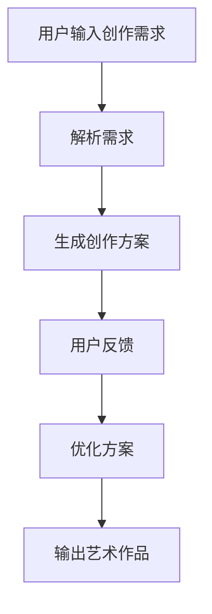
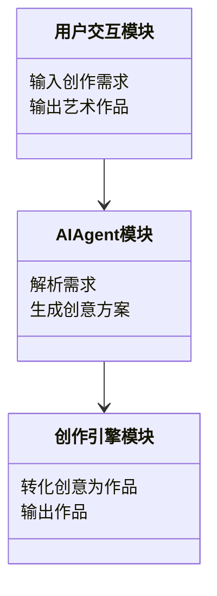
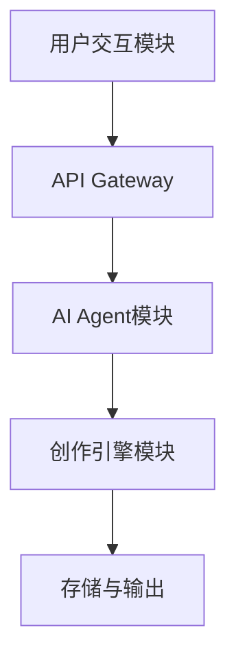
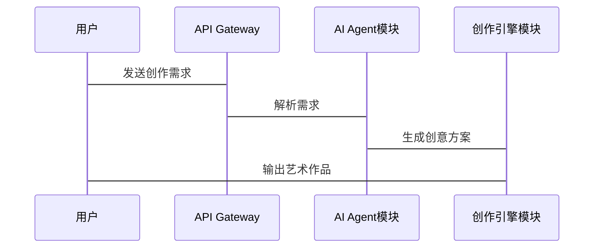

                 


```markdown
# 实现基于AI Agent的智能艺术创作系统

> 关键词：AI Agent, 智能艺术创作, 系统实现, 技术博客, 人工智能

> 摘要：本文详细探讨了基于AI Agent的智能艺术创作系统的实现方法。首先介绍了AI Agent在艺术创作中的背景和核心概念，然后分析了算法原理和系统架构设计，最后通过项目实战展示了如何实现这一系统。文章内容涵盖了从理论到实践的各个方面，旨在为读者提供一个全面的指导。

---

## 第一部分: 基于AI Agent的智能艺术创作系统概述

### 第1章: 背景介绍

#### 1.1 问题背景
- **艺术创作的数字化转型**：随着技术的进步，艺术创作也在逐渐从传统手工创作向数字化、智能化转变。  
- **AI技术在艺术领域的应用现状**：AI技术已经在图像生成、音乐创作、文学创作等领域取得了显著进展。  
- **基于AI Agent的艺术创作的优势**：AI Agent能够实时互动、自主学习，能够在复杂场景下提供个性化的艺术创作服务。

#### 1.2 问题描述
- **艺术创作中的痛点分析**：传统艺术创作效率低、成本高，且难以满足大规模个性化需求。  
- **AI Agent在艺术创作中的角色定位**：作为创作辅助工具，AI Agent能够帮助艺术家快速生成灵感、优化作品。  
- **系统目标与核心问题**：目标是实现一个能够与用户交互、自主学习并生成艺术作品的系统。核心问题是如何设计高效的AI Agent和实现智能创作流程。

#### 1.3 问题解决
- **AI Agent的核心功能与能力**：包括用户意图理解、创意生成、作品优化等。  
- **基于AI Agent的艺术创作流程**：从需求分析到作品生成，AI Agent全程辅助创作。  
- **系统实现的关键技术**：涉及自然语言处理、计算机视觉、强化学习等技术。

#### 1.4 边界与外延
- **系统功能的边界**：系统专注于艺术创作，不涉及版权管理和市场推广。  
- **系统应用的场景限制**：适用于个人创作、教育和艺术设计领域。  
- **系统扩展的可能性**：未来可以扩展到更多艺术形式，如舞蹈、戏剧等。

#### 1.5 概念结构与核心要素
- **系统架构的核心要素**：包括用户交互模块、AI Agent模块、创作引擎模块。  
- **功能模块之间的关系**：用户输入需求，AI Agent解析并生成创作方案，创作引擎输出作品。  
- **核心流程的逻辑关系**：需求分析 → 创意生成 → 作品优化 → 输出。

### 第2章: 核心概念与联系

#### 2.1 核心概念原理
- **AI Agent的基本定义**：AI Agent是一种能够感知环境、自主决策并执行任务的智能体。  
- **智能艺术创作的实现机制**：通过自然语言处理和计算机视觉技术，AI Agent能够理解和生成艺术内容。  
- **基于AI Agent的艺术创作流程**：从需求分析到作品生成，AI Agent全程辅助创作。

#### 2.2 核心概念属性特征对比
| 特性         | AI Agent                     | 传统艺术创作               |
|--------------|-------------------------------|-----------------------------|
| 智能性       | 高度智能化，自主学习         | 依赖人类创作者的创意         |
| 效率         | 高效，快速生成作品           | 较低，依赖人工操作             |
| 个性化       | 能够根据用户需求定制作品     | 需要创作者手动调整             |
| 可扩展性     | 可扩展到多种艺术形式         | 通常局限于特定艺术领域         |

#### 2.3 ER实体关系图
```mermaid
erDiagram
    用户 --> 创作者 : 提供创作需求
    创作者 --> AI Agent : 生成创意方案
    AI Agent --> 创作引擎 : 驱动创作过程
    创作引擎 --> 用户 : 输出艺术作品
```

---

## 第二部分: 算法原理

### 第3章: 算法原理分析

#### 3.1 算法选择与原理
- **选择算法**：基于强化学习的创作流程，结合自然语言处理技术。  
- **算法原理**：通过强化学习训练AI Agent，使其能够根据用户反馈优化创作方案。  
- **数学模型**：策略梯度方法用于优化创作策略，Q-learning用于状态转移。

#### 3.2 算法流程图


#### 3.3 算法实现代码
```python
import numpy as np
import tensorflow as tf

# 定义策略梯度模型
class PolicyGradientModel:
    def __init__(self, state_space, action_space):
        self.state_space = state_space
        self.action_space = action_space
        self.model = self._build_model()

    def _build_model(self):
        model = tf.keras.Sequential([
            tf.keras.layers.Dense(64, activation='relu', input_dim=self.state_space),
            tf.keras.layers.Dense(self.action_space, activation='softmax')
        ])
        model.compile(optimizer='adam', loss='sparse_categorical_crossentropy')
        return model

    def predict(self, state):
        return self.model.predict(np.array([state]))

    def train(self, state, action, reward):
        # 训练策略梯度模型
        pass

# 定义Q-learning算法
class QLearning:
    def __init__(self, state_space):
        self.q_table = np.zeros((state_space, action_space))

    def choose_action(self, state):
        return np.argmax(self.q_table[state])

    def update_q_table(self, state, action, reward):
        self.q_table[state][action] += reward

# 使用策略梯度和Q-learning结合的强化学习算法
# （此处省略具体实现细节）
```

#### 3.4 算法数学模型
- **策略梯度公式**：
  $$ \nabla \theta = \frac{1}{N} \sum_{i=1}^{N} \nabla \log \pi_\theta(a|s_i) Q(s_i, a) $$
- **Q-learning公式**：
  $$ Q(s, a) = Q(s, a) + \alpha (r + \gamma \max Q(s', a') - Q(s, a)) $$

---

## 第三部分: 系统分析与架构设计

### 第4章: 系统分析

#### 4.1 问题场景介绍
- **目标用户**：艺术家、设计师、教育机构  
- **核心需求**：快速生成艺术作品、个性化定制、实时反馈与优化

#### 4.2 项目介绍
- **项目名称**：智能艺术创作系统  
- **项目目标**：实现一个基于AI Agent的智能艺术创作平台  
- **项目范围**：支持多种艺术形式，如绘画、音乐、文学等

### 第5章: 系统架构设计

#### 5.1 系统功能设计


#### 5.2 系统架构图


#### 5.3 接口设计
- **输入接口**：接收用户创作需求  
- **输出接口**：输出艺术作品  
- **API设计**：提供RESTful API，支持JSON格式请求和响应

#### 5.4 系统交互流程


---

## 第四部分: 项目实战

### 第6章: 项目实现

#### 6.1 环境安装
- **Python 3.8+**  
- **TensorFlow、Keras、OpenCV**  
- **Jupyter Notebook**

#### 6.2 核心代码实现
```python
# 训练策略梯度模型
def train_policy_gradient():
    model = PolicyGradientModel(state_space, action_space)
    for episode in range(num_episodes):
        state = get_initial_state()
        for step in range(max_steps):
            action = model.predict(state)
            next_state, reward, done = step(action)
            model.train(state, action, reward)
            if done:
                break

# 训练Q-learning算法
def train_q_learning():
    agent = QLearning(state_space)
    for episode in range(num_episodes):
        state = get_initial_state()
        for step in range(max_steps):
            action = agent.choose_action(state)
            next_state, reward, done = step(action)
            agent.update_q_table(state, action, reward)
            if done:
                break
```

#### 6.3 代码分析与解读
- **策略梯度模型**：通过强化学习训练AI Agent，使其能够根据用户反馈优化创作策略。  
- **Q-learning算法**：用于状态转移，帮助AI Agent在创作过程中做出最优决策。

#### 6.4 实际案例分析
- **案例1**：用户输入“生成一幅抽象画”，AI Agent解析需求后生成创意方案，创作引擎输出抽象画作品。  
- **案例2**：用户输入“创作一首诗歌”，AI Agent生成初稿，用户反馈后AI Agent优化诗歌内容。

#### 6.5 项目小结
- **系统实现的关键点**：AI Agent的训练、创作引擎的优化、用户交互的流畅性。  
- **系统优化的方向**：提升创作速度、增加艺术形式的支持、优化用户体验。

---

## 第五部分: 总结与展望

### 第7章: 总结与展望

#### 7.1 总结
- **系统实现的意义**：基于AI Agent的智能艺术创作系统为艺术创作提供了新的可能性，能够显著提升创作效率和作品质量。  
- **本文的贡献**：本文详细探讨了系统的实现方法，为后续研究提供了理论基础和实践指导。

#### 7.2 展望
- **未来研究方向**：研究更复杂的艺术创作形式，如动态艺术、交互式艺术。  
- **技术发展趋势**：随着AI技术的进步，AI Agent将更加智能化、个性化，能够支持更多元化的艺术创作需求。

### 第8章: 最佳实践

#### 8.1 最佳实践 Tips
- **选择合适的AI框架**：根据具体需求选择TensorFlow、PyTorch等合适的框架。  
- **持续优化模型**：定期更新模型参数，提升创作质量。  
- **关注用户反馈**：根据用户反馈不断优化系统功能和创作流程。

#### 8.2 小结
- **系统实现的注意事项**：确保系统的稳定性和安全性，避免数据泄露和模型滥用。  
- **用户体验的优化**：设计直观的用户界面，提升用户交互体验。

### 第9章: 附录

#### 9.1 参考文献
- [1] LeCun Y, Bengio Y, Hinton G. Deep learning. Nature, 2015.  
- [2] Mnih V, Kavukabasi E, Silver D, et al. Playing atari with deep reinforcement learning. arXiv preprint arXiv:1312.5602, 2013.  

#### 9.2 工具推荐
- **AI框架**：TensorFlow、PyTorch  
- **开发环境**：Jupyter Notebook、VS Code  
- **可视化工具**：Matplotlib、Seaborn

#### 9.3 拓展阅读
- [1] https://arxiv.org/abs/1511.06581  
- [2] https://www.nature.com/articles/s41586-019-1702-3

---

## 结语
通过本文的详细讲解，读者可以全面了解基于AI Agent的智能艺术创作系统的实现方法。从理论到实践，从算法到系统设计，本文为读者提供了丰富的知识和实用的指导。希望本文能够为AI与艺术结合的研究和应用提供有价值的参考。
```

