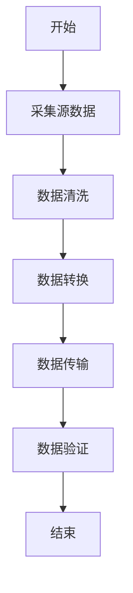
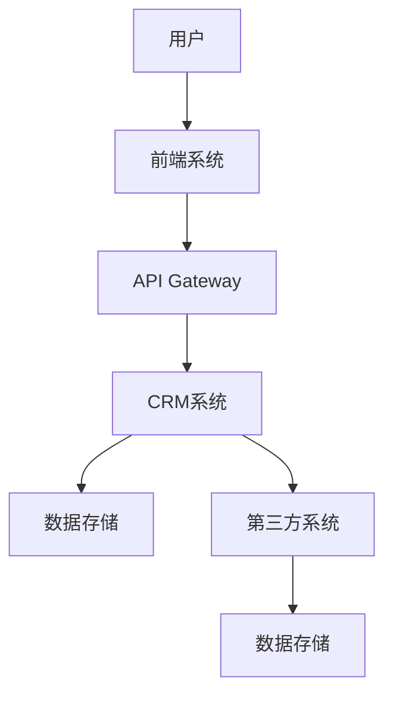

                 


# 客户关系管理集成

> 关键词：客户关系管理，CRM集成，系统集成，数据同步，API，数据安全

> 摘要：客户关系管理（CRM）集成是企业信息化建设中的重要环节，通过将CRM系统与其他业务系统（如ERP、电商平台等）进行深度集成，实现数据的共享与业务流程的协同。本文将从CRM集成的基本概念、核心原理、系统架构设计到实际项目实战进行详细分析，帮助读者全面理解CRM集成的技术与实践。

---

## 第一部分: 客户关系管理集成概述

### 第1章: 客户关系管理集成的基本概念

#### 1.1 什么是客户关系管理
客户关系管理（Customer Relationship Management，CRM）是一种以客户为中心的管理方法，通过整合企业与客户之间的互动数据，优化客户体验、提高客户忠诚度并实现业务目标。CRM的核心模块包括客户信息管理、销售管理、市场营销、客户服务与支持等。

#### 1.2 客户关系管理集成的背景
随着企业信息化的快速发展，CRM系统逐渐成为企业运营的核心工具之一。然而，企业在信息化过程中常常面临“数据孤岛”问题，即各个系统之间的数据无法有效共享，导致业务流程效率低下。CRM集成的目标是将CRM系统与其他业务系统（如ERP、电商平台等）进行深度整合，实现数据的互联互通与业务流程的协同。

#### 1.3 客户关系管理集成的意义
- **提高企业运营效率**：通过CRM集成，企业可以实现数据的统一管理与共享，减少重复录入和数据冗余。
- **优化客户体验**：CRM集成可以帮助企业提供更加个性化的客户服务，提升客户满意度和忠诚度。
- **促进企业数字化转型**：CRM集成是企业实现数字化转型的重要一步，通过数据的共享与分析，企业可以更好地洞察客户需求，优化业务流程。

---

## 第二部分: 客户关系管理集成的核心概念与联系

### 第2章: 客户关系管理集成的核心概念

#### 2.1 客户关系管理集成的类型
CRM集成可以分为以下几种类型：
- **系统集成**：通过技术手段将CRM系统与其他系统（如ERP、电商平台等）进行对接，实现数据的共享与业务流程的协同。
- **数据集成**：专注于数据层面的集成，将CRM系统中的数据与其他系统进行同步与共享。
- **应用集成**：通过应用编程接口（API）或其他集成技术，实现CRM系统与其他应用程序之间的交互与协作。

#### 2.2 客户关系管理集成的标准与方法
- **集成标准**：常用的CRM集成标准包括API（应用程序编程接口）、中间件集成、基于消息队列的集成等。
- **API集成**：通过调用API接口实现CRM系统与其他系统的数据交互。例如，通过REST API或SOAP API进行数据同步。
- **中间件集成**：使用中间件（如ESB，企业服务总线）作为桥梁，实现CRM系统与其他系统的集成。

#### 2.3 客户关系管理集成的关键要素
- **数据模型**：CRM集成的核心是数据模型的设计，确保数据在不同系统之间的兼容性和一致性。
- **集成架构**：CRM集成的架构设计需要考虑系统的可扩展性、可维护性和安全性。
- **安全与权限**：CRM集成过程中需要确保数据的安全性，防止数据泄露和未授权访问。

---

### 第3章: 客户关系管理集成的核心原理

#### 3.1 数据同步的原理
数据同步是CRM集成中的核心过程之一，其目的是确保不同系统中的数据保持一致。数据同步的流程如下：

1. **数据采集**：从源系统中采集需要同步的数据。
2. **数据清洗**：对采集到的数据进行清洗，去除无效数据并处理数据格式。
3. **数据转换**：将数据转换为目标系统的格式和要求。
4. **数据传输**：将处理后的数据传输到目标系统中。
5. **数据验证**：目标系统对传输的数据进行验证，确保数据的完整性和准确性。

##### 数据同步的算法流程


#### 3.2 数据转换的原理
数据转换是CRM集成中的另一个关键环节，其目的是将源系统中的数据转换为目标系统的格式和要求。数据转换的过程包括数据格式转换、数据清洗和数据映射。

##### 数据映射规则
- **字段映射**：将源系统中的字段映射到目标系统的字段。
- **数据格式转换**：将源系统中的数据格式转换为目标系统的格式（例如，日期格式、数值格式等）。
- **数据清洗**：去除无效数据并补充缺失数据。

#### 3.3 数据安全与隐私保护
CRM集成过程中，数据的安全性和隐私保护是至关重要的。以下是几种常用的数据安全技术：
- **数据加密**：使用加密算法对敏感数据进行加密，例如AES加密。
- **数据访问控制**：通过权限管理控制数据的访问权限，确保只有授权用户可以访问敏感数据。
- **数据脱敏**：对敏感数据进行脱敏处理，例如将姓名替换为首字母，将地址中的具体街道信息模糊化。

---

## 第三部分: 客户关系管理集成的系统分析与架构设计

### 第4章: 客户关系管理集成的系统分析

#### 4.1 集成场景分析
以下是一些常见的CRM集成场景：
- **电商系统与CRM集成**：通过电商平台采集客户订单数据，并将其同步到CRM系统中，实现客户信息的统一管理。
- **ERP系统与CRM集成**：通过ERP系统与CRM系统的集成，实现销售数据的共享与协同。
- **第三方应用与CRM集成**：例如，通过CRM系统与邮件营销系统集成，实现邮件营销自动化。

#### 4.2 集成需求分析
在进行CRM集成之前，需要明确集成的需求，包括功能需求、性能需求和安全需求。

##### 功能需求
- 数据同步功能：实现CRM系统与其他系统的数据同步。
- API接口开发：提供API接口供其他系统调用CRM系统中的数据和功能。
- 用户权限管理：实现用户的权限管理，确保数据的安全性。

##### 性能需求
- 数据同步的实时性：确保数据同步的实时性，减少数据延迟。
- 系统扩展性：系统需要具备良好的扩展性，能够适应未来业务发展的需求。

##### 安全需求
- 数据加密：对敏感数据进行加密处理。
- 访问控制：通过权限管理控制数据的访问权限。

---

## 第5章: 客户关系管理集成的架构设计

### 5.1 系统功能设计
以下是CRM集成系统的功能模块设计：

1. **数据同步模块**：实现CRM系统与其他系统的数据同步。
2. **API接口模块**：提供API接口供其他系统调用CRM系统中的数据和功能。
3. **用户权限管理模块**：实现用户的权限管理，确保数据的安全性。
4. **数据转换模块**：实现数据的清洗、转换和映射。

### 5.2 系统架构设计
以下是CRM集成系统的架构设计：



### 5.3 系统接口设计
以下是CRM集成系统的接口设计：

1. **API接口**：提供RESTful API接口，供其他系统调用CRM系统中的数据和功能。
2. **数据同步接口**：实现CRM系统与其他系统的数据同步。

---

## 第四部分: 项目实战

### 第6章: 电商系统与CRM系统的集成

#### 6.1 项目背景
本项目旨在实现电商系统与CRM系统的集成，通过电商平台采集客户订单数据，并将其同步到CRM系统中，实现客户信息的统一管理。

#### 6.2 项目环境安装
1. 安装Java开发环境。
2. 安装MySQL数据库。
3. 安装CRM系统（例如，Salesforce）和电商平台（例如，Shopify）。

#### 6.3 核心代码实现
以下是电商系统与CRM系统集成的核心代码：

```python
import requests
import json
from datetime import datetime

def synchronize_data():
    # 从电商平台获取订单数据
    response = requests.get('https://api.shopify.com/orders', params={'access_token': 'your_token'})
    orders = json.loads(response.text)

    # 将订单数据同步到CRM系统
    headers = {'Content-Type': 'application/json'}
    for order in orders:
        data = {
            'customer_id': order['customer_id'],
            'order_number': order['order_number'],
            'order_date': datetime.now().isoformat(),
            'total_amount': order['total_amount']
        }
        response = requests.post('https://api.crm.com/orders', headers=headers, json=data)
        if response.status_code == 200:
            print(f"Order {order['order_number']} synchronized successfully.")
        else:
            print(f"Failed to synchronize order {order['order_number']}.")

synchronize_data()
```

#### 6.4 项目总结
通过本项目，我们实现了电商系统与CRM系统的集成，确保订单数据的实时同步与共享。在实际应用中，还需要考虑数据安全、系统性能优化和用户体验等问题。

---

## 第五部分: 最佳实践与总结

### 第7章: 最佳实践

#### 7.1 数据安全与隐私保护
在CRM集成过程中，必须重视数据的安全性，防止数据泄露和未授权访问。可以通过以下措施实现数据安全：
- 数据加密
- 数据脱敏
- 访问控制

#### 7.2 系统性能优化
为了确保CRM集成系统的性能，可以采取以下优化措施：
- 数据同步的批量处理
- 使用缓存技术减少数据库访问压力
- 优化API接口的性能

#### 7.3 系统扩展性设计
为了使CRM集成系统具备良好的扩展性，可以采取以下措施：
- 使用模块化设计
- 采用微服务架构
- 使用灵活的接口设计

### 第8章: 总结

通过本文的详细讲解，我们全面了解了客户关系管理集成的技术与实践。从基本概念到系统架构设计，再到项目实战，我们逐步深入探讨了CRM集成的核心内容。希望本文能够为读者在CRM集成领域的学习与实践提供有价值的参考。

---

**注意事项**：
- 在进行CRM集成时，必须重视数据的安全性和隐私保护，确保数据的合规性。
- 系统设计时，应充分考虑系统的可扩展性和可维护性，避免因需求变更导致系统重构。
- 在实际项目中，可以根据具体需求选择合适的集成方式和工具，例如，使用API Gateway实现系统的统一接口管理。

**拓展阅读**：
- 《企业应用架构模式》
- 《微服务设计原则》
- 《数据集成与数据仓库》

