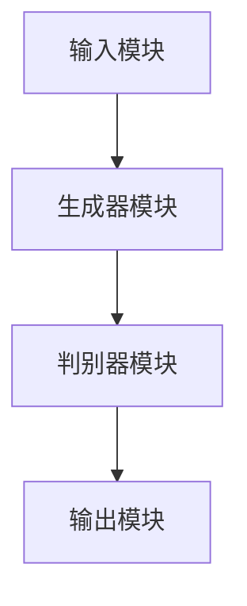
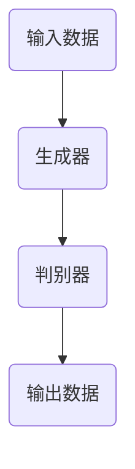

                 


# 对抗生成网络在金融数据增强中的应用

> 关键词：生成对抗网络，金融数据增强，数据生成，时间序列数据，文本数据，系统架构

> 摘要：本文深入探讨了对抗生成网络（GANs）在金融数据增强中的应用。通过分析GANs的基本原理、算法实现、系统架构设计以及实际应用案例，本文展示了GANs如何有效解决金融数据不足、数据多样性不足等问题。我们从理论基础到实际应用，详细阐述了GANs在金融数据增强中的优势与挑战，并提供了具体的实现方案和系统设计。

---

# 第1章: 对抗生成网络概述

## 1.1 生成对抗网络的基本概念
### 1.1.1 生成对抗网络的定义
生成对抗网络（GANs）是一种深度学习模型，由生成器（Generator）和判别器（Discriminator）两个神经网络构成。生成器的目标是生成与真实数据分布相似的数据，而判别器的目标是区分生成数据与真实数据。通过交替训练生成器和判别器，GANs能够生成高质量的数据。

### 1.1.2 GAN的核心组成部分
- **生成器（Generator）**：通过学习真实数据的分布，生成逼真的数据样本。
- **判别器（Discriminator）**：区分生成数据和真实数据，输出概率判别结果。
- **对抗训练机制**：生成器和判别器通过最小化各自的损失函数进行优化，形成一个动态平衡。

### 1.1.3 GAN的训练机制
- GAN的训练过程是一个零和博弈，生成器和判别器的目标函数相互对抗。
- 生成器的损失函数：$L_G = \mathbb{E}_{z}[ -\log(D(G(z))) ]$
- 判别器的损失函数：$L_D = \mathbb{E}_{x}[ -\log(D(x)) ] + \mathbb{E}_{z}[ \log(D(G(z)))]$
- 通过交替优化生成器和判别器，逐步提高生成数据的质量。

## 1.2 生成对抗网络的发展历程
### 1.2.1 GAN的起源
GAN由Ian Goodfellow等人于2014年提出，最初主要用于图像生成。

### 1.2.2 GAN的主要变体
- **Wasserstein GAN (WGAN)**：使用Wasserstein距离作为损失函数，解决了传统GAN的训练不稳定问题。
- **Least Squares GAN (LSGAN)**：使用均方误差作为损失函数，优化生成器和判别器的训练过程。
- **CycleGAN**：无需配对数据，直接实现跨领域数据转换。

### 1.2.3 GAN在不同领域的应用
- 图像生成、图像修复、视频生成。
- 文本生成、语音合成、自然语言处理。
- 金融数据增强、医学图像生成、推荐系统。

## 1.3 金融数据增强的背景与挑战
### 1.3.1 金融数据的特点
- 数据稀疏性：某些金融场景数据量不足。
- 数据多样性：需要多样的数据来训练鲁棒的模型。
- 数据敏感性：金融数据通常涉及隐私和敏感信息。

### 1.3.2 数据增强在金融中的重要性
- 提高模型的泛化能力。
- 解决数据不足问题。
- 提供多样化的数据用于模型训练。

### 1.3.3 传统数据增强方法的局限性
- 线性变换（如旋转、缩放）难以生成复杂的金融数据。
- 生成的数据缺乏真实性和多样性。

## 1.4 对抗生成网络在金融数据增强中的优势
### 1.4.1 GAN生成数据的独特优势
- 数据生成能力强，能够生成高质量的金融数据。
- 能够生成多样化的数据，满足金融建模的需求。
- 可以生成与真实数据分布相似的数据，提高模型的泛化能力。

### 1.4.2 GAN在金融数据增强中的应用前景
- 生成金融时间序列数据。
- 生成金融文本数据。
- 提供多样化的金融数据用于模型训练。

### 1.4.3 GAN与其他生成模型的对比
| 模型 | 优势 | 局限性 |
|------|------|--------|
| GAN | 数据生成能力强，能够生成高质量数据 | 训练不稳定，容易出现模式坍缩 |
| VAE | 分布清晰，训练稳定 | 数据生成质量较低 |
| 流模型 | 数据生成速度快 | 分布复杂难以建模 |

---

## 1.5 本章小结
本章介绍了生成对抗网络（GANs）的基本概念、发展历程及其在金融数据增强中的应用。通过对比传统数据增强方法的局限性，我们展示了GANs在金融数据增强中的独特优势和广阔的应用前景。

---

# 第2章: 对抗生成网络的核心概念与原理

## 2.1 对抗生成网络的数学模型
### 2.1.1 生成器的数学表达
生成器的目标是最小化判别器输出的概率，即：
$$ L_G = -\mathbb{E}_{z}[ \log(D(G(z))) ] $$
其中，$z$ 是生成器的输入噪声，$D(G(z))$ 是判别器对生成数据的判断概率。

### 2.1.2 判别器的数学表达
判别器的目标是最大化真实数据和生成数据的区分能力，即：
$$ L_D = -\mathbb{E}_{x}[ \log(D(x)) ] - \mathbb{E}_{z}[ \log(1 - D(G(z))) ] $$

### 2.1.3 GAN的损失函数
GAN的总损失函数为生成器和判别器损失之和：
$$ L = L_G + L_D $$

## 2.2 对抗训练的原理
### 2.2.1 对抗训练的基本流程
1. 随机采样一批真实数据，输入判别器，计算判别器损失。
2. 随机生成一批假数据，输入判别器，计算生成器损失。
3. 同时优化生成器和判别器的参数，调整学习率。

### 2.2.2 对抗训练的优化方法
- 使用Adam优化器，设置适当的学习率和动量参数。
- 通过调整判别器和生成器的损失权重，保持模型的平衡。

### 2.2.3 对抗训练中的平衡问题
- 如果判别器过于强大，生成器可能无法生成有效的数据。
- 如果生成器过于强大，判别器可能无法有效区分真实数据和生成数据。

## 2.3 GAN的训练过程与挑战
### 2.3.1 训练过程中的梯度问题
- 梯度消失：生成器和判别器的梯度在训练过程中可能会消失，导致模型无法有效更新。
- 梯度爆炸：某些层的梯度过大，导致模型训练不稳定。

### 2.3.2 模态坍缩问题
- 生成器可能陷入局部最优，生成的数据缺乏多样性。

### 2.3.3 对抗训练的收敛性分析
- GAN的收敛性依赖于生成器和判别器的交替优化。
- 使用Wasserstein距离可以提高模型的收敛性。

## 2.4 对抗生成网络的改进方法
### 2.4.1 WGAN：Wasserstein GAN
WGAN通过使用Wasserstein距离作为损失函数，避免了传统的GAN中梯度消失的问题。

### 2.4.2 LSGAN：Least Squares GAN
LSGAN使用均方误差作为损失函数，优化生成器和判别器的训练过程。

### 2.4.3 CycleGAN：无配对数据的生成
CycleGAN可以在没有配对数据的情况下，实现跨领域的数据生成。

## 2.5 本章小结
本章详细分析了对抗生成网络的核心概念与原理，包括生成器和判别器的数学模型、对抗训练的优化方法以及GAN的改进方法。通过这些分析，我们可以更好地理解GANs在金融数据增强中的应用。

---

# 第3章: 对抗生成网络在金融数据增强中的应用

## 3.1 金融数据增强的场景与需求
### 3.1.1 金融数据的多样性需求
金融模型需要多样化的数据来提高其泛化能力。

### 3.1.2 数据增强在金融建模中的作用
- 提供更多的训练数据，提高模型的泛化能力。
- 生成新的数据，用于模型的测试和验证。

### 3.1.3 GAN在金融数据增强中的具体应用
- 生成金融时间序列数据，如股票价格、汇率等。
- 生成金融文本数据，如新闻、报告等。

## 3.2 基于GAN的金融数据生成模型
### 3.2.1 模型的整体架构
- 生成器：用于生成金融数据。
- 判别器：用于区分生成数据和真实数据。

### 3.2.2 生成器的设计与实现
- 使用多层感知机（MLP）或卷积神经网络（CNN）构建生成器。
- 输入噪声向量，生成与真实数据分布相似的金融数据。

### 3.2.3 判别器的设计与实现
- 使用MLP或CNN构建判别器。
- 判别器输出概率判别结果，表示输入数据是真实数据的概率。

## 3.3 GAN在金融时间序列数据增强中的应用
### 3.3.1 时间序列数据的生成
- 使用GAN生成股票价格数据，如苹果股票的价格预测。
- 使用GAN生成金融指数数据，如道琼斯指数的预测。

### 3.3.2 基于GAN的时间序列增强方法
- 使用CycleGAN生成跨市场的金融数据。
- 使用WGAN生成高质量的金融时间序列数据。

### 3.3.3 时间序列数据增强的实际案例
- 案例1：使用GAN生成缺失的股票价格数据。
- 案例2：使用GAN生成未来的汇率数据。

## 3.4 GAN在金融文本数据增强中的应用
### 3.4.1 文本数据的生成与增强
- 生成金融新闻标题，如“美联储加息，美元走强”。
- 生成金融报告摘要，如“2023年全球经济展望”。

### 3.4.2 基于GAN的文本生成模型
- 使用文本到文本的GAN模型，生成与真实文本相似的金融文本数据。
- 使用预训练的GAN模型，微调生成金融文本数据。

### 3.4.3 文本增强在金融分析中的应用
- 提供更多的训练数据，提高金融模型的准确性。
- 生成多样化的文本数据，用于模型的测试和验证。

## 3.5 本章小结
本章通过实际案例展示了GAN在金融数据增强中的应用，包括时间序列数据和文本数据的生成。通过这些案例，我们可以看到GAN在金融数据增强中的巨大潜力。

---

# 第4章: 系统分析与架构设计方案

## 4.1 系统功能设计
### 4.1.1 系统架构设计
- **输入模块**：接收金融数据，如时间序列数据或文本数据。
- **生成器模块**：生成与真实数据分布相似的金融数据。
- **判别器模块**：区分生成数据和真实数据。
- **输出模块**：输出生成的金融数据。

### 4.1.2 系统功能流程
1. 输入金融数据，如股票价格数据。
2. 生成器生成新的金融数据。
3. 判别器区分生成数据和真实数据。
4. 输出生成的金融数据，供金融模型训练或测试使用。

## 4.2 系统架构设计
### 4.2.1 系统架构图


### 4.2.2 数据流图


## 4.3 系统接口设计
### 4.3.1 输入接口
- 接收金融数据，如时间序列数据或文本数据。
- 支持多种数据格式，如CSV、JSON等。

### 4.3.2 输出接口
- 输出生成的金融数据，格式与输入数据一致。
- 提供生成数据的评估结果，如生成数据的质量评分。

## 4.4 系统交互设计
### 4.4.1 交互流程
1. 用户输入金融数据。
2. 系统生成新的金融数据。
3. 用户查看生成数据，并根据需要进行调整。

### 4.4.2 交互界面
- 提供友好的用户界面，方便用户输入和输出数据。
- 提供生成数据的可视化界面，方便用户查看和分析数据。

## 4.5 本章小结
本章通过系统分析与架构设计方案，展示了如何将GAN应用于金融数据增强系统中。通过系统的功能设计和架构设计，我们可以更好地理解GAN在金融数据增强中的实际应用。

---

# 第5章: 项目实战

## 5.1 环境搭建
### 5.1.1 安装Python环境
- 使用Anaconda安装Python 3.8或更高版本。

### 5.1.2 安装必要的库
```bash
pip install numpy matplotlib tensorflow-gpu
```

## 5.2 核心实现
### 5.2.1 生成器的实现
```python
import tensorflow as tf
from tensorflow.keras.layers import Dense, LeakyReLU

def build_generator(input_dim):
    model = tf.keras.Sequential()
    model.add(Dense(256, input_dim))
    model.add(LeakyReLU(alpha=0.2))
    model.add(Dense(128))
    model.add(LeakyReLU(alpha=0.2))
    model.add(Dense(input_dim))
    return model
```

### 5.2.2 判别器的实现
```python
def build_discriminator(input_dim):
    model = tf.keras.Sequential()
    model.add(Dense(256, input_dim))
    model.add(LeakyReLU(alpha=0.2))
    model.add(Dense(128))
    model.add(LeakyReLU(alpha=0.2))
    model.add(Dense(1, activation='sigmoid'))
    return model
```

### 5.2.3 GAN的实现
```python
def train_gan(generator, discriminator, data, epochs=100, batch_size=32):
    generator_optimizer = tf.keras.optimizers.Adam(0.0002)
    discriminator_optimizer = tf.keras.optimizers.Adam(0.0002)

    for epoch in range(epochs):
        for _ in range(2):
            # 训练判别器
            noise = tf.random.normal([batch_size, input_dim])
            generated_data = generator(noise)
            real_data = data[np.random.randint(0, len(data), batch_size)]
            with tf.GradientTape() as tape:
                real_output = discriminator(real_data)
                generated_output = discriminator(generated_data)
                d_loss = tf.reduce_mean(tf.nn.sigmoid_cross_entropy_with_logits(
                    real_output, tf.ones_like(real_output)) +
                    tf.nn.sigmoid_cross_entropy_with_logits(
                    generated_output, tf.zeros_like(generated_output)))
            gradients = tape.gradient(d_loss, discriminator.trainable_weights)
            discriminator_optimizer.apply_gradients(zip(gradients, discriminator.trainable_weights))
            
            # 训练生成器
            noise = tf.random.normal([batch_size, input_dim])
            with tf.GradientTape() as tape:
                generated_output = discriminator(generator(noise))
                g_loss = tf.reduce_mean(tf.nn.sigmoid_cross_entropy_with_logits(
                    generated_output, tf.ones_like(generated_output)))
            gradients = tape.gradient(g_loss, generator.trainable_weights)
            generator_optimizer.apply_gradients(zip(gradients, generator.trainable_weights))
```

## 5.3 应用案例分析
### 5.3.1 生成股票价格数据
- 使用GAN生成与真实股票价格分布相似的数据。
- 比较生成数据与真实数据的分布，验证模型的生成能力。

### 5.3.2 生成金融指数数据
- 使用GAN生成金融指数数据，如道琼斯指数、标普500指数等。
- 使用生成数据训练金融模型，验证模型的预测能力。

## 5.4 本章小结
本章通过具体的项目实战，展示了如何使用GAN生成金融数据。通过实现生成器和判别器，并进行对抗训练，我们可以生成高质量的金融数据，用于金融模型的训练和测试。

---

# 第6章: 总结与展望

## 6.1 本章总结
本文深入探讨了对抗生成网络（GANs）在金融数据增强中的应用。通过分析GANs的基本原理、算法实现以及实际应用案例，我们展示了GANs如何有效解决金融数据不足、数据多样性不足等问题。

## 6.2 对抗生成网络的挑战与未来展望
### 6.2.1 GAN的挑战
- 训练不稳定，容易出现模式坍缩。
- 计算资源需求高，训练时间长。
- 需要大量的标注数据。

### 6.2.2 GAN的未来展望
- 提高生成数据的质量和多样性。
- 研究更高效的训练方法，降低计算成本。
- 探索GAN在更多金融应用场景中的应用，如金融风险管理、投资决策等。

## 6.3 最佳实践 tips
- 在金融数据增强中，选择合适的GAN变体，如WGAN、CycleGAN等。
- 优化生成器和判别器的结构，提高生成数据的质量。
- 结合领域知识，设计合适的金融数据生成模型。

## 6.4 本章小结
本文总结了GANs在金融数据增强中的应用，并展望了未来的研究方向。通过不断优化GANs的算法和应用场景，我们可以更好地利用GANs提升金融数据分析和建模的能力。

---

# 第7章: 参考文献

（此处列出参考文献的具体内容，包括书籍、论文、技术文档等。）

---

通过以上目录结构，我们可以看到《对抗生成网络在金融数据增强中的应用》将从理论到实践，全面探讨GANs在金融数据增强中的应用。通过详细的章节安排和丰富的案例分析，读者可以深入了解GANs的核心原理及其在金融领域的实际应用。

