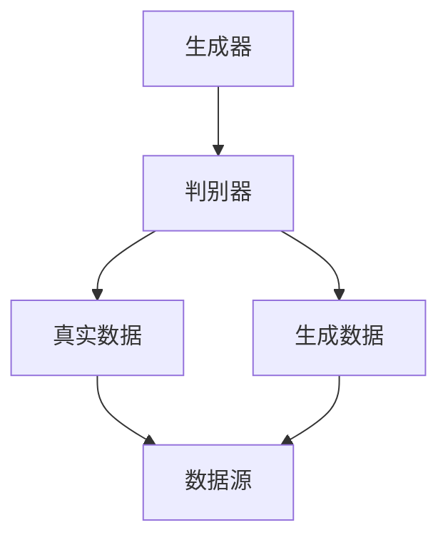
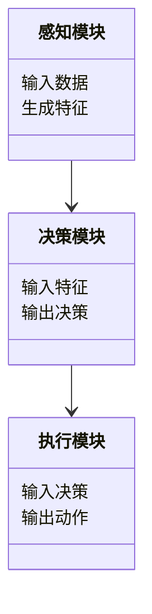
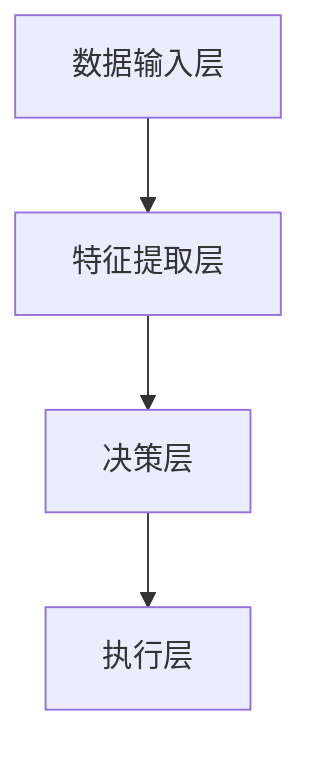

                 


# 对抗训练：提高AI Agent的鲁棒性

## 关键词：  
对抗训练, AI Agent, 鲁棒性, 生成对抗网络, 深度学习, 对抗学习

## 摘要：  
对抗训练是一种通过让模型在对抗环境中学习来提高其鲁棒性和泛化能力的方法。本文详细探讨了对抗训练的基本原理、数学模型、系统架构设计以及实际应用案例，旨在帮助读者理解如何通过对抗训练来提升AI Agent的性能。文章首先介绍了对抗训练的背景和核心概念，然后深入分析了生成对抗网络（GANs）的算法原理，接着通过系统架构设计展示了对抗训练在AI Agent中的具体应用，最后通过项目实战详细讲解了对抗训练的实现过程和案例分析。本文还提供了最佳实践建议，帮助读者在实际项目中有效应用对抗训练技术。

---

## 第1章：对抗训练概述

### 1.1 对抗训练的基本概念

对抗训练是一种机器学习技术，通过让两个或多个模型相互竞争来提高模型的性能。这些模型被称为“对抗者”，它们的目标是互相击败对方。对抗训练的核心思想是通过竞争机制迫使模型学习更复杂的特征，从而提高模型的泛化能力和鲁棒性。

#### 1.1.1 什么是对抗训练？

对抗训练是一种基于博弈论的训练方法，通常涉及两个模型：生成器（Generator）和判别器（Discriminator）。生成器的目标是生成与真实数据无法区分的样本，而判别器的目标是区分真实数据和生成数据。通过不断迭代训练，生成器和判别器的能力都会提升，最终生成器能够生成高质量的数据，判别器则难以准确区分真实数据和生成数据。

#### 1.1.2 对抗训练的核心思想

对抗训练的核心思想是通过引入对抗机制，迫使模型在不同的任务中互相竞争，从而学习到更丰富的特征表示。这种方法不仅能够提高模型的泛化能力，还能增强模型在面对噪声或干扰时的鲁棒性。

#### 1.1.3 对抗训练在AI Agent中的应用

AI Agent需要在复杂的环境中做出决策，对抗训练可以帮助其在对抗性环境中学习，例如在游戏中与对手竞争，或者在安全领域中识别和对抗攻击行为。

---

### 1.2 对抗训练的背景与问题背景

#### 1.2.1 AI Agent面临的挑战

AI Agent需要在动态变化的环境中做出决策，这要求其具有强大的适应能力和鲁棒性。然而，传统的训练方法往往难以应对复杂的对抗性场景，容易被对抗攻击欺骗。

#### 1.2.2 对抗训练的提出及其目标

对抗训练的提出是为了应对AI Agent在对抗性环境中的挑战，其目标是通过让模型在对抗中学习，提高其在复杂环境中的表现。

#### 1.2.3 对抗训练的边界与外延

对抗训练不仅适用于生成模型，还可以应用于分类、检测等多种任务。其外延包括对抗样本生成、模型鲁棒性提升等。

---

### 1.3 对抗训练的核心概念与联系

#### 1.3.1 对抗训练的核心概念原理

对抗训练通过生成器和判别器的对抗，迫使生成器生成更真实的数据，同时判别器更准确地识别数据的来源。这种对抗过程使得生成器和判别器不断优化，最终达到平衡状态。

#### 1.3.2 对抗训练的概念属性特征对比表格

| 特性 | 生成器 | 判别器 |
|------|--------|--------|
| 目标 | 生成真实数据 | 区分真实数据和生成数据 |
| 输入 | 噪声或随机向量 | 真实数据或生成数据 |
| 输出 | 生成数据 | 判别结果（真实或生成） |

#### 1.3.3 对抗训练的ER实体关系图（Mermaid流程图）



---

## 第2章：生成对抗网络（GANs）原理

### 2.1 GANs的基本结构

#### 2.1.1 生成器与判别器的角色

生成器负责生成数据，判别器负责区分生成数据和真实数据。生成器的目标是最小化判别器的错误率，而判别器的目标是最大化正确分类真实数据的能力。

#### 2.1.2 GANs的损失函数

生成器的损失函数和判别器的损失函数需要协调，以实现生成器生成更真实的数据，判别器更准确地识别数据来源。

$$ \text{生成器损失} = -\log(D(G(z))) $$
$$ \text{判别器损失} = -\left( \log(D(x)) + \log(1 - D(G(z))) \right) $$

其中，$D(x)$是判别器对真实数据的判断概率，$D(G(z))$是判别器对生成数据的判断概率，$z$是噪声输入。

#### 2.1.3 GANs的训练过程

生成器和判别器交替训练，生成器通过优化生成数据，使其更接近真实数据分布，而判别器则不断更新以区分真实数据和生成数据。

---

### 2.2 GANs的数学模型与公式

#### 2.2.1 损失函数的数学表达式

生成器的损失函数：

$$ L_G = \mathbb{E}_{z \sim p_z(z)} \left[ -\log D(G(z)) \right] $$

判别器的损失函数：

$$ L_D = \mathbb{E}_{x \sim p_data(x)} \left[ -\log D(x) \right] + \mathbb{E}_{z \sim p_z(z)} \left[ -\log (1 - D(G(z))) \right] $$

其中，$p_z(z)$是生成器的输入分布，$p_data(x)$是真实数据的分布。

#### 2.2.2 生成器和判别器的优化过程

生成器和判别器的参数更新通常使用梯度下降方法，例如Adam优化器。

#### 2.2.3 示例说明

以MNIST数字生成为例，生成器可以生成手写数字图像，判别器则判断输入的数字是否为真实数据。通过不断迭代，生成器能够生成越来越逼真的数字图像。

---

## 第3章：AI Agent的系统架构

### 3.1 系统功能设计

#### 3.1.1 领域模型设计

AI Agent需要具备感知环境、决策和执行的能力，可以通过领域模型将其分解为感知模块、决策模块和执行模块。



#### 3.1.2 系统架构设计

AI Agent的系统架构通常包括数据输入层、特征提取层、决策层和执行层。



#### 3.1.3 系统接口设计

AI Agent需要与外部环境进行交互，通常包括输入接口和输出接口。

#### 3.1.4 系统交互流程

AI Agent通过感知环境获取数据，经过特征提取、决策和执行模块，最终输出动作。

---

## 第4章：项目实战

### 4.1 环境安装与配置

#### 4.1.1 安装Python和必要的库

```bash
pip install numpy matplotlib tensorflow
```

#### 4.1.2 安装TensorFlow或PyTorch

```bash
pip install tensorflow
```

---

### 4.2 对抗训练的代码实现

#### 4.2.1 生成器和判别器的代码实现

```python
import tensorflow as tf
from tensorflow.keras.layers import Dense, LeakyReLU

def make_generator_model():
    model = tf.keras.Sequential([
        Dense(256, activation='relu', input_shape=(100,)),
        Dense(784),
        LeakyReLU(alpha=0.2)
    ])
    return model

def make_discriminator_model():
    model = tf.keras.Sequential([
        Dense(256, activation='relu', input_shape=(784,)),
        Dense(1),
        LeakyReLU(alpha=0.2)
    ])
    return model
```

#### 4.2.2 损失函数和优化器的设置

```python
generator = make_generator_model()
discriminator = make_discriminator_model()

cross_entropy = tf.keras.losses.BinaryCrossentropy()
generator_optimizer = tf.keras.optimizers.Adam(1e-4)
discriminator_optimizer = tf.keras.optimizers.Adam(1e-4)
```

#### 4.2.3 训练过程的代码实现

```python
@tf.function
def train_step(images):
    noise = tf.random.normal([batch_size, 100])
    generated_images = generator(noise)
    real_output = discriminator(images)
    generated_output = discriminator(generated_images)

    loss_g = cross_entropy(tf.ones_like(real_output), generated_output)
    loss_d = cross_entropy(tf.ones_like(real_output), real_output) + cross_entropy(tf.zeros_like(generated_output), generated_output)

    generator_gradients = generator.optimizer.compute_gradients(loss_g, generator.trainable_weights)
    discriminator_gradients = discriminator.optimizer.compute_gradients(loss_d, discriminator.trainable_weights)

    generator.optimizer.apply_gradients(generator_gradients)
    discriminator.optimizer.apply_gradients(discriminator_gradients)

```

---

### 4.3 代码解读与分析

#### 4.3.1 生成器和判别器的结构分析

生成器将噪声输入转换为图像数据，判别器则判断输入是否为真实图像。

#### 4.3.2 损失函数的计算过程

生成器的损失函数衡量生成数据被误判为真实数据的概率，判别器的损失函数衡量其区分真实数据和生成数据的能力。

#### 4.3.3 训练过程中的参数更新

生成器和判别器的参数交替更新，以优化各自的损失函数。

---

### 4.4 案例分析与详细讲解

#### 4.4.1 对抗训练在图像生成中的应用

通过训练生成器和判别器，生成器能够生成高质量的图像，如手写数字或人脸图像。

#### 4.4.2 对抗训练在自然语言处理中的应用

对抗训练可以用于文本生成，生成器生成文本片段，判别器判断其真实性。

---

## 第5章：总结与展望

### 5.1 对抗训练的应用领域

对抗训练已经在图像生成、自然语言处理、游戏AI等领域取得了显著成果。

### 5.2 对抗训练的未来发展

随着算法的改进和计算能力的提升，对抗训练将在更多领域得到应用，进一步推动AI技术的发展。

### 5.3 最佳实践 tips

- 在训练对抗模型时，建议先训练判别器，再训练生成器。
- 定期监控生成器和判别器的损失函数，防止模型崩溃。
- 使用对抗训练时，注意数据分布的均衡性。

---

## 第6章：小结

对抗训练是一种强大的技术，能够显著提高AI Agent的鲁棒性和泛化能力。通过本文的详细讲解，读者可以深入了解对抗训练的原理和应用，并在实际项目中有效应用这一技术。

--- 

希望这篇文章能够为读者提供有价值的信息，并激发他们对对抗训练的兴趣和应用。

