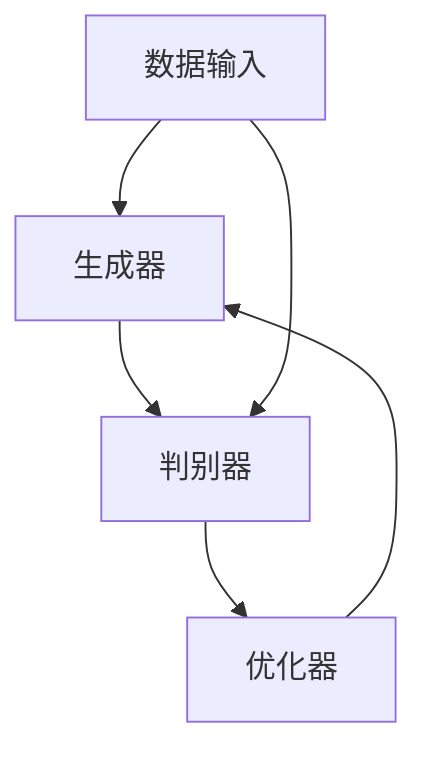

                 

# 对抗训练：提高AI Agent的鲁棒性

> **关键词**: 对抗训练, AI Agent, 鲁棒性, GAN, 深度学习, 系统架构

> **摘要**: 本文深入探讨了对抗训练在提升AI Agent鲁棒性中的应用。通过分析对抗训练的核心原理、算法实现、系统架构及实际案例，本文为AI开发者提供了一套完整的解决方案，帮助他们更好地理解和应用对抗训练技术，从而构建更强大、更鲁棒的AI系统。

---

## 第1章: 对抗训练的背景与概念

### 1.1 对抗训练的基本概念

#### 1.1.1 什么是对抗训练
- 对抗训练是一种基于零和博弈的机器学习方法，通过生成器和判别器的对抗过程，推动模型不断优化。
- 生成器的目标是生成逼真的数据，判别器的目标是识别真实数据与生成数据的区别。
- 对抗训练的核心在于通过“对抗”过程，使生成器和判别器的能力相互提升。

#### 1.1.2 对抗训练的核心思想
- 竞争与平衡：生成器和判别器之间存在竞争，最终达到一种平衡状态，称为纳什均衡。
- 最小最大博弈：通过最小化生成器的最大损失，最大化判别器的最小损失。

#### 1.1.3 对抗训练与传统机器学习的区别
- **输入数据**：传统机器学习依赖于大量标注数据，而对抗训练可以利用生成数据进行优化。
- **模型性能**：对抗训练通过生成器和判别器的互动，显著提升模型的泛化能力。
- **应用场景**：对抗训练在图像生成、语音合成、自然语言处理等领域表现出色。

### 1.2 AI Agent的鲁棒性问题

#### 1.2.1 AI Agent的定义与功能
- AI Agent是一种智能体，能够感知环境、做出决策并采取行动。
- 鲁棒性是指AI Agent在面对不确定性、噪声和异常情况时仍能正常工作的能力。

#### 1.2.2 鲁棒性在AI Agent中的重要性
- **环境适应性**：AI Agent需要在复杂多变的环境中稳定运行。
- **安全与对抗性**：在对抗环境下，鲁棒性是抵御攻击和干扰的关键。
- **用户体验**：鲁棒的AI Agent能够提供更可靠、更稳定的交互体验。

#### 1.2.3 对抗训练如何提升AI Agent的鲁棒性
- **生成多样化的数据**：通过对抗训练，生成器可以生成多样化的数据，增强模型的泛化能力。
- **增强模型的鲁棒性**：对抗训练迫使模型在面对不同类型的输入时保持稳定，从而提升鲁棒性。
- **主动防御**：通过模拟攻击场景，对抗训练可以帮助AI Agent提前识别和抵御潜在的威胁。

### 1.3 对抗训练的背景与应用领域

#### 1.3.1 对抗训练的起源与发展
- **起源**：对抗训练的概念最早可以追溯到GAN（生成对抗网络）的提出，由Ian Goodfellow等人在2014年首次提出。
- **发展**：对抗训练在图像生成、语音合成、自然语言处理等领域取得了显著进展。

#### 1.3.2 对抗训练在AI安全中的应用
- **防御技术**：对抗训练可以用于训练AI Agent识别和抵御对抗性输入，提升模型的安全性。
- **主动防御**：通过模拟攻击场景，对抗训练可以帮助AI Agent提前识别和抵御潜在的威胁。

#### 1.3.3 对抗训练在游戏AI中的应用
- **游戏AI的鲁棒性**：在游戏环境中，AI Agent需要面对各种策略和干扰，对抗训练可以帮助其在复杂环境中保持稳定。
- **游戏生成**：对抗训练可以用于生成多样化的游戏场景和角色，提升游戏体验。

#### 1.3.4 对抗训练在自然语言处理中的应用
- **文本生成**：对抗训练可以用于生成高质量的文本，提升生成模型的鲁棒性。
- **对话系统**：对抗训练可以帮助对话系统在面对多样化的输入时保持稳定，提供更自然的交互体验。

---

## 第2章: 对抗训练的核心概念与原理

### 2.1 对抗训练的原理

#### 2.1.1 生成器与判别器的对抗过程
- **生成器**：生成器的目标是生成能够欺骗判别器的样本。
- **判别器**：判别器的目标是区分真实样本和生成样本。
- **对抗过程**：生成器和判别器在对抗过程中不断优化，最终达到平衡状态。

#### 2.1.2 最小最大博弈与纳什均衡
- **最小最大博弈**：生成器和判别器的目标函数设计为一个最小最大问题，通过优化各自的损失函数来达到平衡。
- **纳什均衡**：在对抗训练中，生成器和判别器的损失函数在达到纳什均衡时，无法通过单方面改变策略来进一步优化。

#### 2.1.3 损失函数的构建与优化
- **生成器的损失函数**：$L_G = -\log(D(G(z)))$
- **判别器的损失函数**：$L_D = -(\log(D(x)) + \log(1 - D(G(z))))$

### 2.2 对抗训练的数学模型

#### 2.2.1 GAN的数学模型
- **生成器**：$G: z \rightarrow x$，将噪声$z$映射到数据空间$x$。
- **判别器**：$D: x \rightarrow \{0,1\}$，判断输入是否为真实数据。
- **联合优化目标**：$\min_{G}\max_{D} \mathbb{E}_{x \sim P_{data}}[\log D(x)] + \mathbb{E}_{z \sim P_z}[\log(1 - D(G(z)))]$

#### 2.2.2 WGAN的数学模型
- **Wasserstein距离**：$W(P_{real}, P_{gen}) = \inf_{\gamma \in \Gamma(P_{real}, P_{gen})} \mathbb{E}_{(x,y)\sim \gamma} \|x - y\|$
- **判别器的改进**：WGAN中的判别器被重新定义为一个 critic，用于估计Wasserstein距离。

#### 2.2.3 其他对敌对训练模型的比较
- **DCGAN**：使用深度卷积生成器和判别器，适用于图像生成。
- **CycleGAN**：用于无监督图像到图像的翻译，如图像风格迁移。
- **条件GAN**：在生成过程中引入条件，生成条件式样本。

### 2.3 对抗训练的训练过程

#### 2.3.1 生成器的训练过程
- **目标**：最大化判别器输出的生成样本的置信度。
- **优化方法**：使用梯度下降，优化生成器的参数以最小化生成样本的损失。

#### 2.3.2 判别器的训练过程
- **目标**：最大化判别器输出的真实样本的置信度，并最小化生成样本的置信度。
- **优化方法**：使用梯度上升，优化判别器的参数以最大化真实样本的损失和生成样本的损失之和。

#### 2.3.3 对抗训练的收敛性分析
- **收敛性问题**：对抗训练可能存在不收敛或在鞍点附近震荡的问题。
- **解决方案**：通过调整学习率、选择合适的优化器、引入标签平滑等方法，可以改善对抗训练的收敛性。

---

## 第3章: 对抗训练的算法原理与实现

### 3.1 基于GAN的对抗训练算法

#### 3.1.1 GAN的基本结构
- **生成器**：使用多层感知机或卷积神经网络。
- **判别器**：使用多层感知机或卷积神经网络。

#### 3.1.2 GAN的损失函数与优化方法
- **损失函数**：$L_GAN = \mathbb{E}_{x \sim P_{real}}[\log D(x)] + \mathbb{E}_{z \sim P_z}[\log(1 - D(G(z)))]$
- **优化方法**：通常使用Adam优化器，设置适当的学习率和动量参数。

#### 3.1.3 GAN的训练技巧与注意事项
- **梯度消失问题**：判别器在训练初期可能面临梯度消失问题，可以通过调整权重初始化、使用标签平滑等方法缓解。
- **模式坍缩问题**：生成器可能生成单一类型的样本，可以通过引入正则化项、使用改进的生成器结构等方法解决。

### 3.2 对抗训练的变体算法

#### 3.2.1 WGAN算法
- **Wasserstein距离**：WGAN使用Wasserstein距离作为判别器的损失函数，可以更稳定地训练生成器和判别器。
- **Lipschitz连续性**：通过限制判别器的Lipschitz连续性，WGAN可以避免梯度消失问题。

#### 3.2.2 GAN-GP算法
- **梯度惩罚**：GAN-GP在判别器的损失函数中引入梯度惩罚项，强制判别器的梯度保持在一定范围内。
- **损失函数**：$L_{GAN-GP} = \mathbb{E}_{x \sim P_{real}}[\log D(x)] + \mathbb{E}_{z \sim P_z}[\log(1 - D(G(z)))] + \lambda \mathbb{E}_{x \sim \hat{P}}[(\|\nabla D(x)\| - 1)^2]$

#### 3.2.3 其他对敌对训练算法的比较
- **DCGAN**：使用深度卷积神经网络结构，适用于高分辨率图像生成。
- **CycleGAN**：用于无监督图像到图像的翻译，无需配对训练数据。
- **条件GAN**：在生成过程中引入条件，生成条件式样本。

### 3.3 对抗训练的实现步骤

#### 3.3.1 环境搭建与依赖安装
- **安装Python**：建议使用Python 3.6及以上版本。
- **安装深度学习库**：安装TensorFlow或PyTorch。
- **安装其他依赖**：安装numpy、matplotlib、scikit-learn等。

#### 3.3.2 数据集准备与预处理
- **数据集选择**：可以选择MNIST、CIFAR-10等常用数据集。
- **数据预处理**：归一化、裁剪、数据增强等。

#### 3.3.3 模型定义与训练实现
- **生成器和判别器的定义**：定义生成器和判别器的神经网络结构。
- **损失函数和优化器**：定义损失函数和选择优化器。
- **训练过程**：定义训练循环，交替训练生成器和判别器。

#### 3.3.4 模型评估与优化
- **生成样本的评估**：通过生成样本的质量、多样性和真实性来评估模型性能。
- **模型优化**：调整学习率、批量大小、正则化参数等，优化模型性能。

---

## 第4章: 对抗训练的系统分析与架构设计

### 4.1 对抗训练的系统架构

#### 4.1.1 系统功能模块划分
- **数据输入模块**：接收输入数据，进行预处理。
- **生成器模块**：生成对抗样本。
- **判别器模块**：判别真实样本和生成样本。
- **优化器模块**：优化生成器和判别器的参数。

#### 4.1.2 系统输入输出设计
- **输入**：噪声向量、真实样本。
- **输出**：生成样本、判别结果。

#### 4.1.3 系统性能指标设计
- **生成样本的质量**：生成样本的逼真度、多样性。
- **判别器的准确率**：判别器正确识别真实样本和生成样本的能力。
- **训练时间**：训练过程的收敛速度。

### 4.2 对抗训练的系统架构图

#### 4.2.1 系统架构图的绘制

#### 4.2.2 各模块之间的交互关系
- 数据输入模块向生成器模块提供噪声向量。
- 生成器模块生成样本后，将其传递给判别器模块。
- 判别器模块将生成样本与真实样本进行比较，返回判别结果。
- 优化器模块根据判别结果，优化生成器和判别器的参数。

#### 4.2.3 系统扩展性设计
- **多任务学习**：在生成器和判别器的基础上，增加其他任务模块。
- **分布式训练**：将生成器和判别器部署在不同的计算节点上，实现分布式训练。

### 4.3 对抗训练的系统接口设计

#### 4.3.1 系统接口设计
- **生成器接口**：`generate_samples(z)`，输入噪声向量$z$，输出生成样本。
- **判别器接口**：`discriminate_samples(x)`，输入样本$x$，输出判别结果。
- **优化器接口**：`train_step(x_real, x_gen)`，输入真实样本和生成样本，优化生成器和判别器的参数。

#### 4.3.2 系统交互流程
1. 数据输入模块接收输入数据，进行预处理。
2. 生成器模块根据预处理后的数据生成样本。
3. 判别器模块将生成样本与真实样本进行比较，返回判别结果。
4. 优化器模块根据判别结果，优化生成器和判别器的参数。
5. 重复上述步骤，直到模型收敛。

---

## 第5章: 对抗训练的项目实战

### 5.1 项目背景与目标

#### 5.1.1 项目背景
- **目标**：训练一个鲁棒的AI Agent，能够在复杂环境中稳定运行。
- **应用场景**：图像生成、语音合成、自然语言处理等。

#### 5.1.2 项目目标
- **生成高质量的样本**：生成逼真的图像、语音或文本。
- **提升模型的鲁棒性**：通过对抗训练，提升模型的泛化能力和抗干扰能力。

### 5.2 项目实施步骤

#### 5.2.1 环境搭建与依赖安装
- **安装Python**：建议使用Python 3.6及以上版本。
- **安装深度学习库**：安装TensorFlow或PyTorch。
- **安装其他依赖**：安装numpy、matplotlib、scikit-learn等。

#### 5.2.2 数据集准备与预处理
- **数据集选择**：可以选择MNIST、CIFAR-10等常用数据集。
- **数据预处理**：归一化、裁剪、数据增强等。

#### 5.2.3 模型定义与训练实现
- **生成器和判别器的定义**：定义生成器和判别器的神经网络结构。
- **损失函数和优化器**：定义损失函数和选择优化器。
- **训练过程**：定义训练循环，交替训练生成器和判别器。

#### 5.2.4 模型评估与优化
- **生成样本的评估**：通过生成样本的质量、多样性和真实性来评估模型性能。
- **模型优化**：调整学习率、批量大小、正则化参数等，优化模型性能。

### 5.3 项目实战案例分析

#### 5.3.1 实战案例：图像生成
- **数据集**：使用MNIST手写数字数据集。
- **模型结构**：定义生成器和判别器的卷积神经网络结构。
- **训练过程**：训练生成器和判别器，生成逼真的手写数字。
- **结果分析**：通过生成样本的质量和判别器的准确率，评估模型性能。

#### 5.3.2 实战案例：语音合成
- **数据集**：使用语音数据集，如LibriSpeech。
- **模型结构**：定义生成器和判别器的循环神经网络结构。
- **训练过程**：训练生成器和判别器，生成逼真的语音。
- **结果分析**：通过语音质量评估指标，如MOS（Mean Opinion Score），评估模型性能。

### 5.4 项目总结与经验分享

#### 5.4.1 项目总结
- **项目成果**：通过对抗训练，成功训练出一个鲁棒的AI Agent。
- **关键点总结**：对抗训练的核心在于生成器和判别器的对抗过程，通过不断优化模型参数，提升生成样本的质量和判别器的准确率。

#### 5.4.2 经验分享
- **选择合适的算法**：根据具体应用场景选择合适的对抗训练算法，如GAN、WGAN等。
- **优化模型参数**：合理设置学习率、批量大小等参数，避免模型发散或收敛过慢。
- **数据预处理**：高质量的数据预处理可以显著提升模型性能，建议在训练前对数据进行充分的清洗和增强。

---

## 第6章: 对抗训练的最佳实践与总结

### 6.1 对抗训练的最佳实践

#### 6.1.1 选择合适的算法
- **根据任务选择**：根据具体任务需求选择合适的对抗训练算法，如GAN、WGAN等。
- **实验验证**：通过实验验证不同算法在具体任务中的表现，选择最优算法。

#### 6.1.2 优化模型参数
- **学习率调整**：使用学习率衰减策略，逐步降低学习率。
- **批量大小**：选择合适的批量大小，平衡训练速度和模型性能。
- **正则化**：引入适当的正则化项，防止模型过拟合。

#### 6.1.3 数据预处理与增强
- **数据清洗**：对数据进行去噪、去重等处理，提升数据质量。
- **数据增强**：通过数据增强技术，增加数据多样性，提升模型的泛化能力。

### 6.2 对抗训练的注意事项

#### 6.2.1 模型的收敛性
- **收敛问题**：对抗训练可能存在不收敛或在鞍点附近震荡的问题，需要通过调整模型结构和优化策略来解决。
- **模式坍缩**：生成器可能生成单一类型的样本，可以通过引入正则化项或改进生成器结构来缓解。

#### 6.2.2 训练过程中的稳定性
- **训练不稳定性**：对抗训练过程中，生成器和判别器的损失函数可能存在不稳定的情况，需要通过调整优化策略和参数设置来改善。
- **梯度消失与爆炸**：合理设置权重初始化和优化器参数，防止梯度消失或爆炸问题。

### 6.3 对抗训练的总结与未来展望

#### 6.3.1 总结
- **对抗训练的核心思想**：通过生成器和判别器的对抗过程，提升模型的生成能力和判别能力。
- **对抗训练的应用价值**：对抗训练在图像生成、语音合成、自然语言处理等领域表现出色，为AI Agent的鲁棒性提升提供了有效的解决方案。

#### 6.3.2 未来展望
- **算法优化**：研究更高效的对抗训练算法，解决现有算法的收敛性问题和训练效率问题。
- **多任务学习**：探索对抗训练在多任务学习中的应用，提升模型的综合性能。
- **跨模态对抗训练**：研究跨模态的对抗训练方法，如图像与文本的联合生成，提升模型的跨模态理解能力。

---

## 第7章: 对抗训练的未来研究方向

### 7.1 对抗训练的未来研究方向

#### 7.1.1 更高效的对抗训练算法
- **改进的优化策略**：研究更高效的优化方法，如使用更先进的优化器或优化策略。
- **多任务对抗训练**：探索对抗训练在多任务学习中的应用，提升模型的综合性能。
- **自适应对抗训练**：研究自适应的对抗训练方法，根据环境变化动态调整生成器和判别器的策略。

#### 7.1.2 对抗训练的跨模态应用
- **图像与文本的联合生成**：研究图像与文本联合生成的对抗训练方法。
- **语音与图像的联合生成**：探索语音与图像联合生成的对抗训练方法。
- **多模态对抗训练**：研究多模态数据的联合生成，提升模型的跨模态理解能力。

#### 7.1.3 对抗训练的安全与防御应用
- **主动防御技术**：研究对抗训练在主动防御中的应用，提升模型的安全性。
- **防御对抗攻击**：探索对抗训练在防御对抗攻击中的应用，提升模型的鲁棒性。
- **安全对抗训练**：研究安全对抗训练方法，提升模型在安全环境中的表现。

### 7.2 对抗训练的挑战与机遇

#### 7.2.1 挑战
- **模型的收敛性问题**：对抗训练可能存在不收敛或在鞍点附近震荡的问题。
- **训练效率问题**：对抗训练的训练过程可能较慢，需要优化训练效率。
- **模型的可解释性问题**：对抗训练生成的模型可能缺乏可解释性，需要研究模型的可解释性。

#### 7.2.2 机遇
- **技术进步**：对抗训练在图像生成、语音合成、自然语言处理等领域取得显著进展，为AI Agent的鲁棒性提升提供了新的可能性。
- **跨领域应用**：对抗训练在多个领域中的成功应用，为对抗训练的进一步研究提供了丰富的应用场景。
- **算法创新**：对抗训练的不断改进和创新，为AI技术的发展提供了新的方向。

---

## 参考文献

1. Goodfellow, I., Pouget-Abadie, J., Mirza, M., ..., & Bengio, Y. (2014). Generative adversarial nets. In *Advances in neural information processing systems* (pp. 2672-2680).
2. Arjovsky, M., Chintala, S., & Bottou, L. (2017). Wasserstein generative adversarial networks. In *International conference on machine learning* (pp. 214-223).
3. Gulrajani, I., Ahmed, F., Alain, G., & Yosinski, A. (2017). Improved training of Wasserstein GANs. In *Proceedings of the 34th international conference on machine learning-Volume 70*, 1558-1567.
4. Brock, A., Bridle, J., Bojanowski, C., & Larochelle, H. (2018). Large scale GAN training using label smoothing. In *Proceedings of the 35th international conference on machine learning*, 668-677.
5. He, K., Zhang, X., Ren, S., & Sun, J. (2015). Deep residual learning for image recognition. In *Proceedings of the IEEE conference on computer vision and pattern recognition*, 770-778.

