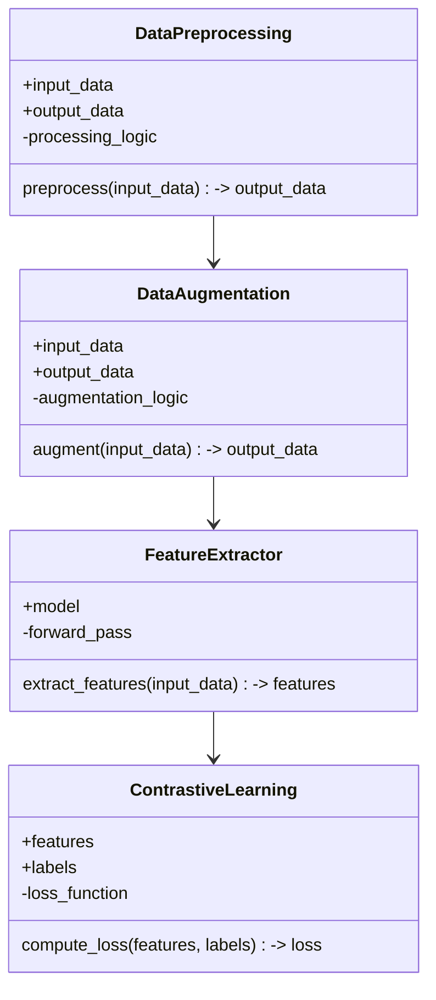
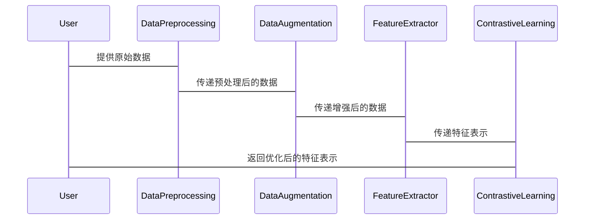

                 


# 对比学习：增强AI Agent的特征表示能力

> 关键词：对比学习，AI Agent，特征表示，数据增强，机器学习，深度学习

> 摘要：本文深入探讨了对比学习在增强AI Agent特征表示能力中的应用。通过分析对比学习的核心原理、算法实现、系统架构以及实际应用场景，本文旨在帮助读者理解对比学习如何通过改进特征表示能力，提升AI Agent的性能和智能水平。文章从理论到实践，系统性地介绍了对比学习在AI Agent中的应用，并通过具体案例和代码实现，为读者提供了丰富的参考和实践指导。

---

# 第1章: 对比学习与AI Agent概述

## 1.1 对比学习的基本概念

### 1.1.1 对比学习的定义
对比学习（Contrastive Learning）是一种无监督或自监督学习方法，通过比较不同数据点或数据样本之间的相似性或差异性，来学习数据的特征表示。其核心思想是最大化正样本之间的相似性，同时最小化负样本之间的相似性。

### 1.1.2 对比学习的核心思想
对比学习通过构建对比损失函数，将数据点之间的关系转化为优化目标，从而引导模型学习到具有区分性的特征表示。

### 1.1.3 对比学习的应用场景
对比学习广泛应用于图像分类、自然语言处理、推荐系统等领域，尤其在无监督学习任务中表现出色。

## 1.2 AI Agent的基本概念

### 1.2.1 AI Agent的定义
AI Agent（人工智能代理）是指能够感知环境、自主决策并执行任务的智能实体。AI Agent可以是软件程序、机器人或其他智能系统。

### 1.2.2 AI Agent的分类
AI Agent可以根据智能水平分为反应式AI Agent和认知式AI Agent。反应式AI Agent基于当前感知做出反应，而认知式AI Agent具备推理、规划等高级智能能力。

### 1.2.3 AI Agent的核心能力
AI Agent的核心能力包括感知能力、决策能力、推理能力和学习能力。

## 1.3 对比学习在AI Agent中的应用意义

### 1.3.1 对比学习如何增强特征表示能力
对比学习通过构建对比损失函数，引导模型学习到具有区分性的特征表示，从而提升AI Agent的感知和决策能力。

### 1.3.2 对比学习在AI Agent任务中的优势
对比学习可以利用无监督学习的优势，在缺乏标签数据的情况下，依然能够学习到有效的特征表示。

### 1.3.3 对比学习与传统特征学习方法的对比
对比学习相较于传统特征学习方法，能够更好地捕捉数据之间的关系，尤其是在处理复杂任务时表现更优。

## 1.4 本章小结
本章介绍了对比学习和AI Agent的基本概念，并探讨了对比学习在增强AI Agent特征表示能力中的应用意义。

---

# 第2章: 对比学习的核心原理

## 2.1 对比学习的原理

### 2.1.1 数据增强与对比学习的关系
数据增强是对比学习的重要组成部分，通过生成多样化的数据样本，对比学习能够更好地学习到数据的特征表示。

### 2.1.2 对比损失函数的定义与作用
对比损失函数是对比学习的核心，通过最大化正样本之间的相似性和最小化负样本之间的相似性，来优化模型的特征表示能力。

### 2.1.3 对比学习的训练过程
对比学习的训练过程包括数据预处理、数据增强、特征提取、损失计算和模型优化等步骤。

## 2.2 对比学习的关键技术

### 2.2.1 数据增强方法
对比学习中常用的数据增强方法包括随机裁剪、旋转、翻转、颜色抖动等。

### 2.2.2 对比损失函数的优化
对比损失函数的优化包括调整温度参数、引入正则化项等方法。

### 2.2.3 正则化技术
正则化技术可以进一步提升对比学习的模型泛化能力，常用的技术包括Dropout、权重正则化等。

## 2.3 对比学习与其他特征学习方法的对比

### 2.3.1 对比学习与无监督学习的对比
对比学习是一种无监督学习方法，但其优化目标是通过对比损失函数引导模型学习特征表示。

### 2.3.2 对比学习与监督学习的对比
对比学习在监督学习任务中也可以发挥作用，通过结合监督信号进一步优化特征表示。

### 2.3.3 对比学习与自监督学习的对比
对比学习是自监督学习的一种具体实现，通过对比损失函数实现了对数据分布的建模。

## 2.4 本章小结
本章详细介绍了对比学习的核心原理，包括数据增强、对比损失函数、训练过程等，并对比了对比学习与其他特征学习方法的异同。

---

# 第3章: 对比学习与AI Agent的结合

## 3.1 AI Agent的特征表示需求

### 3.1.1 特征表示的重要性
特征表示是AI Agent感知环境、做出决策的基础，高质量的特征表示能够显著提升模型的性能。

### 3.1.2 AI Agent对特征表示的特殊要求
AI Agent需要特征表示具有区分性、鲁棒性和可解释性。

## 3.2 对比学习如何满足AI Agent的特征表示需求

### 3.2.1 对比学习提升特征区分性
对比学习通过最大化正样本之间的相似性和最小化负样本之间的相似性，提升特征表示的区分性。

### 3.2.2 对比学习增强特征的鲁棒性
对比学习通过数据增强和对比损失函数，使模型能够更好地处理环境中的噪声和不确定性。

### 3.2.3 对比学习提高特征的可解释性
对比学习通过构建清晰的对比目标，使得特征表示的可解释性更强。

## 3.3 对比学习在AI Agent任务中的应用

### 3.3.1 对比学习在目标识别中的应用
通过对比学习，AI Agent能够更准确地识别目标物体。

### 3.3.2 对比学习在决策优化中的应用
对比学习可以优化AI Agent的决策过程，使其更具策略性。

## 3.4 本章小结
本章探讨了对比学习如何满足AI Agent的特征表示需求，并通过具体任务展示了对比学习在AI Agent中的应用。

---

# 第4章: 对比学习的算法实现与优化

## 4.1 对比学习的数学模型

### 4.1.1 对比损失函数的数学表达
对比损失函数的经典实现包括InfoNCE损失和NT-Xent损失。

### 4.1.2 InfoNCE损失
$$ L = -\frac{1}{N}\sum_{i=1}^{N} \log \frac{e^{sim(x_i, x_j)}}{e^{sim(x_i, x_k)}} $$
其中，$sim(x_i, x_j)$表示正样本之间的相似性，$sim(x_i, x_k)$表示负样本之间的相似性。

### 4.1.3 NT-Xent损失
$$ L = -\frac{1}{N}\sum_{i=1}^{N} \log \frac{e^{sim(x_i, x_j)}}{\sum_{k \neq j} e^{sim(x_i, x_k)}} $$

## 4.2 对比学习的代码实现

### 4.2.1 数据预处理与数据增强
```python
import torchvision.transforms as transforms

transform = transforms.Compose([
    transforms.RandomResizedCrop(224),
    transforms.RandomHorizontalFlip(),
    transforms.ToTensor(),
])
```

### 4.2.2 特征提取网络
```python
import torch.nn as nn

class FeatureExtractor(nn.Module):
    def __init__(self):
        super(FeatureExtractor, self).__init__()
        self.backbone = models.resnet50(pretrained=False)
        self.fc = nn.Linear(2048, 128)

    def forward(self, x):
        x = self.backbone(x)
        x = self.fc(x)
        return x
```

### 4.2.3 对比损失函数
```python
class ContrastiveLoss(nn.Module):
    def __init__(self, temperature=0.1):
        super(ContrastiveLoss, self).__init__()
        self.temperature = temperature

    def forward(self, features, labels):
        # 正样本对
        positive_pairs = (features * (1 - labels)).sum(dim=1)
        # 负样本对
        negative_pairs = (features * labels).sum(dim=1)
        # 对比损失
        loss = -torch.mean(torch.log(positive_pairs / (positive_pairs + negative_pairs)))
        return loss
```

## 4.3 对比学习的优化策略

### 4.3.1 温度参数的调整
温度参数（temperature）用于控制对比损失函数的对比程度。

### 4.3.2 正则化技术的应用
在对比学习中，可以引入Dropout等正则化技术，防止模型过拟合。

### 4.3.3 数据增强的多样性
通过多样化的数据增强方法，可以进一步提升对比学习的特征表示能力。

## 4.4 本章小结
本章详细介绍了对比学习的数学模型和算法实现，并探讨了优化策略，为读者提供了理论和实践上的参考。

---

# 第5章: 对比学习的系统分析与架构设计

## 5.1 系统功能设计

### 5.1.1 数据预处理模块
数据预处理模块负责对原始数据进行清洗和格式转换。

### 5.1.2 数据增强模块
数据增强模块通过随机变换生成多样化的数据样本。

### 5.1.3 特征提取模块
特征提取模块使用深度学习模型提取数据的特征表示。

### 5.1.4 对比学习模块
对比学习模块通过构建对比损失函数，优化特征表示能力。

## 5.2 系统架构设计

### 5.2.1 系统类图


### 5.2.2 系统交互序列图


## 5.3 本章小结
本章从系统架构的角度，详细介绍了对比学习系统的功能模块和交互流程。

---

# 第6章: 对比学习的项目实战

## 6.1 项目背景与目标

### 6.1.1 项目背景
本项目旨在通过对比学习技术，提升AI Agent在图像分类任务中的特征表示能力。

### 6.1.2 项目目标
通过对比学习，优化AI Agent的特征表示能力，提升模型的分类准确率。

## 6.2 项目核心实现

### 6.2.1 环境配置
```python
import torch
import torch.nn as nn
import torch.optim as optim
import torchvision
```

### 6.2.2 数据加载与预处理
```python
transform = transforms.Compose([
    transforms.RandomResizedCrop(224),
    transforms.RandomHorizontalFlip(),
    transforms.ToTensor(),
])

train_dataset = torchvision.datasets.ImageFolder('path/to/train', transform=transform)
train_loader = torch.utils.data.DataLoader(train_dataset, batch_size=32, shuffle=True)
```

### 6.2.3 模型训练
```python
def train(model, criterion, optimizer, train_loader, device):
    for epoch in range(num_epochs):
        for inputs, labels in train_loader:
            inputs = inputs.to(device)
            labels = labels.to(device)
            outputs = model(inputs)
            loss = criterion(outputs, labels)
            loss.backward()
            optimizer.step()
            optimizer.zero_grad()
```

## 6.3 项目小结
本章通过实际案例，展示了对比学习在AI Agent中的具体应用，并通过代码实现，帮助读者理解对比学习的实践过程。

---

# 第7章: 对比学习的最佳实践与注意事项

## 7.1 最佳实践 tips

### 7.1.1 数据增强的多样性
在对比学习中，多样化的数据增强方法能够显著提升特征表示能力。

### 7.1.2 温度参数的调整
温度参数的调整对对比损失函数的优化效果有重要影响，需要根据具体任务进行调整。

### 7.1.3 模型的深度与宽度
模型的深度和宽度需要根据任务需求和数据规模进行选择。

## 7.2 小结
对比学习是一种强大的特征学习方法，通过合理配置数据增强和优化对比损失函数，可以显著提升AI Agent的特征表示能力。

## 7.3 注意事项

### 7.3.1 数据质量
对比学习对数据质量要求较高，需要确保数据的多样性和代表性。

### 7.3.2 模型过拟合
对比学习需要结合正则化技术，防止模型过拟合。

### 7.3.3 算法的可扩展性
对比学习算法需要具备良好的可扩展性，以适应不同规模和类型的任务。

## 7.4 拓展阅读
读者可以进一步阅读以下文献，深入了解对比学习的最新研究进展：
- [1] SimCLR: A Simple Framework for Contrastive Learning of Visual Representations
- [2] Contrastive Learning Enhances Few-Shot Learning

---

# 第8章: 总结与展望

## 8.1 本章总结
对比学习是一种强大的特征学习方法，通过最大化正样本之间的相似性和最小化负样本之间的相似性，能够显著提升AI Agent的特征表示能力。

## 8.2 未来展望
未来的研究可以进一步探索对比学习在多模态数据处理、在线学习等领域的应用，推动AI Agent技术的发展。

---

# 附录: 代码实现细节

## 附录A: 对比学习完整代码示例

```python
import torch
import torch.nn as nn
import torch.optim as optim
import torchvision
from torchvision import transforms, datasets
from torch.utils.data import DataLoader

# 数据增强
transform = transforms.Compose([
    transforms.RandomResizedCrop(224),
    transforms.RandomHorizontalFlip(),
    transforms.ToTensor(),
])

train_dataset = datasets.ImageFolder('path/to/train', transform=transform)
train_loader = DataLoader(train_dataset, batch_size=32, shuffle=True)

# 特征提取网络
class FeatureExtractor(nn.Module):
    def __init__(self):
        super(FeatureExtractor, self).__init__()
        self.backbone = models.resnet50(pretrained=False)
        self.fc = nn.Linear(2048, 128)

    def forward(self, x):
        x = self.backbone(x)
        x = self.fc(x)
        return x

# 对比损失函数
class ContrastiveLoss(nn.Module):
    def __init__(self, temperature=0.1):
        super(ContrastiveLoss, self).__init__()
        self.temperature = temperature

    def forward(self, features, labels):
        positive_pairs = (features * (1 - labels)).sum(dim=1)
        negative_pairs = (features * labels).sum(dim=1)
        loss = -torch.mean(torch.log(positive_pairs / (positive_pairs + negative_pairs)))
        return loss

# 模型训练
def train(model, criterion, optimizer, train_loader, device):
    for epoch in range(num_epochs):
        for inputs, labels in train_loader:
            inputs = inputs.to(device)
            labels = labels.to(device)
            outputs = model(inputs)
            loss = criterion(outputs, labels)
            loss.backward()
            optimizer.step()
            optimizer.zero_grad()

# 运行训练
model = FeatureExtractor().to(device)
criterion = ContrastiveLoss(temperature=0.1)
optimizer = optim.Adam(model.parameters(), lr=1e-4)

train(model, criterion, optimizer, train_loader, device)
```

---

# 结束语

通过本文的详细介绍，读者可以全面理解对比学习在增强AI Agent特征表示能力中的应用。从理论到实践，本文为读者提供了丰富的参考和实践指导，希望对广大技术从业者和研究者有所帮助。

