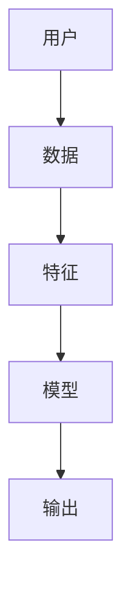
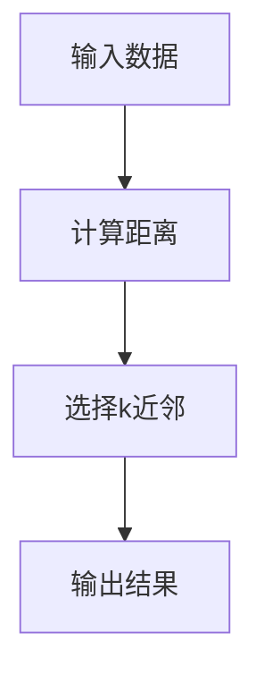
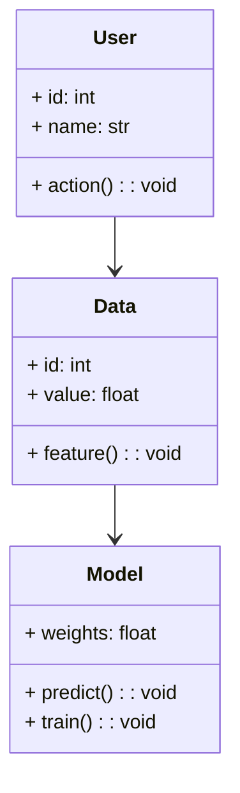
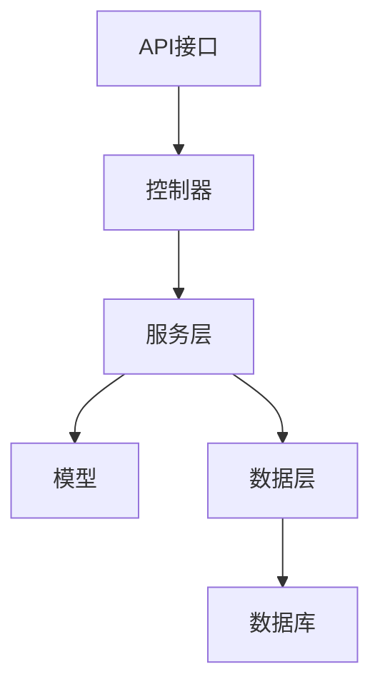

                 


# 少样本学习：在有限数据下快速适应

> 关键词：少样本学习，数据稀缺，模型泛化，算法优化，人工智能

> 摘要：少样本学习（Few-shot Learning）是一种在数据稀缺情况下，通过有限样本快速适应新任务的学习方法。本文将深入探讨少样本学习的核心概念、算法原理、系统架构及应用场景，结合具体案例分析，帮助读者理解如何在有限数据下训练高效的模型。

---

## 第1章：少样本学习的背景与问题描述

### 1.1 少样本学习的定义与背景

#### 1.1.1 数据不足的挑战
在现实应用中，数据获取往往面临以下问题：
- 数据标注成本高昂
- 数据收集受限（如隐私保护）
- 特定领域数据稀缺

例如，在医疗领域，某些罕见病的数据样本可能非常有限。

#### 1.1.2 少样本学习的定义
少样本学习是一种机器学习方法，通过利用少量标注样本和大量未标注样本，使模型能够快速适应新任务。

#### 1.1.3 少样本学习的边界与外延
- 少样本学习的边界：在标注样本数量有限的情况下，如何最大化利用未标注数据。
- 外延：结合半监督学习、无监督学习等方法。

### 1.2 少样本学习的核心问题

#### 1.2.1 数据稀缺性对模型的影响
- 数据不足导致模型过拟合训练样本。
- 模型缺乏泛化能力。

#### 1.2.2 模型的泛化能力需求
- 少样本学习要求模型具备良好的泛化能力。
- 通过迁移学习、元学习等方法提升模型性能。

#### 1.2.3 少样本学习与监督学习的对比
| 对比维度 | 监督学习                     | 少样本学习                   |
|----------|------------------------------|-------------------------------|
| 数据需求 | 需要大量标注数据             | 仅需要少量标注数据           |
| 模型复杂度 | 模型复杂度高                 | 模型复杂度相对较低           |
| 训练时间 | 训练时间较长                 | 训练时间较短                 |

### 1.3 少样本学习的应用场景

#### 1.3.1 医疗领域的应用
- 病例分类：如罕见病诊断。
- 图像识别：如医学影像分析。

#### 1.3.2 计算机视觉中的应用
- 图像分类：如目标检测。
- 视频分析：如行为识别。

#### 1.3.3 自然语言处理中的应用
- 文本分类：如情感分析。
- 问答系统：如小样本对话生成。

---

## 第2章：少样本学习的核心概念与联系

### 2.1 少样本学习的核心原理

#### 2.1.1 数据增强的原理
- 数据增强通过变换已有样本生成新样本，如旋转、缩放、翻转等。

#### 2.1.2 特征提取的重要性
- 特征提取是将数据转化为低维特征向量的过程。
- 使用预训练模型提取特征，如ResNet、BERT等。

#### 2.1.3 模型的泛化能力
- 泛化能力指模型在新数据上的表现。
- 通过数据增强、正则化等方法提升泛化能力。

### 2.2 少样本学习的概念对比表

| 对比维度 | 监督学习 | 半监督学习 | 无监督学习 | 少样本学习 |
|----------|----------|------------|------------|------------|
| 标签数据 | 全部标注 | 部分标注   | 无标注     | 少量标注   |
| 数据需求 | 高       | 中         | 低         | 低         |
| 算法复杂度 | 高       | 中         | 中         | 中         |

### 2.3 少样本学习的ER实体关系图



---

## 第3章：少样本学习的算法原理

### 3.1 基于距离的少样本学习算法

#### 3.1.1 k-近邻算法（k-Nearest Neighbor）

- **原理**：通过计算样本之间的距离，选择k个最近的样本进行分类或回归。
- **流程图**：



- **数学公式**：
  - 距离计算：欧氏距离：$$d(x_i, x_j) = \sqrt{\sum_{p=1}^{n}(x_{ip} - x_{jp})^2}$$
  - k-近邻分类：$$y = \arg\max_{y_i} \sum_{j=1}^{k} \delta(y_j = y_i)$$

#### 3.1.2 算法实现代码

```python
import numpy as np

def k_nearest_neighbor(X_train, y_train, X_test, k):
    n_samples, n_features = X_train.shape
    n_test = X_test.shape[0]
    
    # 计算距离矩阵
    dist_matrix = np.zeros((n_test, n_samples))
    for i in range(n_test):
        for j in range(n_samples):
            dist = np.linalg.norm(X_test[i] - X_train[j])
            dist_matrix[i, j] = dist
    
    # 找到k近邻并预测
    y_pred = []
    for i in range(n_test):
        nearest_indices = np.argsort(dist_matrix[i])[:k]
        nearest_labels = y_train[nearest_indices]
        y_pred.append(np.argmax(np.bincount(nearest_labels)))
    
    return np.array(y_pred)
```

---

## 第4章：少样本学习的系统分析与架构设计

### 4.1 问题场景介绍

- **场景描述**：医疗图像分类，仅提供少量样本。
- **系统目标**：设计一个能够快速适应新任务的分类系统。

### 4.2 领域模型设计



### 4.3 系统架构设计



### 4.4 系统接口设计

- **API接口**：
  - POST /train
  - GET /predict

---

## 第5章：少样本学习的项目实战

### 5.1 环境安装

```bash
pip install numpy scikit-learn
```

### 5.2 系统核心实现源代码

```python
import numpy as np
from sklearn.neighbors import KNeighborsClassifier

# 数据准备
X_train = np.array([[1, 2], [3, 4], [5, 6]])
y_train = np.array([0, 1, 0])
X_test = np.array([[2, 3], [4, 5]])

# 模型训练
knn = KNeighborsClassifier(n_neighbors=3)
knn.fit(X_train, y_train)

# 预测
y_pred = knn.predict(X_test)
print(y_pred)
```

### 5.3 实际案例分析

- **案例分析**：医疗图像分类。
- **代码解读**：通过k-近邻算法实现分类。

### 5.4 项目小结

- **经验总结**：数据增强和特征提取是关键。
- **优化建议**：结合迁移学习提升性能。

---

## 第6章：少样本学习的最佳实践

### 6.1 小结

- 少样本学习在数据稀缺情况下具有重要应用价值。

### 6.2 注意事项

- 数据质量比数量更重要。
- 模型选择需结合具体任务需求。

### 6.3 拓展阅读

- 《Deep Learning》
- 《Pattern Recognition and Machine Learning》

---

通过本文的详细讲解，读者可以全面理解少样本学习的核心概念、算法原理和实际应用。希望本文能为相关领域的研究和实践提供有价值的参考。

