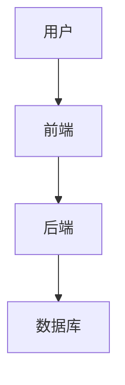
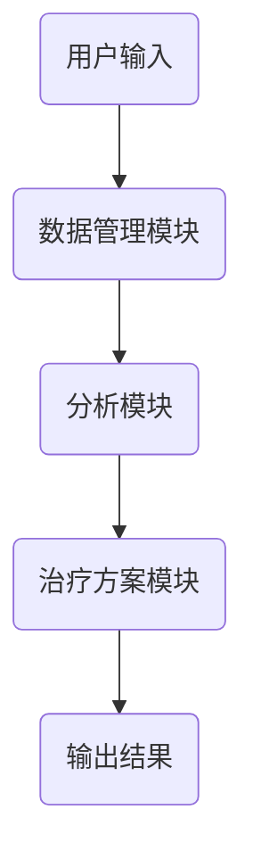
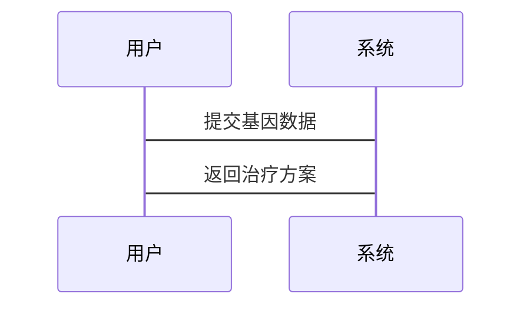

                 


# 巴菲特-芒格的基因治疗个性化医疗投资：精准医学的新纪元

---

## 关键词：
- 巴菲特、芒格、基因治疗、个性化医疗、精准医学、投资策略、医疗创新

---

## 摘要：
本文深入探讨了巴菲特和芒格在基因治疗和个性化医疗领域的投资策略，结合精准医学的最新进展，分析了这一领域的投资价值和未来趋势。文章从精准医学和基因治疗的背景出发，详细阐述了巴菲特和芒格的投资理念，并通过具体案例展示了这些理念在基因治疗中的应用。同时，本文还探讨了基因治疗的核心概念、算法原理、系统架构以及项目实战，为读者提供了全面而深入的分析。

---

## 第一部分：精准医学与基因治疗的背景

### 第1章：精准医学与基因治疗概述

#### 1.1 精准医学的定义与特点
##### 1.1.1 精准医学的定义
精准医学（Precision Medicine）是一种基于患者个体特征（如基因、环境和生活方式）的医疗模式，旨在通过个性化治疗方案提高疗效和生活质量。

##### 1.1.2 精准医学的核心特点
- **个体化**：针对患者个体特征制定治疗方案。
- **预防性**：通过早期预测和干预减少疾病发生。
- **高效性**：提高治疗效果，降低副作用。

##### 1.1.3 精准医学与传统医学的区别
| 特性 | 精准医学 | 传统医学 |
|------|----------|-----------|
| 治疗方式 | 个体化 | 统一化     |
| 数据依赖 | 高度依赖基因组数据 | 较少依赖个体数据 |
| 疗效 | 高效 | 一般       |

#### 1.2 基因治疗的定义与技术
##### 1.2.1 基因治疗的定义
基因治疗（Gene Therapy）是通过修改或替换患者体内的基因来治疗或预防疾病的方法。

##### 1.2.2 基因治疗的主要技术
- **基因编辑**：CRISPR-Cas9技术。
- **基因替换**：利用病毒载体将正常基因导入患者体内。
- **基因增强**：增强特定基因的功能。

##### 1.2.3 基因治疗的现状与挑战
- **现状**：基因治疗已在某些罕见病和癌症中取得突破。
- **挑战**：技术复杂、成本高、伦理问题。

#### 1.3 个性化医疗的投资价值
##### 1.3.1 个性化医疗的市场潜力
- **市场规模**：预计未来几年将快速增长。
- **需求驱动**：患者对个性化治疗的需求增加。

##### 1.3.2 个性化医疗的投资机会
- **技术创新**：基因编辑和测序技术的进步。
- **政策支持**：各国政府对精准医学的重视。

##### 1.3.3 个性化医疗的未来趋势
- **智能化**：结合人工智能优化治疗方案。
- **全球化**：跨国合作推动技术发展。

### 第2章：巴菲特与芒格的投资理念

#### 2.1 巴菲特的价值投资理论
##### 2.1.1 巴菲特的投资哲学
- **长期投资**：寻找具有持续竞争优势的企业。
- **价值投资**：以合理价格买入优质资产。

##### 2.1.2 巴菲特的选股标准
- **护城河**：企业具有竞争优势。
- **管理团队**：管理层优秀且诚信。
- **财务健康**：企业财务稳健。

##### 2.1.3 巴菲特的成功案例
- **可口可乐**：长期投资带来丰厚回报。
- **苹果公司**：巴菲特定价买入，长期持有。

#### 2.2 芒格的多元思维模型
##### 2.2.1 芒格的多元思维模型概述
- **跨学科思维**：将不同领域的知识结合起来。
- **决策框架**：通过多维度分析做出决策。

##### 2.2.2 芒格的决策框架
- **逆向思维**：从反面思考问题。
- **概率思维**：评估事件发生的可能性。

##### 2.2.3 芒格的思维优势
- **跨领域知识**：广泛涉猎多个领域。
- **独立思考**：不随大流，坚持自己的判断。

#### 2.3 巴菲特与芒格的基因治疗投资策略
##### 2.3.1 巴菲特与芒格的基因治疗投资逻辑
- **长期看好**：认为基因治疗是未来医疗的重要方向。
- **价值投资**：寻找具有竞争优势的基因治疗企业。
- **风险管理**：分散投资，降低风险。

##### 2.3.2 巴菲特与芒格的基因治疗投资案例
- **投资基因编辑公司**：如CRISPR Therapeutics。
- **投资个性化医疗平台**：如llumina。

##### 2.3.3 巴菲特与芒格的基因治疗投资展望
- **技术创新**：基因治疗技术的进一步突破。
- **市场扩展**：个性化医疗的广泛应用。

---

## 第二部分：基因治疗的核心概念

### 第3章：基因治疗的核心概念

#### 3.1 基因治疗的定义与分类
##### 3.1.1 基因治疗的定义
基因治疗是通过修改或替换患者体内的基因来治疗或预防疾病的方法。

##### 3.1.2 基因治疗的分类
- **体外基因治疗**：在实验室中修改细胞，再输回患者体内。
- **体内基因治疗**：直接将基因导入患者体内。
- **基因增强**：增强特定基因的功能。

##### 3.1.3 基因治疗的优缺点
| 优点 | 缺点 |
|------|------|
| 治疗效果显著 | 技术复杂 |
| 针对性强 | 成本高 |
| 持久性好 | 伦理争议 |

#### 3.2 个性化医疗的核心要素
##### 3.2.1 个性化医疗的定义
个性化医疗是根据患者个体特征制定的治疗方案。

##### 3.2.2 个性化医疗的核心要素
- **基因组数据**：患者的基因信息。
- **疾病特征**：患者的疾病类型和阶段。
- **治疗反应**：患者对不同治疗的反应。

##### 3.2.3 个性化医疗的实现步骤
1. **数据采集**：获取患者的基因组数据。
2. **数据分析**：利用算法分析数据。
3. **制定方案**：根据分析结果制定个性化治疗方案。

#### 3.3 精准医学与基因治疗的关系
- **精准医学**：基因治疗是其重要组成部分。
- **相互促进**：基因治疗推动精准医学发展，精准医学为基因治疗提供支持。

---

## 第三部分：基因治疗的算法原理

### 第4章：基因治疗的算法原理

#### 4.1 生物医学数据分析
##### 4.1.1 生物医学数据的类型
- **基因组数据**：DNA序列。
- **转录组数据**：RNA表达水平。
- **蛋白质组数据**：蛋白质表达水平。

##### 4.1.2 数据分析方法
- **机器学习**：用于疾病预测和治疗方案优化。
- **统计分析**：用于数据挖掘和模式识别。

#### 4.2 机器学习在基因治疗中的应用
##### 4.2.1 机器学习算法
- **监督学习**：用于分类和回归。
- **无监督学习**：用于聚类和降维。

##### 4.2.2 机器学习流程
1. **数据预处理**：清洗和标准化数据。
2. **特征选择**：选择重要特征。
3. **模型训练**：训练机器学习模型。
4. **模型评估**：评估模型性能。

#### 4.3 算法实现与优化
##### 4.3.1 算法实现
```python
from sklearn import datasets
from sklearn.tree import DecisionTreeClassifier
from sklearn.model_selection import train_test_split
from sklearn.metrics import accuracy_score

# 加载数据集
data = datasets.load_breast_cancer()
X = data.data
y = data.target

# 划分训练集和测试集
X_train, X_test, y_train, y_test = train_test_split(X, y, test_size=0.2)

# 训练决策树模型
model = DecisionTreeClassifier()
model.fit(X_train, y_train)

# 预测测试集
y_pred = model.predict(X_test)

# 计算准确率
accuracy = accuracy_score(y_test, y_pred)
print(f"模型准确率为：{accuracy}")
```

##### 4.3.2 算法优化
- **超参数调优**：使用网格搜索优化模型。
- **特征工程**：进一步优化特征选择。

---

## 第四部分：基因治疗的系统分析

### 第5章：基因治疗的系统分析

#### 5.1 系统架构设计
##### 5.1.1 系统架构
- **前端**：用户界面。
- **后端**：业务逻辑处理。
- **数据库**：存储基因组数据和治疗方案。

##### 5.1.2 系统架构图


#### 5.2 系统功能设计
##### 5.2.1 功能模块
- **数据管理模块**：管理基因组数据。
- **分析模块**：执行机器学习分析。
- **治疗方案模块**：制定个性化治疗方案。

##### 5.2.2 功能流程图


#### 5.3 系统接口设计
##### 5.3.1 接口定义
- **数据接口**：与基因测序仪对接。
- **用户接口**：供医生和患者使用。

##### 5.3.2 接口交互图


---

## 第五部分：基因治疗的项目实战

### 第6章：基因治疗的项目实战

#### 6.1 环境安装与配置
##### 6.1.1 环境需求
- **操作系统**：Linux或Windows。
- **编程语言**：Python 3.8以上。
- **库依赖**：numpy、pandas、scikit-learn。

##### 6.1.2 安装步骤
```bash
pip install numpy pandas scikit-learn
```

#### 6.2 系统核心实现
##### 6.2.1 数据预处理
```python
import pandas as pd
import numpy as np

# 读取数据
data = pd.read_csv('gene_data.csv')

# 数据清洗
data.dropna(inplace=True)

# 标准化数据
from sklearn.preprocessing import StandardScaler
scaler = StandardScaler()
data_scaled = scaler.fit_transform(data)
```

##### 6.2.2 模型训练与优化
```python
from sklearn.ensemble import RandomForestClassifier
from sklearn.model_selection import GridSearchCV

# 网格搜索优化模型
param_grid = {
    'n_estimators': [100, 200],
    'max_depth': [None, 10, 20]
}

grid_search = GridSearchCV(RandomForestClassifier(), param_grid, cv=5)
grid_search.fit(X_train, y_train)

best_model = grid_search.best_estimator_
```

##### 6.2.3 案例分析与解读
- **案例选择**：选择一个癌症患者的数据。
- **数据分析**：分析其基因特征。
- **治疗方案**：根据模型预测结果制定个性化治疗方案。

#### 6.3 项目总结与小结
- **项目成果**：成功构建个性化医疗分析系统。
- **经验总结**：数据质量和模型优化的重要性。

---

## 第六部分：最佳实践与未来展望

### 第7章：最佳实践与未来展望

#### 7.1 最佳实践 tips
##### 7.1.1 数据收集
- **数据来源**：确保数据的多样性和代表性。
- **数据质量**：保证数据的准确性和完整性。

##### 7.1.2 模型选择
- **模型评估**：使用交叉验证评估模型性能。
- **模型解释**：选择可解释性高的模型。

##### 7.1.3 风险管理
- **风险控制**：制定风险管理策略。
- **合规性**：遵守相关法律法规。

#### 7.2 未来展望
- **技术进步**：基因编辑技术的进一步突破。
- **应用扩展**：个性化医疗在更多疾病中的应用。
- **投资趋势**：基因治疗领域的持续增长。

---

## 总结

本文系统地探讨了巴菲特和芒格在基因治疗和个性化医疗领域的投资策略，结合精准医学的最新进展，分析了这一领域的投资价值和未来趋势。通过详细讲解基因治疗的核心概念、算法原理、系统架构以及项目实战，为读者提供了全面而深入的分析。未来，随着技术的不断进步和投资的持续增加，基因治疗和个性化医疗将进入一个新的纪元，为人类健康带来革命性的变化。

