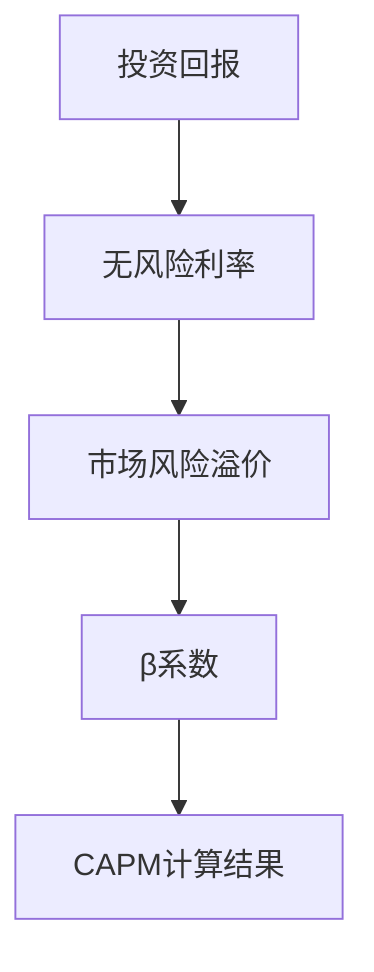
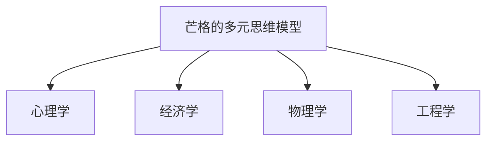
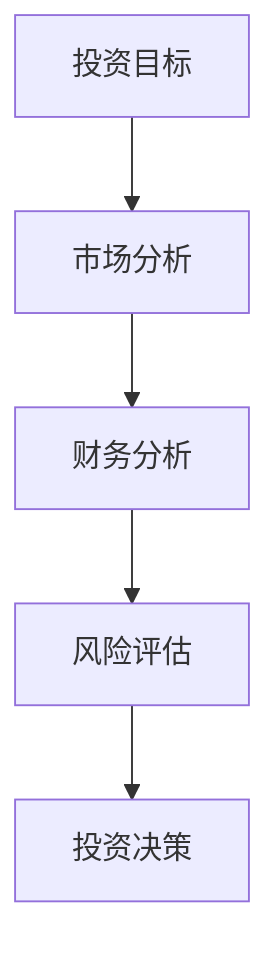

                 


# 巴菲特-芒格的太空互联网投资：全球连接的新纪元

## 关键词
- 巴菲特, 芒格, 太空互联网, 投资策略, 全球连接, 卫星通信, 数字经济

## 摘要
本文深入分析了巴菲特和芒格在太空互联网投资领域的智慧和策略，探讨了太空互联网的发展现状、核心技术和投资机会。通过CAPM模型和多元思维模型，揭示了他们如何评估投资价值，并结合实际案例，展示了如何在高风险高回报的太空互联网行业中做出明智的投资决策。

---

## 目录大纲

### 第一部分：背景介绍

#### 第1章：巴菲特与芒格的投资理念

##### 1.1 投资理念概述
- 1.1.1 巴菲特的价值投资理论：寻找具有强大护城河和长期盈利能力的公司。
- 1.1.2 芒格的多元思维模型：通过跨学科思维分析问题，关注公司治理和管理层能力。

##### 1.2 巴菲特与芒格的投资风格对比
- 1.2.1 巴菲特的长期价值投资：注重安全边际和内在价值。
- 1.2.2 芒格的跨学科思维：关注复杂系统和潜在风险。

#### 第2章：太空互联网的发展背景

##### 2.1 太空互联网的起源与发展
- 2.1.1 太空互联网的概念：通过卫星提供全球互联网服务。
- 2.1.2 太空互联网的历史发展：从早期概念到实际部署。

##### 2.2 太空互联网的现状与趋势
- 2.2.1 当前主要参与者：SpaceX、OneWeb、亚马逊的柯伊伯项目。
- 2.2.2 太空互联网的未来展望：全球覆盖、高速连接和新兴市场的增长潜力。

### 第二部分：核心概念与联系

#### 第3章：太空互联网的定义与特点

##### 3.1 太空互联网的定义
- 3.1.1 太空互联网的构成要素：卫星网络、地面站、用户终端。

##### 3.2 太空互联网的特点
- 3.2.1 高覆盖性：能够覆盖传统互联网无法触及的偏远地区。
- 3.2.2 高成本：卫星发射和维护费用高昂。

#### 第4章：巴菲特与芒格的投资逻辑

##### 4.1 巴菲特的资本资产定价模型（CAPM）
- 4.1.1 CAPM公式：$$ CAPM = R_f + \beta (R_m - R_f) $$
- 4.1.2 β系数的含义：衡量公司的系统性风险。

##### 4.2 芒格的多元思维模型
- 4.2.1 多元思维模型的结构图：
  ```mermaid
  graph TD
    A[芒格的多元思维模型] --> B[心理学]
    A --> C[经济学]
    A --> D[物理学]
    A --> E[工程学]
  ```

### 第三部分：系统分析与架构设计

#### 第5章：太空互联网的投资决策框架

##### 5.1 投资决策流程
- 5.1.1 问题场景介绍：评估太空互联网公司的投资价值。
- 5.1.2 系统功能设计：利用CAPM模型和多元思维模型进行分析。

### 第四部分：项目实战

#### 第6章：太空互联网公司的投资分析

##### 6.1 公司案例分析
- 6.1.1 SpaceX的分析与投资决策：
  - 技术实力：星链项目进展迅速。
  - 市场进入壁垒：领先的技术和发射能力。
  - 投资价值：高成长性和市场领导地位。
- 6.1.2 OneWeb的分析与投资决策：
  - 财务状况：多次融资和重组，财务压力较大。
  - 技术创新：全球覆盖的卫星网络。
  - 投资风险：市场竞争和运营成本。

### 第五部分：总结与小结

#### 第7章：总结与投资建议

##### 7.1 全书总结
- 7.1.1 太空互联网的未来：全球连接和数字化转型的关键角色。
- 7.1.2 巴菲特与芒格的投资智慧：长期价值和风险管理的重要性。

##### 7.2 投资建议
- 7.2.1 投资太空互联网的注意事项：关注技术创新、成本控制和政策环境。
- 7.2.2 拓展阅读推荐：《巴菲特选股术》、《芒格的智慧》。

---

### 附录：数学公式与流程图

#### 附录A：CAPM模型流程图



#### 附录B：多元思维模型结构图



---

### 附录C：投资决策框架



---

### 结语

通过本文的详细分析，读者可以深入了解巴菲特和芒格在太空互联网投资中的智慧和策略。他们的投资逻辑不仅适用于太空互联网，也为其他高科技领域的投资提供了宝贵的借鉴。未来，随着技术的发展和市场的成熟，太空互联网将为全球连接开启新的纪元。

