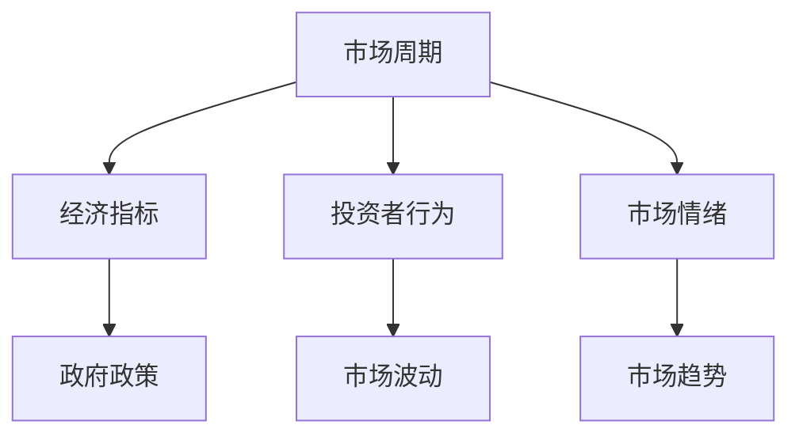
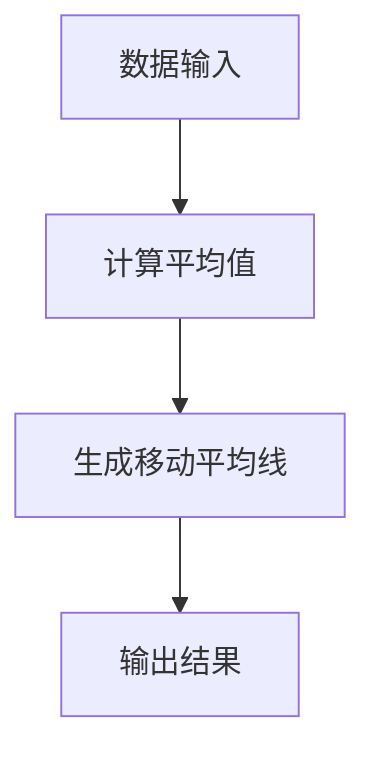
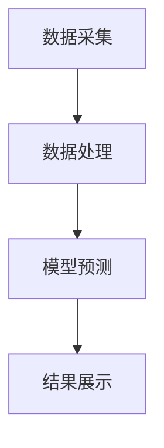
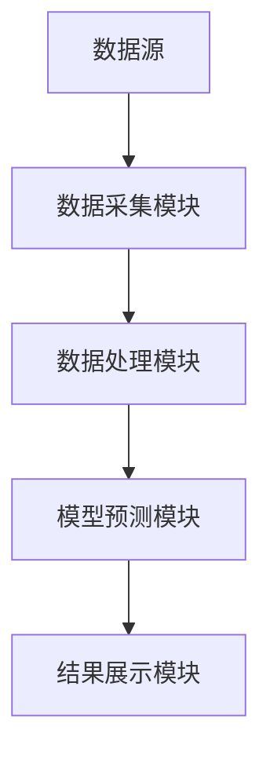

                 


---

# 《市场周期理论：理解牛熊交替的规律》

## 关键词：
市场周期理论、牛熊交替、经济波动、技术分析、投资策略

## 摘要：
本文系统地介绍了市场周期理论的核心概念、分析方法及其在投资策略中的应用。通过分析市场周期的背景、原理、算法和系统架构，结合实际案例，深入探讨了如何理解牛熊交替的规律，并通过技术分析和数学模型为投资者提供科学的决策支持。

---

## 第一部分: 市场周期理论的背景与基础

### 第1章: 市场周期理论的基本概念

#### 1.1 市场周期的定义与特征

**市场周期**是指市场在经济发展过程中，由于各种内外部因素的影响，价格、成交量等市场指标呈现出周期性波动的现象。市场周期通常分为牛市和熊市，其中牛市代表市场繁荣，熊市代表市场衰退。

**市场周期的特征**包括：
- **波动性**：价格波动的幅度和频率。
- **趋势性**：价格在一定周期内呈现上升或下降的趋势。
- **周期性**：市场的繁荣与衰退交替出现，形成周期性波动。

市场周期与经济波动密切相关，经济周期的变化直接影响市场的供需关系，从而影响价格和成交量的变化。

#### 1.2 市场周期的历史演变

市场周期理论的历史可以追溯到18世纪，经济学家如亚当·斯密和约翰·凯恩斯都对市场周期进行了研究。现代市场周期理论的发展主要得益于技术分析和行为金融学的研究。

**牛市与熊市的交替规律**：
- **牛市**：市场参与者情绪乐观，交易活跃，价格持续上升。
- **熊市**：市场参与者情绪悲观，交易低迷，价格持续下降。

**典型案例分析**：
- 20世纪80年代的互联网泡沫：互联网技术的发展引发了市场的狂热情绪，最终导致泡沫破裂。
- 2008年全球金融危机：次贷危机引发了全球范围的熊市。

#### 1.3 市场周期与其他经济理论的关系

**经济周期理论**是市场周期理论的基础，两者共同解释了市场的波动现象。

**技术分析与市场周期**：技术分析通过分析价格和成交量的变化，预测市场的未来走势，为市场周期的研究提供了工具。

**投资策略与市场周期**：投资者可以根据市场周期的阶段调整投资策略，例如在牛市中增加股票配置，在熊市中转向防御性资产。

#### 1.4 市场周期的影响因素

**经济政策**：政府的货币政策和财政政策直接影响市场的供需关系。

**市场情绪**：投资者的心理和行为是市场波动的重要驱动因素。

**宏观经济指标**：GDP、失业率、通胀率等指标是预测市场周期的重要依据。

---

## 第二部分: 市场周期理论的核心概念与联系

### 第2章: 市场周期的核心原理

#### 2.1 市场周期的核心概念

**市场波动性**：市场的短期价格波动，通常由投资者情绪和市场参与者的交易行为引起。

**市场趋势**：价格在一定周期内呈现的上升或下降趋势，通常由基本面因素驱动。

**市场情绪**：投资者的心理状态和行为，影响市场的买卖决策，进而影响价格波动。

#### 2.2 市场周期的属性特征对比

**牛市与熊市的特征对比**：

| 特征      | 牛市                | 熊市                |
|-----------|--------------------|--------------------|
| 价格趋势  | 上升趋势           | 下降趋势           |
| 市场情绪   | 乐观               | 悲观               |
| 交易量     | 高                | 低                |
| 投资者行为 | 积极买入           | 积极卖出           |
| 经济指标   | 增长               | 衰退               |

**市场周期的波动性与持续性**：
- **波动性**：市场周期的波动性越大，价格波动的幅度越大。
- **持续性**：市场周期的持续时间越长，价格趋势的变化越显著。

**市场周期的复杂性与可预测性**：
- **复杂性**：市场周期受多种因素影响，具有非线性特征。
- **可预测性**：通过技术分析和数学模型，可以对市场周期进行一定的预测。

#### 2.3 市场周期的ER实体关系图



---

## 第三部分: 市场周期的算法原理

### 第3章: 市场周期的技术分析方法

#### 3.1 技术分析的基本原理

**技术分析**是通过分析历史价格和成交量数据，预测未来价格走势的方法。技术分析的核心假设是市场行为反映所有信息，即价格已经反映了市场的所有信息。

**常用技术指标**：
- **移动平均线（MA）**：通过计算一定周期内的平均价格，反映市场的趋势。
- **相对强弱指数（RSI）**：衡量市场的超买或超卖状态。
- **MACD**：通过计算短期和长期移动平均线的差异，判断市场的买卖信号。

#### 3.2 技术分析算法的实现

**移动平均线算法**：



```python
import pandas as pd

def calculate_ma(data, window):
    ma = data['收盘价'].rolling(window=window).mean()
    return ma

# 示例数据
data = pd.DataFrame({
    '收盘价': [100, 102, 101, 103, 104]
})
window = 3

ma = calculate_ma(data, window)
print(ma)
```

**移动平均线的计算公式**：
$$ MA_t = \frac{1}{n} \sum_{i=1}^{n} P_{t-i} $$
其中，$P_{t-i}$ 是第 $t-i$ 天的收盘价，$n$ 是计算窗口。

#### 3.3 市场周期的数学模型

**ARIMA模型**：
ARIMA（自回归积分滑动平均模型）是一种常用的时间序列分析模型，适用于预测市场周期的变化。

**ARIMA模型的公式**：
$$
\phi (B) X_t = \theta (B) \epsilon_t
$$
其中，$\phi (B)$ 是自回归多项式，$\theta (B)$ 是滑动平均多项式，$\epsilon_t$ 是白噪声。

**ARIMA模型的实现步骤**：
1. 数据预处理：检查数据的平稳性，必要时进行差分。
2. 模型参数选择：通过AIC或BIC准则选择最优参数。
3. 模型拟合：使用训练数据拟合ARIMA模型。
4. 模型预测：利用拟合的模型预测未来的价格走势。

---

## 第四部分: 市场周期的系统分析与架构设计

### 第4章: 市场周期分析系统的架构设计

#### 4.1 系统功能设计

**功能模块**：
- 数据采集模块：采集市场数据，包括价格和成交量。
- 数据处理模块：对数据进行清洗和转换。
- 模型预测模块：使用技术指标和数学模型预测市场周期。
- 结果展示模块：以图表形式展示预测结果。

**系统功能流程图**：



#### 4.2 系统架构设计

**系统架构图**：



**技术选型**：
- 数据采集：使用API接口获取市场数据。
- 数据处理：使用Pandas进行数据清洗和转换。
- 模型预测：使用Python的Scikit-learn库进行机器学习模型训练。
- 结果展示：使用Matplotlib绘制图表。

---

## 第五部分: 项目实战

### 第5章: 市场周期预测系统开发

#### 5.1 环境安装

**安装Python环境**：
```bash
pip install numpy pandas matplotlib scikit-learn
```

#### 5.2 系统核心实现源代码

**数据采集与处理**：

```python
import pandas as pd
import requests

# 采集数据
url = 'https://api.example.com/market_data'
response = requests.get(url)
data = pd.DataFrame(response.json())
```

**模型预测与展示**：

```python
from sklearn.linear_model import LinearRegression

# 训练模型
model = LinearRegression()
model.fit(X_train, y_train)

# 预测结果
y_pred = model.predict(X_test)

# 绘制图表
import matplotlib.pyplot as plt

plt.plot(y_test, label='实际值')
plt.plot(y_pred, label='预测值')
plt.legend()
plt.show()
```

#### 5.3 代码解读与分析

**数据采集模块**：通过API接口获取市场数据，并将其转换为DataFrame格式。

**模型预测模块**：使用线性回归模型对市场周期进行预测，输出预测结果。

**结果展示模块**：以图表形式展示实际值和预测值，便于分析模型的准确性。

#### 5.4 案例分析与详细解读

**案例分析**：
假设我们预测未来一周的市场趋势，模型预测结果为上升趋势，建议投资者增加股票配置。

**详细解读**：
- 数据预处理：检查数据的平稳性，必要时进行差分。
- 模型选择：选择合适的数学模型，如ARIMA模型。
- 模型验证：通过回测验证模型的准确性。

---

## 第六部分: 最佳实践

### 第6章: 小结与注意事项

#### 6.1 小结

市场周期理论是理解牛熊交替规律的核心，通过技术分析和数学模型，投资者可以更好地预测市场走势，制定科学的投资策略。

#### 6.2 注意事项

- **数据质量**：数据的准确性和完整性直接影响模型的预测结果。
- **模型选择**：选择合适的模型，避免过拟合。
- **风险控制**：市场周期预测具有不确定性，投资者需注意风险控制。

#### 6.3 拓展阅读

- 建议阅读《技术分析的理论与实践》和《时间序列分析》等书籍，深入理解市场周期的理论和应用。

---

以上是《市场周期理论：理解牛熊交替的规律》的完整目录和内容框架。通过系统地分析市场周期的背景、原理、算法和实际应用，本文为投资者提供了科学的决策支持，帮助他们在复杂的市场环境中把握牛熊交替的规律，制定有效的投资策略。

