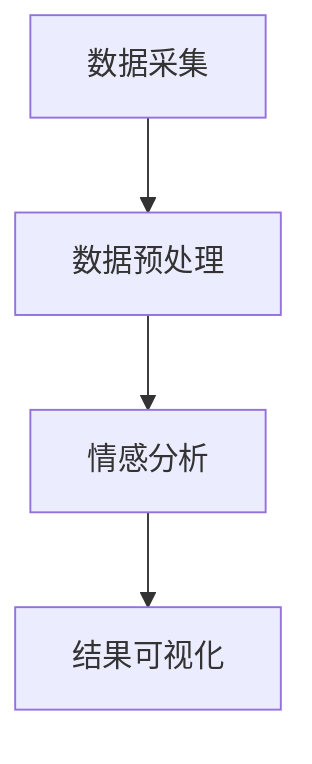
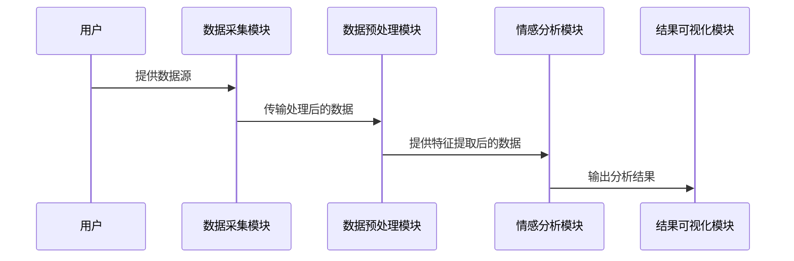

                 

# 市场情绪分析

> 关键词：市场情绪分析，情绪计算，文本挖掘，深度学习，金融市场，投资决策

> 摘要：市场情绪分析是一种通过分析市场参与者的情绪和态度来预测市场行为的方法。本文从市场情绪分析的基本概念、算法原理、系统架构到项目实战，全面解析如何利用技术手段捕捉和分析市场情绪，从而辅助投资决策。通过详细讲解背景、核心概念、算法实现、系统设计和实际案例，本文旨在帮助读者掌握市场情绪分析的核心技术和应用方法。

---

## 目录

### 第一部分: 市场情绪分析的背景与基础

#### 第1章: 市场情绪分析概述

##### 1.1 市场情绪分析的定义与背景
- 1.1.1 市场情绪分析的定义
- 1.1.2 市场情绪分析的应用场景
- 1.1.3 市场情绪分析的边界与外延

##### 1.2 市场情绪分析的核心概念
- 1.2.1 情感计算的定义与特点
- 1.2.2 市场情绪的分类与维度
- 1.2.3 市场情绪分析的指标体系

##### 1.3 市场情绪分析的数据来源
- 1.3.1 文本数据来源
- 1.3.2 市场数据来源
- 1.3.3 社交媒体数据来源

##### 1.4 市场情绪分析的背景介绍
- 1.4.1 问题背景
- 1.4.2 问题描述
- 1.4.3 问题解决方法
- 1.4.4 市场情绪分析的边界与外延

##### 1.5 本章小结

#### 第2章: 市场情绪分析的核心概念与联系

##### 2.1 市场情绪分析的核心概念原理
- 2.1.1 情感计算的原理
- 2.1.2 市场情绪分析的特征提取
- 2.1.3 市场情绪分析的模型构建

##### 2.2 核心概念属性特征对比表格
- 2.2.1 情感计算与文本挖掘的对比
- 2.2.2 市场情绪分析与其他金融分析方法的对比

##### 2.3 ER实体关系图架构
- 2.3.1 实体关系图的构建
- 2.3.2 实体关系图的分析

### 第二部分: 市场情绪分析的算法原理

#### 第3章: 市场情绪分析的算法概述

##### 3.1 市场情绪分析的算法概述
- 3.1.1 文本分类算法
- 3.1.2 情感分析算法
- 3.1.3 深度学习算法

##### 3.2 市场情绪分析的算法实现
- 3.2.1 基于规则的市场情绪分析
- 3.2.2 基于机器学习的市场情绪分析
- 3.2.3 基于深度学习的市场情绪分析

#### 第4章: 市场情绪分析的算法实现细节

##### 4.1 基于规则的市场情绪分析
- 4.1.1 规则设定
- 4.1.2 规则匹配
- 4.1.3 规则评估

##### 4.2 基于机器学习的市场情绪分析
- 4.2.1 特征提取
- 4.2.2 模型训练
- 4.2.3 模型评估

##### 4.3 基于深度学习的市场情绪分析
- 4.3.1 LSTM模型
- 4.3.2 Transformer模型
- 4.3.3 BERT模型

### 第三部分: 市场情绪分析的系统架构与设计

#### 第5章: 市场情绪分析的系统架构

##### 5.1 系统架构设计
- 5.1.1 系统模块划分
- 5.1.2 模块之间的交互关系
- 5.1.3 系统架构图（Mermaid）

##### 5.2 系统接口设计
- 5.2.1 数据接口
- 5.2.2 模型接口
- 5.2.3 用户接口

#### 第6章: 市场情绪分析的系统设计

##### 6.1 系统功能设计
- 6.1.1 数据采集模块
- 6.1.2 数据预处理模块
- 6.1.3 情感分析模块
- 6.1.4 结果可视化模块

##### 6.2 系统架构设计（Mermaid）

##### 6.3 系统交互设计（Mermaid）

### 第四部分: 市场情绪分析的项目实战

#### 第7章: 市场情绪分析的项目实战

##### 7.1 环境搭建
- 7.1.1 安装Python
- 7.1.2 安装必要的库（如numpy, pandas, tensorflow等）
- 7.1.3 安装自然语言处理工具（如spaCy, NLTK）

##### 7.2 数据收集
- 7.2.1 收集文本数据（如新闻、社交媒体评论）
- 7.2.2 收集市场数据（如股票价格、交易量）
- 7.2.3 数据清洗与预处理

##### 7.3 特征工程
- 7.3.1 文本分词
- 7.3.2 词袋模型
- 7.3.3 词嵌入（如Word2Vec, GloVe）

##### 7.4 模型训练
- 7.4.1 选择模型（如LSTM, BERT）
- 7.4.2 调参与优化
- 7.4.3 模型训练与评估

##### 7.5 结果分析与可视化
- 7.5.1 结果分析
- 7.5.2 可视化展示
- 7.5.3 实际案例分析

### 第五部分: 市场情绪分析的高级主题与优化

#### 第8章: 高级主题与优化

##### 8.1 多模态市场情绪分析
- 8.1.1 文本与图像的结合
- 8.1.2 多模态数据的融合方法

##### 8.2 实时市场情绪分析
- 8.2.1 实时数据流处理
- 8.2.2 实时模型更新

##### 8.3 情感分析模型的优化与调优
- 8.3.1 超参数调优
- 8.3.2 模型压缩与优化
- 8.3.3 模型解释性分析

### 第六部分: 总结与展望

#### 第9章: 总结与展望

##### 9.1 全书总结
- 9.1.1 核心概念回顾
- 9.1.2 算法实现总结
- 9.1.3 系统设计总结

##### 9.2 未来展望
- 9.2.1 市场情绪分析的未来发展方向
- 9.2.2 技术进步对市场情绪分析的推动作用
- 9.2.3 可能的应用领域扩展

##### 9.3 最佳实践 tips
- 9.3.1 数据质量的重要性
- 9.3.2 模型选择与优化
- 9.3.3 结果解释与可视化

##### 9.4 本章小结

---

通过以上目录结构，本文将系统地介绍市场情绪分析的各个方面，从基础概念到高级算法，再到实际应用，帮助读者全面掌握市场情绪分析的技术与实践方法。

