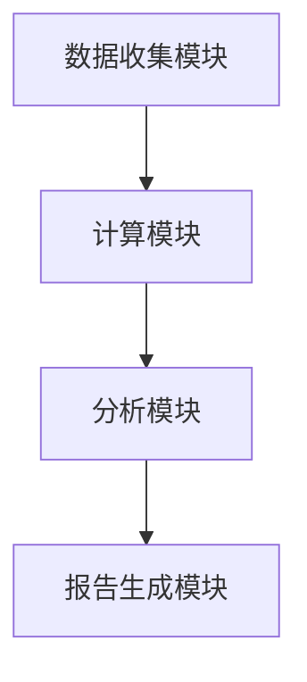
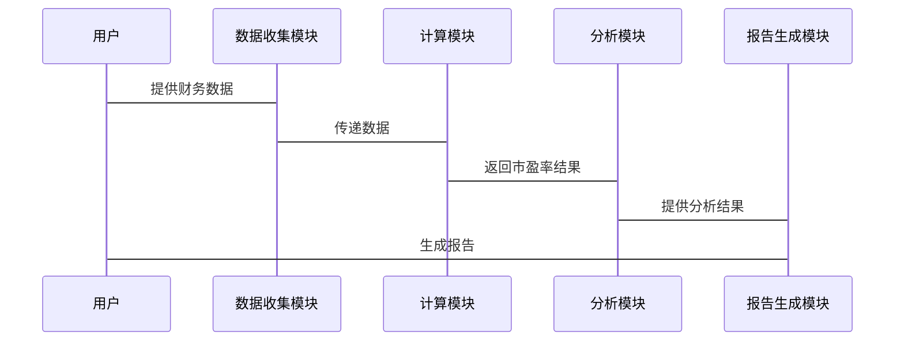

                 


# 市盈率法在企业估值中的应用

> 关键词：市盈率法、企业估值、投资分析、财务指标、投资策略

> 摘要：市盈率法是一种常用的企业估值方法，本文将详细探讨其定义、计算方法、优缺点，以及在不同行业中的应用。通过实际案例分析和系统设计，帮助读者掌握如何在实际投资中应用市盈率法，实现对企业价值的准确评估。

---

# 第1章 市盈率法的概述

## 1.1 市盈率法的基本概念

### 1.1.1 市盈率的定义与计算公式

市盈率（Price-to-Earnings Ratio，简称P/E）是衡量股票价值的重要指标，计算公式为：

$$ P/E = \frac{股票价格}{每股净利润} $$

例如，某公司股票价格为50元，每股净利润为5元，则市盈率为10倍。

### 1.1.2 市盈率法的起源与发展

市盈率法起源于20世纪初，随着现代金融理论的发展，逐渐成为企业估值的重要工具。它基于市场对未来的盈利预期，反映了投资者对公司未来表现的信心。

### 1.1.3 市盈率法在企业估值中的作用

市盈率法可以帮助投资者快速评估股票的合理价格，判断其是否被高估或低估。它常用于比较不同公司或行业的估值水平。

## 1.2 市盈率法的理论基础

### 1.2.1 市盈率与企业价值的关系

市盈率反映了市场对公司未来盈利能力的预期。高市盈率可能意味着高成长性，但也可能意味着高风险。

### 1.2.2 市盈率法的经济学原理

市盈率法基于有效市场假说，认为市场价格反映了所有可获得的信息。它假设市场参与者理性决策，且信息透明。

### 1.2.3 市盈率法的适用范围与边界

市盈率法适用于盈利稳定、成长性明确的公司。对于亏损公司或周期性行业，市盈率法可能不太适用。

---

# 第2章 市盈率法的理论框架

## 2.1 市盈率法的数学模型

### 2.1.1 市盈率的计算公式

$$ P/E = \frac{P}{E} $$

其中，$P$为股票价格，$E$为每股净利润。

### 2.1.2 市盈率与企业价值的关系

$$ V = P/E \times EBITDA $$

EBITDA是息税折旧及摊销前利润，用于衡量企业经营效率。

## 2.2 市盈率法的优缺点

### 2.2.1 市盈率法的优点

- 计算简单，数据易得。
- 能够反映市场对未来的预期。

### 2.2.2 市盈率法的缺点

- 忽略了公司的财务杠杆和资产状况。
- 对亏损公司不适用。

## 2.3 市盈率法与其他估值方法的比较

### 2.3.1 市盈率法与DCF模型的比较

DCF模型基于未来现金流的现值，考虑了更多的财务细节，但计算复杂。

### 2.3.2 市盈率法与市净率法的比较

市净率法基于资产价值，适用于资产密集型行业，而市盈率法适用于成长型企业。

---

# 第3章 市盈率法在科技行业的应用

## 3.1 科技行业的特点与市盈率法的适用性

### 3.1.1 科技行业的高成长性

科技行业通常具有较高的增长潜力，市盈率较高。

### 3.1.2 科技行业市盈率法应用案例

以某科技公司为例，假设其股票价格为100元，净利润为10元，则市盈率为10倍。如果行业平均市盈率为15倍，则该公司的股票可能被低估。

### 3.1.3 科技行业市盈率法的特殊性

高研发投入和轻资产特性使得市盈率法成为主要的估值方法。

## 3.2 科技行业市盈率法的具体实施步骤

### 3.2.1 数据收集与整理

收集公司的财务数据，包括股票价格、净利润等。

### 3.2.2 市盈率计算与分析

计算市盈率，并与行业平均水平比较。

### 3.2.3 市盈率法的验证与调整

结合其他指标如市净率，进行综合分析。

---

# 第4章 市盈率法在制造业的应用

## 4.1 制造业的特点与市盈率法的适用性

### 4.1.1 制造业的周期性

制造业受经济周期影响较大，市盈率可能波动较大。

### 4.1.2 制造业市盈率法应用案例

以某制造公司为例，假设其股票价格为50元，净利润为5元，则市盈率为10倍。如果行业平均市盈率为12倍，则该公司的股票可能被低估。

### 4.1.3 制造业市盈率法的特殊性

制造业公司通常依赖资产和现金流，市盈率法可能不太适用。

## 4.2 制造业市盈率法的具体实施步骤

### 4.2.1 数据收集与整理

收集公司的财务数据，包括股票价格、净利润等。

### 4.2.2 市盈率计算与分析

计算市盈率，并与行业平均水平比较。

### 4.2.3 市盈率法的验证与调整

结合其他指标如市净率，进行综合分析。

---

# 第5章 市盈率法的系统设计与实现

## 5.1 系统功能模块设计

### 5.1.1 数据收集模块

从财务报表中提取股票价格和净利润数据。

### 5.1.2 计算模块

计算市盈率，并与行业平均水平比较。

### 5.1.3 分析模块

生成报告，提出投资建议。

## 5.2 系统架构设计

使用Mermaid绘制系统架构图，展示各模块的交互。



## 5.3 系统接口设计

定义API接口，实现模块之间的数据传递。

## 5.4 系统交互设计

使用Mermaid绘制序列图，展示系统交互流程。



---

# 第6章 项目实战

## 6.1 环境安装

安装Python和相关库，如pandas、numpy。

## 6.2 核心实现源代码

编写Python代码，实现市盈率计算。

```python
import pandas as pd
import numpy as np

# 假设我们有一个包含股票数据的DataFrame df
# df.columns = ['股票代码', '股票名称', '股价', '净利润']

# 计算市盈率
df['市盈率'] = df['股价'] / df['净利润']

# 找出市盈率低于行业平均的股票
average_pe = df['市盈率'].mean()
df[df['市盈率'] < average_pe]
```

## 6.3 实际案例分析

以具体公司为例，分析市盈率法的应用，并解释结果。

---

# 第7章 总结与展望

## 7.1 总结

市盈率法是一种简单有效的估值工具，但需结合其他方法进行综合分析。

## 7.2 小结

本文详细探讨了市盈率法的定义、计算方法、优缺点，以及在不同行业中的应用。通过实际案例和系统设计，帮助读者掌握市盈率法的应用技巧。

## 7.3 注意事项

使用市盈率法时，需注意公司基本面和行业特点，避免单一指标误导。

## 7.4 拓展阅读

建议阅读《投资学》和《财务报表分析》等相关书籍，深入理解市盈率法的应用。

---

# 附录

## 附录A 市盈率法的数学模型

详细推导市盈率法的数学公式。

## 附录B 系统设计的详细代码

提供完整的系统设计代码，包括数据处理、计算和报告生成部分。

---

通过以上目录结构，您可以逐步深入学习市盈率法在企业估值中的应用，从理论到实践，全面掌握这一重要工具。

