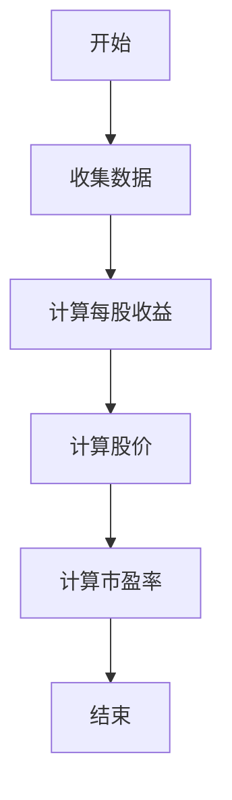

                 


# 市盈率（P/E）分析：最广泛使用的估值指标

---

## 关键词

市盈率（P/E），估值指标，每股收益（EPS），投资决策，企业价值，股票分析，金融指标

---

## 摘要

市盈率（P/E）是投资者评估股票价值时最常用的指标之一，它通过比较股票价格与每股收益，帮助投资者判断股票是否被高估或低估。本文将详细探讨市盈率的定义、计算方法、核心要素、行业比较分析、算法原理、系统架构设计与实现，以及实际案例分析。通过这些分析，读者将能够全面理解市盈率的含义，并掌握如何在实际投资中有效运用这一指标。

---

# 第1章: 市盈率（P/E）概述

## 1.1 什么是市盈率

市盈率（P/E）是衡量股票价值的重要指标，用于评估投资者为公司每股收益支付的溢价。公式如下：

$$ P/E = \frac{市场价（P）}{每股收益（EPS）} $$

## 1.2 市盈率的背景与重要性

市盈率在投资决策中扮演着重要角色，因为它可以帮助投资者判断股票的相对价值。通过比较市盈率，投资者可以识别出被低估或高估的股票。

## 1.3 市盈率的局限性与适用场景

尽管市盈率是一个有用的工具，但它并非完美。例如，亏损公司的市盈率可能无法计算，且不同行业的市盈率标准不同。

---

# 第2章: 市盈率的计算与分析方法

## 2.1 市盈率的计算公式

市盈率的基本公式为：

$$ P/E = \frac{P}{EPS} $$

其中，P为股票价格，EPS为每股收益。

## 2.2 市盈率的核心要素

### 市场价（P）

股票的市场价格，反映市场对公司的整体估值。

### 每股收益（EPS）

公司净利润除以总股本，衡量每股的盈利能力。

### 市盈率与企业盈利的关系

市盈率与企业盈利呈反比关系，即盈利越高，市盈率越低。

## 2.3 市盈率的行业比较分析

### 行业平均市盈率的计算

计算行业内所有股票的市盈率平均值。

### 行业市盈率的差异分析

不同行业的市盈率差异较大，例如科技行业通常具有较高的市盈率。

---

# 第3章: 市盈率的算法原理与数学模型

## 3.1 市盈率的计算流程



## 3.2 市盈率的数学模型

市盈率的动态分析公式为：

$$ Dynamic\ P/E = \frac{市场价}{预期每股收益} $$

---

# 第4章: 市盈率分析系统架构设计与实现

## 4.1 系统功能设计

### 数据收集模块

收集股票的市场价格和每股收益数据。

### 数据处理模块

清洗数据，处理缺失值。

### 数据计算模块

计算市盈率，并进行行业比较分析。

### 数据展示模块

可视化市盈率结果。

---

# 第5章: 项目实战：市盈率分析系统实现

## 5.1 环境配置

安装必要的Python库，如pandas和matplotlib。

## 5.2 核心实现代码

```python
import pandas as pd
import matplotlib.pyplot as plt

# 数据收集
data = pd.read_csv('stock_data.csv')

# 数据处理
data.dropna()

# 数据计算
data['P/E'] = data['Price'] / data['EPS']

# 可视化
data[['P/E', '行业']].boxplot(by='行业', figsize=(10,6))
plt.show()
```

## 5.3 案例分析

以苹果公司为例，分析其市盈率，并与行业平均水平进行比较。

---

# 第6章: 市盈率分析的最佳实践与注意事项

## 6.1 最佳实践

### 关注动态市盈率

动态市盈率考虑了未来预期收益，更具前瞻性。

### 结合其他指标

市盈率应与其他指标如市净率和股息率结合使用。

## 6.2 注意事项

### 避免单一指标误判

市盈率不能单独决定投资决策，需综合分析。

### 考虑行业特性

不同行业的市盈率标准不同，需进行行业比较。

## 6.3 本章小结

市盈率分析是投资决策中的重要环节，但需结合其他指标和行业特性综合考量。

---

通过本文的详细分析，读者可以全面理解市盈率的概念、计算方法及其在投资中的应用。希望这些内容能够帮助投资者更有效地进行股票估值和投资决策。

