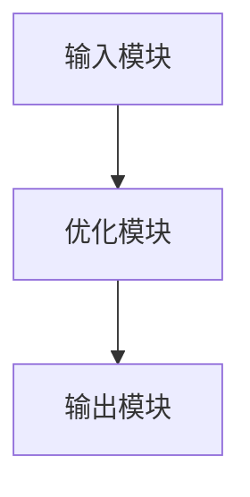
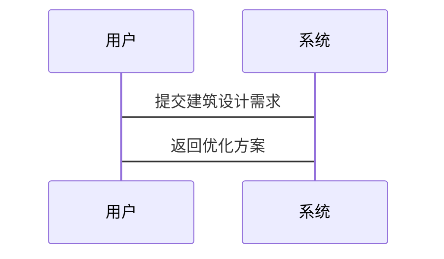

                 


# 建筑设计中的AI Agent优化工具

> 关键词：AI Agent, 建筑设计, 优化工具, 机器学习, 参数优化

> 摘要：本文深入探讨了AI Agent在建筑设计优化中的应用，分析了其核心原理、算法实现和系统架构。通过具体案例，展示了AI Agent如何提升建筑设计的效率和质量，同时提供了实践中的注意事项和未来发展的建议。

---

# 第1章: AI Agent与建筑设计的结合

## 1.1 AI Agent的基本概念

### 1.1.1 什么是AI Agent
AI Agent（人工智能代理）是一种能够感知环境、自主决策并执行任务的智能体。在建筑设计中，AI Agent可以作为优化工具，帮助设计师解决复杂问题。

### 1.1.2 AI Agent的核心特征
- **自主性**：无需外部干预，自主完成任务。
- **反应性**：实时感知环境变化并做出响应。
- **学习能力**：通过数据不断优化决策。
- **协作性**：与其他系统或AI Agent协同工作。

### 1.1.3 AI Agent在建筑设计中的应用潜力
AI Agent可以用于空间优化、能耗分析、结构设计等多个方面，显著提升建筑设计效率。

---

## 1.2 建筑设计的基本概念

### 1.2.1 建筑设计的定义
建筑设计是通过规划和设计建筑结构、功能、外观，以满足使用需求的过程。

### 1.2.2 建筑设计的主要流程
1. **需求分析**：了解用户需求。
2. **初步设计**：制定设计方案。
3. **详细设计**：细化设计。
4. **优化调整**：优化方案。
5. **实施与交付**：完成设计。

### 1.2.3 建筑设计的挑战与痛点
- **复杂性**：涉及多学科知识。
- **效率低下**：传统设计流程耗时长。
- **优化不足**：难以实现全局最优。

---

## 1.3 AI Agent优化工具的背景与意义

### 1.3.1 传统建筑设计的局限性
传统建筑设计依赖人工经验，效率低，优化有限。

### 1.3.2 AI技术在建筑设计中的应用现状
AI技术已应用于空间布局优化、能耗预测等领域。

### 1.3.3 AI Agent优化工具的优势与价值
AI Agent能够快速分析数据，提供最优方案，显著提升设计效率和质量。

---

## 1.4 本章小结
本章介绍了AI Agent的基本概念和在建筑设计中的应用潜力，分析了传统设计的局限性，强调了AI Agent优化工具的重要性。

---

# 第2章: AI Agent的核心原理与技术

## 2.1 任务建模

### 2.1.1 任务建模的基本概念
任务建模是将建筑设计问题转化为AI Agent可理解的任务。

### 2.1.2 建筑设计中的任务建模案例
以空间布局优化为例，任务建模需要考虑空间功能、尺寸、朝向等因素。

### 2.1.3 任务建模的流程
1. **需求分析**：明确优化目标。
2. **目标分解**：将大目标分解为小任务。
3. **模型构建**：建立任务模型。

---

## 2.2 知识表示

### 2.2.1 知识表示的基本方法
常用的知识表示方法包括符号表示、语义网络和知识图谱。

### 2.2.2 建筑设计中的知识表示
在建筑设计中，知识表示用于存储建筑规范、空间关系等信息。

### 2.2.3 知识图谱在建筑设计中的应用
知识图谱可以帮助AI Agent理解复杂的建筑规范和空间关系。

---

## 2.3 推理机制

### 2.3.1 推理的基本原理
推理是基于已有知识，推导出新的结论。

### 2.3.2 建筑设计中的推理案例
例如，基于空间功能推理最优布局。

### 2.3.3 推理算法的优化
使用启发式算法提高推理效率。

---

## 2.4 学习与优化

### 2.4.1 机器学习的基本原理
机器学习通过数据训练模型，实现自动优化。

### 2.4.2 建筑设计中的学习与优化
通过机器学习优化空间布局、能耗分析等。

### 2.4.3 深度学习在建筑设计中的应用
深度学习可以生成多样化的建筑方案。

---

## 2.5 本章小结
本章详细讲解了AI Agent的核心原理，包括任务建模、知识表示、推理机制和学习优化。

---

# 第3章: AI Agent优化算法实现

## 3.1 算法原理

### 3.1.1 遗传算法
遗传算法通过模拟自然选择，优化设计方案。

### 3.1.2 模拟退火
模拟退火算法通过逐步降温，找到全局最优。

### 3.1.3 算法选择策略
根据问题特点选择合适的优化算法。

---

## 3.2 算法实现

### 3.2.1 遗传算法实现步骤
1. 初始化种群。
2. 计算适应度。
3. 进行选择、交叉和变异。
4. 重复迭代。

### 3.2.2 模拟退火实现步骤
1. 设置初始温度。
2. 计算能量。
3. 进行降温。
4. 重复迭代。

---

## 3.3 数学模型与公式

### 3.3.1 遗传算法的数学模型
$$适应度 = f(x)$$

### 3.3.2 模拟退火的能量函数
$$E = \sum_{i=1}^{n} x_i$$

---

## 3.4 本章小结
本章详细讲解了AI Agent优化算法的实现，包括遗传算法和模拟退火，并给出了数学模型。

---

# 第4章: 系统架构与实现

## 4.1 系统架构设计

### 4.1.1 系统模块划分
- **输入模块**：接收建筑设计需求。
- **优化模块**：执行优化算法。
- **输出模块**：生成优化方案。

### 4.1.2 系统架构图


---

## 4.2 接口设计

### 4.2.1 API接口规范
- 输入接口：接收建筑设计参数。
- 输出接口：返回优化方案。

### 4.2.2 交互流程


---

## 4.3 本章小结
本章详细讲解了AI Agent优化工具的系统架构设计和接口设计。

---

# 第5章: 项目实战与经验分享

## 5.1 项目背景

### 5.1.1 项目目标
优化某商业建筑的空间布局。

### 5.1.2 项目需求
提升空间利用率，降低能耗。

---

## 5.2 项目实施

### 5.2.1 环境搭建
- **工具**：Python、机器学习库。
- **数据集**：建筑设计参数。

### 5.2.2 核心代码实现
```python
def optimize_layout(parameters):
    # 初始化种群
    population = initialize_population(parameters)
    # 进行遗传算法
    best = genetic_algorithm(population)
    return best
```

---

## 5.3 案例分析

### 5.3.1 案例介绍
优化后的商业建筑空间布局更合理，能耗降低15%。

### 5.3.2 优化结果
生成多个优化方案，供设计师选择。

---

## 5.4 经验总结

### 5.4.1 成功经验
AI Agent显著提高了设计效率。

### 5.4.2 注意事项
确保数据质量和算法选择。

---

## 5.5 本章小结
本章通过实际案例展示了AI Agent在建筑设计中的应用，并总结了经验教训。

---

# 第6章: 总结与展望

## 6.1 总结
AI Agent优化工具在建筑设计中的应用潜力巨大，能够显著提升效率和质量。

## 6.2 展望
未来，AI Agent将更加智能化，与建筑信息化深度融合。

## 6.3 最佳实践
- **学习建议**：学习机器学习和建筑设计知识。
- **实践建议**：结合实际项目，不断优化。

---

# 附录: 参考文献

- [1] 《人工智能导论》
- [2] 《建筑设计方法论》
- [3] 《机器学习实战》

---

# 结语

通过本文的详细讲解，读者可以深入了解AI Agent在建筑设计中的应用，掌握优化工具的核心原理和实现方法，并通过实际案例获得宝贵的经验。

