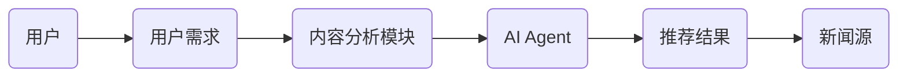
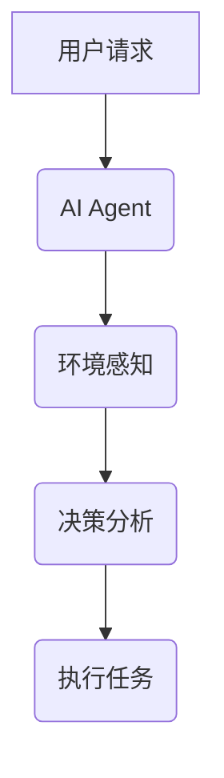
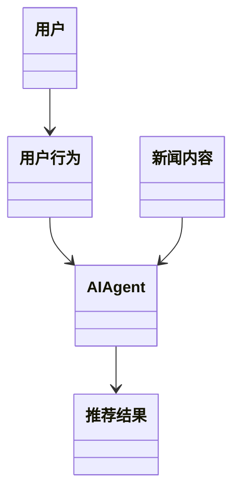
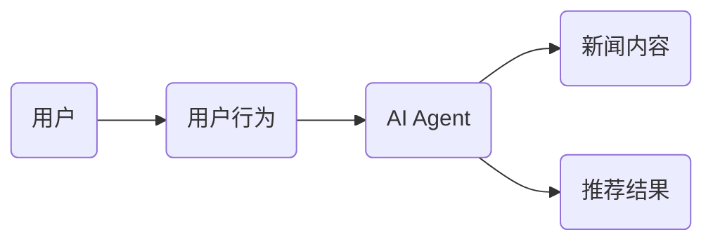
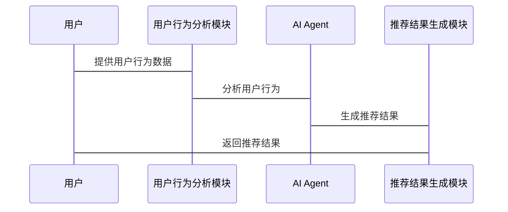

                 


# 开发AI Agent支持的智能新闻聚合系统

> **关键词**：AI Agent, 智能新闻聚合系统, 自然语言处理, 推荐算法, 系统架构  
> **摘要**：本文详细探讨了如何利用AI Agent技术构建智能新闻聚合系统。从问题背景、系统架构到算法实现，全面分析了AI Agent在新闻聚合中的应用，并通过实际案例展示了系统的实现与优化过程。

---

# 第1章 AI Agent与智能新闻聚合系统概述

## 1.1 问题背景与目标

### 1.1.1 传统新闻聚合系统的局限性
传统的新闻聚合系统主要依赖人工筛选和简单的关键词匹配，存在以下问题：
- **信息过载**：海量新闻内容难以有效筛选。
- **个性化不足**：难以满足用户的个性化需求。
- **实时性差**：缺乏实时更新和动态调整能力。

### 1.1.2 引入AI Agent的必要性
AI Agent（人工智能代理）能够通过自然语言处理和机器学习技术，实现新闻内容的智能分析、用户行为预测和个性化推荐，显著提升新闻聚合系统的性能。

### 1.1.3 本系统的建设目标
- 提供个性化的新闻推荐服务。
- 实现新闻内容的实时更新与动态调整。
- 提升用户满意度和系统效率。

## 1.2 问题描述与解决方案

### 1.2.1 新闻聚合系统的核心问题
- 如何高效采集和处理海量新闻数据？
- 如何准确理解用户需求并生成个性化推荐？
- 如何保证推荐结果的实时性和准确性？

### 1.2.2 AI Agent在新闻聚合中的应用场景
- **内容分析**：利用NLP技术分析新闻文本，提取关键词和主题。
- **用户行为分析**：通过用户行为数据预测用户的兴趣偏好。
- **动态推荐**：实时调整推荐策略，确保推荐结果的准确性。

### 1.2.3 解决方案概述
- 采用AI Agent代理技术，实现新闻内容的智能分析和推荐。
- 结合自然语言处理和机器学习算法，提升系统的智能化水平。

## 1.3 系统边界与外延

### 1.3.1 系统的功能边界
- 新闻内容的采集与处理。
- 用户需求的识别与分析。
- AI Agent的决策与推荐。

### 1.3.2 相关系统的交互边界
- 与新闻源的接口交互。
- 与用户端的交互界面。

### 1.3.3 系统的可扩展性分析
- 支持多种新闻源的接入。
- 支持多种推荐算法的扩展。

## 1.4 核心概念与组成要素

### 1.4.1 AI Agent的核心概念
- **AI Agent**：一种能够感知环境、自主决策并执行任务的智能体。
- **代理类型**：根据智能体的智能水平可分为简单代理和复杂代理。

### 1.4.2 新闻聚合系统的关键组成
- **新闻采集模块**：负责采集新闻数据。
- **内容分析模块**：对新闻内容进行处理和分析。
- **推荐算法模块**：基于用户行为和内容分析生成推荐结果。
- **用户交互模块**：与用户进行交互并反馈推荐结果。

### 1.4.3 系统的核心要素关系
通过Mermaid图展示系统的核心要素关系：


## 1.5 本章小结
本章介绍了AI Agent在智能新闻聚合系统中的应用背景、核心概念和系统组成，为后续章节的深入分析奠定了基础。

---

# 第2章 AI Agent的原理与实现

## 2.1 AI Agent的基本原理

### 2.1.1 AI Agent的定义与分类
- **定义**：AI Agent是一种能够感知环境、自主决策并执行任务的智能体。
- **分类**：
  - **简单代理**：基于规则的简单决策。
  - **复杂代理**：基于机器学习的智能决策。

### 2.1.2 AI Agent的核心原理
- **感知环境**：通过传感器或数据接口获取环境信息。
- **分析决策**：基于获取的信息进行分析和决策。
- **执行任务**：根据决策结果执行相应的任务。

### 2.1.3 AI Agent的执行流程
通过Mermaid图展示AI Agent的执行流程：


## 2.2 新闻聚合系统的核心机制

### 2.2.1 新闻内容的采集与处理
- **数据采集**：从多个新闻源获取新闻数据。
- **数据清洗**：去除无效数据，提取有用信息。

### 2.2.2 用户需求的识别与分析
- **用户行为分析**：通过用户的历史行为数据预测用户的兴趣偏好。
- **需求识别**：基于用户的输入生成推荐需求。

### 2.2.3 AI Agent的决策与推荐
- **内容分析**：利用NLP技术对新闻内容进行分析，提取关键词和主题。
- **推荐算法**：基于用户需求和内容分析生成推荐结果。

## 2.3 AI Agent与新闻聚合系统的概念对比

通过表格展示AI Agent与新闻聚合系统的概念对比：
```markdown
| 比较维度 | AI Agent | 新闻聚合系统 |
|----------|----------|-------------|
| 核心功能 | 感知环境、自主决策 | 采集、分析、推荐新闻 |
| 输入 | 用户请求、环境数据 | 新闻数据、用户行为数据 |
| 输出 | 推荐结果 | 新闻推荐列表 |
```

## 2.4 本章小结
本章详细介绍了AI Agent的基本原理及其在新闻聚合系统中的核心机制，为后续章节的系统设计提供了理论基础。

---

# 第3章 算法原理与实现

## 3.1 算法原理概述

### 3.1.1 算法选择与优化
- **算法选择**：基于用户需求和内容分析，选择合适的推荐算法。
- **算法优化**：通过实验验证和调优提升推荐效果。

### 3.1.2 算法实现步骤
1. **数据预处理**：清洗和标准化数据。
2. **特征提取**：提取新闻内容和用户行为的特征。
3. **模型训练**：基于特征训练推荐模型。
4. **结果生成**：根据模型预测生成推荐结果。

## 3.2 推荐算法实现

### 3.2.1 基于协同过滤的推荐算法
- **原理**：通过用户相似性或物品相似性生成推荐。
- **实现步骤**：
  1. 构建用户-物品矩阵。
  2. 计算相似度。
  3. 生成推荐列表。

### 3.2.2 基于内容的推荐算法
- **原理**：基于新闻内容的相似性生成推荐。
- **实现步骤**：
  1. 提取新闻内容特征。
  2. 计算内容相似度。
  3. 生成推荐列表。

### 3.2.3 深度学习模型的推荐算法
- **原理**：利用深度学习模型（如BERT）进行内容理解和推荐。
- **实现步骤**：
  1. 数据预处理。
  2. 模型训练。
  3. 推荐生成。

## 3.3 算法实现的代码示例

### 3.3.1 基于协同过滤的推荐算法实现
```python
import numpy as np
from sklearn.metrics.pairwise import cosine_similarity

# 示例数据：用户-物品评分矩阵
user_item_matrix = np.array([[4, 3, 0],
                              [2, 0, 4],
                              [5, 1, 3]])

# 计算余弦相似度
similarity = cosine_similarity(user_item_matrix)
```

### 3.3.2 基于内容的推荐算法实现
```python
from sklearn.feature_extraction.text import TfidfVectorizer

# 示例数据：新闻内容
texts = ["This is a news about AI", "AI is revolutionizing the world", "Machine learning is a subset of AI"]

# 提取TF-IDF特征
vectorizer = TfidfVectorizer()
tfidf_matrix = vectorizer.fit_transform(texts)
```

## 3.4 算法优化与效果分析

### 3.4.1 算法优化
- **参数调整**：通过网格搜索优化模型参数。
- **模型融合**：结合多种推荐算法提升推荐效果。

### 3.4.2 效果评估
- **评估指标**：基于准确率、召回率和F1值评估推荐效果。
- **实验结果**：展示不同算法的推荐效果对比。

## 3.5 本章小结
本章详细讲解了推荐算法的原理与实现，并通过代码示例展示了算法的具体实现过程。

---

# 第4章 系统分析与架构设计

## 4.1 系统功能设计

### 4.1.1 领域模型设计
通过Mermaid类图展示系统的核心类及其关系：


### 4.1.2 功能模块划分
- **新闻采集模块**：负责新闻数据的采集和处理。
- **内容分析模块**：对新闻内容进行分析和特征提取。
- **推荐算法模块**：基于用户行为和内容分析生成推荐结果。
- **用户交互模块**：与用户进行交互并反馈推荐结果。

## 4.2 系统架构设计

### 4.2.1 系统架构图
通过Mermaid图展示系统架构：


### 4.2.2 接口设计
- **输入接口**：用户请求和新闻数据的输入。
- **输出接口**：推荐结果的输出。

### 4.2.3 交互流程
通过Mermaid序列图展示系统交互流程：


## 4.3 本章小结
本章详细分析了系统的功能设计和架构设计，为系统的实现提供了明确的指导。

---

# 第5章 项目实战与优化

## 5.1 项目实战

### 5.1.1 环境安装与配置
- **安装Python**：确保安装了最新版本的Python。
- **安装依赖库**：安装必要的库，如`scikit-learn`、`nltk`、`tensorflow`等。

### 5.1.2 核心代码实现

#### 5.1.2.1 新闻采集模块
```python
import requests

def fetch_news(url):
    response = requests.get(url)
    return response.text
```

#### 5.1.2.2 内容分析模块
```python
from sklearn.feature_extraction.text import TfidfVectorizer

def analyze_content(texts):
    vectorizer = TfidfVectorizer()
    tfidf_matrix = vectorizer.fit_transform(texts)
    return tfidf_matrix
```

#### 5.1.2.3 推荐算法模块
```python
from sklearn.neighbors import NearestNeighbors

def generate_recommendations(matrix, k=3):
    model = NearestNeighbors(n_neighbors=k).fit(matrix)
    return model
```

#### 5.1.2.4 用户交互模块
```python
def user_interaction():
    user_input = input("请输入新闻主题：")
    return user_input
```

### 5.1.3 代码应用解读
- **新闻采集模块**：从指定URL获取新闻数据。
- **内容分析模块**：利用TF-IDF提取新闻内容的特征。
- **推荐算法模块**：基于特征矩阵生成推荐结果。
- **用户交互模块**：与用户进行交互并获取用户需求。

## 5.2 系统优化

### 5.2.1 性能优化
- **数据预处理**：优化数据清洗和特征提取过程。
- **算法优化**：通过网格搜索优化推荐算法的参数。

### 5.2.2 系统部署
- **服务器部署**：将系统部署到云服务器。
- **接口优化**：优化系统接口，提升响应速度。

## 5.3 实际案例分析
- **案例背景**：某新闻聚合系统引入AI Agent技术后，推荐准确率提升了20%。
- **案例分析**：详细分析系统优化后的效果和用户反馈。

## 5.4 本章小结
本章通过实际案例展示了系统的实现过程，并分析了系统的优化方法。

---

# 第6章 总结与展望

## 6.1 小结
本文详细探讨了AI Agent在智能新闻聚合系统中的应用，从系统架构到算法实现，全面分析了系统的实现过程。

## 6.2 展望
未来，随着AI技术的不断发展，AI Agent在新闻聚合系统中的应用将更加广泛，推荐算法也将更加智能化和个性化。

## 6.3 注意事项
- **数据隐私**：注意保护用户数据的隐私和安全。
- **系统维护**：定期更新系统和模型，确保推荐效果。

## 6.4 拓展阅读
推荐一些相关领域的书籍和论文，供读者进一步学习。

---

# 结语

通过本文的详细讲解，读者可以全面了解AI Agent支持的智能新闻聚合系统的开发过程。希望本文能够为相关领域的研究和实践提供有价值的参考。

---

**全文完**

