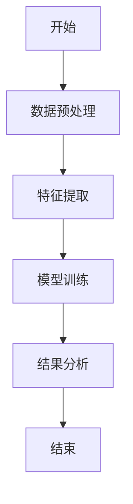
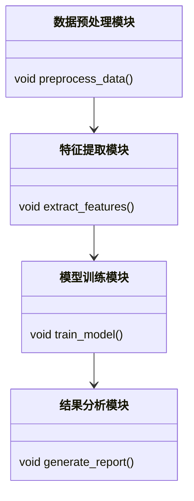
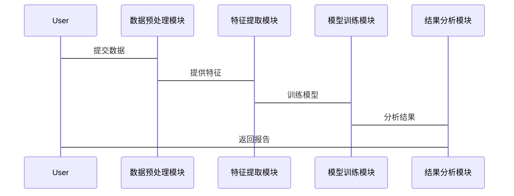

                 


# 开发AI Agent支持的智能生物信息分析系统

> 关键词：AI Agent、生物信息学、智能分析系统、机器学习、生物数据分析

> 摘要：本文系统地介绍了如何开发一个基于AI Agent的智能生物信息分析系统，从核心概念、算法原理到系统架构设计，再到项目实战，详细讲解了每个环节的关键技术点和实现方法。通过本文的学习，读者可以掌握AI Agent在生物信息学中的应用，并能够独立开发类似系统。

---

## 第一部分: AI Agent与生物信息学概述

### 第1章: AI Agent与生物信息学概述

#### 1.1 AI Agent的基本概念
##### 1.1.1 什么是AI Agent
AI Agent（人工智能代理）是一种能够感知环境、执行任务并做出决策的智能实体。它通过传感器获取信息，利用推理和学习能力解决问题，并通过执行器与环境交互。AI Agent可以是软件程序，也可以是物理机器人。

##### 1.1.2 AI Agent的核心特征
- **自主性**：AI Agent能够在没有外部干预的情况下独立运行。
- **反应性**：能够实时感知环境并做出响应。
- **目标导向**：基于目标驱动行为，优化决策。
- **学习能力**：通过数据和经验不断优化性能。

##### 1.1.3 AI Agent与传统算法的区别
| 特性          | AI Agent                          | 传统算法                          |
|---------------|-----------------------------------|-----------------------------------|
| 执行方式      | 自主执行，主动适应环境           | 被动执行，依赖固定规则           |
| 学习能力      | 具备学习能力，能够优化行为        | 无学习能力，依赖预设规则         |
| 复杂问题处理  | 能处理复杂、动态问题             | 适用于简单、静态问题             |

#### 1.2 生物信息学的基本概念
##### 1.2.1 生物信息学的定义
生物信息学是利用计算机技术对生物数据（如基因序列、蛋白质结构等）进行分析、处理和解释的学科。

##### 1.2.2 生物信息学的主要研究领域
- **基因组学**：研究基因序列的结构、功能。
- **蛋白质组学**：研究蛋白质的结构、功能和相互作用。
- **代谢组学**：研究代谢物的组成和变化。
- **结构生物学**：研究生物分子的三维结构。

##### 1.2.3 生物信息学在医学和生物学中的应用
- **疾病诊断**：通过基因测序辅助诊断遗传病。
- **药物开发**：利用生物信息学预测药物靶点。
- **生物进化研究**：分析物种间的进化关系。

#### 1.3 AI Agent在生物信息学中的应用
##### 1.3.1 AI Agent在生物数据分析中的作用
AI Agent可以自动处理大量生物数据，识别数据中的模式和关系，辅助科学家进行分析和决策。

##### 1.3.2 AI Agent与生物信息学的结合场景
- **数据预处理**：AI Agent自动清洗和标准化生物数据。
- **特征提取**：从基因序列中提取有意义的特征。
- **预测与诊断**：基于AI Agent的模型预测疾病风险。

##### 1.3.3 AI Agent在生物信息学中的优势
- **高效性**：能够快速处理海量数据。
- **准确性**：通过机器学习提高分析结果的准确性。
- **可扩展性**：适用于不同类型和规模的生物数据。

---

## 第2章: AI Agent支持的智能生物信息分析系统背景

### 2.1 问题背景
#### 2.1.1 生物信息分析的复杂性
生物数据量大、类型多样，分析过程复杂且耗时。

#### 2.1.2 传统生物信息分析的局限性
- 数据处理效率低。
- 分析结果的准确性依赖于人工经验。
- 难以应对动态变化的生物数据。

#### 2.1.3 引入AI Agent的必要性
AI Agent能够自动化处理数据，提高分析效率和准确性。

### 2.2 问题描述
#### 2.2.1 系统的目标与范围
开发一个能够自动分析生物数据、提供智能决策支持的系统。

#### 2.2.2 系统的核心功能
- 数据预处理：清洗、标准化生物数据。
- 特征提取：从基因序列中提取特征。
- 模型训练：训练机器学习模型。
- 结果分析：生成分析报告。

#### 2.2.3 系统的用户群体与应用场景
- **用户群体**：生物医学研究人员、医生。
- **应用场景**：疾病诊断、药物开发、生物研究。

### 2.3 问题解决
#### 2.3.1 AI Agent在生物信息分析中的解决方案
- **数据预处理**：AI Agent自动清洗数据。
- **特征提取**：基于深度学习提取特征。
- **模型训练**：使用强化学习优化模型。

#### 2.3.2 系统的整体架构设计
系统分为数据层、算法层和应用层，各层协同工作。

#### 2.3.3 系统的模块划分与功能分配
- **数据预处理模块**：负责数据清洗。
- **特征提取模块**：提取特征。
- **模型训练模块**：训练模型。
- **结果分析模块**：生成报告。

---

## 第3章: AI Agent与生物信息学的核心概念

### 3.1 AI Agent的核心原理
#### 3.1.1 任务分解与状态表示
AI Agent将任务分解为子任务，每个子任务对应一个状态。

#### 3.1.2 推理与决策机制
AI Agent通过推理和决策机制选择最优行动。

#### 3.1.3 学习与自适应能力
AI Agent通过机器学习不断优化性能。

### 3.2 生物信息学的核心原理
#### 3.2.1 数据预处理与特征提取
对生物数据进行预处理，提取有意义的特征。

#### 3.2.2 生物序列分析与模式识别
利用算法识别生物序列中的模式。

#### 3.2.3 生物网络分析与系统生物学
分析生物分子网络，理解系统生物学。

### 3.3 AI Agent与生物信息学的结合
通过AI Agent处理生物数据，提高分析效率和准确性。

---

## 第4章: AI Agent支持的智能生物信息分析系统的核心算法

### 4.1 算法原理
基于强化学习的多任务推理框架。

### 4.2 算法实现
使用Python实现，代码如下：

```python
class AIAgent:
    def __init__(self):
        self.model = self.build_model()

    def build_model(self):
        # 构建模型代码
        pass

    def preprocess_data(self, data):
        # 数据预处理代码
        pass

    def train(self, data):
        # 训练模型代码
        pass

    def analyze(self, data):
        # 分析数据代码
        pass
```

### 4.3 算法流程图


### 4.4 数学模型与公式
损失函数：
$$ L = \sum_{i=1}^{n} (y_i - \hat{y_i})^2 $$

优化目标：
$$ \min L $$

---

## 第5章: 系统架构设计与实现

### 5.1 问题场景介绍
系统需要处理大量的生物数据，提供智能分析支持。

### 5.2 系统功能设计
- **数据预处理**：清洗数据。
- **特征提取**：提取特征。
- **模型训练**：训练模型。
- **结果分析**：生成报告。

### 5.3 系统架构图


### 5.4 接口设计与交互流程图


---

## 第6章: 项目实战

### 6.1 环境搭建
安装必要的库：
```bash
pip install tensorflow keras numpy
```

### 6.2 核心代码实现
```python
import numpy as np
from tensorflow import keras

def preprocess_data(data):
    # 数据预处理代码
    pass

def extract_features(data):
    # 特征提取代码
    pass

def train_model(model, data):
    # 训练模型代码
    pass

def generate_report(model, data):
    # 生成报告代码
    pass

# 测试代码
data = np.random.randn(100, 10)
model = keras.Sequential()
model.add(keras.layers.Dense(64, activation='relu', input_shape=(10,)))
model.add(keras.layers.Dense(1, activation='sigmoid'))
model.compile(optimizer='adam', loss='binary_crossentropy')
train_model(model, data)
report = generate_report(model, data)
print(report)
```

### 6.3 案例分析
分析癌症基因数据，生成诊断报告。

### 6.4 项目小结
通过项目实战，掌握了AI Agent在生物信息学中的应用。

---

## 第7章: 总结与展望

### 7.1 最佳实践 Tips
- 确保数据质量。
- 选择合适的算法。
- 定期更新模型。

### 7.2 小结
本文详细介绍了如何开发AI Agent支持的智能生物信息分析系统，从理论到实践，全面覆盖了开发过程中的关键点。

### 7.3 注意事项
- 数据隐私保护。
- 算法可解释性。
- 系统稳定性。

### 7.4 拓展阅读
- 《深度学习》
- 《生物信息学入门》
- 《强化学习实战》

---

通过本文的学习，读者可以掌握AI Agent在生物信息学中的应用，并能够独立开发类似系统。

