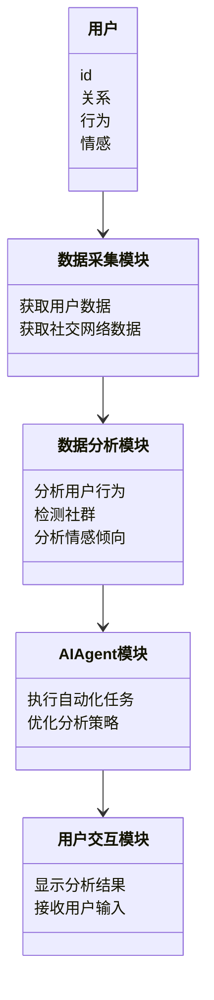

                 


# 开发AI Agent支持的智能社交网络分析系统

---

## 关键词

- AI Agent
- 社交网络分析
- 智能系统
- 算法原理
- 系统架构

---

## 摘要

本文将详细探讨如何开发一个基于AI Agent的智能社交网络分析系统。文章从问题背景出发，分析了社交网络分析的重要性及AI Agent的应用潜力，详细讲解了AI Agent与社交网络分析的核心概念与联系。接着，深入探讨了AI Agent算法的原理、社交网络分析的数学模型，以及系统的架构设计。通过项目实战部分，展示了如何实现该系统，并提供了实际案例分析。最后，总结了开发此类系统的最佳实践、注意事项及未来发展方向。

---

## 第一部分: AI Agent与智能社交网络分析系统背景介绍

### 第1章: 问题背景与描述

#### 1.1 问题背景

随着社交媒体的普及，社交网络分析变得越来越重要。社交网络不仅包含了大量用户数据，还隐藏着丰富的信息，如用户行为模式、社交影响力、社群结构等。然而，传统的社交网络分析方法往往依赖于人工操作，效率低下且难以实时处理海量数据。AI Agent的引入为解决这些问题提供了新的可能性。

**AI Agent**是一种能够感知环境并采取行动以实现目标的智能体。它可以在社交网络中自动执行任务，如数据收集、用户行为分析、情感分析等。通过AI Agent，社交网络分析可以变得更加高效和智能化。

#### 1.2 问题描述

社交网络分析的核心问题是如何从海量数据中提取有价值的信息，并实时响应用户的查询或需求。传统的分析方法通常依赖于规则或统计模型，难以处理复杂且动态变化的社交网络数据。AI Agent的引入可以显著提升分析的效率和准确性。

AI Agent在社交网络分析中的主要任务包括：

- **数据采集**：从社交媒体平台获取用户数据。
- **用户行为分析**：分析用户的互动模式、兴趣爱好等。
- **情感分析**：识别用户的情感倾向。
- **社群检测**：发现用户群体中的社群结构。
- **实时监控**：实时跟踪用户行为和网络变化。

#### 1.3 问题解决与边界

AI Agent通过自动化和智能化的方式解决了传统社交网络分析中的许多问题。它能够实时处理数据，快速响应用户需求，并在复杂环境中做出决策。然而，AI Agent的应用也存在一些边界，如数据隐私问题、计算资源限制等。

**系统目标**：开发一个能够实时分析社交网络数据的智能系统，提供高效、准确的分析结果。

**系统边界**：系统主要关注社交网络分析，不涉及其他领域（如金融交易分析）。

**核心要素**：用户数据、AI Agent、分析算法、交互界面。

---

### 第2章: 核心概念与联系

#### 2.1 AI Agent的基本原理

AI Agent的核心在于其感知和行动能力。它能够通过传感器或API获取环境数据，并基于预设的目标采取相应的行动。在社交网络分析中，AI Agent可以执行数据采集、分析和反馈等任务。

**AI Agent的特征**：

- **自主性**：能够在没有外部干预的情况下运行。
- **反应性**：能够实时感知环境变化并做出响应。
- **目标导向性**：所有行动都以实现特定目标为导向。
- **学习能力**：能够通过机器学习算法不断优化自身性能。

#### 2.2 社交网络分析的基本原理

社交网络分析的核心是通过图论方法研究用户之间的关系。每个用户可以看作图中的一个节点，用户之间的互动（如点赞、评论）则构成图中的边。通过分析图的结构，可以发现用户的行为模式、社群结构等信息。

**社交网络分析的主要方法**：

- **中心性分析**：识别网络中的关键用户。
- **社群检测**：发现用户群体。
- **情感分析**：分析用户的情感倾向。
- **网络演化分析**：研究网络结构随时间的变化。

#### 2.3 核心概念对比表

| **概念**       | **AI Agent**                | **社交网络分析**            |
|----------------|-----------------------------|-----------------------------|
| **目标**       | 执行特定任务                | 分析社交网络结构和行为模式  |
| **输入**       | 用户数据、环境数据          | 用户行为数据                |
| **输出**       | 行动、反馈                  | 分析结果（如关键用户、社群）|
| **依赖**       | 机器学习算法、规则引擎      | 图论方法、统计模型          |

#### 2.4 ER实体关系图

```mermaid
er
actor: 用户
agent: AI Agent
network: 社交网络
interaction: 交互
```

---

## 第二部分: 算法原理与数学模型

### 第3章: AI Agent算法原理

#### 3.1 AI Agent的核心算法

AI Agent的核心算法可以分为三类：

1. **基于规则的AI Agent**：通过预设的规则执行任务，适用于任务简单、环境确定的场景。
2. **基于学习的AI Agent**：通过机器学习算法（如神经网络、SVM）从数据中学习规律，适用于复杂、动态变化的环境。
3. **基于强化学习的AI Agent**：通过与环境的交互不断优化自身的策略，适用于需要长期规划和决策的任务。

**基于强化学习的AI Agent**在社交网络分析中表现尤为突出，因为它能够通过与用户的互动不断优化自身的分析策略。

#### 3.2 算法流程图

```mermaid
graph TD
A[开始] --> B[接收输入]
B --> C[解析输入]
C --> D[生成响应]
D --> E[返回结果]
E -->
```

---

## 第三部分: 系统分析与架构设计

### 第4章: 系统分析与架构设计

#### 4.1 问题场景介绍

在开发AI Agent支持的智能社交网络分析系统时，我们需要考虑以下问题：

- 如何高效地采集用户数据？
- 如何保证数据的实时性和准确性？
- 如何设计系统的架构以支持高并发和大数据处理？
- 如何保证系统的可扩展性和可维护性？

#### 4.2 系统功能设计

系统的功能模块包括：

1. **数据采集模块**：从社交媒体平台获取用户数据。
2. **数据分析模块**：对用户数据进行分析，生成分析结果。
3. **AI Agent模块**：执行自动化的分析任务。
4. **用户交互模块**：提供友好的用户界面，方便用户查看分析结果。

#### 4.3 系统架构设计



---

## 第四部分: 项目实战

### 第5章: 项目实战

#### 5.1 环境安装

为了实现AI Agent支持的智能社交网络分析系统，我们需要以下环境：

- **编程语言**：Python
- **机器学习框架**：TensorFlow或Scikit-learn
- **社交网络API**：如Twitter API、Facebook Graph API
- **可视化工具**：Matplotlib、Seaborn
- **开发框架**：Flask或Django

#### 5.2 核心实现

以下是系统的Python实现代码：

```python
import requests
from sklearn.cluster import KMeans
import matplotlib.pyplot as plt

def get_user_data(api_key):
    url = f"https://api.twitter.com/1.1/friends/list.json"
    params = {'screen_name': 'username', 'count': 100}
    response = requests.get(url, params=params, auth=(api_key, ''))
    return response.json()

def analyze_sentiment(text):
    # 使用预训练的情感分析模型
    model = ...  # 加载模型
    return model.predict(text)

def detect_communities(users):
    # 使用K-Means进行社群检测
    user_features = ...  # 提取用户特征
    kmeans = KMeans(n_clusters=5)
    kmeans.fit(user_features)
    return kmeans.labels_

def visualize_communities(labels):
    plt.figure(figsize=(10, 6))
    plt.scatter(range(len(labels)), labels)
    plt.title('Community Detection')
    plt.show()
```

#### 5.3 代码解读

- **数据采集**：通过API获取用户数据。
- **情感分析**：使用预训练的机器学习模型对文本进行情感分析。
- **社群检测**：使用K-Means算法将用户分成不同的社群。
- **可视化**：将社群检测结果可视化，帮助用户更好地理解数据。

#### 5.4 案例分析

假设我们希望分析某个用户在Twitter上的社交网络。首先，我们通过Twitter API获取该用户的关注者数据。然后，我们对这些数据进行情感分析，识别用户的积极、消极和中性情感倾向。接下来，我们使用K-Means算法将用户分成不同的社群，并通过可视化工具展示这些社群的分布。

---

## 第五部分: 总结与展望

### 第6章: 总结与展望

#### 6.1 最佳实践 tips

- 在开发AI Agent支持的智能社交网络分析系统时，建议优先选择基于强化学习的AI Agent，因为它们能够在复杂环境中做出最优决策。
- 确保系统的数据采集模块能够高效地获取数据，并具备一定的容错能力。
- 在系统设计时，充分考虑系统的可扩展性和可维护性，以便未来的功能扩展。

#### 6.2 小结

通过本文的详细讲解，我们了解了如何开发一个基于AI Agent的智能社交网络分析系统。从核心概念到算法原理，再到系统架构设计和项目实战，我们一步步构建了这个系统。AI Agent的应用显著提升了社交网络分析的效率和准确性，为未来的社交网络研究提供了新的思路。

#### 6.3 注意事项

- **数据隐私**：在处理用户数据时，必须遵守相关法律法规，保护用户隐私。
- **系统性能**：确保系统的性能能够支持高并发和大数据处理。
- **算法优化**：持续优化AI Agent的算法，提升系统的智能化水平。

#### 6.4 拓展阅读

- 《机器学习实战》
- 《深度学习入门：基于Python》
- 《社交网络分析入门》

---

## 结语

开发AI Agent支持的智能社交网络分析系统是一项复杂但极具挑战性的任务。通过本文的讲解，我们不仅掌握了系统的开发方法，还了解了AI Agent和社交网络分析的核心概念与联系。未来，随着AI技术的不断发展，AI Agent在社交网络分析中的应用将更加广泛，为我们的生活带来更多的便利。

