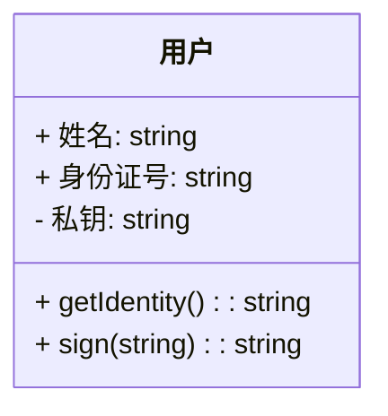
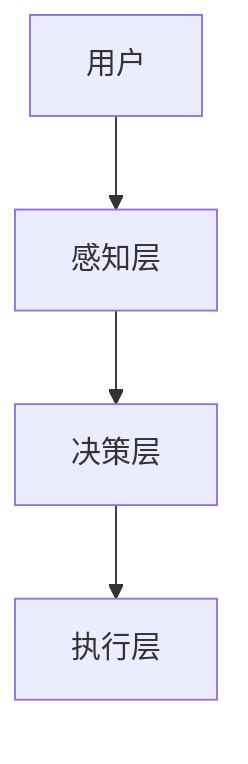
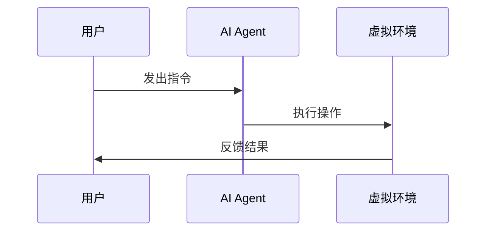

                 


# 开发AI Agent支持的智能虚拟现实系统

> 关键词：AI Agent，智能虚拟现实，系统架构，算法原理，项目实战

> 摘要：本文详细探讨了开发AI Agent支持的智能虚拟现实系统的各个方面，从核心概念到算法实现，从系统架构到项目实战，全面解析了AI Agent在智能虚拟现实系统中的应用及其对虚拟现实技术的提升。

---

## 第1章: AI Agent与智能虚拟现实系统概述

### 1.1 AI Agent的基本概念

#### 1.1.1 AI Agent的定义
AI Agent（人工智能代理）是一种能够感知环境、自主决策并执行任务的智能实体。它能够根据当前状态和环境信息，采取最优行动以实现目标。

#### 1.1.2 AI Agent的核心特征
- **自主性**：无需外部干预，自主决策。
- **反应性**：实时感知环境并做出反应。
- **目标导向性**：基于目标驱动行为。
- **学习能力**：通过经验改进性能。

#### 1.1.3 AI Agent与传统AI的区别
AI Agent不仅仅是静态的知识库或规则引擎，而是能够动态适应环境、主动采取行动的智能体。

### 1.2 智能虚拟现实系统的基本概念

#### 1.2.1 虚拟现实（VR）与增强现实（AR）的定义
- **VR**：完全沉浸式的数字环境。
- **AR**：将数字信息叠加在现实世界中。

#### 1.2.2 智能虚拟现实系统的构成要素
- **虚拟环境**：构建数字化场景。
- **用户交互**：实现人与虚拟环境的互动。
- **智能代理**：提供智能服务。

#### 1.2.3 智能虚拟现实系统的应用场景
- **教育培训**：模拟真实场景进行培训。
- **娱乐**：提升沉浸式体验。
- **工业**：用于设备操作与维护。

### 1.3 AI Agent支持的智能虚拟现实系统

#### 1.3.1 AI Agent在智能虚拟现实系统中的作用
AI Agent负责环境感知、任务执行、用户交互等关键功能。

#### 1.3.2 智能虚拟现实系统的核心问题
- **实时性**：保证快速响应。
- **准确性**：确保决策的正确性。
- **可扩展性**：支持复杂场景。

#### 1.3.3 本章小结
本章介绍了AI Agent和智能虚拟现实系统的基本概念，强调了AI Agent在提升虚拟现实系统智能性中的关键作用。

---

## 第2章: AI Agent与智能虚拟现实系统的原理

### 2.1 AI Agent的核心原理

#### 2.1.1 AI Agent的感知与决策机制
AI Agent通过传感器感知环境，利用算法进行推理和决策。

#### 2.1.2 AI Agent的行为规划算法
常用算法包括随机搜索、贪心算法和A*算法。

#### 2.1.3 AI Agent的学习与自适应能力
通过强化学习和监督学习提升性能。

### 2.2 智能虚拟现实系统的原理

#### 2.2.1 虚拟环境的构建与渲染
涉及场景建模、光照计算等技术。

#### 2.2.2 用户与虚拟环境的交互机制
包括手势识别、语音交互等。

#### 2.2.3 智能虚拟角色的行为控制
通过AI Agent实现角色的自主行为。

### 2.3 AI Agent与智能虚拟现实系统的联系

#### 2.3.1 AI Agent在智能虚拟现实系统中的功能模块
- **感知模块**：环境信息采集。
- **决策模块**：策略制定。
- **执行模块**：动作执行。

#### 2.3.2 AI Agent与虚拟环境的交互流程
用户输入 → AI Agent处理 → 系统响应。

#### 2.3.3 AI Agent对智能虚拟现实系统的优化作用
提升用户体验，降低系统延迟。

### 2.4 本章小结
本章详细讲解了AI Agent与智能虚拟现实系统的原理，分析了它们之间的联系。

---

## 第3章: AI Agent支持的智能虚拟现实系统的算法原理

### 3.1 AI Agent的核心算法

#### 3.1.1 路径规划算法
使用A*算法优化路径选择。

#### 3.1.2 自然语言处理算法
通过NLP技术实现人机对话。

### 3.2 虚拟现实系统的算法实现

#### 3.2.1 光线追踪算法
用于实时渲染高质量图像。

#### 3.2.2 碰撞检测算法
确保虚拟角色与环境的交互安全。

### 3.3 AI Agent与虚拟现实系统协同的算法

#### 3.3.1 多智能体协作算法
实现多个AI Agent的协同工作。

#### 3.3.2 实时反馈算法
优化用户交互体验。

### 3.4 算法实现的数学模型

#### 3.4.1 A*算法的数学模型
$$f(n) = g(n) + h(n)$$

#### 3.4.2 NLP算法的数学模型
$$P(\text{intent} | \text{input}) = \text{softmax}(W_{\text{intent}} \cdot \text{input})$$

### 3.5 本章小结
本章详细讲解了AI Agent支持的智能虚拟现实系统中的核心算法及其数学模型。

---

## 第4章: AI Agent支持的智能虚拟现实系统的系统分析与架构设计

### 4.1 系统分析

#### 4.1.1 项目背景
智能虚拟现实系统的开发需求。

#### 4.1.2 系统功能设计
- **环境构建**：场景建模。
- **用户交互**：输入处理。
- **智能代理**：行为控制。

#### 4.1.3 系统架构设计
采用分层架构，包括感知层、决策层和执行层。

### 4.2 系统架构设计

#### 4.2.1 领域模型类图


#### 4.2.2 系统架构图


#### 4.2.3 系统接口设计
- **输入接口**：接收用户输入。
- **输出接口**：反馈处理结果。

#### 4.2.4 系统交互流程图


### 4.3 本章小结
本章通过系统分析与架构设计，明确了AI Agent支持的智能虚拟现实系统的实现路径。

---

## 第5章: AI Agent支持的智能虚拟现实系统的项目实战

### 5.1 环境搭建

#### 5.1.1 开发工具安装
安装Python、PyTorch、OpenCV等工具。

#### 5.1.2 开发环境配置
配置虚拟环境和依赖库。

### 5.2 系统核心实现

#### 5.2.1 AI Agent的核心代码
```python
def ai_agent决策():
    感知环境信息()
    分析目标()
    制定计划()
    执行行动()
```

#### 5.2.2 虚拟现实系统的核心代码
```python
def 虚拟环境渲染():
    构建场景()
    处理用户输入()
    更新状态()
    输出结果()
```

### 5.3 代码应用解读与分析

#### 5.3.1 AI Agent代码解读
```python
def 感知环境():
    return 环境信息
```

#### 5.3.2 虚拟环境代码解读
```python
def 渲染场景():
    return 图像数据
```

### 5.4 实际案例分析

#### 5.4.1 案例背景
模拟一个虚拟助手在智能虚拟现实系统中的应用。

#### 5.4.2 案例实现
```python
def 案例实现():
    初始化系统()
    用户输入指令()
    AI Agent处理()
    输出结果()
```

### 5.5 本章小结
本章通过项目实战，详细讲解了AI Agent支持的智能虚拟现实系统的实现过程。

---

## 第6章: 总结与展望

### 6.1 本章总结
回顾了AI Agent支持的智能虚拟现实系统的开发过程。

### 6.2 最佳实践 tips
- **模块化设计**：便于维护和扩展。
- **算法优化**：提升系统性能。
- **用户体验**：注重交互设计。

### 6.3 小结
AI Agent支持的智能虚拟现实系统具有广阔的应用前景。

### 6.4 注意事项
- **性能优化**：避免资源浪费。
- **安全性**：保护用户隐私。

### 6.5 拓展阅读
推荐相关书籍和论文，供进一步学习。

---

# 附录: 参考文献

---

通过以上步骤，我们可以系统地开发和实现一个AI Agent支持的智能虚拟现实系统，从理论到实践，全面覆盖了开发过程中的关键环节。

