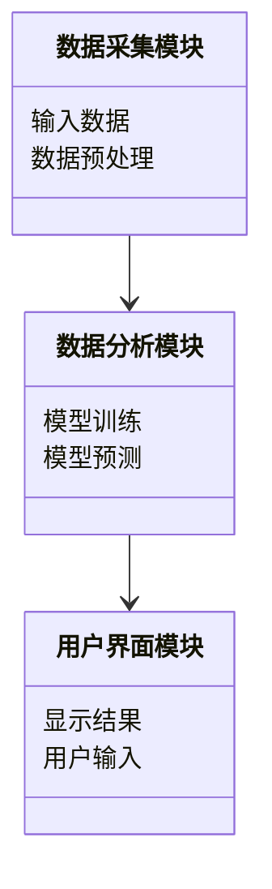

                 


```markdown
# 开发AI Agent支持的智能财务分析系统

## 关键词
AI Agent, 智能财务分析系统, 机器学习, 财务数据, 算法原理, 系统架构

## 摘要
本文详细探讨了开发AI Agent支持的智能财务分析系统的各个方面，从基本概念到算法原理，再到系统架构和项目实战。文章首先介绍了AI Agent的基本概念及其在智能财务分析系统中的应用背景，接着深入分析了AI Agent的核心技术和算法原理，最后通过项目实战展示了系统的开发与实现过程。本文旨在为开发者和研究人员提供全面的技术指导，帮助他们更好地理解和开发类似的智能财务分析系统。

---

## 第一部分: AI Agent与智能财务分析系统概述

### 第1章: AI Agent与智能财务分析系统概述

#### 1.1 AI Agent的基本概念
##### 1.1.1 AI Agent的定义
AI Agent（人工智能代理）是指在计算机系统中，能够感知环境并采取行动以实现目标的实体。AI Agent可以是软件程序，也可以是硬件设备，其核心功能是通过感知和行动与环境交互，以达到预定的目标。

##### 1.1.2 AI Agent的核心特点
- **自主性**：AI Agent能够自主决策，无需外部干预。
- **反应性**：能够实时感知环境并做出反应。
- **目标导向**：所有行为都围绕特定目标展开。
- **学习能力**：能够通过数据和经验不断优化自身性能。

##### 1.1.3 AI Agent与传统软件的区别
AI Agent与传统软件的区别主要体现在以下几个方面：
- **智能性**：AI Agent具备学习和推理能力，而传统软件通常只是被动执行任务。
- **适应性**：AI Agent能够根据环境变化调整行为，传统软件则无法做到。
- **交互性**：AI Agent能够与环境和用户进行动态交互，传统软件通常只是单向执行。

#### 1.2 智能财务分析系统的背景与意义
##### 1.2.1 财务分析的传统方法与挑战
传统的财务分析方法主要依赖于人工审核和统计分析，这种方法效率低下、容易出错，且难以应对海量数据的处理需求。

##### 1.2.2 AI Agent在财务分析中的优势
AI Agent能够快速处理大量数据，自动识别异常值和趋势，从而提高财务分析的效率和准确性。

##### 1.2.3 智能财务分析系统的应用场景
智能财务分析系统广泛应用于企业财务监控、投资决策、风险评估等领域，能够帮助财务人员更高效地完成工作。

#### 1.3 AI Agent支持的智能财务分析系统架构
##### 1.3.1 系统的整体架构
智能财务分析系统通常由数据采集模块、数据分析模块、用户界面模块和AI Agent控制模块组成。

##### 1.3.2 数据流与信息处理流程
数据从外部输入系统，经过预处理、特征提取、模型分析等步骤，最终生成分析结果并反馈给用户。

##### 1.3.3 系统的可扩展性与灵活性
系统设计注重模块化，便于根据需求进行功能扩展和性能优化。

---

## 第二部分: AI Agent的核心技术与算法原理

### 第2章: AI Agent的核心技术

#### 2.1 AI Agent的基本原理
##### 2.1.1 问题背景与问题描述
AI Agent需要解决的问题是如何在复杂多变的环境中做出最优决策。

##### 2.1.2 问题解决的思路与方法
通过感知环境、分析数据、制定策略和执行行动来实现目标。

##### 2.1.3 AI Agent的核心要素与组成
AI Agent的核心要素包括感知模块、推理模块、决策模块和执行模块。

#### 2.2 AI Agent与财务分析的结合
##### 2.2.1 财务数据的特征与处理
财务数据通常具有高维度、非线性关系等特点，需要进行清洗和特征提取。

##### 2.2.2 AI Agent在财务分析中的角色
AI Agent作为系统的智能核心，负责数据处理、模型训练和决策支持。

##### 2.2.3 AI Agent与财务分析系统的交互流程
数据输入 → 数据预处理 → 模型训练 → 决策输出 → 用户反馈。

#### 2.3 AI Agent的核心概念与联系
##### 2.3.1 AI Agent的核心概念原理
AI Agent通过感知和行动实现目标，其核心在于智能算法和数据处理能力。

##### 2.3.2 核心概念属性特征对比表格
| 属性 | AI Agent | 传统软件 |
|------|-----------|-----------|
| 智能性 | 高         | 低         |
| 适应性 | 高         | 低         |
| 交互性 | 高         | 低         |

##### 2.3.3 ER实体关系图架构的 Mermaid 流程图
```mermaid
erd
  项目: AI Agent支持的智能财务分析系统
  章节: 第2章 AI Agent的核心技术
  用户
    --> 角色: AI Agent
    --> 角色: 财务数据
    --> 关系: 实现
```

### 第3章: AI Agent的算法原理

#### 3.1 算法原理概述
##### 3.1.1 算法的基本思想
AI Agent的算法通常基于机器学习和深度学习，通过训练模型来实现智能决策。

##### 3.1.2 算法的输入与输出
输入：财务数据；输出：分析结果或决策建议。

##### 3.1.3 算法的步骤与流程
数据预处理 → 模型训练 → 模型预测 → 结果输出。

#### 3.2 算法的数学模型与公式
##### 3.2.1 数学模型的建立
以线性回归为例，模型可以表示为：
$$ y = \beta_0 + \beta_1 x + \epsilon $$

##### 3.2.2 关键公式推导
通过最小二乘法求解回归系数：
$$ \hat{\beta} = (X^T X)^{-1} X^T y $$

##### 3.2.3 公式的实际意义与应用
回归系数表示自变量对因变量的影响程度，可用于预测和趋势分析。

#### 3.3 算法的实现与优化
##### 3.3.1 算法的实现步骤
1. 数据清洗和预处理。
2. 选择合适的模型并进行训练。
3. 调参优化，提高模型性能。
4. 验证模型效果，进行部署。

##### 3.3.2 算法的优化方法
通过交叉验证、网格搜索等方法优化模型参数。

##### 3.3.3 算法的性能评估
通过准确率、召回率、F1分数等指标评估模型性能。

#### 3.4 本章小结

---

## 第三部分: 智能财务分析系统的开发与实现

### 第4章: 智能财务分析系统的架构设计

#### 4.1 系统的整体架构
##### 4.1.1 系统的模块划分
系统主要模块包括数据采集模块、数据分析模块、用户界面模块和AI Agent控制模块。

##### 4.1.2 各模块之间的关系
数据采集模块 → 数据分析模块 → AI Agent控制模块 → 用户界面模块。

##### 4.1.3 系统的可扩展性设计
模块化设计，便于后续功能扩展。

#### 4.2 系统的功能设计
##### 4.2.1 领域模型的 Mermaid 类图


#### 4.3 系统的接口设计
##### 4.3.1 系统接口的定义
定义清晰的API接口，便于模块间通信。

##### 4.3.2 接口的实现方式
通过RESTful API实现模块间通信。

##### 4.3.3 接口的调用流程
数据采集模块调用数据分析模块接口，分析结果反馈给用户界面模块。

#### 4.4 本章小结

### 第5章: 智能财务分析系统的项目实战

#### 5.1 项目环境的安装与配置
##### 5.1.1 开发工具的安装
安装Python、Jupyter Notebook、Pandas等开发工具。

##### 5.1.2 依赖库的安装与配置
安装scikit-learn、TensorFlow等机器学习库。

##### 5.1.3 环境的验证与测试
验证环境是否配置正确，确保代码可以正常运行。

#### 5.2 系统核心功能的实现
##### 5.2.1 数据采集模块的实现
```python
import pandas as pd
data = pd.read_csv('financial_data.csv')
```

##### 5.2.2 数据分析模块的实现
```python
from sklearn.linear_model import LinearRegression
model = LinearRegression()
model.fit(X, y)
```

##### 5.2.3 用户界面模块的实现
```python
print("分析结果:", result)
```

#### 5.3 代码的应用
##### 5.3.1 代码实现
通过代码实现数据采集、分析和结果显示的完整流程。

##### 5.3.2 代码应用解读与分析
详细解读代码的每个部分，说明其在系统中的作用。

##### 5.3.3 实际案例分析
通过具体案例分析，展示系统的实际应用效果。

#### 5.4 项目小结
总结项目开发过程中的经验和教训，提出改进建议。

---

## 第四部分: 总结与展望

### 第6章: 总结与展望

#### 6.1 本章小结
总结本文的主要内容和技术要点，强调AI Agent在智能财务分析系统中的重要性。

#### 6.2 未来的发展方向
探讨AI Agent技术在财务分析领域的未来发展方向，如多模态数据处理、自适应学习等。

#### 6.3 最佳实践 tips
给出一些实用的开发建议，如选择合适的工具和库，注重代码的可维护性等。

#### 6.4 小结
重申AI Agent技术在智能财务分析系统中的潜力和重要性，鼓励读者进一步研究和实践。

---

通过本文的详细讲解，读者可以系统地了解AI Agent支持的智能财务分析系统的开发过程，并能够实际应用这些技术解决实际问题。
```

