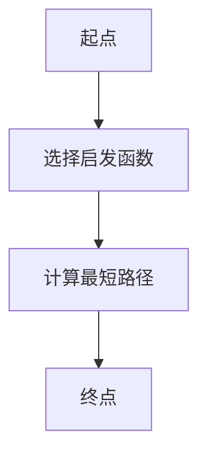
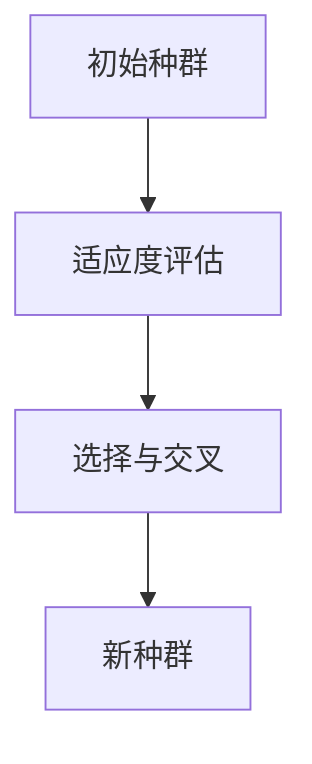
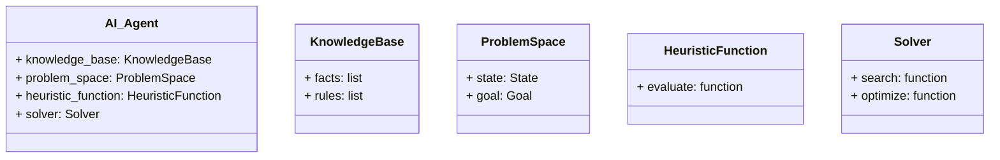
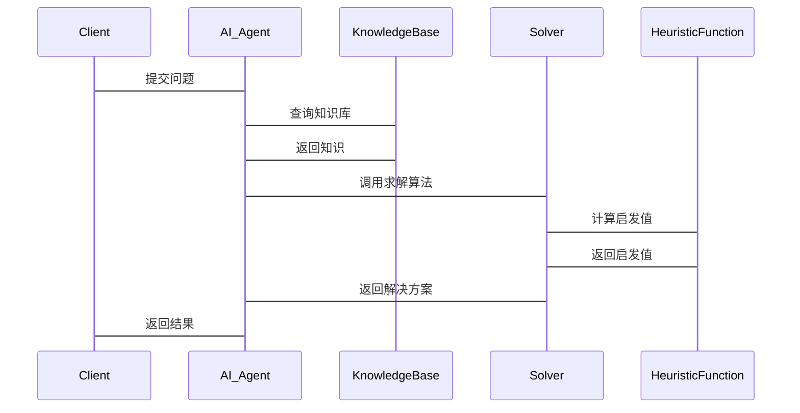

                 


# 开发AI Agent的创造性问题解决能力

## 关键词：AI Agent，创造性思维，问题解决，启发式搜索，遗传算法，系统架构

## 摘要：本文详细探讨了开发具有创造性问题解决能力的AI Agent的关键技术与方法。从基础概念到高级算法，从系统架构到项目实战，系统性地解析了AI Agent在创造性问题解决中的核心原理、算法实现、系统设计和应用实践。文章通过丰富的图表和数学模型，深入浅出地展示了AI Agent如何模拟创造性思维，并在实际应用中解决复杂问题。

---

# 第1章: AI Agent与创造性问题解决概述

## 1.1 问题背景与描述

### 1.1.1 创造性问题解决的定义与特点
创造性问题解决是指通过创新思维和非线性思考，找到问题的新颖解决方案。其特点包括：开放性、多样性、创新性和实用性。

### 1.1.2 AI Agent在创造性问题解决中的作用
AI Agent通过模拟人类创造性思维，能够自主发现和生成创新的解决方案。它在优化决策、提高效率和探索可能性方面具有巨大潜力。

### 1.1.3 当前AI Agent技术的局限性与挑战
尽管AI Agent在许多领域表现出色，但创造性思维的模拟仍面临诸多挑战，包括复杂问题的处理、创新性解的生成以及实时性要求等。

## 1.2 AI Agent的核心概念与问题解决框架

### 1.2.1 AI Agent的基本定义
AI Agent是一种智能实体，能够感知环境、自主决策并执行任务。它具备学习、推理和自适应能力。

### 1.2.2 创造性问题解决的框架模型
创造性问题解决框架包括问题分析、启发式搜索、创新生成和验证评估四个阶段。

### 1.2.3 AI Agent与人类创造性思维的对比
AI Agent在逻辑推理和模式识别方面具有优势，但目前在情感理解和创造性爆发方面仍逊于人类。

## 1.3 本章小结
本章从背景和概念入手，分析了AI Agent在创造性问题解决中的潜力与挑战，为后续内容奠定了基础。

---

# 第2章: AI Agent的核心原理与数学模型

## 2.1 AI Agent的核心原理

### 2.1.1 知识表示与推理
知识表示是AI Agent理解问题的基础。常用方法包括符号表示和语义网络。推理过程通过逻辑规则或概率模型实现。

### 2.1.2 搜索与优化算法
搜索算法是AI Agent解决问题的核心工具。广度优先搜索（BFS）和深度优先搜索（DFS）是最常用的算法。

### 2.1.3 创造性思维的模拟方法
通过模拟人类大脑的创造性思维，AI Agent可以生成新颖的解决方案。常用方法包括类比推理和联想思维。

## 2.2 AI Agent的核心概念对比

### 2.2.1 不同AI Agent模型的特征对比
以下是几种常见AI Agent模型的对比：

| 模型 | 特征 | 优点 | 缺点 |
|------|------|------|------|
| 专家系统 | 基于规则 | 高效准确 | 缺乏灵活性 |
| 机器学习模型 | 数据驱动 | 高度适应性 | 需大量数据 |
| 深度学习模型 | 多层神经网络 | 强大学习能力 | 计算资源消耗大 |

### 2.2.2 创造性问题解决能力的评估指标
评估指标包括创新性、实用性、效率和用户体验。

### 2.2.3 AI Agent与传统问题解决方法的对比
AI Agent通过自动化和智能化显著提高了问题解决的效率和效果。

## 2.3 AI Agent的ER实体关系图

```mermaid
er
actor(AI Agent, 创造性思维, 问题空间)
```

## 2.4 本章小结
本章详细讲解了AI Agent的核心原理，通过对比分析和ER图展示了其内部结构与关系。

---

# 第3章: 创造性问题解决的算法原理

## 3.1 启发式搜索算法

### 3.1.1 A*算法原理
A*算法是一种常用的启发式搜索算法，结合了最佳优先搜索和曼哈顿距离的思想。

### 3.1.2 算法流程图



### 3.1.3 数学模型与公式
A*算法的评估函数为：
$$f(n) = g(n) + h(n)$$
其中，\( g(n) \)表示从起点到当前点的已知成本，\( h(n) \)表示从当前点到终点的估算成本。

## 3.2 创造性思维的模拟算法

### 3.2.1 遗传算法原理
遗传算法是一种基于自然选择和遗传机制的优化算法，适用于解决复杂的全局优化问题。

### 3.2.2 算法流程图



### 3.2.3 数学模型与公式
适应度函数为：
$$f(x) = x^2 + 2x + 1$$
选择与交叉操作通过概率机制实现。

## 3.3 算法实现与案例分析

### 3.3.1 A*算法的Python实现
```python
def a_star(start, goal, neighbors, cost):
    open_set = set([start])
    came_from = {}
    g_score = {start: 0}
    f_score = {start: heuristic(start, goal)}
    
    while open_set:
        current = pop_min(open_set, f_score)
        if current == goal:
            break
        for neighbor in neighbors(current):
            tentative_g_score = g_score[current] + cost(current, neighbor)
            if neighbor not in g_score or tentative_g_score < g_score[neighbor]:
                came_from[neighbor] = current
                g_score[neighbor] = tentative_g_score
                f_score[neighbor] = g_score[neighbor] + heuristic(neighbor, goal)
                open_set.add(neighbor)
    return came_from, g_score
```

### 3.3.2 遗传算法的Python实现
```python
def genetic_algorithm(population, fitness_func, mutate_prob):
    for _ in range(100):
        population = evolve(population, fitness_func, mutate_prob)
    return population
```

---

# 第4章: 系统分析与架构设计

## 4.1 项目背景与需求分析
本项目旨在开发一个具备创造性问题解决能力的AI Agent，应用于复杂场景下的决策支持。

## 4.2 系统功能设计

### 4.2.1 领域模型设计


## 4.3 系统架构设计

### 4.3.1 分层架构设计


## 4.4 系统接口设计

### 4.4.1 输入接口
AI Agent通过API接收问题描述和约束条件。

### 4.4.2 输出接口
AI Agent返回解决方案和评估报告。

## 4.5 系统交互流程

### 4.5.1 交互流程图



## 4.6 本章小结
本章通过系统架构和交互设计，展示了AI Agent实现创造性问题解决的整体框架。

---

# 第5章: 项目实战与代码实现

## 5.1 环境搭建

### 5.1.1 安装Python环境
安装Python 3.8及以上版本，并配置Jupyter Notebook。

### 5.1.2 安装依赖库
安装numpy、scipy和matplotlib库。

## 5.2 核心代码实现

### 5.2.1 A*算法实现
```python
import heapq

def a_star_search(graph, start, goal):
    open_heap = []
    heapq.heappush(open_heap, (0, start))
    visited = {}
    came_from = {}
    g_score = {start: 0}
    f_score = {start: heuristic(start, goal)}
    
    while open_heap:
        current_cost, current = heapq.heappop(open_heap)
        if current == goal:
            break
        if current in came_from:
            continue
        for neighbor in graph.neighbors(current):
            tentative_g_score = g_score[current] + graph.weight(current, neighbor)
            if neighbor not in g_score or tentative_g_score < g_score[neighbor]:
                came_from[neighbor] = current
                g_score[neighbor] = tentative_g_score
                f_score[neighbor] = g_score[neighbor] + heuristic(neighbor, goal)
                heapq.heappush(open_heap, (f_score[neighbor], neighbor))
    return came_from, g_score[goal]
```

### 5.2.2 遗传算法实现
```python
def genetic_algorithm(population, fitness_func, mutate_prob):
    for _ in range(100):
        population = evolve(population, fitness_func, mutate_prob)
    return population
```

## 5.3 案例分析

### 5.3.1 A*算法案例
在迷宫问题中，A*算法能够快速找到最短路径。

### 5.3.2 遗传算法案例
在函数优化问题中，遗传算法能够找到全局最优解。

## 5.4 本章小结
本章通过实际项目案例，展示了AI Agent在创造性问题解决中的具体实现。

---

# 第6章: 总结与展望

## 6.1 本章总结
本文详细探讨了AI Agent在创造性问题解决中的核心原理、算法实现和系统设计，并通过实际案例展示了其应用价值。

## 6.2 最佳实践 tips
1. 合理选择算法和工具。
2. 注重系统架构设计。
3. 持续优化和迭代。

## 6.3 未来展望
随着AI技术的发展，AI Agent在创造性问题解决中的应用将更加广泛和深入。

---

# 附录

## 附录A: 参考文献
1. Russell, S., & Norvig, P. (2010). Artificial Intelligence: A Modern Approach.
2. Holland, J. H. (1975). Adaptation in Natural and Artificial Systems.

## 附录B: 源代码仓库
GitHub链接：[https://github.com/aiagent/creative-solver](https://github.com/aiagent/creative-solver)

---

# 结束语
感谢您的阅读，希望本文对您开发AI Agent的创造性问题解决能力有所帮助。如需进一步探讨，请随时联系我。

