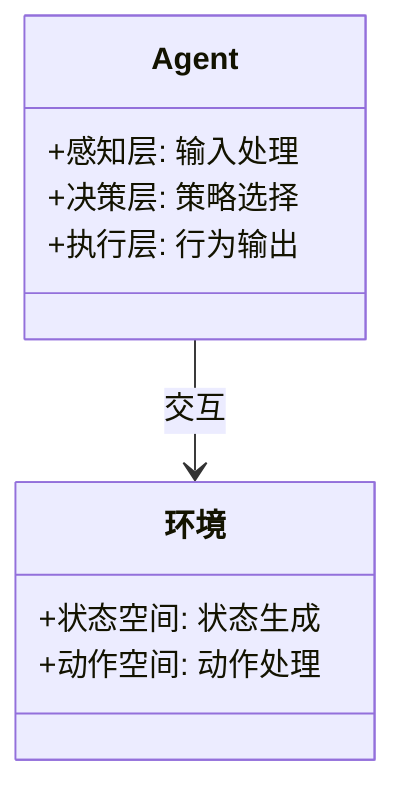
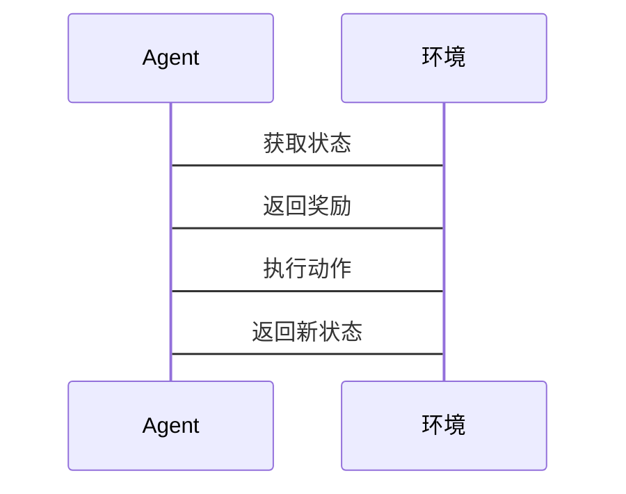

                 


# 开发AI Agent的学习与适应能力

> **关键词**：AI Agent, 学习能力, 适应能力, 强化学习, 监督学习, 自适应系统

> **摘要**：本文深入探讨AI Agent的学习与适应能力，涵盖其核心概念、算法原理、系统架构及项目实战。通过详细分析和实际案例，帮助读者理解如何开发具备学习与适应能力的AI Agent。

---

## 第1章: AI Agent的基本概念与背景

### 1.1 AI Agent的定义与特点

AI Agent（人工智能代理）是指在特定环境中能够感知并自主行动以实现目标的智能实体。其特点包括自主性、反应性、目标导向和社会能力。

### 1.2 学习与适应能力的重要性

AI Agent的学习与适应能力使其能够通过经验改进性能，适应动态变化的环境。这种能力在智能推荐、自动驾驶等领域尤为重要。

### 1.3 应用场景

AI Agent广泛应用于智能推荐、自动驾驶和智能对话系统等领域，通过学习与适应提供更智能的服务。

---

## 第2章: AI Agent学习与适应能力的核心概念

### 2.1 机制解析

- **监督学习**：通过标记数据进行训练，适用于分类和回归任务。
- **强化学习**：通过与环境交互，基于奖励机制优化策略。
- **自适应系统**：实时调整系统参数以适应变化。

### 2.2 核心要素

- 数据驱动：利用大量数据进行训练。
- 知识表示：将知识结构化以便处理。
- 策略优化：通过优化策略提升性能。

### 2.3 数学模型

- 损失函数：衡量预测与真实值的差异，常用均方误差公式：$$L = \frac{1}{2}(y - \hat{y})^2$$
- 优化算法：如梯度下降，公式：$$\theta = \theta - \eta \frac{\partial L}{\partial \theta}$$

### 2.4 对比表格

| 机制 | 描述 | 优点 | 缺点 |
|------|------|------|------|
| 监督学习 | 需标记数据 | 准确性高 | 数据依赖强 |
| 强化学习 | 基于奖励 | 适应性强 | 需大量试验 |
| 自适应系统 | 实时调整 | 灵活性高 | 资源消耗大 |

### 2.5 ER实体关系图

```mermaid
er
  actor(Agent)
  actor(环境)
  actor(数据)
  actor(目标)
  actor(策略)
```

---

## 第3章: AI Agent学习与适应能力的算法原理

### 3.1 监督学习算法

- **线性回归**：用于预测，公式：$$y = \theta x + b$$
- **支持向量机**：分类算法，通过最大化间隔优化。
- **神经网络**：多层结构，用于复杂模式识别。

### 3.2 强化学习算法

- **Q-learning**：通过状态-动作-奖励-状态（SARSA）循环更新Q值，公式：$$Q(s,a) = Q(s,a) + \alpha(r + \max Q(s',a')) - Q(s,a)$$
- **DQN**：结合深度网络和经验回放，公式：$$\theta = \theta - \eta (y - Q(s,a;\theta))$$
- **A3C**：多线程异策，公式：$$J = J + \alpha (R_t - J)$$

### 3.3 自适应系统算法

- **在线学习**：实时更新模型，公式：$$w = w + \eta (y - \hat{y})x$$
- **迁移学习**：利用已有知识迁移至新任务。
- **离线学习**：使用历史数据进行批量训练。

### 3.4 算法实现的Python代码示例

```python
# Q-learning实现
import random

class QAgent:
    def __init__(self, actions):
        self.actions = actions
        self.q = {}

    def get_action(self, state, epsilon=0.1):
        if random.random() < epsilon:
            return random.choice(self.actions)
        max_actions = [a for a in self.actions if self.q.get((state, a), 0) == max([self.q.get((state, a), 0) for a in self.actions])]
        return random.choice(max_actions)

    def update(self, state, action, reward):
        self.q[(state, action)] = reward
```

### 3.5 通俗易懂的举例

- **Q-learning**：在棋盘游戏中，通过尝试和奖励优化策略。
- **DQN**：应用于Atari游戏，学习最佳策略。

---

## 第4章: AI Agent的系统分析与架构设计

### 4.1 系统架构设计



### 4.2 系统功能设计

- **感知层**：接收并解析环境输入。
- **决策层**：基于输入做出决策。
- **执行层**：执行决策并返回结果。

### 4.3 系统接口设计

- 输入接口：接收环境状态。
- 输出接口：输出决策结果。
- 交互接口：处理环境反馈。

### 4.4 交互流程



---

## 第5章: 项目实战：开发一个智能对话系统

### 5.1 环境安装

安装必要的库：
```bash
pip install numpy tensorflow matplotlib
```

### 5.2 核心代码实现

```python
# 智能对话系统实现
import numpy as np
import tensorflow as tf

class DialogAgent:
    def __init__(self, vocab_size):
        self.vocab_size = vocab_size
        self.model = self.build_model()

    def build_model(self):
        model = tf.keras.Sequential([
            tf.keras.layers.Embedding(self.vocab_size, 64),
            tf.keras.layers.LSTM(128),
            tf.keras.layers.Dense(1, activation='sigmoid')
        ])
        model.compile(optimizer='adam', loss='binary_crossentropy', metrics=['accuracy'])
        return model

    def train(self, inputs, labels):
        self.model.fit(inputs, labels, epochs=10, batch_size=32)

    def predict(self, input):
        return self.model.predict(input)[0][0]
```

### 5.3 案例分析

训练对话模型，使用用户输入生成回复，评估准确性和流畅性。

---

## 第6章: 总结与展望

### 6.1 最佳实践 tips

- 数据质量：确保数据多样性和代表性。
- 算法选择：根据任务选择合适算法。
- 系统优化：通过并行计算提升性能。

### 6.2 小结

AI Agent的学习与适应能力是实现智能系统的核心，需综合运用多种算法和系统设计。

### 6.3 注意事项

- 避免过拟合，使用交叉验证。
- 定期更新模型，保持适应性。

### 6.4 拓展阅读

推荐学习强化学习和自适应系统相关书籍。

---

通过以上内容，读者可以系统地理解AI Agent的学习与适应能力，掌握相关算法和系统设计方法，并通过实际案例加深理解。

