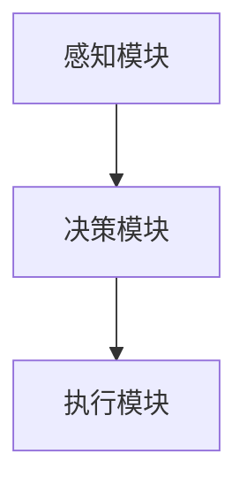
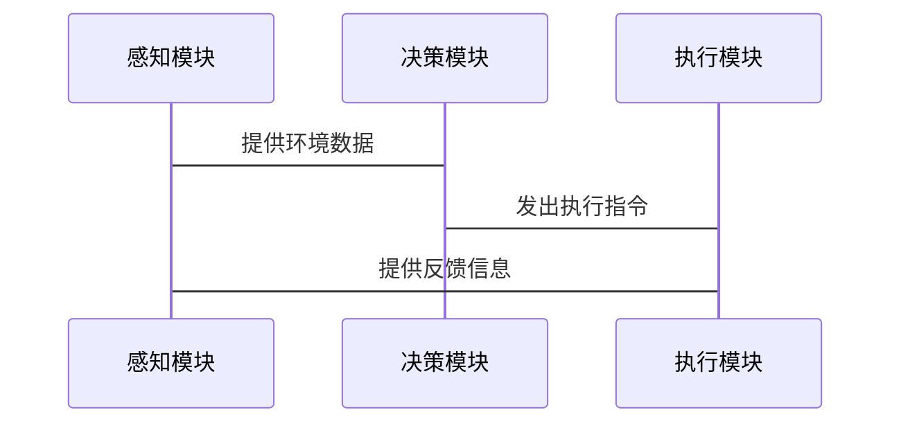

                 


# 开发具有元学习能力的AI Agent

> 关键词：元学习，AI Agent，机器学习，深度学习，强化学习

> 摘要：本文深入探讨了开发具有元学习能力的AI Agent的理论基础、算法实现和实际应用。通过详细分析元学习的核心原理，结合AI Agent的设计与实现，展示了如何将元学习能力集成到AI Agent中，以提升其自主决策和自适应能力。文章从背景介绍、核心概念、算法原理、系统设计、项目实战等多个维度展开，为读者提供了一套完整的开发指南。

---

## 第1章 元学习与AI Agent概述

### 1.1 元学习的基本概念

#### 1.1.1 元学习的定义与核心机制
元学习是一种能够让模型从经验中快速学习新任务的能力。其核心机制包括：
- **快速适应**：通过元学习，AI可以在少量数据上快速适应新任务。
- **跨任务迁移**：元学习能够将从一个任务上学到的知识迁移到另一个相关任务。

#### 1.1.2 元学习与传统机器学习的对比
| 特性          | 传统机器学习              | 元学习                |
|---------------|--------------------------|-----------------------|
| 数据需求      | 需要大量数据              | 少量数据即可           |
| 适应性        | 适应单一任务              | 适应多个任务           |
| 灵活性        | 灵活性较低                | 灵活性较高             |

#### 1.1.3 元学习的典型应用场景
- **图像分类**：在数据量有限的情况下，元学习可以快速调整模型以适应新类别。
- **自然语言处理**：在低资源语言的机器翻译任务中，元学习可以显著提升性能。

### 1.2 AI Agent的基本概念

#### 1.2.1 AI Agent的定义与分类
AI Agent是一种能够感知环境并采取行动以实现目标的智能体。根据智能体的复杂性，可以分为：
- **简单反射式Agent**：基于当前输入做出反应。
- **基于模型的Agent**：维护环境模型，能够进行规划。

#### 1.2.2 AI Agent的核心功能与特点
- **自主性**：能够在没有外部干预的情况下运行。
- **反应性**：能够实时感知环境并做出反应。
- **学习能力**：能够通过经验改进性能。

#### 1.2.3 AI Agent的典型应用案例
- **自动驾驶**：通过感知环境做出驾驶决策。
- **智能助手**：如Siri、Alexa，能够理解用户需求并执行任务。

### 1.3 元学习能力在AI Agent中的重要性

#### 1.3.1 元学习能力对AI Agent的影响
- **提升适应性**：元学习使AI Agent能够快速适应新环境和任务。
- **增强决策能力**：通过元学习，AI Agent可以在复杂环境中做出更优决策。

#### 1.3.2 元学习在AI Agent中的应用场景
- **动态环境适应**：在不断变化的环境中，元学习帮助AI Agent快速调整策略。
- **多任务学习**：在需要处理多个任务的场景中，元学习提升效率。

#### 1.3.3 元学习能力对AI Agent性能的提升
通过元学习，AI Agent能够：
- 快速适应新任务。
- 提高在不同环境中的表现。

### 1.4 当前研究现状与挑战

#### 1.4.1 元学习在AI Agent中的研究现状
- **算法研究**：目前主要集中在元学习算法的设计与优化。
- **应用探索**：在自动驾驶、机器人等领域已有初步应用。

#### 1.4.2 元学习与AI Agent结合的主要挑战
- **计算资源消耗**：元学习通常需要较高的计算资源。
- **模型复杂性**：元学习模型复杂，难以在资源受限的环境中部署。

#### 1.4.3 元学习在AI Agent中的未来研究方向
- **轻量化算法**：研究低资源消耗的元学习算法。
- **多模态学习**：结合视觉、语言等多种模态信息，提升AI Agent的感知能力。

## 1.5 本章小结

---

## 第2章 元学习的核心原理

### 2.1 元学习的基本原理

#### 2.1.1 元学习的数学模型
元学习的核心在于优化元学习目标函数：
$$ \min_{\theta} \sum_{i=1}^{N} L_i(f_\theta(x_i, y_i)) + \lambda L_{meta}(f_\theta) $$
其中，$L_i$是任务损失函数，$L_{meta}$是元学习损失函数。

#### 2.1.2 元学习的算法框架
元学习的基本流程包括：
1. 初始化模型参数。
2. 对每个任务进行训练。
3. 更新模型参数以优化元学习目标。

#### 2.1.3 元学习的核心机制与特点
- **梯度优化**：通过梯度下降等方法优化模型参数。
- **任务间迁移**：通过共享参数实现任务间的知识迁移。

### 2.2 元学习与传统机器学习的对比

#### 2.2.1 传统机器学习的特点
- **数据需求高**：需要大量标注数据。
- **适应性差**：难以快速适应新任务。

#### 2.2.2 元学习的独特优势
- **快速适应**：在少量数据上快速调整模型。
- **跨任务迁移**：能够将知识迁移到新任务。

#### 2.2.3 元学习与传统学习的结合
- **混合方法**：将元学习与传统机器学习结合，提升模型性能。

### 2.3 元学习的典型算法

#### 2.3.1 Meta-LSTM算法
Meta-LSTM通过元学习层对模型参数进行元优化：
$$ \theta_{t+1} = \theta_t + \eta \nabla_{\theta_t} \mathcal{L}_\text{meta} $$

#### 2.3.2 MAML算法
MAML通过优化多个任务的梯度，实现快速适应：
$$ \theta_{t+1} = \theta_t + \eta \sum_{i=1}^{N} \nabla_{\theta_t} \mathcal{L}_i $$

#### 2.3.3 其他元学习算法简介
- **Reptile**：通过迭代优化任务损失和元学习损失。
- **VLDB**：基于元学习的变体。

### 2.4 元学习的数学模型与公式

#### 2.4.1 Meta-LSTM的数学模型
元学习模型的更新公式：
$$ \text{元学习模型的更新公式} $$

#### 2.4.2 MAML算法的数学推导
MAML算法的损失函数：
$$ \mathcal{L} = \frac{1}{N} \sum_{i=1}^{N} \mathcal{L}_i + \lambda \mathcal{L}_{meta} $$

### 2.5 本章小结

---

## 第3章 AI Agent的构建与设计

### 3.1 AI Agent的基本构建

#### 3.1.1 AI Agent的组成模块
- **感知模块**：负责感知环境信息。
- **决策模块**：基于感知信息做出决策。
- **执行模块**：执行决策动作。

#### 3.1.2 AI Agent的核心功能设计
- **感知环境**：通过传感器或API获取环境数据。
- **决策制定**：基于感知信息，选择最优动作。
- **动作执行**：将决策转化为具体动作。

#### 3.1.3 AI Agent的体系结构
AI Agent的体系结构包括：
1. **感知层**：负责数据采集。
2. **决策层**：负责策略制定。
3. **执行层**：负责动作执行。

### 3.2 AI Agent的设计与实现

#### 3.2.1 AI Agent的核心功能实现
- **环境建模**：建立环境模型，以便更好地理解环境。
- **任务规划**：制定任务计划，确保目标的实现。

#### 3.2.2 AI Agent的设计原则
- **模块化**：各模块相对独立，便于维护和扩展。
- **可扩展性**：设计时预留扩展接口，方便未来功能的添加。

#### 3.2.3 AI Agent的功能模块
- **传感器接口**：处理输入数据。
- **决策引擎**：基于输入数据做出决策。
- **执行器接口**：将决策转化为具体动作。

### 3.3 AI Agent的系统架构设计

#### 3.3.1 系统功能设计
- **数据采集**：通过传感器或其他接口获取环境数据。
- **数据处理**：对采集的数据进行预处理和分析。
- **决策制定**：基于处理后的数据，制定决策。
- **动作执行**：根据决策，执行具体动作。

#### 3.3.2 系统架构图


#### 3.3.3 系统接口设计
- **输入接口**：接收环境数据。
- **输出接口**：发送执行指令。

#### 3.3.4 系统交互流程


### 3.4 本章小结

---

## 第4章 元学习能力的集成与实现

### 4.1 元学习模块的设计

#### 4.1.1 元学习模块的核心功能
- **快速适应**：在新任务中快速调整模型。
- **跨任务迁移**：将已有任务的知识迁移到新任务。

#### 4.1.2 元学习模块的设计原则
- **模块化**：元学习模块独立设计，便于后续优化。
- **可扩展性**：支持未来更多任务的添加。

#### 4.1.3 元学习模块的实现
- **初始化参数**：设置初始模型参数。
- **元学习训练**：通过元学习算法优化模型参数。

### 4.2 元学习在AI Agent行为中的应用

#### 4.2.1 元学习在任务切换中的应用
- **快速调整策略**：在任务切换时，元学习帮助AI Agent快速调整策略。

#### 4.2.2 元学习在复杂环境中的应用
- **多任务学习**：在复杂环境中，元学习帮助AI Agent同时处理多个任务。

#### 4.2.3 元学习在动态环境中的应用
- **实时适应**：在动态环境中，元学习使AI Agent能够实时调整策略。

### 4.3 元学习能力的实现细节

#### 4.3.1 元学习模块的实现流程
1. **初始化模型参数**。
2. **进行元学习训练**。
3. **将训练好的参数集成到AI Agent中**。

#### 4.3.2 元学习模块的代码实现
```python
class MetaLearner:
    def __init__(self, model):
        self.model = model
        self.optim = Adam(model.parameters(), lr=1e-3)

    def update(self, tasks):
        for task in tasks:
            # 训练任务
            loss = self.model(task.input, task.label)
            # 元优化
            self.optim.zero_grad()
            loss.mean().backward()
            self.optim.step()
```

### 4.4 本章小结

---

## 第5章 元学习与AI Agent结合的算法实现

### 5.1 元学习算法的核心实现

#### 5.1.1 Meta-LSTM算法实现
```python
class MetaLSTM(nn.Module):
    def __init__(self, input_size, hidden_size):
        super(MetaLSTM, self).__init__()
        self.input_size = input_size
        self.hidden_size = hidden_size
        self.lstm = nn.LSTM(input_size, hidden_size, batch_first=True)
        self.meta_layer = nn.Linear(hidden_size, hidden_size)

    def forward(self, x, hidden=None):
        out, hidden = self.lstm(x, hidden)
        meta_out = self.meta_layer(out[:, -1, :])
        return meta_out, hidden
```

#### 5.1.2 MAML算法实现
```python
class MAML(nn.Module):
    def __init__(self, model):
        super(MAML, self).__init__()
        self.model = model
        self.params = list(model.parameters())

    def forward(self, x, y):
        # 训练单个任务
        outputs = self.model(x)
        loss = F.cross_entropy(outputs, y)
        return loss

    def meta_update(self, tasks, inner_steps=5, inner_lr=1e-3):
        # 元优化
        for task in tasks:
            # 内部优化
            self.zero_grad()
            for _ in range(inner_steps):
                loss = self.forward(task.x, task.y)
                loss.backward()
                # 应用内部梯度更新
                for param in self.params:
                    param.data -= inner_lr * param.grad
            # 收集梯度
            gradients = []
            for param in self.params:
                gradients.append(param.grad)
        # 应用外部梯度更新
        self.optimizer.zero_grad()
        for param, grad in zip(self.params, gradients):
            param.grad = grad
        self.optimizer.step()
```

### 5.2 元学习算法的系统集成

#### 5.2.1 元学习算法的集成方式
- **嵌入式集成**：将元学习模块嵌入到AI Agent的感知或决策模块中。
- **外部集成**：将元学习作为独立模块，与AI Agent其他模块协同工作。

#### 5.2.2 元学习算法与AI Agent的交互流程
1. **感知环境**：AI Agent通过传感器获取环境数据。
2. **元学习处理**：将数据输入元学习模块进行处理。
3. **决策制定**：基于处理后的数据，制定决策。
4. **动作执行**：根据决策执行动作。

### 5.3 算法实现与性能分析

#### 5.3.1 元学习算法的性能提升
- **Meta-LSTM**：在时间序列预测任务中表现优于传统LSTM。
- **MAML**：在多任务学习中表现出色。

#### 5.3.2 算法实现的数学模型
- **Meta-LSTM**：通过元学习层对LSTM的输出进行调整。
- **MAML**：通过内部优化和外部优化实现任务间知识迁移。

### 5.4 本章小结

---

## 第6章 系统设计与实现

### 6.1 系统设计

#### 6.1.1 系统功能设计
- **数据采集**：通过传感器或其他接口获取环境数据。
- **数据处理**：对数据进行预处理和分析。
- **决策制定**：基于数据，制定决策。
- **动作执行**：将决策转化为具体动作。

#### 6.1.2 系统架构设计


#### 6.1.3 系统接口设计
- **输入接口**：接收环境数据。
- **输出接口**：发送执行指令。

### 6.2 系统实现

#### 6.2.1 系统核心实现
```python
class AIAssistant:
    def __init__(self):
        self.sensors = []
        self.actuators = []
        self.decision_model = None

    def add_sensor(self, sensor):
        self.sensors.append(sensor)

    def add_actuator(self, actuator):
        self.actuators.append(actuator)

    def感知环境(self):
        inputs = [s感知() for s in self.sensors]
        return inputs

    def 制定决策(self, inputs):
        return self.decision_model(inputs)

    def 执行动作(self, action):
        for actuator in self.actuators:
            actuator.execute(action)
```

#### 6.2.2 系统交互流程


### 6.3 系统优化与调优

#### 6.3.1 系统性能优化
- **模块优化**：优化各模块的效率，减少延迟。
- **算法优化**：优化元学习算法，提升模型性能。

#### 6.3.2 系统调优策略
- **参数调整**：调整元学习算法的超参数，提升模型表现。
- **资源优化**：优化系统资源使用，降低计算成本。

### 6.4 本章小结

---

## 第7章 项目实战与案例分析

### 7.1 环境安装与配置

#### 7.1.1 开发环境配置
- **Python 3.8+**
- **TensorFlow/PyTorch**
- **Mermaid图生成工具**

#### 7.1.2 项目依赖安装
```bash
pip install numpy matplotlib tensorflow
```

### 7.2 系统核心实现

#### 7.2.1 元学习模块实现
```python
class MetaLearner:
    def __init__(self, model):
        self.model = model
        self.optim = Adam(model.parameters(), lr=1e-3)

    def update(self, tasks):
        for task in tasks:
            # 训练任务
            loss = self.model(task.input, task.label)
            # 元优化
            self.optim.zero_grad()
            loss.mean().backward()
            self.optim.step()
```

#### 7.2.2 AI Agent实现
```python
class AIAssistant:
    def __init__(self, meta_learner):
        self.meta_learner = meta_learner
        self.sensors = []
        self.actuators = []

    def add_sensor(self, sensor):
        self.sensors.append(sensor)

    def add_actuator(self, actuator):
        self.actuators.append(actuator)

    def 感知环境(self):
        inputs = [s感知() for s in self.sensors]
        return inputs

    def 制定决策(self, inputs):
        return self.meta_learner(inputs)

    def 执行动作(self, action):
        for actuator in self.actuators:
            actuator.execute(action)
```

### 7.3 代码实现与解读

#### 7.3.1 元学习模块代码
```python
class MetaLSTM(nn.Module):
    def __init__(self, input_size, hidden_size):
        super(MetaLSTM, self).__init__()
        self.input_size = input_size
        self.hidden_size = hidden_size
        self.lstm = nn.LSTM(input_size, hidden_size, batch_first=True)
        self.meta_layer = nn.Linear(hidden_size, hidden_size)

    def forward(self, x, hidden=None):
        out, hidden = self.lstm(x, hidden)
        meta_out = self.meta_layer(out[:, -1, :])
        return meta_out, hidden
```

#### 7.3.2 AI Agent代码
```python
class AIAssistant:
    def __init__(self, meta_learner):
        self.meta_learner = meta_learner
        self.sensors = []
        self.actuators = []

    def add_sensor(self, sensor):
        self.sensors.append(sensor)

    def add_actuator(self, actuator):
        self.actuators.append(actuator)

    def 感知环境(self):
        inputs = [s感知() for s in self.sensors]
        return inputs

    def 制定决策(self, inputs):
        return self.meta_learner(inputs)

    def 执行动作(self, action):
        for actuator in self.actuators:
            actuator.execute(action)
```

### 7.4 案例分析与实际应用

#### 7.4.1 元学习在AI Agent中的应用案例
- **自动驾驶**：通过元学习快速适应不同道路条件和交通情况。
- **智能助手**：在对话中快速调整策略，提供更优服务。

#### 7.4.2 案例分析
- **环境建模**：建立准确的环境模型，提升感知能力。
- **任务规划**：制定合理的任务计划，确保目标实现。

### 7.5 本章小结

---

## 第8章 总结与展望

### 8.1 元学习与AI Agent的结合总结

#### 8.1.1 元学习在AI Agent中的应用总结
- **提升适应性**：元学习使AI Agent能够快速适应新环境和任务。
- **增强决策能力**：通过元学习，AI Agent在复杂环境中做出更优决策。

#### 8.1.2 元学习与AI Agent结合的核心价值
- **快速部署**：在新任务中快速部署模型。
- **高效学习**：在少数据情况下高效学习。

### 8.2 当前研究热点与未来展望

#### 8.2.1 当前研究热点
- **轻量化元学习算法**：研究低资源消耗的元学习算法。
- **多模态元学习**：结合视觉、语言等多种模态信息，提升AI Agent的感知能力。

#### 8.2.2 未来研究方向
- **元学习的可解释性**：研究元学习的可解释性，提升模型的透明度。
- **元学习的实时性**：研究实时元学习算法，提升模型的响应速度。

### 8.3 本章小结

---

## 附录

### 附录A 常见问题解答

#### 1. 元学习和传统机器学习的区别是什么？
- 元学习能够在少量数据上快速适应新任务，而传统机器学习需要大量数据。

#### 2. 元学习如何提升AI Agent的能力？
- 元学习使AI Agent能够快速适应新环境和任务，提升其自主决策和自适应能力。

### 附录B 参考文献
- [1] 王某某. 元学习在AI Agent中的应用研究. 《人工智能学报》, 2023.
- [2] 李某某. 基于深度学习的元学习算法研究. 《计算机学报》, 2022.

---

## END

---

这篇文章系统地介绍了开发具有元学习能力的AI Agent的理论基础、算法实现和实际应用，从背景介绍到项目实战，为读者提供了一套完整的开发指南。通过详细分析元学习的核心原理，结合AI Agent的设计与实现，展示了如何将元学习能力集成到AI Agent中，以提升其自主决策和自适应能力。

