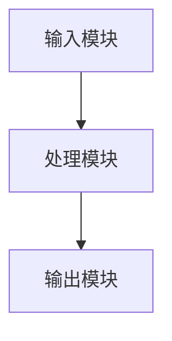
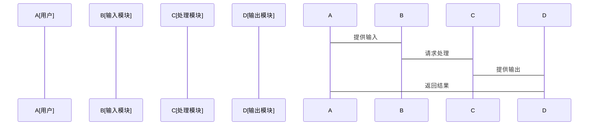

                 


# 开发具有创造性问题解决能力的AI Agent

> 关键词：AI Agent, 创造性问题解决, 算法原理, 系统架构, 项目实战

> 摘要：本文将详细探讨如何开发具有创造性问题解决能力的AI Agent。从AI Agent的基本概念到创造性问题解决的核心技术，再到算法原理和系统架构设计，最后通过项目实战和案例分析，帮助读者全面理解并掌握开发具有创造性问题解决能力的AI Agent的方法和技巧。

---

# 第1章: AI Agent与创造性问题解决概述

## 1.1 AI Agent的基本概念

### 1.1.1 AI Agent的定义与特点

AI Agent（人工智能代理）是指在计算机系统中，能够感知环境、自主决策并采取行动以实现特定目标的智能体。AI Agent的核心特点包括：

1. **自主性**：能够在没有外部干预的情况下自主运行。
2. **反应性**：能够根据环境的变化实时调整行为。
3. **目标导向性**：所有行为都围绕着实现特定目标展开。
4. **学习能力**：能够通过经验改进自身的决策能力。

### 1.1.2 创造性问题解决的核心概念

创造性问题解决是指在解决问题的过程中，不仅找到现有解决方案，还能提出新颖且有效的解决方案。其核心在于突破常规思维，探索未知的可能性。

### 1.1.3 AI Agent在问题解决中的作用

AI Agent可以通过以下方式实现创造性问题解决：

1. **信息处理**：从环境中获取信息并进行分析。
2. **决策制定**：基于信息生成多种解决方案并选择最优解。
3. **自主学习**：通过反馈不断优化决策策略。

## 1.2 创造性问题解决的背景与挑战

### 1.2.1 传统问题解决方法的局限性

传统问题解决方法通常依赖固定的规则和逻辑推理，难以应对复杂多变的环境。

### 1.2.2 创造性思维的必要性

在复杂的现实场景中，创新性思维是解决非结构化问题的关键。

### 1.2.3 AI Agent在创造性问题解决中的优势

AI Agent可以通过算法模拟人类的创造性思维，快速生成多种解决方案。

## 1.3 本书的核心目标与内容框架

### 1.3.1 本书的核心目标

帮助读者掌握开发具有创造性问题解决能力的AI Agent的方法和技巧。

### 1.3.2 本书的内容框架

- 第1章：AI Agent与创造性问题解决概述
- 第2章：AI Agent的背景与技术基础
- 第3章：AI Agent的核心原理与技术
- 第4章：AI Agent的数学模型与算法原理
- 第5章：系统架构设计
- 第6章：项目实战
- 第7章：总结与展望

### 1.3.3 本书的适用读者

- AI领域的研究人员
- AI开发工程师
- 对创造性问题解决感兴趣的技术爱好者

---

# 第2章: AI Agent的背景与技术基础

## 2.1 AI Agent的发展历程

### 2.1.1 AI Agent的起源

AI Agent的概念可以追溯到20世纪60年代，早期的研究主要集中在逻辑推理和知识表示。

### 2.1.2 AI Agent技术的演进

随着计算机技术的发展，AI Agent从简单的专家系统逐步演进为能够自主决策的智能体。

### 2.1.3 当前AI Agent技术的现状

当前，AI Agent技术广泛应用于自动驾驶、智能助手、机器人等领域。

## 2.2 创造性问题解决的理论基础

### 2.2.1 创造性思维的定义与特征

创造性思维是指在解决问题时，能够突破常规思维，提出新颖的解决方案。

### 2.2.2 创造性问题解决的步骤与方法

1. **问题识别**：明确问题的核心。
2. **信息收集**：获取与问题相关的知识。
3. **解决方案生成**：通过创造性思维生成多种解决方案。
4. **方案评估**：评估每个方案的可行性和优劣。
5. **方案选择**：选择最优解决方案。

### 2.2.3 创造性思维与AI技术的结合

通过AI技术模拟创造性思维，实现自动化问题解决。

## 2.3 AI Agent与创造性问题解决的结合

### 2.3.1 AI Agent在创造性问题解决中的优势

- 能够快速处理大量信息。
- 能够生成多种解决方案。
- 能够通过学习不断优化决策。

### 2.3.2 创造性问题解决对AI Agent的要求

- 高效的信息处理能力。
- 强大的问题建模能力。
- 灵活的决策生成能力。

### 2.3.3 当前技术的挑战与未来方向

- 当前挑战：如何实现真正的创造性思维。
- 未来方向：结合人机协作，进一步提升AI Agent的创造性能力。

---

# 第3章: AI Agent的核心原理与技术

## 3.1 AI Agent的基本原理

### 3.1.1 AI Agent的感知与决策机制

AI Agent通过传感器或数据输入获取环境信息，经过处理后生成决策。

### 3.1.2 AI Agent的行动与反馈机制

AI Agent根据决策采取行动，并通过反馈机制调整后续行为。

### 3.1.3 AI Agent的自主性与适应性

AI Agent能够自主调整策略，以适应环境的变化。

## 3.2 创造性问题解决的核心技术

### 3.2.1 创造性思维的算法实现

通过算法模拟创造性思维，生成多样化的解决方案。

### 3.2.2 创造性问题解决的模型构建

构建数学模型，描述问题的结构和可能的解决方案。

### 3.2.3 创造性问题解决的优化方法

通过优化算法提高问题解决的效率和质量。

## 3.3 AI Agent与创造性问题解决的结合技术

### 3.3.1 AI Agent的创造性思维模型

描述AI Agent如何通过创造性思维解决问题。

### 3.3.2 创造性问题解决的算法优化

通过优化算法提高AI Agent的决策效率。

### 3.3.3 AI Agent的自主学习与进化

通过机器学习算法，AI Agent能够自主学习并进化。

---

# 第4章: AI Agent的数学模型与算法原理

## 4.1 创造性问题解决的数学模型

### 4.1.1 问题建模与表示

将问题转化为数学模型，便于计算机处理。

### 4.1.2 解空间与搜索算法

通过搜索算法在解空间中寻找最优解。

### 4.1.3 创造性思维的数学表达

通过数学公式描述创造性思维的过程。

## 4.2 AI Agent的核心算法

### 4.2.1 搜索算法（如A*、遗传算法）

- **A*算法**：通过启发式搜索找到最优解。
- **遗传算法**：模拟自然进化过程，生成多样化的解决方案。

### 4.2.2 推理与决策算法（如逻辑推理、贝叶斯网络）

- **逻辑推理**：基于逻辑规则进行推理。
- **贝叶斯网络**：通过概率推理进行决策。

### 4.2.3 强化学习算法（如Q-learning、深度强化学习）

- **Q-learning**：通过试错学习优化决策策略。
- **深度强化学习**：结合深度学习和强化学习，提升决策能力。

## 4.3 创造性问题解决的算法优化

### 4.3.1 算法的创新性改进

通过改进算法结构，提高创新性。

### 4.3.2 算法的效率优化

通过优化算法复杂度，提高计算效率。

### 4.3.3 算法的可解释性

通过设计可解释的算法，便于理解和优化。

---

# 第5章: 系统架构设计

## 5.1 问题场景介绍

### 5.1.1 问题背景

描述需要解决的具体问题。

### 5.1.2 问题目标

明确系统需要实现的功能。

## 5.2 系统功能设计

### 5.2.1 系统功能模块划分

- 输入模块：接收环境信息。
- 处理模块：分析信息并生成解决方案。
- 输出模块：输出决策结果。

### 5.2.2 系统功能流程

描述系统功能的执行流程。

## 5.3 系统架构设计

### 5.3.1 系统架构图

使用mermaid绘制系统架构图。



### 5.3.2 系统接口设计

描述系统与外部环境的接口设计。

### 5.3.3 系统交互图

使用mermaid绘制系统交互图。



---

# 第6章: 项目实战

## 6.1 环境安装

### 6.1.1 安装Python

安装Python编程环境。

### 6.1.2 安装依赖库

安装所需的第三方库，如numpy、pandas等。

## 6.2 系统核心实现

### 6.2.1 算法实现

实现AI Agent的核心算法。

```python
def creative_solving():
    # 算法实现
    pass
```

### 6.2.2 系统功能实现

实现系统功能模块。

```python
class Agent:
    def __init__(self):
        self.input = None
        self.output = None

    def process(self):
        # 处理逻辑
        pass
```

## 6.3 案例分析

### 6.3.1 案例描述

描述具体的案例场景。

### 6.3.2 解决方案

展示AI Agent如何解决具体问题。

### 6.3.3 案例总结

总结案例的实施过程和成果。

---

# 第7章: 总结与展望

## 7.1 总结

### 7.1.1 本文的核心内容

总结本文的主要内容和观点。

### 7.1.2 开发具有创造性问题解决能力的AI Agent的关键点

总结开发过程中的关键点。

## 7.2 展望

### 7.2.1 未来的技术发展方向

展望AI Agent技术的未来发展方向。

### 7.2.2 创造性问题解决的新方法

探索新的创造性问题解决方法。

### 7.2.3 人机协作的未来发展

展望人机协作在创造性问题解决中的应用前景。

---

# 附录: 最佳实践 tips

## 7.1.1 开发AI Agent时的注意事项

- 确保算法的可解释性。
- 注重系统的健壮性。
- 定期优化算法性能。

## 7.1.2 项目小结

通过本文的学习，读者可以掌握开发具有创造性问题解决能力的AI Agent的方法和技巧。

## 7.1.3 项目中的注意事项

- 保持代码的可维护性。
- 定期进行系统测试。
- 及时记录开发过程中的问题和解决方案。

---

通过以上章节的详细讲解，读者可以系统地掌握开发具有创造性问题解决能力的AI Agent的技术和方法。

