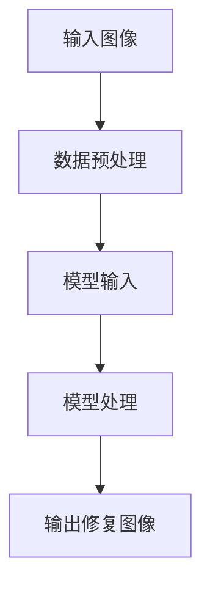
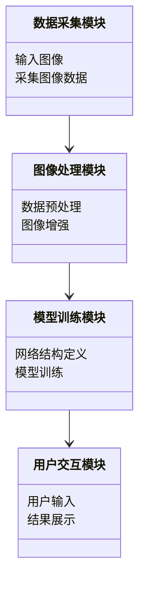
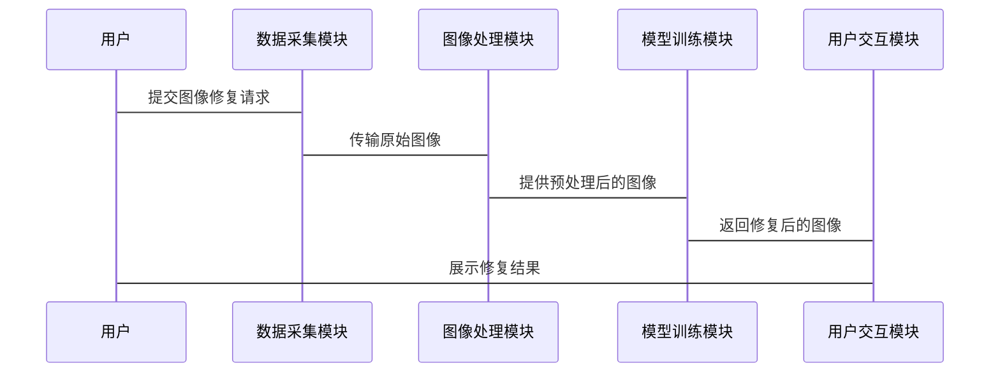

                 


# 开发具有图像修复能力的AI Agent

> 关键词：图像修复，AI Agent，深度学习，生成对抗网络，图像处理，计算机视觉

> 摘要：本文将详细介绍如何开发具有图像修复能力的AI Agent。通过分析图像修复的基本概念、算法原理、系统架构设计以及实际项目开发，我们将深入探讨如何利用深度学习技术实现高效的图像修复。本文将结合数学模型、算法流程图和系统架构图，详细讲解从数据预处理到模型训练，再到图像修复的完整流程，并通过实际案例分析，展示如何在实际项目中应用这些技术。最后，我们将总结开发经验和最佳实践，展望未来图像修复技术的发展方向。

---

# 第一部分：图像修复与AI Agent概述

## 第1章：图像修复的背景与挑战

### 1.1 图像修复的基本概念
- **1.1.1 图像修复的定义**  
  图像修复是指通过技术手段恢复受损图像或低质量图像的过程，旨在提升图像的质量、清晰度和可读性。

- **1.1.2 图像修复的主要挑战**  
  - 图像损坏类型多样（如噪声、模糊、缺失等）。  
  - 恢复过程需要保持图像的结构和语义信息。  
  - 处理大规模数据时的计算效率问题。  

- **1.1.3 图像修复的应用领域**  
  医疗图像处理、卫星图像分析、历史照片修复、视频增强等。

---

## 第2章：AI在图像修复中的作用

### 2.1 基于深度学习的图像修复优势
- **2.1.1 AI技术如何提升图像修复效果**  
  深度学习模型能够从大量数据中学习图像的特征，从而自动修复损坏区域。

- **2.1.2 基于生成对抗网络的图像修复**  
  使用生成器和判别器的对抗训练，生成逼真的图像修复结果。

- **2.1.3 当前图像修复技术的发展趋势**  
  更高分辨率、更复杂的图像修复模型、多模态数据的结合等。

---

# 第二部分：图像修复的核心算法原理

## 第3章：图像修复算法的数学模型

### 3.1 基于深度学习的图像修复算法
- **3.1.1 基于卷积神经网络的图像修复**  
  使用CNN提取图像的特征，并通过反向传播优化模型参数。

- **3.1.2 基于生成对抗网络的图像修复**  
  GAN模型包括生成器和判别器，生成器负责修复图像，判别器用于判断修复效果的真实性。

- **3.1.3 基于变分自编码器的图像修复**  
  使用VAE模型对图像进行压缩和重建，实现图像修复。

---

### 3.2 图像修复算法的数学推导
#### 3.2.1 基于CNN的图像修复模型
- 损失函数：  
  $$L = L_{\text{重建}} + \lambda L_{\text{正则化}}$$  
  其中，$L_{\text{重建}}$ 是重建损失，$L_{\text{正则化}}$ 是正则化项，$\lambda$ 是调节系数。

#### 3.2.2 基于GAN的图像修复模型
- 生成器损失：  
  $$L_G = \mathbb{E}_{x,y}[\log(D(x,y))]$$  
- 判别器损失：  
  $$L_D = -\mathbb{E}_{x,y}[\log(D(x,y))] + \mathbb{E}_{x,y}[\log(1 - D(x,y))]$$  

---

## 第4章：算法流程图与实现细节

### 4.1 算法流程图


### 4.2 实现细节
- 数据预处理：归一化、裁剪、旋转等操作。  
- 模型训练：使用Adam优化器，设置合适的学习率和批量大小。  
- 模型评估：使用PSNR、SSIM等指标衡量修复效果。

---

# 第三部分：AI Agent的系统架构设计

## 第5章：AI Agent的整体架构

### 5.1 系统模块划分
- **数据采集模块**：负责获取待修复的图像数据。  
- **图像处理模块**：对图像进行预处理和增强。  
- **模型训练模块**：训练修复模型并保存模型参数。  
- **用户交互模块**：提供友好的用户界面，接收输入并展示修复结果。

---

### 5.2 系统功能设计
- **数据预处理功能**：包括图像的归一化、噪声添加等操作。  
- **模型训练功能**：支持多种模型训练模式，如单卡训练和分布式训练。  
- **图像修复功能**：用户上传图像后，系统自动进行修复并返回结果。  
- **结果展示与分析功能**：展示修复后的图像，并提供修复效果的对比分析。

---

## 第6章：系统架构图与交互流程

### 6.1 系统架构图


---

## 第7章：系统接口设计与交互流程

### 7.1 系统接口设计
- 输入接口：支持多种格式的图像输入（如JPEG、PNG）。  
- 输出接口：返回修复后的图像和修复效果的评估指标。

### 7.2 交互流程


---

# 第四部分：项目实战与优化

## 第8章：图像修复系统的开发与实现

### 8.1 环境搭建
- 安装必要的库和工具：TensorFlow/PyTorch、OpenCV、Matplotlib等。  
- 配置开发环境：安装Jupyter Notebook或IDE。

### 8.2 核心代码实现
```python
import tensorflow as tf
from tensorflow.keras import layers

# 定义生成器模型
def build_generator(input_shape):
    model = tf.keras.Sequential()
    model.add(layers.Conv2D(64, (3,3), padding='same', activation='relu', input_shape=input_shape))
    model.add(layers.Conv2D(128, (3,3), padding='same', activation='relu'))
    model.add(layers.Conv2DTranspose(64, (3,3), padding='same', activation='relu'))
    model.add(layers.Conv2DTranspose(3, (3,3), padding='same', activation='tanh'))
    return model

# 定义判别器模型
def build_discriminator(input_shape):
    model = tf.keras.Sequential()
    model.add(layers.Conv2D(64, (3,3), padding='same', activation='relu', input_shape=input_shape))
    model.add(layers.Conv2D(128, (3,3), padding='same', activation='relu'))
    model.add(layers.Conv2D(256, (3,3), padding='same', activation='relu'))
    model.add(layers.Flatten())
    model.add(layers.Dense(1, activation='sigmoid'))
    return model
```

---

## 第9章：模型优化与部署

### 9.1 模型优化策略
- 模型剪枝：删除冗余的神经网络层。  
- 模型量化：将模型中的浮点数权重转换为低精度整数。  
- 知识蒸馏：将大模型的知识迁移到小模型中。

### 9.2 模型部署方案
- 部署到Web应用：使用Flask或Django构建RESTful API。  
- 部署到移动应用：将模型集成到移动设备的本地运行环境中。  
- 部署到云服务：利用AWS S3或阿里云OSS存储图像数据，通过函数计算实现图像修复的自动化处理。

---

## 第10章：总结与展望

### 10.1 总结
本文详细介绍了如何开发具有图像修复能力的AI Agent，涵盖了从算法原理到系统架构设计的完整流程，并通过实际案例展示了技术的实现和应用。

### 10.2 未来展望
- 更高效算法的探索：如基于Transformer的图像修复模型。  
- 多模态数据的结合：结合文本信息和图像信息，提升修复效果。  
- 模型的实时性优化：降低计算成本，提升处理速度。

---

通过本文的学习，读者将能够掌握图像修复的核心技术，并能够将其应用到实际项目中，开发出高效的AI图像修复系统。

