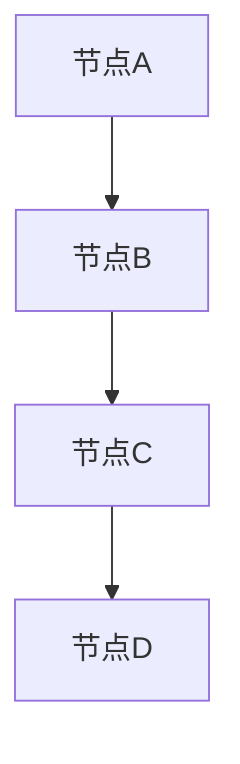
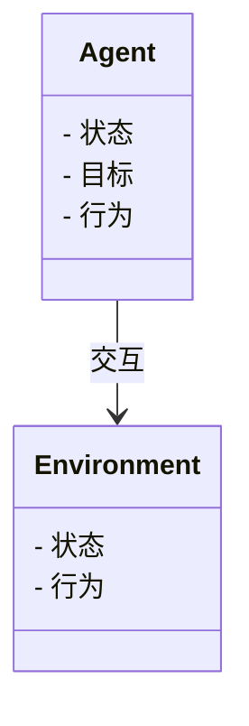
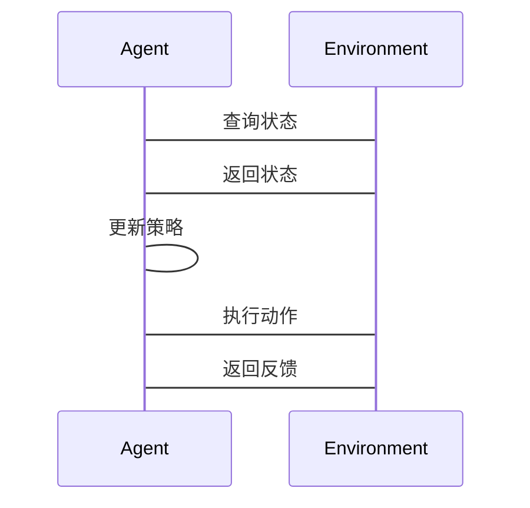
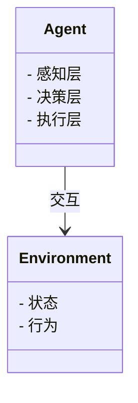

                 


# 开发具有图神经网络能力的AI Agent

> 关键词：AI Agent，图神经网络，智能体，算法原理，系统架构，项目实战

> 摘要：本文深入探讨了开发具有图神经网络能力的AI Agent的关键技术，从背景知识、核心概念、算法原理到系统架构和项目实战，全面解析了如何将图神经网络应用于AI Agent的设计与实现。通过详细的技术分析和实践案例，帮助读者掌握这一前沿领域的核心技术与方法。

---

# 第一部分: 开发具有图神经网络能力的AI Agent背景与基础

## 第1章: AI Agent概述

### 1.1 什么是AI Agent
AI Agent（人工智能代理）是指能够感知环境、做出决策并执行动作的智能体。它可以自主地完成特定任务，无需人工干预。

**关键概念对比表：**

| 比较维度 | AI Agent | 传统程序 |
|----------|-----------|-----------|
| 行为方式 | 自主决策并执行 | 等待指令后执行 |
| 感知能力 | 可感知环境变化 | 仅根据输入数据执行 |

### 1.2 图神经网络的基本概念
图神经网络是一种处理图结构数据的深度学习模型。图数据由节点和边组成，能够表示复杂的实体关系。

**图数据的ER实体关系图：**



### 1.3 图神经网络在AI Agent中的应用
图神经网络能够处理复杂的关系数据，非常适合用于AI Agent的知识表示、推理和决策过程。

---

## 第2章: 图神经网络的核心原理

### 2.1 图卷积网络（GCN）
图卷积网络通过在图的节点间传播信息，提取节点特征。

**GCN的传播公式：**

$$ h^{(l+1)} = \theta (h^{(l)} A h^{(l)}) $$

其中，$A$ 是图的邻接矩阵，$\theta$ 是非线性激活函数。

**GCN的流程图：**

```mermaid
graph TD
X[h^{(l)}] --> W[权重矩阵] --> H[隐藏层] --> A[邻接矩阵] --> h^{(l+1)}
```

---

## 第3章: AI Agent的设计原则

### 3.1 可扩展性原则
AI Agent应具备扩展能力，能够适应新的任务和环境。

**系统功能设计的类图：**



### 3.2 学习式架构
学习式AI Agent通过与环境交互，不断优化自己的行为策略。

**学习式架构的序列图：**



---

# 第二部分: 图神经网络AI Agent的算法原理

## 第4章: 图神经网络的数学

### 4.1 图注意力机制（GAT）
图注意力机制通过计算节点间的注意力权重，生成节点表示。

**GAT的注意力计算公式：**

$$ \alpha_{ij} = \text{softmax}(e^{h_i^T W h_j}) $$

**GAT的流程图：**

```mermaid
graph TD
X[h^{(l)}] --> W[权重矩阵] --> H[隐藏层] --> A[注意力权重] --> h^{(l+1)}
```

### 4.2 图嵌入技术
图嵌入技术将图的节点映射到低维向量空间。

**图嵌入的Python代码示例：**

```python
import numpy as np

def compute_embeddings(nodes, edges):
    # 初始化嵌入向量
    embeddings = np.random.randn(len(nodes), 128)
    # 传播信息
    for edge in edges:
        i, j = edge
        embeddings[j] += embeddings[i]
    return embeddings
```

---

## 第5章: 图神经网络AI Agent的系统架构

### 5.1 系统架构设计
AI Agent的系统架构包括感知层、决策层和执行层。

**系统架构的类图：**



### 5.2 系统接口设计
AI Agent需要与环境进行交互，定义清晰的接口。

**系统接口的序列图：**


---

## 第6章: 图神经网络AI Agent的项目实战

### 6.1 环境安装
安装必要的库：

```bash
pip install numpy matplotlib networkx
```

### 6.2 核心实现代码

```python
import numpy as np
import networkx as nx

class GraphAgent:
    def __init__(self, nodes, edges):
        self.graph = nx.Graph()
        self.graph.add_nodes_from(nodes)
        self.graph.add_edges_from(edges)
        
    def compute_embeddings(self):
        embeddings = np.random.randn(len(self.graph.nodes), 128)
        for edge in self.graph.edges:
            i, j = edge
            embeddings[j] += embeddings[i]
        return embeddings
```

### 6.3 案例分析
以社交网络分析为例，训练AI Agent识别关键节点。

**案例分析流程图：**


---

## 第7章: 最佳实践与总结

### 7.1 小结
本文详细探讨了开发具有图神经网络能力的AI Agent的关键技术，从理论到实践，全面解析了其设计与实现过程。

### 7.2 注意事项
在实际开发中，需要注意图数据的稀疏性和计算效率问题。

### 7.3 拓展阅读
推荐阅读相关领域的最新论文和书籍，深入了解图神经网络的前沿技术。

---

通过以上内容，读者可以系统地掌握开发具有图神经网络能力的AI Agent的核心技术与方法。

