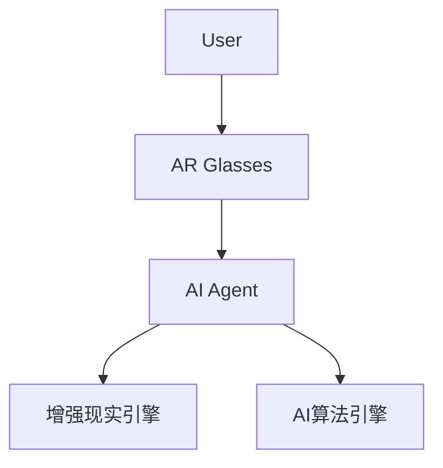

                 


# 开发具有增强现实能力的AI Agent

---

## 关键词

增强现实, AI Agent, 人机交互, 系统架构, 算法原理, 项目实战

---

## 摘要

随着人工智能和增强现实技术的快速发展，AI Agent在增强现实场景中的应用越来越广泛。本文将深入探讨如何开发具有增强现实能力的AI Agent，涵盖其核心概念、算法原理、系统架构设计、项目实战以及最佳实践等内容。通过结合增强现实和AI Agent的技术特点，本文将帮助读者理解如何在实际应用中实现高效的增强现实AI Agent系统。

---

# 目录

---

## 第1章 增强现实与AI Agent概述

### 1.1 增强现实的基本概念

- 1.1.1 增强现实的定义与特点
- 1.1.2 增强现实的核心技术
- 1.1.3 增强现实的应用场景

### 1.2 AI Agent的基本概念

- 1.2.1 AI Agent的定义与特点
- 1.2.2 AI Agent的核心技术
- 1.2.3 AI Agent的应用场景

### 1.3 增强现实与AI Agent的结合

- 1.3.1 增强现实与AI Agent的协同工作原理
- 1.3.2 增强现实与AI Agent的结合优势
- 1.3.3 增强现实与AI Agent的未来发展趋势

## 第2章 增强现实与AI Agent的核心概念与联系

### 2.1 核心概念原理

- 2.1.1 增强现实的核心技术原理
- 2.1.2 AI Agent的核心技术原理
- 2.1.3 增强现实与AI Agent的协同工作原理

### 2.2 核心概念属性特征对比

- 2.2.1 增强现实与AI Agent的技术特征对比
- 2.2.2 增强现实与AI Agent的功能特征对比
- 2.2.3 增强现实与AI Agent的性能特征对比

### 2.3 ER实体关系图架构

```mermaid
erDiagram
    actor User {
        <U> string id
        <U> string name
    }
    actor AR Glasses {
        <U> string id
        <U> string model
    }
    actor AI Agent {
        <U> string id
        <U> string type
    }
    User -> AR Glasses : 使用
    AR Glasses -> AI Agent : 集成
```

---

## 第3章 增强现实与AI Agent的算法原理

### 3.1 增强现实算法概述

- 3.1.1 增强现实算法的基本原理
- 3.1.2 增强现实算法的关键步骤
- 3.1.3 增强现实算法的数学模型

### 3.2 AI Agent算法概述

- 3.2.1 AI Agent算法的基本原理
- 3.2.2 AI Agent算法的关键步骤
- 3.2.3 AI Agent算法的数学模型

### 3.3 增强现实与AI Agent算法的协同工作原理

- 3.3.1 算法协同的基本概念
- 3.3.2 算法协同的实现步骤
- 3.3.3 算法协同的优化策略

---

## 第4章 增强现实与AI Agent的系统架构设计

### 4.1 系统架构概述

- 4.1.1 系统架构的基本概念
- 4.1.2 系统架构的关键组成部分
- 4.1.3 系统架构的设计原则

### 4.2 系统功能设计

- 4.2.1 系统功能模块划分
- 4.2.2 系统功能模块的交互流程
- 4.2.3 系统功能模块的实现方法

### 4.3 系统架构图



---

## 第5章 增强现实与AI Agent的项目实战

### 5.1 项目环境安装

- 5.1.1 开发工具的安装与配置
- 5.1.2 依赖库的安装与配置
- 5.1.3 环境变量的配置与测试

### 5.2 系统核心代码实现

- 5.2.1 增强现实引擎的代码实现
- 5.2.2 AI Agent算法引擎的代码实现
- 5.2.3 系统功能模块的代码实现

### 5.3 代码应用解读与分析

- 5.3.1 代码的结构与功能解读
- 5.3.2 代码的关键实现细节分析
- 5.3.3 代码的优化与改进策略

### 5.4 实际案例分析与详细讲解剖析

- 5.4.1 实际案例的背景介绍
- 5.4.2 实际案例的实现过程
- 5.4.3 实际案例的优化与总结

---

## 第6章 最佳实践、小结与展望

### 6.1 最佳实践

- 6.1.1 开发过程中的注意事项
- 6.1.2 代码编写中的最佳实践
- 6.1.3 系统优化中的实用技巧

### 6.2 小结

- 6.2.1 本文的主要内容总结
- 6.2.2 本文的核心观点回顾
- 6.2.3 本文的不足之处与改进建议

### 6.3 展望

- 6.3.1 增强现实与AI Agent技术的未来发展趋势
- 6.3.2 增强现实与AI Agent技术的潜在应用场景
- 6.3.3 增强现实与AI Agent技术的未来挑战与机遇

---

## 附录

### 附录A: 常见问题解答

### 附录B: 进一步阅读的推荐文献

### 附录C: 项目源代码

---

通过以上详细的目录结构和内容安排，我们可以逐步展开撰写《开发具有增强现实能力的AI Agent》这篇文章，确保每部分内容都详实具体，逻辑清晰，能够帮助读者全面理解并掌握相关知识。

